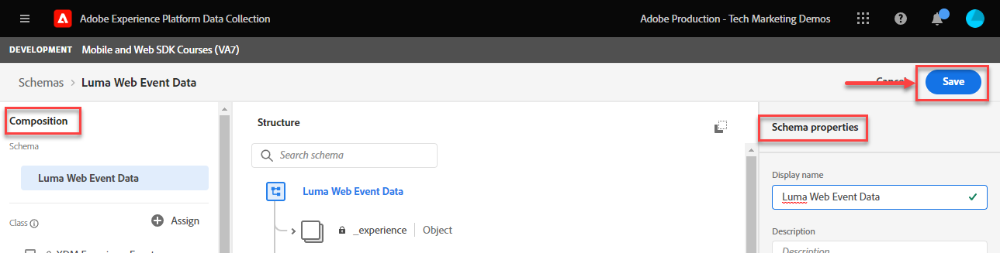
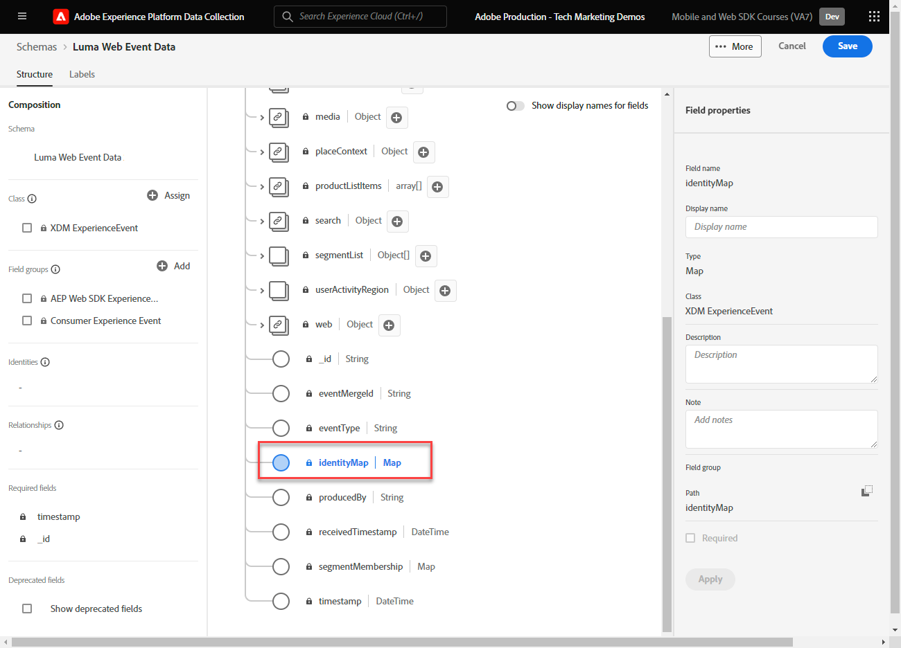

# Web データ用の XDM スキーマの作成

データ収集インターフェイスで Web データ用の XDM スキーマを作成する方法を説明します。

エクスペリエンスデータモデル (XDM) スキーマは、Adobe Experience Platformでスキーマを構成するための構成要素、原則およびベストプラクティスです。

Platform Web SDK は、スキーマを使用して WebExperience Cloudデータを標準化し、Platform Edge ネットワークに送信し、最終的に、データをデータストリームで設定された任意のイベントアプリケーションに転送します。 顧客体験データをExperience Platformに取り込むために必要な標準データモデルを定義し、これらの標準に基づいて構築されたダウンストリームサービスとアプリケーションを可能にするので、この手順は重要です。

>[!NOTE]
>
> デモ用に、このレッスンの演習では、スキーマの例を作成して、閲覧されたコンテンツと顧客が購入した製品を [Luma デモサイト](https://luma.enablementadobe.com/content/luma/us/en.html). これらの手順を使用して、独自の目的で別のスキーマを作成できますが、まずサンプルのスキーマを作成して、スキーマエディターの機能を学ぶことをお勧めします。

XDM スキーマの詳細については、「[XDM を使用した顧客体験データのモデル化](https://experienceleague.adobe.com/?recommended=ExperiencePlatform-D-1-2021.1.xdm&amp;lang=ja)」をクリックするか、 [XDM システムの概要](https://experienceleague.adobe.com/docs/experience-platform/xdm/home.html?lang=ja).

## 学習内容

このレッスンを最後まで学習すると、以下の内容を習得できます。

* データ収集インターフェイス内での XDM スキーマの作成
* XDM スキーマへのフィールドグループの追加
* ベストプラクティスを使用した Web イベントデータの XDM スキーマの作成

## 前提条件

データ収集とAdobe Experience Platformに必要なプロビジョニングとユーザー権限 ( [権限の設定](configure-permissions.md) レッスン。

## XDM スキーマの作成

XDM スキーマは、Experience Platform内のデータを記述する標準的な方法で、スキーマに準拠するすべてのデータを、競合なしに組織全体で再利用したり、複数の組織間で共有したりできます。 詳しくは、 [スキーマ構成の基本](https://experienceleague.adobe.com/docs/experience-platform/xdm/schema/composition.html?lang=ja).

この演習では、上の Web イベントデータを取り込むための推奨ベースラインフィールドグループを使用して XDM スキーマを作成します。 [Luma デモサイト](https://luma.enablementadobe.com/content/luma/us/en.html){target="_blank"}:

1. を開きます。 [データ収集インターフェイス](https://launch.adobe.com/){target="_blank"}
1. が正しいサンドボックスにあることを確認します。

   >[!NOTE]
   >
   >Real-Time CDPなどの Platform ベースのアプリケーションを使用している場合は、このチュートリアルで開発サンドボックスを使用することをお勧めします。 そうでない場合は、 **[!UICONTROL Prod]** サンドボックス。

1. に移動します。 **[!UICONTROL スキーマ]** 左のナビゲーションで
1. を選択します。 **[!UICONTROL スキーマを作成]** 右上のボタン
1. ドロップダウンメニューで、「 」を選択します。 **[!UICONTROL XDM ExperienceEvent]**

## フィールドグループの追加

前述したように、XDM は、ダウンストリームAdobe Experience Platformサービスで使用する共通の構造と定義を提供することで、顧客体験データを標準化する中核的なフレームワークです。 XDM 標準に準拠することで、 _すべての顧客体験データ_ は、共通の表現に組み込むことができます。 このアプローチを使用すると、顧客の行動から有益なインサイトを得たり、セグメントを通じて顧客のオーディエンスを定義したり、複数のソースのデータを使用してパーソナライズ機能を目的として顧客属性を表したりできます。 詳しくは、 [データモデリングのベストプラクティス](https://experienceleague.adobe.com/docs/experience-platform/xdm/schema/best-practices.html?lang=en) を参照してください。

可能な場合は、既存のフィールドグループを使用し、製品に依存しないモデルや命名規則に従うことをお勧めします。 上記の定義済みフィールドグループに適合しない組織に固有のデータの場合、カスタムフィールドグループを作成できます。 詳しくは、 [スキーマエディターを使用したスキーマの作成](https://experienceleague.adobe.com/docs/experience-platform/xdm/tutorials/create-schema-ui.html?lang=en#create) を参照してください。

>[!TIP]
> 
>この演習では、Web データ収集用に推奨される事前定義済みフィールドグループを追加します。 _**[!UICONTROL AEP Web SDK ExperienceEvent]**_、および _**[!UICONTROL 消費者エクスペリエンスイベント]**_.

1. Adobe Analytics の **[!UICONTROL フィールドグループ]** セクション、選択 **[!UICONTROL 追加]**
1. [!UICONTROL `AEP Web SDK ExperienceEvent`] を検索します
1. 「 」ボックスをオンにします。
1. [!UICONTROL `Consumer Experience Event`] を検索します
1. 「 」ボックスをオンにします。
1. 選択 **[!UICONTROL フィールドグループを追加]**

   

フィールドグループを選択した状態で、スキーマに名前を付ける準備が整いました。 XDM スキーマの一般的な命名規則は、データのソースに続いてスキーマに名前を付けることです。

1. **[!UICONTROL 構成**] パネルで、 `Untitled schema name`
1. Adobe Analytics の **[!UICONTROL スキーマのプロパティ]** パネル、 **[!UICONTROL 表示名]** `Luma Web Event Data`
1. 以外の項目を選択 **[!UICONTROL 表示名]** 有効化するフィールド **[!UICONTROL 保存]** オプション
1. 「**[!UICONTROL 保存]**」を選択します

両方のフィールドグループを使用する場合、Web でのデータ収集に必要な、最も一般的に使用されるキーと値のペアにアクセスできることに注意してください。 The [!UICONTROL 表示名] の各フィールドは、Platform ベースのアプリケーションのセグメントビルダーインターフェイスでマーケターに表示され、必要に応じて標準フィールドの表示名を変更できます。 また、不要なフィールドを削除することもできます。 いずれかのフィールドグループ名をクリックすると、そのグループが属するキーと値のペアのグループがインターフェイスで強調表示されます。 次の例では、どのグループが属しているかを確認します。 **[!UICONTROL 消費者エクスペリエンスイベント]**.

このレッスンは出発点にすぎません。 独自の Web イベントスキーマを作成する場合は、ビジネス要件を確認し、文書化する必要があります。 このプロセスは、 [ビジネス要件ドキュメント](https://experienceleague.adobe.com/docs/analytics-learn/tutorials/implementation/implementation-basics/creating-a-business-requirements-document.html?lang=ja) および [ソリューションデザインリファレンス](https://experienceleague.adobe.com/docs/analytics-learn/tutorials/implementation/implementation-basics/creating-and-maintaining-an-sdr.html?lang=ja) (Adobe Analytics実装の場合 )。ただし、には _すべてのダウンストリームデータ受信者_ （プラットフォーム、ターゲット、イベントの転送先など）。

### identityMap オブジェクト

と呼ばれる Web ユーザーを識別するために必要な特別なデータセットがあります。 `[!UICONTROL identityMap]`.

Web 上のユーザーを識別するために必要なExperience CloudID を格納するので、Web 関連のデータ収集には必須のオブジェクトです。 また、認証済みユーザーの内部顧客 ID を設定するためのキーにもなります。 `[!UICONTROL identityMap]` 詳しくは、 [ID の設定](configure-identities.md) レッスン。 これは、 **[!UICONTROL XDM ExperienceEvent]** クラス。

>[!IMPORTANT]
>
> 有効にすることができます。 **[!UICONTROL プロファイル]** スキーマを保存する前に、スキーマのを設定します。 **禁止** この時点で有効にします。 プロファイルに対してスキーマを有効にすると、無効にしたり削除したりすることはできません。 また、この時点以降は、フィールドをスキーマから削除できません。 実稼動環境で独自のデータを使用する際には、後で注意する必要があります。
>
>この設定については、 [設定Experience Platform](setup-experience-platform.md) レッスン。
>

これで、タグプロパティに Web SDK 拡張機能を追加すると、このスキーマを参照できます。

[次へ： ](configure-identities.md)

>[!NOTE]
>
>Adobe Experience Platform Web SDK の学習に時間を割いていただき、ありがとうございます。 ご質問がある場合、一般的なフィードバックを共有する場合、または今後のコンテンツに関する提案がある場合は、このドキュメントで共有します [Experience Leagueコミュニティディスカッション投稿](https://experienceleaguecommunities.adobe.com/t5/adobe-experience-platform-launch/tutorial-discussion-implement-adobe-experience-cloud-with-web/td-p/444996)
