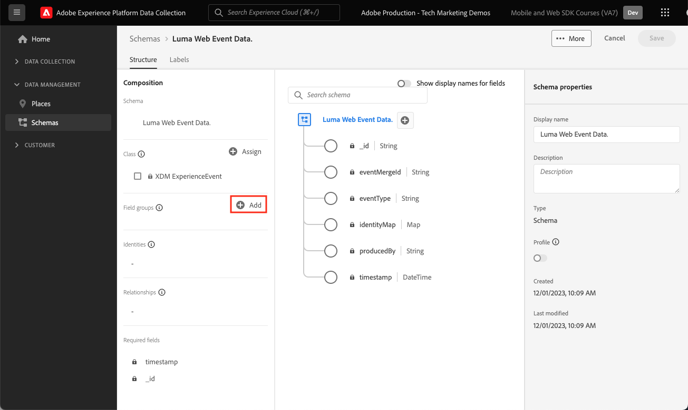

# Web データ用の XDM スキーマの作成

Adobe Experience Platform データ収集インターフェイスで web データの XDM スキーマを作成する方法について説明します。

エクスペリエンスデータモデル（XDM）スキーマは、Adobe Experience Platformでデータを収集するための構成要素、原則およびベストプラクティスです。

Platform Web SDKは、スキーマを使用して web イベントデータを標準化し、Platform Edge Networkに送信し、最終的にデータストリームで設定されたExperience Cloud アプリケーションにデータを転送します。 この手順は、カスタマーエクスペリエンスデータをExperience Platformに取り込むために必要な標準データモデルを定義し、これらの標準に基づいて構築されたダウンストリームのサービスとアプリケーションを可能にするので、重要です。

>[!NOTE]
>
>Web SDKを使用してAdobe Analytics、Adobe Target、Adobe Audience Managerを実装する場合、XDM スキーマは _必須ではありません_ （データは、後で示すように、`xdm` オブジェクトではなく、`data` オブジェクトで渡すことができます）。 XDM スキーマは、Journey Optimizer、Real-Time Customer Data Platform、Customer Journey Analyticsなど、Platform ネイティブアプリケーションの最もパフォーマンスの高い実装に必要です。 独自の実装で XDM スキーマを使用しないことにすることもできますが、このチュートリアルの一部としてこれを行うことが想定されます。

## データをモデル化する理由

企業には、ドメインについてコミュニケーションを行うための独自の言語があります。 自動車の販売店はメーカー、モデル、シリンダーを扱っています。 航空会社は便名、サービス区分、座席割り当てを扱っています。 これらの用語には、特定の会社に固有のものや、業界別で共有されているものや、ほとんどすべての企業で共有されているものがあります。 業界横断的な用語や、より広範な用語を共有する用語の場合、共通の方法で用語に名前を付けて構造化することで、データを活用して強力な処理を開始できます。

例えば、多くの企業が注文を扱っています。 これらの企業が同様の方法で注文をモデル化すると判断した場合はどうなりますか？ 例えば、データモデルが、注文の合計価格を表す `priceTotal` プロパティを持つオブジェクトで構成されていた場合、どうなりますか？ そのオブジェクトに `currencyCode` と `purchaseOrderNumber` という名前のプロパティも含まれている場合はどうなりますか？ order オブジェクトには、支払いオブジェクトの配列となる `payments` という名前のプロパティが含まれている場合があります。 各オブジェクトは、注文の支払いを表します。 例えば、顧客が注文の一部をギフトカードで支払い、残りをクレジットカードで支払った場合を考えてみましょう。 次のようなモデルの作成を開始できます。

```json
{
  "order": {
    "priceTotal": 89.50,
    "currencyCode": "EUR",
    "purchaseOrderNumber": "JWN20192388410012",
    "payments": [
      {
        "paymentType": "gift_card",
        "paymentAmount": 50
      },
      {
        "paymentType": "credit_card",
        "paymentAmount": 39.50
      }
    ]
  }
}
```

注文を扱うすべての企業が、業界で一般的な用語について一貫した方法で注文データをモデル化することを決定した場合、不思議なことが起こり始める可能性があります。 データ（prop や evar、誰でも）を絶えず解釈したり翻訳したりしなくても、組織内や組織外でより流動的に情報を交換できます。 機械学習を使用すると、データ _意味_ をより簡単に理解し、実用的なインサイトを提供できます。 関連するデータを表示するためのユーザーインターフェイスが、より直感的になる可能性があります。 データは、同じモデリングに従っているパートナーやベンダーとシームレスに統合できます。

これがAdobeの目標である [ エクスペリエンスデータモデル ](https://business.adobe.com/products/experience-platform/experience-data-model.html) です。 XDM は、業界で一般的なデータの規範的なモデリングを提供すると同時に、特定のニーズに合わせてモデルを拡張することもできます。 Adobe Experience Platformは XDM を中心に構築されているので、Experience Platformに送信するデータは XDM 内にある必要があります。 データをExperience Platformに送信する前に、現在のデータモデルを XDM に変換する場所と方法について考えるのではなく、より広く組織全体で XDM を採用することを検討してください。これにより、翻訳が必要になることはほとんどありません。


>[!NOTE]
>
> デモ目的で、このレッスンの演習では、顧客が閲覧したコンテンツと購入した製品を [Luma デモサイト ](https://luma.enablementadobe.com/content/luma/us/en.html) でキャプチャするサンプルスキーマを作成します。 これらの手順を使用して、異なるスキーマを独自の用途で作成できますが、まずは、サンプルスキーマの作成方法を追ってスキーマエディターの機能を理解することをお勧めします。

XDM スキーマについて詳しくは、プレイリスト [XDM を使用した顧客体験データのモデル化 ](https://experienceleague.adobe.com/en/playlists/experience-platform-model-your-customer-experience-data-with-xdm) または [XDM システムの概要 ](https://experienceleague.adobe.com/ja/docs/experience-platform/xdm/home) を参照してください。

## 学習目標

このレッスンを最後まで学習すると、以下の内容を習得できます。

* データ収集インターフェイス内から XDM スキーマを作成します
* XDM スキーマへのフィールドグループの追加
* ベストプラクティスを使用した web イベントデータの XDM スキーマの作成

## 前提条件

データ収集とAdobe Experience Platformに必要なすべてのプロビジョニングとユーザー権限については、[ 概要 ](overview.md) ページで説明します。

## XDM スキーマの作成

XDM スキーマはExperience Platformの標準的なデータ記述方法で、スキーマに適合するすべてのデータを組織間で競合なく再利用したり、複数の組織間で共有したりできます。 詳しくは、[ スキーマ構成の基本 ](https://experienceleague.adobe.com/ja/docs/experience-platform/xdm/schema/composition) を参照してください。

この演習では、[Luma デモサイト ](https://luma.enablementadobe.com/content/luma/us/en.html){target="_blank"} で web イベントデータを取得するための推奨ベースラインフィールドグループを使用して XDM スキーマを作成します。

1. [ データ収集インターフェイス ](https://experience.adobe.com/data-collection/){target="_blank"} を開きます。
1. 正しいサンドボックスにいることを確認します。 右上隅にあるサンドボックスを見つけます

   >[!NOTE]
   >
   >Real-Time CDPやJourney Optimizerなどの Platform ベースのアプリケーションを使用している場合は、このチュートリアルで開発用サンドボックスを使用することをお勧めします。 そうでない場合は、**[!UICONTROL Prod]** サンドボックスを使用します。

1. 左側のナビゲーションの **[!UICONTROL スキーマ]** に移動します
1. 右上の **[!UICONTROL スキーマを作成]** ボタンを選択します

   
1. 次の画面で **[!UICONTROL エクスペリエンスイベント]** を選択します
1. 「**[!UICONTROL 次へ]**」を選択します。

   

1. 「**[!UICONTROL スキーマ表示名]**」フィールドにスキーマの名前を入力します。この場合は `Luma Web Event Data` です。

   >[!TIP]
   >
   >XDM スキーマの一般的な命名規則は、データのソースの後にスキーマを命名することです。


1. 「終了」を選択します

   

## フィールドグループを追加

前述したように、XDM は、ダウンストリーム Adobe Experience Platform サービスで使用する共通の構造と定義を提供することで、顧客体験データを標準化するコアフレームワークです。 XDM 標準規格に準拠しているので、_すべての顧客体験データ_ を共通の表現に組み込むことができます。 このアプローチにより、顧客の行動から有益なインサイトを得たり、セグメントを通じて顧客オーディエンスを定義したり、複数のソースのデータを使用してパーソナライゼーション目的で顧客属性を表現したりできます。 詳しくは、[ データモデリングのベストプラクティス ](https://experienceleague.adobe.com/en/docs/experience-platform/xdm/schema/best-practices) を参照してください。

可能であれば、既存のフィールドグループを使用し、製品に依存しないモデルと命名規則に従うことをお勧めします。 上記の事前定義済みのフィールドグループに適合しない、組織に固有の任意のデータの場合は、カスタムフィールドグループを作成できます。 カスタムスキーマの手順について詳しくは、[ スキーマエディターを使用したスキーマの作成 ](https://experienceleague.adobe.com/en/docs/experience-platform/xdm/tutorials/create-schema-ui#create) を参照してください。

>[!TIP]
> 
>この演習では、web データ収集用の推奨される事前定義済みフィールドグループである _**[!UICONTROL AEP Web SDK ExperienceEvent]**_ および _**[!UICONTROL Consumer Experience Event]**_ を追加します。
>


1. 「**[!UICONTROL フィールドグループ]**」セクションで、「**[!UICONTROL 追加]**」を選択します

   

1. [!UICONTROL `AEP Web SDK ExperienceEvent`] を検索
1. チェックボックスをオンにする
1. [!UICONTROL `Consumer Experience Event`] を検索
1. チェックボックスをオンにする
1. 「**[!UICONTROL フィールドグループを追加]**」を選択します

   

両方のフィールドグループを使用すると、web 上のデータ収集に必要な最も一般的に使用されるキーと値のペアにアクセスできます。 各フィールドの [!UICONTROL  表示名 ] は、Platform ベースのアプリケーションのセグメントビルダーインターフェイスでマーケターに表示され、標準フィールドの表示名を必要に応じて変更できます。 また、不要なフィールドを削除することもできます。 いずれかのフィールドグループ名をクリックすると、それに属するキーと値のペアのグループがインターフェイスで強調表示されます。 以下の例では、どのようなフィールドが **[!UICONTROL 消費者エクスペリエンスイベント]** に属しているのかがわかります。


このレッスンは、出発点にすぎません。 独自の web イベントスキーマを作成する場合は、ビジネス要件を調査し、文書化する必要があります。 このプロセスは、Adobe Analyticsの実装の [ ビジネス要件ドキュメント ](https://experienceleague.adobe.com/en/docs/analytics-learn/tutorials/implementation/implementation-basics/creating-a-business-requirements-document) および [ ソリューション設計リファレンス ](https://experienceleague.adobe.com/en/docs/analytics-learn/tutorials/implementation/implementation-basics/creating-and-maintaining-an-sdr) を作成する場合と似ていますが、Platform、Target、イベント転送の宛先など、_すべてのダウンストリームデータ受信者_ の要件を含める必要があります。


### identityMap オブジェクト

`[!UICONTROL identityMap]` と呼ばれる web ユーザーの識別に使用する特別なフィールドがあります。


これは、web 上のユーザーを識別するために必要なExperience Cloud ID を格納するので、web 関連のデータ収集の必須オブジェクトです。 また、認証済みユーザーに対して内部顧客 ID を設定する際にも重要です。 `[!UICONTROL identityMap]` については、[ID の設定 ](configure-identities.md) のレッスンで詳しく説明します。 **[!UICONTROL XDM ExperienceEvent]** クラスを使用するすべてのスキーマに自動的に含まれます。


>[!IMPORTANT]
>
> スキーマを保存する前に、スキーマの **[!UICONTROL プロファイル]** を有効にすることができます。 **この時点では有効にしない** ください。 プロファイルでスキーマを有効にした後は、サンドボックス全体をリセットしないと、そのスキーマを無効にしたり削除したりすることはできません。 この時点ではフィールドをスキーマから削除することはできませんが、[UI でフィールドを非推奨（廃止予定 ](https://experienceleague.adobe.com/en/docs/experience-platform/xdm/tutorials/field-deprecation-ui#deprecate) することは可能です。 これらの影響は、実稼動環境で独自のデータを操作する際に後で留意することが重要です。
>
>
>この設定については、[Experience Platformのセットアップ ](setup-experience-platform.md) のレッスンで詳しく説明します。
>

このレッスンを完了するには、右上の **[!UICONTROL 保存]** を選択します。


これで、タグプロパティに web SDK拡張機能を追加する際に、このスキーマを参照できるようになります。


[次へ： ](configure-identities.md)

>[!NOTE]
>
>Adobe Experience Platform Web SDKの学習にご協力いただき、ありがとうございます。 ご不明な点がある場合や、一般的なフィードバックを共有したい場合、または今後のコンテンツに関するご提案がある場合は、この [Experience League Community Discussion の投稿でお知らせください ](https://experienceleaguecommunities.adobe.com/t5/adobe-experience-platform-data/tutorial-discussion-implement-adobe-experience-cloud-with-web/td-p/444996)
