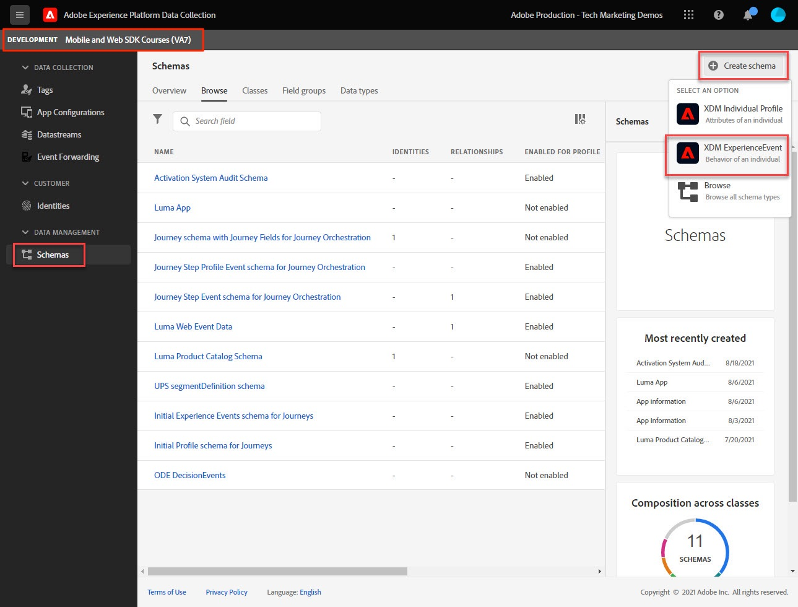

# Web データ用の XDM スキーマの作成

>[!CAUTION]
>
>このチュートリアルの大きな変更は、2024 年 4 月 23 日火曜日（PT）に公開される予定です。 その後、多くの演習が変更され、すべてのレッスンを完了するには、最初からチュートリアルを再開する必要が生じる場合があります。

データ収集インターフェイスで web データの XDM スキーマを作成する方法を説明します。

Experience Data Model （XDM）スキーマは、Adobe Experience Platformでスキーマを構成するための構成要素、原則およびベストプラクティスです。

Platform Web SDK は、スキーマを使用して web イベントデータを標準化し、Platform Edge Networkに送信し、最終的にデータストリームで設定されたExperience Cloudアプリケーションにデータを転送します。 この手順は、カスタマーエクスペリエンスデータをExperience Platformに取り込むために必要な標準データモデルを定義し、これらの標準に基づいて構築されたダウンストリームのサービスとアプリケーションを可能にするので、重要です。

>[!NOTE]
>
> デモ目的で、このレッスンの演習では、で顧客が表示したコンテンツと購入した製品をキャプチャするサンプルスキーマを作成します。 [Luma デモサイト](https://luma.enablementadobe.com/content/luma/us/en.html). これらの手順を使用して、異なるスキーマを独自の用途で作成できますが、まずは、サンプルスキーマの作成方法を追ってスキーマエディターの機能を理解することをお勧めします。

XDM スキーマについて詳しくは、「」コースを参照してください[XDM を使用したカスタマーエクスペリエンスデータのモデル化](https://experienceleague.adobe.com/?recommended=ExperiencePlatform-D-1-2021.1.xdm&amp;lang=ja)」または [XDM システムの概要](https://experienceleague.adobe.com/docs/experience-platform/xdm/home.html?lang=ja).

## 学習目標

このレッスンを最後まで学習すると、以下の内容を習得できます。

* データ収集インターフェイス内から XDM スキーマを作成します
* XDM スキーマへのフィールドグループの追加
* ベストプラクティスを使用した web イベントデータの XDM スキーマの作成

## 前提条件

データ収集とAdobe Experience Platformに必要なすべてのプロビジョニングとユーザー権限については、を参照してください。 [権限の設定](configure-permissions.md) レッスン：

## XDM スキーマの作成

XDM スキーマはExperience Platformでデータを記述する標準的な方法であり、スキーマに適合するすべてのデータを組織間で競合なく再利用したり、複数の組織間で共有したりできます。 詳しくは、 [スキーマ構成の基本](https://experienceleague.adobe.com/docs/experience-platform/xdm/schema/composition.html?lang=ja).

この演習では、で web イベントデータをキャプチャするための推奨ベースラインフィールドグループを使用して、XDM スキーマを作成します [Luma デモサイト](https://luma.enablementadobe.com/content/luma/us/en.html){target="_blank"}:

1. を開きます [データ収集インターフェイス](https://launch.adobe.com/){target="_blank"}
1. 正しいサンドボックスにいることを確認します

   >[!NOTE]
   >
   >Real-Time CDPなどの Platform ベースのアプリケーションを使用している場合は、このチュートリアルで開発用サンドボックスを使用することをお勧めします。 そうでない場合は、 **[!UICONTROL Prod]** サンドボックス。

1. に移動 **[!UICONTROL スキーマ]** 左側のナビゲーションで
1. 「」を選択します **[!UICONTROL スキーマを作成]** 右上のボタン
1. ドロップダウンメニューから「」を選択します **[!UICONTROL XDM ExperienceEvent]**

## フィールドグループの追加

前述したように、XDM は、ダウンストリーム Adobe Experience Platform サービスで使用する共通の構造と定義を提供することで、顧客体験データを標準化するコアフレームワークです。 XDM 標準に準拠することにより、 _すべての顧客体験データ_ 共通の表現に組み込むことができます。 このアプローチにより、顧客の行動から有益なインサイトを得たり、セグメントを通じて顧客オーディエンスを定義したり、複数のソースのデータを使用してパーソナライゼーション目的で顧客属性を表現したりできます。 参照： [データモデリングのベストプラクティス](https://experienceleague.adobe.com/docs/experience-platform/xdm/schema/best-practices.html?lang=en) を参照してください。

可能であれば、既存のフィールドグループを使用し、製品に依存しないモデルと命名規則に従うことをお勧めします。 上記の事前定義済みのフィールドグループに適合しない、組織に固有の任意のデータの場合は、カスタムフィールドグループを作成できます。 参照： [スキーマエディターを使用したスキーマの作成](https://experienceleague.adobe.com/docs/experience-platform/xdm/tutorials/create-schema-ui.html?lang=en#create) カスタムスキーマの詳細な手順については、を参照してください。

>[!TIP]
> 
>この演習では、web データ収集に推奨される事前定義済みのフィールドグループを追加します。 _**[!UICONTROL AEP Web SDK ExperienceEvent]**_、および _**[!UICONTROL 消費者エクスペリエンスイベント]**_.

1. が含まれる **[!UICONTROL フィールドグループ]** セクションで選択 **[!UICONTROL 追加]**
1. [!UICONTROL `AEP Web SDK ExperienceEvent`] を検索します
1. チェックボックスをオンにする
1. [!UICONTROL `Consumer Experience Event`] を検索します
1. チェックボックスをオンにする
1. を選択 **[!UICONTROL フィールドグループの追加]**

   

フィールドグループを選択したら、スキーマに名前を付ける準備が整います。 XDM スキーマの一般的な命名規則は、データのソースの後にスキーマを命名することです。

1. **内[!UICONTROL 構成**] パネルで、 `Untitled schema name`
1. が含まれる **[!UICONTROL スキーマプロパティ]** パネルで、 **[!UICONTROL 表示名]** `Luma Web Event Data`
1. 以外を選択 **[!UICONTROL 表示名]** アクティブ化するフィールド **[!UICONTROL 保存]** オプション
1. 「**[!UICONTROL 保存]**」を選択します

両方のフィールドグループを使用すると、web 上のデータ収集に必要な最も一般的に使用されるキーと値のペアにアクセスできます。 この [!UICONTROL 表示名] の各フィールドは、Platform ベースのアプリケーションのセグメントビルダーインターフェイスでマーケターに表示され、標準フィールドの表示名を必要に応じて変更できます。 また、不要なフィールドを削除することもできます。 いずれかのフィールドグループ名をクリックすると、それに属するキーと値のペアのグループがインターフェイスで強調表示されます。 以下の例では、どのグループが属しているのかがわかります **[!UICONTROL 消費者エクスペリエンスイベント]**.

このレッスンは、出発点にすぎません。 独自の web イベントスキーマを作成する場合は、ビジネス要件を調査し、文書化する必要があります。 このプロセスは、を作成する場合と似ています。 [ビジネス要件に関するドキュメント](https://experienceleague.adobe.com/docs/analytics-learn/tutorials/implementation/implementation-basics/creating-a-business-requirements-document.html?lang=ja) および [ソリューションデザインリファレンス](https://experienceleague.adobe.com/docs/analytics-learn/tutorials/implementation/implementation-basics/creating-and-maintaining-an-sdr.html?lang=ja) Adobe Analyticsを実装する場合、の要件を含める必要があります。 _すべてのダウンストリームデータ受信者_ 例えば、Platform、Target、イベント転送の宛先などです。

### identityMap オブジェクト

という Web ユーザーの識別に必要な特別なデータ セットがあります。 `[!UICONTROL identityMap]`.

これは、web 上のユーザーを識別するために必要なExperience Cloud ID を格納するので、web 関連のデータ収集の必須オブジェクトです。 また、認証済みユーザーに対して内部顧客 ID を設定する際にも重要です。 `[!UICONTROL identityMap]` 詳しくは、以下で説明します [Id の設定](configure-identities.md) レッスン： を使用するすべてのスキーマに自動的に含まれます **[!UICONTROL XDM ExperienceEvent]** クラス。

>[!IMPORTANT]
>
> を有効にすることができます **[!UICONTROL Profile]** （スキーマを保存する前のスキーマ）。 **実行しない** この時点で有効にします。 プロファイルに対してスキーマを有効にすると、そのスキーマを無効にしたり削除したりできなくなります。 また、この時点より後にフィールドをスキーマから削除することはできません。 これらの影響は、実稼動環境で独自のデータを操作する際に後で留意することが重要です。
>
>この設定については、 [Experience Platformを設定](setup-experience-platform.md) レッスン：
>

これで、Web SDK 拡張機能をタグプロパティに追加する際に、このスキーマを参照できるようになります。

[次へ： ](configure-identities.md)

>[!NOTE]
>
>Adobe Experience Platform Web SDK の学習に時間を費やしていただき、ありがとうございます。 ご質問がある場合、一般的なフィードバックを共有する場合、将来のコンテンツに関する提案がある場合は、このページで共有します [Experience League コミュニティ ディスカッションの投稿](https://experienceleaguecommunities.adobe.com/t5/adobe-experience-platform-launch/tutorial-discussion-implement-adobe-experience-cloud-with-web/td-p/444996)
