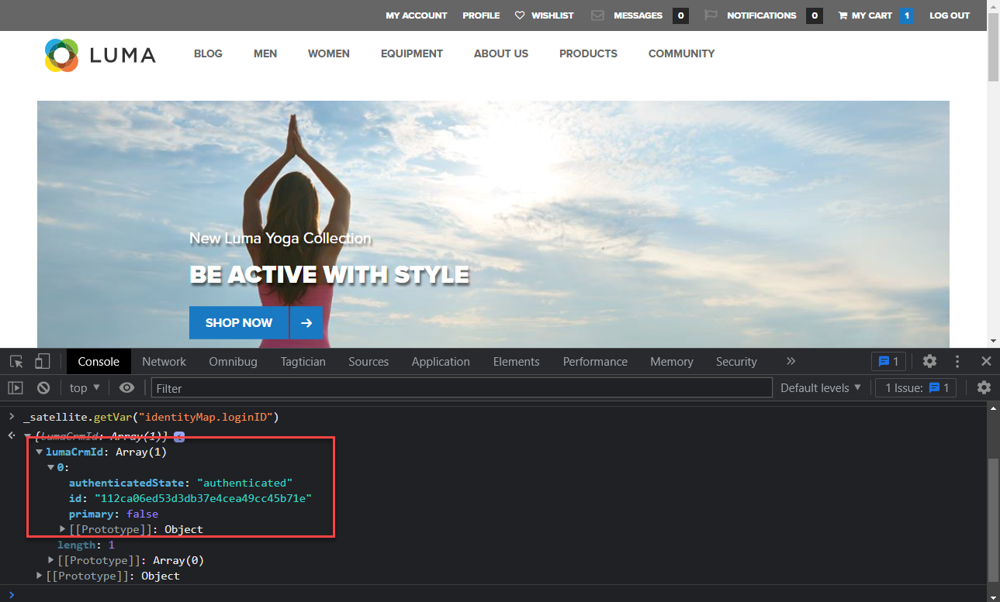

# データ要素の作成


>[!CAUTION]
>
>このチュートリアルの大きな変更は、2024 年 4 月 23 日火曜日（PT）に公開される予定です。 その後、多くの演習が変更され、すべてのレッスンを完了するには、最初からチュートリアルを再開する必要が生じる場合があります。

Experience Platform Web SDK を使用してデータを取得するために必要な、基本的なデータ要素を作成する方法を説明します。 上でコンテンツデータと ID データの両方をキャプチャ [Luma デモサイト](https://luma.enablementadobe.com/content/luma/us/en.html). XDM オブジェクトと呼ばれる新しいデータ要素タイプを通じて、Platform Web SDK を使用してデータを収集するために以前作成した XDM スキーマを使用する方法を説明します。

>[!NOTE]
>
> デモ目的で、このレッスンの演習は、で使用する例に基づいて構築されています [スキーマの設定](configure-schemas.md) 手順；で表示されるコンテンツとユーザーの ID をキャプチャする XDM オブジェクトの例の作成 [Luma デモサイト](https://luma.enablementadobe.com/content/luma/us/en.html).

>[!IMPORTANT]
>
>このレッスンのデータは、 `[!UICONTROL digitalData]` luma サイト上のデータレイヤー。 データレイヤーを表示するには、開発者コンソールを開いてと入力します。 `[!UICONTROL digitalData]` 使用可能な完全なデータレイヤーを確認するには、


Platform Web SDK に関係なく、web サイトからのデータ収集変数にマッピングするタグプロパティ内に、データレイヤー、HTML属性など、引き続きデータ要素を作成する必要があります。 これらのデータ要素を作成したら、次の作業で作成した XDM スキーマにマッピングする必要があります [スキーマの設定](configure-schemas.md) レッスン： これを行うために、Platform Web SDK 拡張機能では、XDM オブジェクトと呼ばれる新しいデータ要素タイプを使用可能にします。 したがって、データ要素の作成は次の 2 つのアクションで構成されます。

1. データ要素への web サイト変数のマッピング
1. これらのデータ要素の XDM オブジェクトへのマッピング

手順 1 では、引き続き、コアタグ拡張機能の任意のデータ要素タイプを使用して、現在の方法でデータレイヤーをデータ要素にマッピングします。 手順 2 の場合、Platform Web SDK 拡張機能は、以前は使用できなかった新しいデータ要素タイプのセットを作成します。

* イベント結合 ID
* ID マップ
* XDM オブジェクト

このレッスンでは、XDM オブジェクトと ID マップのデータ要素タイプに焦点を当てます。 Luma 訪問者のアクティビティと認証ステータスを取得する XDM オブジェクトを作成します。

## 学習目標

このレッスンを終了すると、次の操作を実行できます。

* コンテンツとユーザーログイン ID のデータを取り込むためのデータ要素の作成
* ID マップデータ要素の作成
* データ要素を XDM オブジェクトデータ要素にマッピングする


## 前提条件

データレイヤーとは何かを理解し、 [Luma デモサイト](https://luma.enablementadobe.com/content/luma/us/en.html){target="_blank"} データレイヤーを使用し、タグでデータ要素を参照する方法を理解する。 チュートリアルの次の前の手順を完了している必要があります

* [権限の設定](configure-permissions.md)
* [XDM スキーマの設定](configure-schemas.md)
* [ID 名前空間の設定](configure-identities.md)
* [データストリームの設定](configure-datastream.md)
* [タグプロパティにインストールされている Web SDK 拡張機能](install-web-sdk.md)

>[!IMPORTANT]
>
>この [Experience CloudID サービス拡張機能](https://exchange.adobe.com/experiencecloud.details.100160.adobe-experience-cloud-id-launch-extension.html) id サービス機能はAdobe Experience Platform Web SDK に組み込まれているので、Platform Web SDK を実装する場合は必要ありません。

## データ要素を作成してデータレイヤーをキャプチャする

XDM オブジェクトの作成を開始する前に、にマッピングする次のデータ要素セットを作成します [Luma デモサイト](https://luma.enablementadobe.com/content/luma/us/en.html){target="_blank"} データレイヤー：

1. に移動 **[!UICONTROL データ要素]** を選択して、 **[!UICONTROL データ要素を追加]** （または **[!UICONTROL 新しいデータ要素の作成]** タグプロパティに既存のデータ要素がない場合）

   

1. データ要素に「`page.pageInfo.pageName`」と名前を付けます。
1. の使用 **[!UICONTROL JavaScript 変数]** **[!UICONTROL データ要素タイプ]** luma のデータレイヤーの値を指すようにするには： `digitalData.page.pageInfo.pageName`

1. チェックボックスをオンにする **[!UICONTROL 小文字の値を強制]** および **[!UICONTROL テキストをクリーン]** 大文字と小文字を統一し、余分なスペースを削除するには

1. 移動 `None` as the **[!UICONTROL ストレージ期間]** この値はページごとに異なるので、を設定します

1. 「**[!UICONTROL 保存]**」を選択します

   

同じ手順に従って、次の 4 つの追加データ要素を作成します。

* **`page.pageInfo.server`**  マッピング先
  `digitalData.page.pageInfo.server`

* **`page.pageInfo.hierarchie1`**  マッピング先
  `digitalData.page.pageInfo.hierarchie1`

* **`user.profile.attributes.username`**  マッピング先
  `digitalData.user.0.profile.0.attributes.username`

* **`user.profile.attributes.loggedIn`** マッピング先
  `digitalData.user.0.profile.0.attributes.loggedIn`

* **`cart.orderId`** マッピング先 `digitalData.cart.orderId` （これは、 [Analytics のセットアップ](setup-analytics.md) レッスン）


>[!CAUTION]
>
>この [!UICONTROL JavaScript 変数] データ要素タイプは、配列参照を角括弧ではなくドットとして扱うので、ユーザー名データ要素はとして参照します `digitalData.user[0].profile[0].attributes.username` **動作しない**.

## Id マップデータ要素の作成

次に、ID マップデータ要素を作成します。

1. に移動 **[!UICONTROL データ要素]** を選択して、 **[!UICONTROL データ要素を追加]**

1. **[!UICONTROL 名前]** データ要素 `identityMap.loginID`

1. として **[!UICONTROL 拡張機能]**&#x200B;を選択 `Adobe Experience Platform Web SDK`

1. として **[!UICONTROL データ要素タイプ]**&#x200B;を選択 `Identity map`

1. 内で画面領域の右側が表示されます **[!UICONTROL データ収集インターフェイス]** id を設定するには：

   

1. として  **[!UICONTROL 名前空間]**&#x200B;を選択し、 `Luma CRM Id` で以前に作成した名前空間 [Id の設定](configure-identities.md) レッスン：

   >[!NOTE]
   >
   >    表示されない場合 `Luma CRM Id` 名前空間。デフォルトの実稼動サンドボックスでも作成したことを確認してください。 現在、名前空間ドロップダウンに表示されるのは、デフォルトの実稼動サンドボックスで作成された名前空間のみです。

1. 後 **[!UICONTROL 名前空間]** を選択しました。ID を設定する必要があります。 「」を選択します `user.profile.attributes.username` このレッスンの前半で作成したデータ要素。ユーザーが Luma サイトにログインしたときに ID を取得します。

<!--  >[!TIP]
   >
   >You can verify the **[!UICONTROL Luma CRM ID]** is collected in a data element on the web property by going to the [Luma Demo site](https://luma.enablementadobe.com/content/luma/us/en.html), logging in, [switching the tag environment](validate-with-debugger.md#use-the-experience-platform-debugger-to-map-to-your-tag-property) to your own, and typing `_satellite.getVar("user.profile.attributes.username")` in the web browser developer console.
   >
   >   
-->

1. として **[!UICONTROL 認証状態]**&#x200B;を選択 **[!UICONTROL 認証済み]**
1. を選択 **[!UICONTROL プライマリ]**

1. 「**[!UICONTROL 保存]**」を選択します

   

>[!TIP]
>
> Adobeでは、次のような、人物を表す ID を送信することをお勧めします `Luma CRM Id`、として [!UICONTROL プライマリ] id。
>
> ID マップに人物識別子が含まれる場合（例： `Luma CRM Id`）に設定すると、人物識別子はになります [!UICONTROL プライマリ] id。 そうでない場合、 `ECID` がになります [!UICONTROL プライマリ] id。


<!--
1. Once the data element is configured in **[!UICONTROL Data Collection interface]**, it can be tested on the Luma web property like any other Data Element. Enter the following script in the browser developer console
   
   
   ```
   _satellite.getVar('identityMap.loginID')
   ```  

   
   
   >[!NOTE]
   >
   >ECID identifier will NOT populate in the Data Element, as this is configured already with Platform Web SDK.   
-->

## データ要素の XDM オブジェクトへのマッピング

作成するすべてのデータ要素は、XDM オブジェクトにマッピングする必要があります。 このオブジェクトは、次の作業の際に作成した XDM スキーマに準拠している必要があります [スキーマの設定](configure-schemas.md) レッスン：

データ要素を XDM オブジェクトフィールドにマッピングするには、様々な方法があります。 データ要素が XDM オブジェクトに存在する正確なキーと値のペアのスキーマに一致する限り、個々のデータ要素を個々の XDM フィールドにマッピングしたり、データ要素を XDM オブジェクト全体にマッピングしたりできます。 このレッスンでは、個々のフィールドにマッピングしてコンテンツ データをキャプチャします。 以下の方法について説明します [データ要素を XDM オブジェクト全体にマッピング](setup-analytics.md#Map-an-entire-array-to-an-XDM-Object) が含まれる [Analytics のセットアップ](setup-analytics.md) レッスン：

コンテンツデータを取得する XDM オブジェクトを作成します。

1. 左側のナビゲーションで、を選択します。 **[!UICONTROL データ要素]**
1. を選択 **[!UICONTROL データ要素を追加]**
1. **[!UICONTROL 名前]** データ要素 **`xdm.content`**
1. として **[!UICONTROL 拡張機能]** 選択 `Adobe Experience Platform Web SDK`
1. として **[!UICONTROL データ要素タイプ]** 選択 `XDM object`
1. プラットフォームを選択 **[!UICONTROL Sandbox]** で処理中に XDM スキーマを作成した [XDM スキーマの設定](configure-schemas.md) レッスン（この例では） `DEVELOPMENT Mobile and Web SDK Courses`
1. として **[!UICONTROL スキーマ]**&#x200B;を選択します `Luma Web Event Data` スキーマ：

   

   >[!NOTE]
   >
   >サンドボックスは、スキーマを作成したExperience Platformサンドボックスに対応しています。 Experience Platformインスタンスでは複数のサンドボックスを使用できるので、必ず適切なサンドボックスを選択してください。 必ず開発、次に実稼動で作業してください。

1. に到達するまで下にスクロールします。 **`web`** オブジェクト
1. 選択して開きます

   


1. 次の web XDM 変数をデータ要素にマッピングします

   * **`web.webPageDetials.name`**&#x200B;コピー先：`%page.pageInfo.pageName%`
   * **`web.webPageDetials.server`**&#x200B;コピー先：`%page.pageInfo.server%`
   * **`web.webPageDetials.siteSection`**&#x200B;コピー先：`%page.pageInfo.hierarchie1%`

   

1. 次に、を見つけます `identityMap` スキーマ内のオブジェクトを選択し、以下の手順を実行します

1. をにマッピングします `identityMap.loginID` データ要素

1. 「**[!UICONTROL 保存]**」を選択します

   


これらの手順の最後で、次のデータ要素が作成されているはずです。

| CORE 拡張機能のデータ要素 | Platform Web SDK データ要素 |
-----------------------------|-------------------------------
| `cart.orderId` | `identityMap.loginID` |
| `page.pageInfo.hierarchie1` | `xdm.content` |
| `page.pageInfo.pageName` | |
| `page.pageInfo.server` | |
| `user.profile.attributes.loggedIn` | |
| `user.profile.attributes.username` | |

これらのデータ要素を配置すると、タグにルールを作成することで、XDM オブジェクトを介して Platform Edge Networkへのデータ送信を開始する準備が整います。

[次へ： ](create-tag-rule.md)

>[!NOTE]
>
>Adobe Experience Platform Web SDK の学習に時間を費やしていただき、ありがとうございます。 ご質問がある場合、一般的なフィードバックを共有する場合、将来のコンテンツに関する提案がある場合は、このページで共有します [Experience League コミュニティ ディスカッションの投稿](https://experienceleaguecommunities.adobe.com/t5/adobe-experience-platform-launch/tutorial-discussion-implement-adobe-experience-cloud-with-web/td-p/444996)
