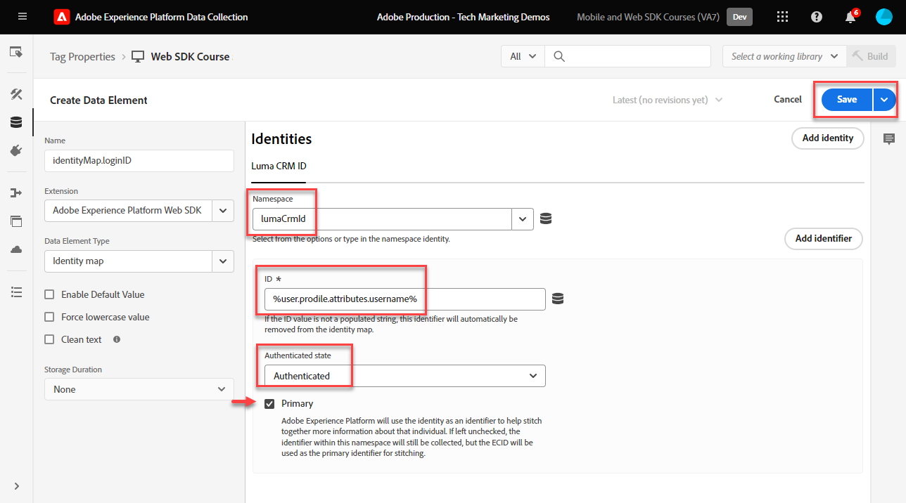
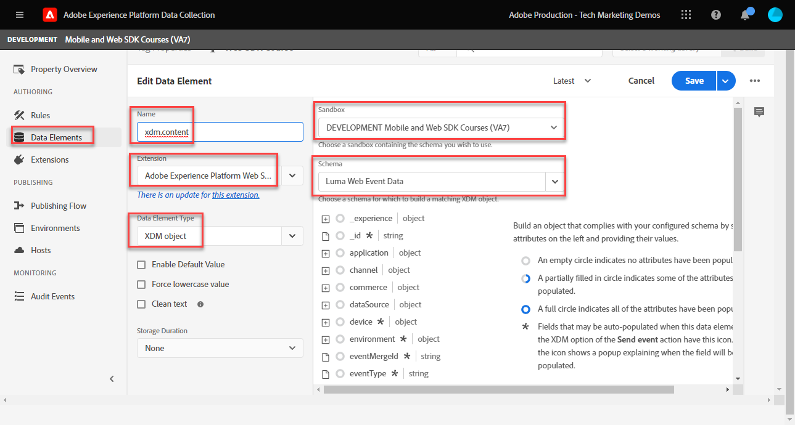

# データ要素の作成

Experience PlatformWeb SDK を使用して、データを取得するために必要な基本的なデータ要素を作成する方法について説明します。 のコンテンツと ID データの両方を [Luma デモサイト](https://luma.enablementadobe.com/content/luma/us/en.html). 前に作成した XDM スキーマを使用し、XDM オブジェクトと呼ばれる新しいデータ要素タイプを通じて、Platform Web SDK を使用してデータを収集する方法について説明します。

>[!NOTE]
>
> デモの目的で、このレッスンの演習は、 [スキーマの設定](configure-schemas.md) ステップ表示されたコンテンツと、 [Luma デモサイト](https://luma.enablementadobe.com/content/luma/us/en.html).

>[!IMPORTANT]
>
>このレッスンのデータは、 `[!UICONTROL digitalData]` Luma サイトのデータレイヤー。 データレイヤーを表示するには、デベロッパーコンソールを開き、「 」と入力します。 `[!UICONTROL digitalData]` をクリックして、使用可能なデータレイヤー全体を確認します。


Platform Web SDK に関係なく、Web サイトのデータ収集変数 ( データレイヤー、HTML属性など ) にマッピングするデータ要素を、タグプロパティ内で引き続き作成する必要があります。 これらのデータ要素を作成したら、それらを、 [スキーマの設定](configure-schemas.md) レッスン。 これをおこなうには、Platform Web SDK 拡張機能で、XDM オブジェクトと呼ばれる新しいデータ要素を使用できるようにします。 したがって、データ要素の作成は、次の 2 つのアクションで構成されます。

1. Web サイト変数のデータ要素へのマッピングおよび
1. これらのデータ要素の XDM オブジェクトへのマッピング

手順 1 では、コアタグ拡張機能のデータ要素タイプのいずれかを使用して、現在の方法でデータレイヤーをデータ要素に引き続きマッピングします。 手順 2 では、Platform Web SDK 拡張機能は、以前は使用できなかった一連の新しいデータ要素を作成します。

* イベント結合 ID
* ID マップ
* XDM オブジェクト

このレッスンでは、XDM オブジェクトと ID マップのデータ要素タイプに焦点を当てます。 Luma 訪問者のアクティビティと認証ステータスをキャプチャするための XDM オブジェクトを作成します。

## 学習内容

このレッスンを最後まで学習すると、次のことが可能になります。

* コンテンツおよびユーザーログイン ID データを取り込むためのデータ要素の作成
* ID マップデータ要素の作成
* データ要素を XDM オブジェクトデータ要素にマッピングする


## 前提条件

データレイヤーとは何かを把握し、 [Luma デモサイト](https://luma.enablementadobe.com/content/luma/us/en.html){target="_blank"} データレイヤーを参照し、タグ内のデータ要素を参照する方法を理解している必要があります。 チュートリアルの前の次の手順を完了している必要があります

* [権限の設定](configure-permissions.md)
* [XDM スキーマの設定](configure-schemas.md)
* [ID 名前空間の設定](configure-identities.md)
* [データストリームの設定](configure-datastream.md)
* [タグプロパティにインストールされる Web SDK 拡張機能](install-web-sdk.md)

>[!IMPORTANT]
>
>この [Experience CloudID サービス拡張機能](https://exchange.adobe.com/experiencecloud.details.100160.adobe-experience-cloud-id-launch-extension.html) は、Adobe Experience Platform Web SDK を実装する際には必要ありません。ID サービス機能は、Platform Web SDK に組み込まれているからです。

## データレイヤーを取り込むためのデータ要素の作成

XDM オブジェクトの作成を開始する前に、次の一連のデータ要素マッピングを作成し、 [Luma デモサイト](https://luma.enablementadobe.com/content/luma/us/en.html){target="_blank"} データレイヤー：

1. に移動します。 **[!UICONTROL データ要素]** を選択し、 **[!UICONTROL データ要素を追加]** ( または **[!UICONTROL 新規データ要素の作成]** タグプロパティに既存のデータ要素がない場合 )

   

1. データ要素に「`page.pageInfo.pageName`」と名前を付けます。
1. 以下を使用： **[!UICONTROL JavaScript 変数]** **[!UICONTROL データ要素タイプ]** を指定して、Luma のデータレイヤーの値を指定します。 `digitalData.page.pageInfo.pageName`

1. 「**[!UICONTROL 強制的に値を小文字に変換]**」および「**[!UICONTROL クリーンテキスト]**」のチェックボックスをオンして大文字と小文字を標準化し、不要なスペースを削除します。

1. 終了 `None` を **[!UICONTROL ストレージ期間]** の設定は、ページごとにこの値が異なるので、

1. 「**[!UICONTROL 保存]**」を選択します

   

同じ手順に従って、次の 4 つの追加データ要素を作成します。

* **`page.pageInfo.server`**  マッピング先
  `digitalData.page.pageInfo.server`

* **`page.pageInfo.hierarchie1`**  マッピング先
  `digitalData.page.pageInfo.hierarchie1`

* **`user.profile.attributes.username`**  マッピング先
  `digitalData.user.0.profile.0.attributes.username`

* **`user.profile.attributes.loggedIn`** マッピング先
  `digitalData.user.0.profile.0.attributes.loggedIn`

* **`cart.orderId`** マッピング先 `digitalData.cart.orderId` ( この [Analytics を設定](setup-analytics.md) レッスン )


>[!CAUTION]
>
>この [!UICONTROL JavaScript 変数] データ要素タイプは、配列参照を括弧ではなくドットとして扱うので、ユーザー名データ要素を `digitalData.user[0].profile[0].attributes.username` **動作しない**.

## ID マップデータ要素の作成

次に、ID マップデータ要素を作成できます。

1. に移動します。 **[!UICONTROL データ要素]** を選択し、 **[!UICONTROL データ要素を追加]**

1. **[!UICONTROL 名前]** データ要素 `identityMap.loginID`

1. を **[!UICONTROL 拡張]**&#x200B;を選択します。 `Adobe Experience Platform Web SDK`

1. を **[!UICONTROL データ要素タイプ]**&#x200B;を選択します。 `Identity map`

1. これにより、 **[!UICONTROL データ収集インターフェイス]** を使用して id を設定します。

   

1. を  **[!UICONTROL 名前空間]**&#x200B;を選択し、 `Luma CRM Id` 以前に [ID の設定](configure-identities.md) レッスン。

   >[!NOTE]
   >
   >    もし、 `Luma CRM Id` 名前空間で、デフォルトの実稼動サンドボックスでも作成したことを確認してください。 デフォルトの実稼動サンドボックスで作成された名前空間のみが、「名前空間」ドロップダウンに現在表示されます。

1. 次の期間の後 **[!UICONTROL 名前空間]** が選択されている場合は、ID を設定する必要があります。 を選択します。 `user.profile.attributes.username` このレッスンで作成したデータ要素。ユーザーが Luma サイトにログインしたときに ID を取り込みます。

<!--  >[!TIP]
   >
   >You can verify the **[!UICONTROL Luma CRM ID]** is collected in a data element on the web property by going to the [Luma Demo site](https://luma.enablementadobe.com/content/luma/us/en.html), logging in, [switching the tag environment](validate-with-debugger.md#use-the-experience-platform-debugger-to-map-to-your-tag-property) to your own, and typing `_satellite.getVar("user.profile.attributes.username")` in the web browser developer console.
   >
   >   
-->

1. を **[!UICONTROL 認証状態]**&#x200B;を選択します。 **[!UICONTROL 認証済み]**
1. 選択 **[!UICONTROL プライマリ]**

1. 「**[!UICONTROL 保存]**」を選択します

   

>[!TIP]
>
> Adobeでは、人物を表す ID（例： ）を送信することをお勧めします。 `Luma CRM Id`、 [!UICONTROL プライマリ] id.


<!--
1. Once the data element is configured in **[!UICONTROL Data Collection interface]**, it can be tested on the Luma web property like any other Data Element. Enter the following script in the browser developer console
   
   
   ```
   _satellite.getVar('identityMap.loginID')
   ```  

   
   
   >[!NOTE]
   >
   >ECID identifier will NOT populate in the Data Element, as this is configured already with Platform Web SDK.   
-->

## データ要素の XDM オブジェクトへのマッピング

作成するすべてのデータ要素は、XDM オブジェクトにマッピングされている必要があります。 このオブジェクトは、 [スキーマの設定](configure-schemas.md) レッスン。

データ要素を XDM オブジェクトフィールドにマッピングする方法は異なります。 データ要素が XDM オブジェクトに存在するキー値ペアのスキーマと完全に一致する限り、個々のデータ要素を個々の XDM フィールドにマップしたり、データ要素を XDM オブジェクト全体にマップしたりできます。 このレッスンでは、個々のフィールドにマッピングしてコンテンツデータをキャプチャします。 次の方法を学習します。 [データ要素を XDM オブジェクト全体にマッピングする](setup-analytics.md#Map-an-entire-array-to-an-XDM-Object) 内 [Analytics を設定](setup-analytics.md) レッスン。

コンテンツデータをキャプチャする XDM オブジェクトを作成します。

1. 左側のナビゲーションで、「 **[!UICONTROL データ要素]**
1. 選択 **[!UICONTROL データ要素を追加]**
1. ****&#x200B;データ要素に「」と名前を付けます。**`xdm.content`**
1. を **[!UICONTROL 拡張]** 選択 `Adobe Experience Platform Web SDK`
1. を **[!UICONTROL データ要素タイプ]** 選択 `XDM object`
1. プラットフォームを選択 **[!UICONTROL サンドボックス]** で XDM スキーマを作成したとき、 [XDM スキーマの設定](configure-schemas.md) レッスン：この例 `DEVELOPMENT Mobile and Web SDK Courses`
1. を **[!UICONTROL スキーマ]**&#x200B;を選択し、 `Luma Web Event Data` schema:

   

   >[!NOTE]
   >
   >サンドボックスは、Experience Platformを作成したスキーマサンドボックスに対応します。 Experience Platformインスタンスでは複数のサンドボックスを使用できるので、必ず正しいサンドボックスを選択してください。 常に最初に開発で作業し、次に実稼動で作業します。

1. 下にスクロールして、 **`web`** object
1. 選択して開きます

   


1. 次の Web XDM 変数をデータ要素にマッピングする

   * **`web.webPageDetials.name`**&#x200B;コピー先：`%page.pageInfo.pageName%`
   * **`web.webPageDetials.server`**&#x200B;コピー先：`%page.pageInfo.server%`
   * **`web.webPageDetials.siteSection`**&#x200B;コピー先：`%page.pageInfo.hierarchie1%`

   

1. 次に、 `identityMap` オブジェクトを選択して選択します。

1. にマッピング `identityMap.loginID` データ要素

1. 「**[!UICONTROL 保存]**」を選択します

   


これらの手順の最後に、次のデータ要素を作成する必要があります。

| CORE 拡張機能のデータ要素 | Platform Web SDK のデータ要素 |
-----------------------------|-------------------------------
| `cart.orderId` | `identityMap.loginID` |
| `page.pageInfo.hierarchie1` | `xdm.content` |
| `page.pageInfo.pageName` | |
| `page.pageInfo.server` | |
| `user.profile.attributes.loggedIn` | |
| `user.profile.attributes.username` | |

これらのデータ要素が配置されたら、タグでルールを作成して、XDM オブジェクトを介して Platform Edge Network へのデータ送信を開始する準備が整いました。

[次へ： ](create-tag-rule.md)

>[!NOTE]
>
>Adobe Experience Platform Web SDK の学習に時間を割いていただき、ありがとうございます。 ご質問がある場合、一般的なフィードバックを共有したい場合、または今後のコンテンツに関する提案がある場合は、こちらで共有してください [Experience Leagueコミュニティディスカッション投稿](https://experienceleaguecommunities.adobe.com/t5/adobe-experience-platform-launch/tutorial-discussion-implement-adobe-experience-cloud-with-web/td-p/444996)
