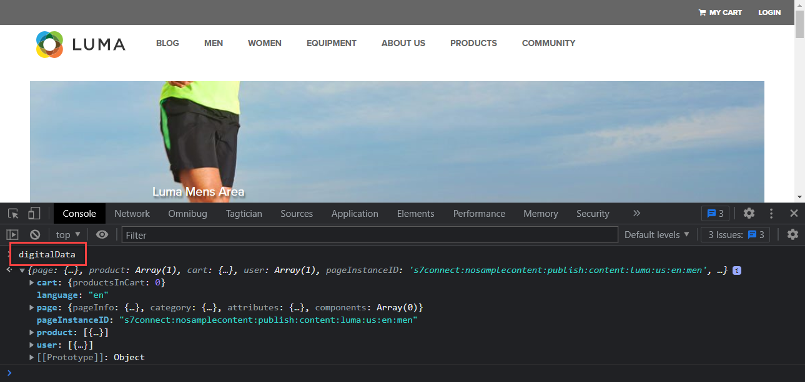
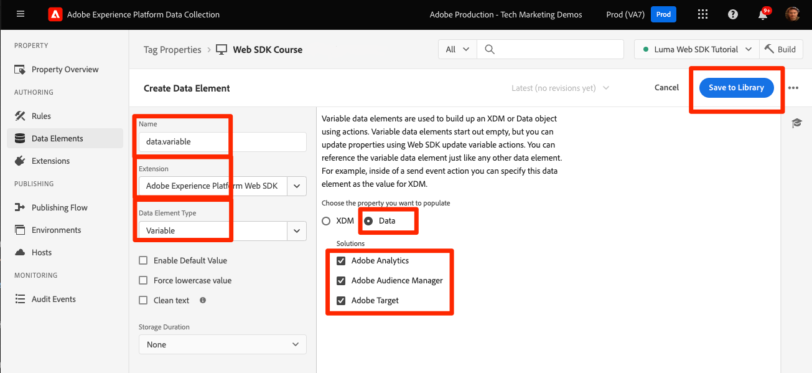

# データ要素の作成

[Luma デモサイト ](https://luma.enablementadobe.com/content/luma/us/en.html) で、コンテンツ、コマース、ID データのタグでデータ要素を作成する方法を説明します。 次に、XDM スキーマのフィールドにAdobe Experience Platform Web SDK拡張機能の変数データ要素タイプを入力します。

## 学習目標

このレッスンを終了すると、次の操作を実行できます。

* データレイヤーを XDM にマッピングする様々なアプローチを理解する
* データをキャプチャするデータ要素の作成
* XDM オブジェクトへのデータ要素のマッピング


## 前提条件

データレイヤーとは何かを理解し、チュートリアルの前のレッスンを完了しました。

* [XDM スキーマの設定](configure-schemas.md)
* [ID 名前空間の設定](configure-identities.md)
* [データストリームの設定](configure-datastream.md)
* [タグプロパティにインストールされている web SDK拡張機能](install-web-sdk.md)


>[!IMPORTANT]
>
>このレッスンのデータは、Luma サイトの `[!UICONTROL digitalData]` データレイヤーから得られます。 データレイヤーを表示するには、開発者コンソールを開き、`[!UICONTROL digitalData]` と入力して、使用可能な完全なデータレイヤーを表示します。


## データレイヤーのアプローチ

Adobe Experience Platformのタグ機能を使用して、データレイヤーから XDM にデータをマッピングする方法は複数あります。 次に、3 つの異なるアプローチの長所と短所をいくつか示します。 必要に応じて、次の方法を組み合わせることができます。

1. データレイヤーへの XDM の実装
1. タグの XDM へのマッピング
1. データストリームの XDM へのマッピング

>[!NOTE]
>
>このチュートリアルの例では、タグで XDM にマッピングするアプローチに従っています。


### データレイヤーへの XDM の実装

このアプローチでは、完全に定義された XDM オブジェクトをデータレイヤーの構造として使用します。 次に、データレイヤー全体をタグの XDM オブジェクトデータ要素にマッピングします。 実装でタグマネージャーを使用していない場合、[XDM sendEvent コマンド ](https://experienceleague.adobe.com/en/docs/experience-platform/edge/fundamentals/tracking-events#sending-xdm-data) を使用してアプリケーションから直接 XDM にデータを送信できるので、このアプローチは理想的です。 タグを使用する場合は、データレイヤー全体をパススルー JSON オブジェクトとして XDM に取り込むカスタムコードデータ要素を作成できます。 次に、パススルー JSON をイベント送信アクションの XDM オブジェクトフィールドにマッピングします。

以下に、Adobe Client Data Layer フォーマットを使用したデータレイヤーの外観の例を示します。

データレイヤー内の+++XDM の例

```JSON
window.adobeDataLayer.push({
"eventType": "web.webPageDetails.pageViews",
"web":{
         "webInteraction":{
            "linkClicks":{
               "id":"",
               "value":""
            },
            "URL":"",
            "name":"",
            "region":"",
            "type":""
         },
         "webPageDetails":{
            "pageViews":{
               "id":"",
               "value":"1"
            },
            "URL":"https://luma.enablementadobe.com/",
            "isErrorPage":"",
            "isHomePage":"",
            "name":"luma:home",
            "server":"enablementadobe.com",
            "siteSection":"home",
            "viewName":""
         },
         "webReferrer":{
            "URL":"",
            "type":""
         }
      }
});
```

+++

長所

* データレイヤー変数から XDM への再マッピングの追加手順を不要にします
* タグ付けデジタル動作も web 開発チームが所有している場合は、のデプロイが早くなる可能性があります

短所

* XDM に送信するデータを更新するために、開発チームと開発サイクルに完全に依存している
* XDM はデータレイヤーから正確なペイロードを受け取るので、柔軟性は限られています
* スクレーピング、永続性、迅速なデプロイメントのための機能など、ビルトインのタグ機能は使用できません
* サードパーティのピクセルにデータレイヤーを使用するのは難しいです（ただし、これらのピクセルを [ イベント転送 ](setup-event-forwarding.md) に移動する必要がある場合があります。
* データレイヤーと XDM の間でデータを変換できない

### タグ内のデータレイヤーのマッピング

このアプローチでは、個々のデータレイヤー変数またはデータレイヤーオブジェクトをタグのデータ要素にマッピングし、最終的には XDM にマッピングします。 これは、タグ管理システムを使用した実装に対する従来のアプローチです。

#### 長所

* XDM に到達する前に個々の変数を制御し、データを変換できるため、最も柔軟なアプローチ
* Adobe タグのトリガーとスクレーピング機能を使用して、データを XDM に渡すことができます
* データ要素をサードパーティのピクセルにクライアントサイドでマッピングできます。

#### 短所

* データレイヤーをデータ要素として再構築するのに時間がかかる


>[!TIP]
>
> Google データレイヤー
> 
> 組織が既にGoogle Analyticsを使用しており、web サイトに従来のGoogle dataLayer オブジェクトがある場合は、タグの [0}Google Data Layer extension} を使用できます。 ](https://experienceleague.adobe.com/en/docs/experience-platform/tags/extensions/client/google-data-layer/overview)これにより、IT チームにサポートを依頼することなく、Adobe テクノロジーをより迅速にデプロイできます。 Google データレイヤーを XDM にマッピングするには、上記と同じ手順に従います。

### データストリームの XDM へのマッピング

このアプローチでは、[ データ収集のためのデータ準備 ](https://experienceleague.adobe.com/en/docs/experience-platform/datastreams/data-prep) と呼ばれるデータストリーム設定に組み込まれた機能を使用し、タグの XDM へのデータレイヤー変数のマッピングをスキップします。

#### 長所

* 個々の変数を XDM にマッピングできるので、柔軟性があります
* XDM に送信する前にデータレイヤーから [ 新しい値を計算 ](https://experienceleague.adobe.com/en/docs/experience-platform/data-prep/functions) または [ データタイプを変換 ](https://experienceleague.adobe.com/en/docs/experience-platform/data-prep/data-handling) する機能
* [ マッピング UI](https://experienceleague.adobe.com/en/docs/experience-platform/datastreams/data-prep#create-mapping) を活用して、ポイントアンドクリック UI でソースデータのフィールドを XDM にマッピングします

#### 短所

* データレイヤー変数をクライアントサイドのサードパーティピクセルのデータ要素として使用することはできませんが、イベント転送では使用できます
* Adobe Experience Platformのタグ機能のスクレーピング機能を使用できない
* タグとデータストリームの両方でデータレイヤーをマッピングすると、メンテナンスが複雑になります


>[!IMPORTANT]
>
>前述のように、このチュートリアルの例では、タグアプローチでの XDM へのマッピングに従います。

## データ要素を作成してデータレイヤーをキャプチャする

XDM オブジェクトを作成する前に、[Luma デモサイト ](https://luma.enablementadobe.com/content/luma/us/en.html){target="_blank"} データレイヤーに次のデータ要素のセットを作成します。

1. **[!UICONTROL データ要素]** に移動し、「**[!UICONTROL データ要素を追加]** （タグプロパティに既存のデータ要素がない場合は「**[!UICONTROL 新しいデータ要素を作成]**」を選択します

   

1. データ要素に「`page.pageInfo.pageName`」と名前を付けます。
1. **[!UICONTROL JavaScript変数]** **[!UICONTROL データ要素タイプ]** を使用して、Luma のデータレイヤーの値を指すようにします。`digitalData.page.pageInfo.pageName`

1. 「**[!UICONTROL 小文字を強制]**」および「**[!UICONTROL テキストをクリーン]**」チェックボックスをオンにして大文字と小文字を区別し、不要なスペースを削除します

1. この値はページごとに異なるので、`None` を **[!UICONTROL ストレージ期間]** 設定のままにします

1. 「**[!UICONTROL 保存]**」を選択します

   

同じ手順に従って、これらの追加のデータ要素を作成します。

* **`page.pageInfo.server`** マッピング先
  `digitalData.page.pageInfo.server`

* **`page.pageInfo.hierarchie1`** マッピング先
  `digitalData.page.pageInfo.hierarchie1`

* **`user.profile.attributes.username`** マッピング先
  `digitalData.user.0.profile.0.attributes.username`

* **`user.profile.attributes.loggedIn`** マッピング先
  `digitalData.user.0.profile.0.attributes.loggedIn`

* **`product.productInfo.sku`** にマッピングされた `digitalData.product.0.productInfo.sku`
<!--digitalData.product.0.productInfo.sku
    ```javascript
    var cart = digitalData.product;
    var cartItem;
    cart.forEach(function(item){
    cartItem = item.productInfo.sku;
    });
    return cartItem;
    ```
    -->
* **`product.productInfo.title`** にマッピングされた `digitalData.product.0.productInfo.title`
* **`cart.orderId`** にマッピングされた `digitalData.cart.orderId`
<!--
    ```javascript
    var cart = digitalData.product;
    var cartItem;
    cart.forEach(function(item){
    cartItem = item.productInfo.title;
    });
    return cartItem;
    ```
    -->
* **`product.category`** カスタムコード **** データ要素タイプ **[!UICONTROL と次のカスタムコードを使用して、トップレベルカテゴリのサイト URL を解析で]** ます。

  ```javascript
  var cat = location.pathname.split(/[/.]+/);
  if (cat[5] == 'products') {
     return (cat[6]);
  } else if (cat[5] != 'html') { 
     return (cat[5]);
  }
  ```

* 次のカスタムコードを使用して **`cart.productInfo`** きます。

  ```javascript
  var cart = digitalData.cart.cartEntries; 
  var cartItem = [];
  cart.forEach(function(item, index, array){
  cartItem.push({
  "SKU": item.sku
  });
  });
  return cartItem; 
  ```

* 次のカスタムコードを使用して **`cart.productInfo.purchase`** きます。

  ```javascript
  var cart = digitalData.cart.cartEntries; 
  var cartItem = [];
  cart.forEach(function(item, index, array){
  var qty = parseInt(item.qty);
  var price = parseInt(item.price);
  cartItem.push({
  "SKU": item.sku,
  "quantity": qty,
  "priceTotal": price
  });
  });
  return cartItem; 
  ```


>[!CAUTION]
>
>[!UICONTROL JavaScript変数 ] データ要素タイプは、配列参照を角括弧ではなくドットとして扱うので、ユーザー名データ要素を `digitalData.user[0].profile[0].attributes.username` **として参照することは機能しません**。

## XDM およびデータオブジェクト用の変数データ要素の作成

作成したデータ要素は、XDM オブジェクト（Platform アプリケーション用）とデータオブジェクト（Analytics、Target およびAudience Manager用）の作成に使用されます。 これらのオブジェクトには、非常に簡単に作成できる **[!UICONTROL 変数]** データ要素と呼ばれる独自の特別なデータ要素があります。

XDM の変数データ要素を作成するには、[ スキーマの設定 ](configure-schemas.md) レッスンで作成したスキーマに関連付けます。

1. 「**[!UICONTROL データ要素を追加]**」を選択します。
1. データ要素に `xdm.variable.content` という名前を付けます。 タグプロパティを整理しやすくするために、XDM に固有のデータ要素を「xdm」というプレフィックスを付けることをお勧めします
1. 「**[!UICONTROL Extension]**」として「**[!UICONTROL Adobe Experience Platform Web SDK]**」を選択します
1. **[!UICONTROL データ要素タイプ]** として **[!UICONTROL 変数]** を選択します。
1. **[!UICONTROL プロパティ]** として **[!UICONTROL XDM]** を選択します
1. スキーマを作成した **[!UICONTROL サンドボックス]** を選択します
1. 適切な **[!UICONTROL スキーマ]** を選択します。ここでは `Luma Web Event Data` です
1. 「**[!UICONTROL 保存]**」を選択します

   

次に、データオブジェクトの変数データ要素を作成します。

1. 「**[!UICONTROL データ要素を追加]**」を選択します。
1. データ要素に `data.variable` という名前を付けます。 タグプロパティを整理しやすくするために、データオブジェクトに固有のデータ要素に「data」というプレフィックスを付けることをお勧めします
1. 「**[!UICONTROL Extension]**」として「**[!UICONTROL Adobe Experience Platform Web SDK]**」を選択します
1. **[!UICONTROL データ要素タイプ]** として **[!UICONTROL 変数]** を選択します。
1. **[!UICONTROL data]** を **[!UICONTROL property]** として選択します
1. このチュートリアルの一部として実装するExperience Cloud ソリューションを選択します
1. 「**[!UICONTROL 保存]**」を選択します

   


これらの手順の最後で、次のデータ要素が作成されているはずです。

| コア拡張機能のデータ要素 | Platform Web SDK Extension のデータ要素 |
-----------------------------|-------------------------------
| `cart.orderId` | `data.variable` |
| `cart.productInfo` | `xdm.variable.content` |
| `cart.productInfo.purchase` | |
| `page.pageInfo.hierarchie1` | |
| `page.pageInfo.pageName` | |
| `page.pageInfo.server` | |
| `product.category` | |
| `product.productInfo.sku` | |
| `product.productInfo.title` | |
| `user.profile.attributes.loggedIn` | |
| `user.profile.attributes.username` | |

>[!TIP]
>
>今後の [ タグルールの作成 ](create-tag-rule.md) レッスンでは、**[!UICONTROL 変数]** データ要素を使用して、**[!UICONTROL 変数を更新アクションタイプ]** を使用してタグ内で複数のルールをスタックする方法を学習します。

これらのデータ要素を配置すると、タグルールを使用して Platform Edge Networkへのデータ送信を開始する準備が整います。 ただし、最初に、Web SDKを使用して ID を収集する方法を説明します。

>[!NOTE]
>
>Adobe Experience Platform Web SDKの学習にご協力いただき、ありがとうございます。 ご不明な点がある場合や、一般的なフィードバックを共有したい場合、または今後のコンテンツに関するご提案がある場合は、この [Experience League Community Discussion の投稿でお知らせください ](https://experienceleaguecommunities.adobe.com/t5/adobe-experience-platform-data/tutorial-discussion-implement-adobe-experience-cloud-with-web/td-p/444996)
