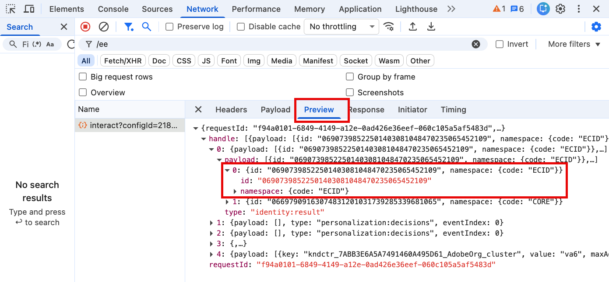
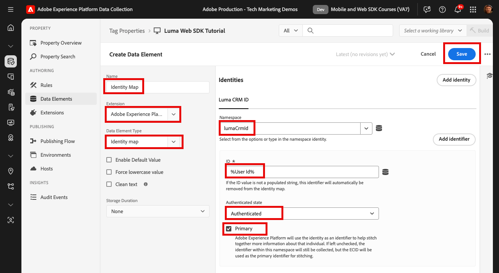

# IDの取得

Adobe Experience Platform Web SDK を使用して ID を取得する方法について説明します。[Luma デモ web サイト ](https://luma.enablementadobe.com)で、未認証のID データと認証済みのID データの両方をキャプチャします。 Platform Web SDKのID マップと呼ばれるデータ要素タイプで認証データを収集するために、先ほど作成したデータ要素を使用する方法を説明します。

このレッスンでは、Adobe Experience Platform Web SDK タグ拡張機能で使用できるID マップデータ要素に焦点を当てます。 認証済みユーザーIDと認証ステータスを含むデータ要素をXDMにマッピングします。

## 学習目標

このレッスンの最後には、次のことが可能になります。

* Experience Cloud ID （ECID）とファーストパーティデバイス ID （FPID）の関係について
* 未認証IDと認証済みIDの違いを把握する
* ID マップデータ要素の作成

## 前提条件

データレイヤーについて理解し、[Luma デモ web サイト ](https://luma.enablementadobe.com){target="_blank"} データレイヤーについて理解し、タグでデータ要素を参照する方法を理解しました。 チュートリアルの前のレッスンを完了している必要があります。

* [XDM スキーマの設定](configure-schemas.md)
* [ID名前空間の設定](configure-identities.md)
* [データストリームの設定](configure-datastream.md)
* [タグプロパティにインストールされたWeb SDK拡張機能](install-web-sdk.md)
* [データ要素の作成](create-data-elements.md)

## Experience Cloud ID

[Experience Cloud ID （ECID） ](https://experienceleague.adobe.com/en/docs/experience-platform/identity/features/ecid)は、Adobe Experience PlatformおよびAdobe Experience Cloud アプリケーションで使用される共有ID名前空間です。 ECIDは、顧客IDの基盤を提供し、デジタルプロパティのデフォルト IDです。 ECIDは、常に存在するため、未認証のユーザー行動を追跡するための理想的な識別子です。

<!-- 
FYI I commented this out because it was breaking the build - Jack
>[!TIP]
>
> When you use the Experience Platform Web SDK to set up Adobe applications on your digital properties, the ECID is generated at the Adobe Edge server level. As such, ECID is not viewable on the client-side network request payload. You can view the ECID by seeing the Preview tab of the network request, or by using the [Adobe Experience Platform Debugger Edge Trace](set-up-analytics.md#experience-cloud-id-validation).
>
-->

Platform Web SDK[を使用して](https://experienceleague.adobe.com/en/docs/experience-platform/edge/identity/overview)ECIDを追跡する方法について説明します。

ECIDは、ファーストパーティ CookieとPlatform Edge Networkを組み合わせて設定します。 デフォルトでは、ファーストパーティ ID CookieはWeb SDKによってクライアントサイドに設定されます。 Cookieの有効期間に対するブラウザーの制限を考慮するために、代わりに独自のファーストパーティ ID Cookieをサーバーサイドで設定することを選択できます。 これらのID Cookieは、ファーストパーティデバイス ID （FPID）と呼ばれます。

>[!IMPORTANT]
>
>ID サービス機能はPlatform Web SDKに組み込まれているため、Adobe Experience Platform Web SDKを実装する際に[Experience Cloud ID サービス拡張機能](https://exchange.adobe.com/apps/ec/100160/adobe-experience-cloud-id-launch-extension)は必要ありません。

## ファーストパーティデバイス ID （FPID）

FPIDは、Web SDKが設定したファーストパーティ Cookieではなく、AdobeがECIDの作成に使用する独自のweb サーバー&#x200B;_を使用して設定した1st パーティ Cookieです。_&#x200B;ブラウザーのサポートは異なる場合がありますが、DNS CNAMEやJavaScript コードで設定される場合とは異なり、DNS A レコード（IPv4の場合）またはAAA レコード（IPv6の場合）を活用するサーバーで設定する場合、ファーストパーティ Cookieの耐久性が高くなる傾向があります。

FPID Cookieが設定されると、その値を取得して、イベントデータが収集されるたびにAdobeに送信できます。 収集されたFPIDは、Platform Edge NetworkでECIDを生成するためのシードとして使用されます。これは、Adobe Experience Cloud アプリケーションのデフォルトのIDであり続けます。

このチュートリアルではFPIDは使用されませんが、独自のWeb SDKの実装ではFPIDを使用することをお勧めします。 [ ファーストパーティデバイス IDの詳細については、Platform Web SDK](https://experienceleague.adobe.com/en/docs/experience-platform/edge/identity/first-party-device-ids)を参照してください。

>[!CAUTION]
>
> FPIDは、Web サーバーが設定したCookieを使用してECIDを生成する別の方法です。 認証済みユーザーの識別には使用されません。

## 認証済みId

前述のように、Platform Web SDKを使用する場合、デジタルプロパティへのすべての訪問者には、AdobeによってECIDが割り当てられます。 ECIDは、未認証のデジタル行動を追跡するためのデフォルトのIDです。

また、認証されたユーザーIDを送信して、Platformが[ID グラフ ](https://experienceleague.adobe.com/en/docs/platform-learn/tutorials/identities/understanding-identity-and-identity-graphs)を作成し、Targetが[ サードパーティ ID](https://experienceleague.adobe.com/en/docs/target/using/audiences/visitor-profiles/3rd-party-id)を設定できるようにすることもできます。 認証IDの設定は、[!UICONTROL ID マップ ] データ要素タイプを使用して行われます。

[!UICONTROL ID マップ ] データ要素を作成するには：

1. **[!UICONTROL データ要素]**&#x200B;に移動し、**[!UICONTROL データ要素を追加]**&#x200B;を選択します

1. データ要素&#x200B;**[!UICONTROL の]** Name`Identity Map`

1. **[!UICONTROL 拡張機能]**&#x200B;として、`Adobe Experience Platform Web SDK`を選択します

1. **[!UICONTROL データ要素タイプ]**&#x200B;として、`Identity map`を選択します

1. **[!UICONTROL 名前空間]**&#x200B;として、`lumaCrmId`IDの設定[ レッスンで作成された](configure-identities.md)名前空間を選択します。 ドロップダウンに表示されない場合は、入力します。

1. **[!UICONTROL ID]**&#x200B;として、`User Id` データ要素の作成[ レッスンで作成された](create-data-elements.md#create-data-elements-to-capture-the-data-layer) データ要素を選択します。

1. **[!UICONTROL 認証済み状態]**&#x200B;として、**[!UICONTROL 認証済み]**&#x200B;を選択します
1. **[!UICONTROL プライマリ]**&#x200B;を選択

1. **[!UICONTROL 保存]**&#x200B;を選択

   

>[!IMPORTANT]
>
> Adobeでは、`Luma CRM Id`などの個人を表すIDを[!UICONTROL primary]IDとして送信することをお勧めします。
>
> ID マップに人物識別子（例：`Luma CRM Id`）が含まれている場合、その人物識別子は[!UICONTROL  プライマリ ] IDになります。 それ以外の場合、`ECID`は[!UICONTROL  プライマリ ]IDになります。
>
> さらに、Platform アプリケーションをお使いのお客様は、グラフの折りたたみを防ぐために[ID グラフリンクルール ](https://experienceleague.adobe.com/ja/docs/platform-learn/tutorials/identities/graph-linking-rules/overview)を実装することをお勧めします。

>[!NOTE]
>
> Web SDKの実装でECIDを取得するために何らかの操作を行う必要はありません。 自動的にキャプチャされます。

これらの手順の最後に、次のデータ要素を作成する必要があります。

| コア拡張機能データ要素 | Platform Web SDK Extension Data Elements |
|-----------------------------|-------------------------------|
| `Ecommerce Cart Products` | `Data Variable` |
| `Ecommerce Product Category` | `Identity Map` |
| `Ecommerce Product Id` | `XDM Variable` |
| `Ecommerce Product Name` | |
| `Ecommerce Purchase Id` | |
| `Ecommerce Purchase Products` |  |
| `Page Name` | |
| `User Id` | |
| `User Logged In` | |

これらのデータ要素を配置すれば、タグでルールを作成してPlatform Edge Networkにデータを送信する準備が整います。

>[!NOTE]
>
>Adobe Experience Platform Web SDKについて学ぶために時間を割いていただきありがとうございます。 ご質問がある場合、一般的なフィードバックを共有したい場合、または今後のコンテンツに関する提案がある場合は、この[Experience League コミュニティ ディスカッション投稿](https://experienceleaguecommunities.adobe.com/adobe-experience-platform-18/tutorial-discussion-implement-adobe-experience-cloud-with-web-sdk-tutorial-248848)で共有してください
