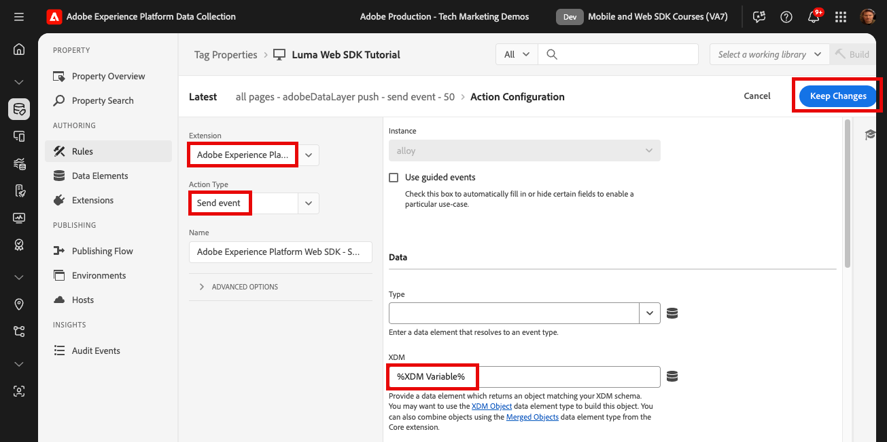
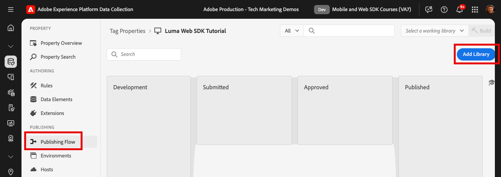

# タグルールの作成

タグルールを使用してAdobe Experience Platform Edge Networkにイベントを送信する方法について説明します。 タグルールは、イベント、条件、アクションを組み合わせたルールで、タグプロパティに対し、アクションの実行を指示します。 Platform Web SDKでは、ルールを使用して、適切なデータで Platform Edge Networkにイベントを送信します。

## 学習目標

このレッスンを終了すると、次の操作を実行できます。

* タグ内でルールを管理する際は、命名規則を使用します
* 「変数を更新」アクションと「イベントを送信」アクションを使用して XDM フィールドでイベントを送信
* 複数のルールをまたいで複数の XDM フィールドセットをスタックする
* 個々または全体の配列データ要素の XDM オブジェクトへのマッピング
* 開発ライブラリへのタグルールの公開

## 前提条件

データ収集タグと [Luma デモサイト &#x200B;](https://luma.enablementadobe.com) に精通し、チュートリアルの前のレッスンを完了しました。

* [XDM スキーマの設定](configure-schemas.md)
* [ID 名前空間の設定](configure-identities.md)
* [データストリームの設定](configure-datastream.md)
* [Web SDK 拡張機能のインストール](install-web-sdk.md)
* [データ要素の作成](create-data-elements.md)
* [ID のキャプチャ](create-identities.md)

## 命名規則

タグでルールを管理するには、標準の命名規則に従うことをお勧めします。 このチュートリアルでは、次の 4 つのパートで構成される命名規則を使用します。

* [**location**] - [**event**] - [**purpose**] - [**order**]

ここで、

1. **location** は、ルールが実行されるサイトの 1 つ以上のページです
1. **event**：ルールのトリガー
1. **目的** は、ルールによって実行される主なアクションです
1. **order** は、同じイベントを共有する他のルールに対して実行するルールの順序です
<!-- minor update -->

## Adobe クライアントデータレイヤー拡張機能を追加する

Luma の web サイトでは、Adobe Client Data Layer （ACDL）と呼ばれるイベント駆動型のデータレイヤーを使用しています。 データレイヤーイベントが発生すると、`adobeDataLayer` 配列にプッシュされます。 このチュートリアルでは、Adobe クライアントデータレイヤーと呼ばれるタグ拡張機能を使用して、これらのイベントを便利に利用し、ルールを作成します。

拡張機能を追加するには：

1. **[!UICONTROL 拡張機能]** に移動します。
1. **[!UICONTROL Adobe Client Data Layer]** にフィルタリング
1. 「**[!UICONTROL インストール]**」を選択します。

   

1. デフォルト設定のままにします
1. 「**[!UICONTROL 保存]**」を選択します

>[!NOTE]
>
> Experience Platform Web SDKを実装するためにAdobe Client Data Layer を使用する必要はありません。 他の多くのタイプのイベントは、ルールを実行するためにタグ実装（ライブラリの読み込み、DOM の準備、ウィンドウの読み込みなど）で一般的に使用されます。

## タグルールの作成

タグでは、ルールを使用して、様々な条件下での変数の設定やネットワーク呼び出しの実行などのアクションを実行します。 Experience Platform Web SDK タグ拡張機能には、ルールで使用される 2 つのアクションが含まれています。

* **[!UICONTROL 変数を更新]** データ要素を XDM またはデータ変数にマッピングします
* **[!UICONTROL Send Event]**:Experience Platform Edge Networkにデータを送信するためのネットワーク呼び出しを行います

このレッスンの残りの部分では、以下を行います。

1. **[!UICONTROL 変数を更新]** アクションを使用して、XDM フィールドの「グローバル設定」を定義します。

1. **[!UICONTROL 変数を更新]** アクションを再度使用して、「グローバル設定」をオーバーライドし、特定の条件下（製品ページへの製品詳細の追加など）で追加の XDM フィールドを提供します。

1. **[!UICONTROL イベントを送信]** アクションを使用して、Adobe Experience Platform Edge Networkにデータを送信します。

これらのルールはすべて、「[!UICONTROL order]」オプションを使用して適切に順序付けされます。

このビデオでは、プロセスの概要を説明します。

>[!VIDEO](https://video.tv.adobe.com/v/3427710/?learn=on&enablevpops)

### グローバル設定フィールド

グローバル XDM フィールドのタグルールを作成するには：

1. このチュートリアルで使用するタグプロパティを開きます

1. 左側のナビゲーションで **[!UICONTROL ルール]** に移動します

1. 「**[!UICONTROL 新規ルールを作成]**」ボタンを選択します

   

1. ルール名を設定します。`all pages - adobeDataLayer push - set global variables - 1`

1. 「**[!UICONTROL イベント]**」セクションで、「**[!UICONTROL 追加]**」を選択します

   

1. **[!UICONTROL Adobe Client Data Layer]** 拡張機能を使用し、**[!UICONTROL Event Type]** として **[!UICONTROL Data Pushed]** を選択します

1. **[!UICONTROL 詳細]** ドロップダウンを選択し、「`1` 注文 **[!UICONTROL 」として]** と入力します

   >[!NOTE]
   >
   > 注文番号が小さいほど、早く実行されます。 したがって、「グローバル設定」には低い注文番号を付けます。

1. リッスン **[!UICONTROL すべてのイベント]**
1. 「**[!UICONTROL 変更を保持]**」を選択して、メインのルール画面に戻ります
   

1. 「**[!UICONTROL アクション]**」セクションで、「**[!UICONTROL 追加]**」を選択します

1. **[!UICONTROL Extension]** として、「**[!UICONTROL Adobe Experience Platform Web SDK]**」を選択します

1. **[!UICONTROL アクションタイプ]** として、「**[!UICONTROL 変数を更新]**」を選択します

1. **[!UICONTROL データ要素]** として、`XDM Variable` データ要素の作成 [&#x200B; のレッスンで作成した &#x200B;](create-data-elements.md) を選択します

   

1. 次に、XDM フィールドを適切な値にマッピングして指定します。

   | XDM フィールド | マッピング先 |
   |---|---|
   | `eventType` | `Web Webpagedetails Page Views` （入力を開始して推奨値を確認する） |
   | `identityMap` | `Identity Map` データ要素 |
   | `web.webPageDetails.name` | `Page Name` データ要素 |
   | `web.webPageDetails.pageViews.value` | `1` |

   >[!TIP]
   >
   > データ要素が null の場合、XDM フィールドはネットワークリクエストに含まれません。 したがって、ユーザーが認証されず、`Identity Map` データ要素が null の場合、`identityMap` オブジェクトは送信されません。 だからこそ、「グローバル設定」で安全に定義できます。

   >[!TIP]
   >
   > `web.webPageDetails.pageViews.value` を設定すると、他のダウンストリームアプリケーションのページビューを指定するための標準的な方法が提供されます。 Adobe Analyticsがページビューとしてネットワーク呼び出しを処理する必要はありません。

1. 完了すると、`XDM Variable` は次のようになります。 次のように、入力されたフィールドと部分的に入力されたフィールドが青い円で示されます。
   
1. ルールの **[!UICONTROL 変更を保持]** を選択してから **[!UICONTROL 保存]** を選択します

### 製品ページフィールド

次に、追加の順序付きルールで **[!UICONTROL 変数を更新]** を使用して、XDM オブジェクトをエンリッチメントしてから、[!UICONTROL Platform Edge Network] に送信します。

>[!TIP]
>
>ルールの順序は、イベントがトリガーされたときに最初に実行されるルールを決定します。 2 つのルールのイベントタイプが同じ場合は、注文番号が最も小さいルールが最初に実行されます。
> 

まず、Luma の製品詳細ページで製品表示を追跡します。

1. 「**[!UICONTROL ルールを追加]**」を選択します
1. [!UICONTROL `product detail pages - adobeDataLayer push - set product details variables - 20`] という名前を付けます
1. イベントの下の  新しいトリガーを追加します
1. **[!UICONTROL Extension]** で、「**[!UICONTROL Adobe Client Data Layer]**」を選択します
1. **[!UICONTROL イベントタイプ]** で、「**[!UICONTROL プッシュされたデータ]**」を選択します
1. 選択して **[!UICONTROL 詳細オプション]** を開き、`20` を入力します。 この順序値によって、ルールがグローバル変数ルールの _後_ に実行されるようになります。
1. **[!UICONTROL 特定のイベント]** をリッスンします
1. `productView` 登録するイベント / キー **[!UICONTROL として]** を入力
1. 「**[!UICONTROL 変更を保持]**」を選択します

   

1. **[!UICONTROL アクション]** で **[!UICONTROL 追加]** を選択します
1. **[!UICONTROL Adobe Experience Platform Web SDK]** 拡張機能を選択します
1. **[!UICONTROL アクションタイプ]** を **[!UICONTROL 変数を更新]** として選択します
1. `XDM Variable` データ要素 **[!UICONTROL として]** を選択します
1. これらの XDM フィールドを適切な値にマッピングします。

   | XDM フィールド | マッピング先 |
   |---|---|
   | `eventType` | `Commerce Product Views` （入力を開始して推奨値を確認する） |
   | `commerce.productViews.value` | `1` |
   | `productListItems.name` | `Ecommerce Product Name` データ要素（選択 **[!UICONTROL 個々の項目を指定]** および **[!UICONTROL 項目を追加]** 最初） |
   | `productListItems.sku` | `Ecommerce Product Id` データ要素 |

1. 「**[!UICONTROL 変更を保持]**」を選択します

1. 「**[!UICONTROL 保存]**」を選択して、ルールを保存します

   >[!NOTE]
   >
   >このルールは優先順位が高いので、「グローバル設定」ルールの `eventType` 定が上書きされます。 `eventType` には 1 つの値のみを含めることができ、最も価値のあるイベントで設定することをお勧めします。

   >[!TIP]
   >
   >XDM で commerce.productViews.value=1 を設定すると、Analytics の `prodView` イベントに自動的にマッピングされます

### 買い物かごフィールド

配列が XDM スキーマの形式と一致する場合は、配列全体を XDM オブジェクトにマッピングできます。 前に作成したカスタムコードデータ要素 `Ecommerce Cart Products`、Luma web サイト上の `adobeDataLayer.ecommerce.cart.items` データレイヤーオブジェクトをループし、XDM スキーマの `productListItems` オブジェクトの必要な形式に変換します。

説明するには、以下の Luma サイトデータレイヤー（左）と翻訳済みデータ要素（右）の比較を参照してください。

データ要素と `productListItems` 構造を比較します（ヒント。一致する必要があります）。

>[!NOTE]
>
> この時点では、チュートリアルで `_satellite.getVar('Ecommerce Cart Products')` を実行することはできません。

>[!IMPORTANT]
>
>データレイヤーから XDM にフィールドをマッピングする場合は、フィールドが XDM フィールドのデータタイプと一致していることを確認します。 上記の例では、`quantity` と `priceTotal` は整数である必要があります。そうでない場合、レコードは Platform に取り込まれません。
> 

次に、配列を XDM オブジェクトにマッピングします。

1. `cart page - adobeDataLayer push - set cart variables - 20` という名前の新しいルールの作成
1. イベントの下の  新しいトリガーを追加します
1. **[!UICONTROL Extension]** で、「**[!UICONTROL Adobe Client Data Layer]**」を選択します
1. **[!UICONTROL イベントタイプ]** で、「**[!UICONTROL プッシュされたデータ]**」を選択します
1. 選択して **[!UICONTROL 詳細オプション]** を開き、`20` を入力します。 この順序値によって、ルールがグローバル変数ルールの _後_ に実行されるようになります。
1. **[!UICONTROL 特定のイベント]** をリッスンします
1. `cartView` 登録するイベント / キー **[!UICONTROL として]** を入力
1. 「**[!UICONTROL 変更を保持]**」を選択します

   

1. **[!UICONTROL アクション]** で **[!UICONTROL 追加]** を選択します
1. **[!UICONTROL Adobe Experience Platform Web SDK]** 拡張機能を選択します
1. **[!UICONTROL アクションタイプ]** を **[!UICONTROL 変数を更新]** として選択します
1. `XDM Variable` データ要素 **[!UICONTROL として]** を選択します
1. これらの XDM フィールドを適切な値にマッピングします。

   | XDM フィールド | マッピング先 |
   |---|---|
   | `eventType` | `Commerce Product List (Cart) Views` （入力を開始して推奨値を確認する） |
   | `commerce.productListViews.value` | `1` |
   | `productListItems` | `Ecommerce Cart Products` データ要素（を選択 **[!UICONTROL 配列全体を指定]** 最初） |

   >[!TIP]
   >
   >XDM で commerce.productListViews.value=1 を設定すると、Analytics の `scView` イベントに自動的にマッピングされます

1. 「**[!UICONTROL 変更を保持]**」を選択します

1. 「**[!UICONTROL 保存]**」を選択して、ルールを保存します

### 注文確認フィールド

購入イベント用に別のルールを作成します。

1. `order confirmation - adobeDataLayer push - set purchase variables -  20` という名前の新しいルールの作成
1. イベントの下の  新しいトリガーを追加します
1. **[!UICONTROL Extension]** で、「**[!UICONTROL Adobe Client Data Layer]**」を選択します
1. **[!UICONTROL イベントタイプ]** で、「**[!UICONTROL プッシュされたデータ]**」を選択します
1. 選択して **[!UICONTROL 詳細オプション]** を開き、`20` を入力します。 この順序値によって、ルールがグローバル変数ルールの _後_ に実行されるようになります。
1. **[!UICONTROL 特定のイベント]** をリッスンします
1. `purchase` 登録するイベント / キー **[!UICONTROL として]** を入力
1. 「**[!UICONTROL 変更を保持]**」を選択します
1. **[!UICONTROL アクション]** で **[!UICONTROL 追加]** を選択します
1. **[!UICONTROL Adobe Experience Platform Web SDK]** 拡張機能を選択します
1. **[!UICONTROL アクションタイプ]** を **[!UICONTROL 変数を更新]** として選択します
1. `XDM Variable` データ要素 **[!UICONTROL として]** を選択します
1. これらの XDM フィールドを適切な値にマッピングします。

   | XDM フィールド | マッピング先 |
   |---|---|
   | `eventType` | `Commerce Purchases` （入力を開始して推奨値を確認する） |
   | `commerce.productListViews.value` | `1` |
   | `commerce.order.purchaseID` | `Ecommerce Purchase Id` データ要素 |
   | `commerce.order.currencyCode` | `USD` |
   | `productListItems` | `Ecommerce Cart Products` データ要素（を選択 **[!UICONTROL 配列全体を指定]** 最初） |

   >[!TIP]
   >
   >XDM で `commerce.productListViews.value` を `1`、`commerce.order.purchaseID`、`commerce.order.currencyCode` に設定すると、それぞれ Analytics の `purchase`、`s.purchaseID`、`s.currencyCode` 変数に自動的にマッピングされます。

1. 「**[!UICONTROL 変更を保持]**」を選択します
1. 「**[!UICONTROL 保存]**」を選択します

### イベントルールを送信

これで変数を設定したので、**[!UICONTROL イベントの送信]** アクションを使用して XDM オブジェクト全体を Platform Edge Networkに送信するルールを作成できます。

1. `all pages - adobeDataLayer push - send event - 50` という名前の新しいルールの作成
1. イベントの下の  新しいトリガーを追加します
1. **[!UICONTROL Extension]** で、「**[!UICONTROL Adobe Client Data Layer]**」を選択します
1. **[!UICONTROL イベントタイプ]** で、「**[!UICONTROL プッシュされたデータ]**」を選択します
1. 選択して **[!UICONTROL 詳細オプション]** を開き、`50` を入力します（通常はデフォルト）。 この順序値は、ルールが変数設定ルールの _後_ に実行されることを保証します。
1. **[!UICONTROL すべてのイベント]** をリッスン
1. 「**[!UICONTROL 変更を保持]**」を選択します
1. **[!UICONTROL アクション]** で **[!UICONTROL 追加]** を選択します
1. **[!UICONTROL Adobe Experience Platform Web SDK]** 拡張機能を選択します
1. **[!UICONTROL アクションタイプ]** を **[!UICONTROL イベント変数を送信]** として選択します

1. **[!UICONTROL アクションタイプ]** として、「**[!UICONTROL イベントを送信]**」を選択します

1. **[!UICONTROL XDM]** として、前のレッスンで作成した `XDM Variable` データ要素を選択します

1. 「**[!UICONTROL 変更を保持]**」を選択して、メインのルール画面に戻ります

   
1. 「**[!UICONTROL 保存]**」を選択して、ルールを保存します

   

プロパティには次のルールが必要です。

    ![ ルールのリストを確認 ] （assets/create-rule-list-of-rules.png） 

## ライブラリでのルールの公開

次に、ルールを開発環境に公開して、ルールが機能することを検証します。

ライブラリを作成するには：

1. 左側のナビゲーションの **[!UICONTROL 公開フロー]** に移動します

1. 「**[!UICONTROL ライブラリを追加]**」を選択します。

   
1. **[!UICONTROL 名前]** に `Luma Web SDK Tutorial` と入力します
1. **[!UICONTROL 環境]** で、「`Development`」を選択します。
1. 「**[!UICONTROL 変更されたすべてのリソースを追加]**」を選択します。

   >[!NOTE]
   >
   >    前のレッスンで作成したすべてのタグコンポーネントが表示されます。 Core 拡張機能には、すべての web タグプロパティに必要な基本JavaScriptが含まれています。

1. **[!UICONTROL 開発用に保存してビルド]** を選択します

   

ライブラリのビルドには数分かかる場合があり、完了すると、ライブラリ名の左側に緑のドットが表示されます。

[!UICONTROL &#x200B; 公開フロー &#x200B;] 画面で確認できるように、公開プロセスには多くの詳細があり、これはこのチュートリアルの範囲外です。 このチュートリアルでは、開発環境で 1 つのライブラリのみを使用します。

これで、Adobe Experience Platform Debuggerを使用してリクエスト内のデータを検証する準備が整いました。

>[!NOTE]
>
>Adobe Experience Platform Web SDKの学習にご協力いただき、ありがとうございます。 ご不明な点がある場合や、一般的なフィードバックを共有したい場合、または今後のコンテンツに関するご提案がある場合は、この [Experience League Community Discussion の投稿でお知らせください &#x200B;](https://experienceleaguecommunities.adobe.com/adobe-experience-platform-18/tutorial-discussion-implement-adobe-experience-cloud-with-web-sdk-tutorial-248848?profile.language=ja)
