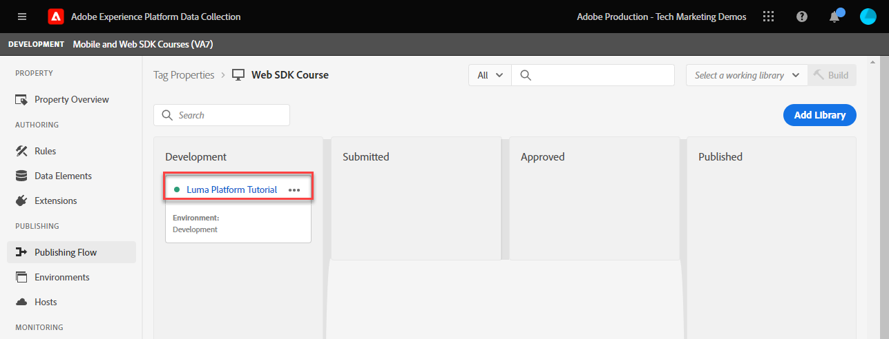

# タグルールの作成

>[!CAUTION]
>
>このチュートリアルの大きな変更は、2024 年 4 月 23 日火曜日（PT）に公開される予定です。 その後、多くの演習が変更され、すべてのレッスンを完了するには、最初からチュートリアルを再開する必要が生じる場合があります。

タグルールを使用して、XDM オブジェクトと共にイベントを Platform Edge Networkに送信する方法を説明します。 タグルールは、イベント、条件、アクションを組み合わせたルールで、タグプロパティに対し、アクションの実行を指示します。

>[!NOTE]
>
> デモ目的で、このレッスンの演習は、で使用した例に基づいて構築されています [データ要素の作成](create-data-elements.md) 手順：でユーザーからコンテンツおよび ID を取得するための XDM イベントアクションの送信 [Luma デモサイト](https://luma.enablementadobe.com/content/luma/us/en.html).

## 学習目標

このレッスンを最後まで学習すると、以下の内容を習得できます。

* タグ内でルールを管理する際は、命名規則を使用します
* XDM イベントを送信するタグルールを作成する
* 開発ライブラリへのタグルールの公開

## 前提条件

データ収集タグと [Luma デモサイト](https://luma.enablementadobe.com/content/luma/us/en.html)を選択し、このチュートリアルの次の前のレッスンを完了している必要があります。

* [権限の設定](configure-permissions.md)
* [XDM スキーマの設定](configure-schemas.md)
* [ID 名前空間の設定](configure-identities.md)
* [データストリームの設定](configure-datastream.md)
* [タグプロパティにインストールされている Web SDK 拡張機能](install-web-sdk.md)
* [データ要素の作成](create-data-elements.md)

## 命名規則

タグのルールをより適切に管理するには、標準の命名規則に従うことをお勧めします。 このチュートリアルでは、3 つのパートで構成される命名規則を使用します。

* [場所] - [イベント] - [ツール]

ここで、

1. 場所は、ルールが実行されるサイトの 1 つ以上のページです
1. event は、ビーコンを実行するトリガーです
1. ツールは、そのルールのアクションステップで使用される特定のアプリケーションです

## タグルールの作成

タグでは、ルールを使用して、様々な条件下でアクション（呼び出し実行）を実行します。 最初のルールを使用して、Web SDK のを使用して XDM オブジェクトをEdge Networkに送信します [!UICONTROL イベントを送信] アクション。 このチュートリアルの後半では、訪問者が閲覧しているページのタイプに基づいて、異なるバージョンの XDM オブジェクトを送信します。 そのため、ルール条件を使用して、その他のタイプのページを除外します。

タグルールを作成するには：

1. このチュートリアルで使用するタグプロパティを開きます
1. に移動 **[!UICONTROL ルール]** 左側のナビゲーションで
1. 「」を選択します **[!UICONTROL 新しいルールの作成]** ボタン
   
1. ルール名を設定します。`all pages - library load - AA & AT`

   >[!NOTE]
   >
   > このルールは、Adobe Analyticsと Target が今後のレッスンで具体的に使用する理由です `AA & AT` は、名前の末尾で使用されます。

1. が含まれる **[!UICONTROL イベント]** セクションで選択 **[!UICONTROL 追加]**
   
1. の使用 **[!UICONTROL Core 拡張機能]** を選択して、 `Library Loaded (Page Top)` as the **[!UICONTROL イベントタイプ]**.

   この設定は、タグライブラリがページに読み込まれるたびにルールが起動することを意味します。
1. を選択 **[!UICONTROL 変更を保持]** ルールのメイン画面に戻るには
   
1. が含まれる **[!UICONTROL 条件]** セクションで、 **[!UICONTROL 追加]** ボタン
   
1. を選択 **[!UICONTROL 論理タイプ]** `Exception`, **[!UICONTROL 拡張機能]** `Core`、および **[!UICONTROL 条件タイプ]** `Path Without Query String`
1. URL パスを入力 `/content/luma/us/en/user/cart.html` が含まれる **[!UICONTROL パスがと等しい]** フィールド、 **[!UICONTROL 名前]** 0.45511884 `Core - cart page`
1. を選択 **[!UICONTROL 変更を保持]**
   
1. 次の URL パスにさらに 3 つの例外を追加します

   * **`Core - checkout page`** for `/content/luma/us/en/user/checkout.html`
   * **`Core - thank you page`** for `/content/luma/us/en/user/checkout/order/thank-you.html`
   * **`Core - product page`** （用） `/products/` 正規表現スイッチをオンにして

   

1. が含まれる **[!UICONTROL アクション]** セクションで選択 **[!UICONTROL 追加]**
1. を選択 **[!UICONTROL Adobe Experience Platform Web SDK]** as the **[!UICONTROL 拡張機能]**
1. を選択 **[!UICONTROL イベントを送信]** as the **[!UICONTROL アクションタイプ]**
1. を選択 **[!UICONTROL web.webpagedetails.pageViews]** as the **[!UICONTROL タイプ]**.

   >[!WARNING]
   >
   > このドロップダウンがに入力されます **`xdm.eventType`** XDM オブジェクト内の変数。 このフィールドには自由形式のラベルも入力できますが、次の操作を強くお勧めします **実行しない** それは Platform との逆効果を持つでしょう。

1. として **[!UICONTROL XDM データ]**&#x200B;を選択し、 `xdm.content` 前のレッスンで作成したデータ要素
1. を選択 **[!UICONTROL 変更を保持]** ルールのメイン画面に戻るには

   
1. を選択 **[!UICONTROL 保存]** ルールを保存するには

   

## ライブラリへのルールの公開

次に、ルールが機能することを検証できるように、開発環境にルールを公開します。

ライブラリを作成するには：

1. に移動 **[!UICONTROL 公開フロー]** 左側のナビゲーションで
1. を選択 **[!UICONTROL ライブラリを追加]**

   
1. の場合 **[!UICONTROL 名前]**、と入力します `Luma Web SDK Tutorial`
1. の場合 **[!UICONTROL 0.5511122]**&#x200B;を選択 `Development`
1. を選択  **[!UICONTROL 変更されたリソースをすべて追加]**

   >[!NOTE]
   >
   >    Adobe Experience Platform Web SDK 拡張機能と `all pages - library load - AA & AT` ルールに従うと、前のレッスンで作成したタグコンポーネントが表示されます。 Core 拡張機能には、すべての web タグプロパティに必要な基本 JavaScript が含まれています。

1. を選択 **[!UICONTROL 開発用に保存してビルド]**

   

ライブラリのビルドには数分かかる場合があり、完了すると、ライブラリ名の左側に緑のドットが表示されます。

ご覧のように [!UICONTROL 公開フロー] 画面では、このチュートリアルの範囲外にある公開プロセスについて詳しく説明します。 このチュートリアルでは、開発環境で 1 つのライブラリのみを使用します。

これで、Adobe Experience Platform Debuggerを使用してリクエスト内のデータを検証する準備が整いました。

[次 ](validate-with-debugger.md)

>[!NOTE]
>
>Adobe Experience Platform Web SDK の学習に時間を費やしていただき、ありがとうございます。 ご質問がある場合、一般的なフィードバックを共有する場合、将来のコンテンツに関する提案がある場合は、このページで共有します [Experience League コミュニティ ディスカッションの投稿](https://experienceleaguecommunities.adobe.com/t5/adobe-experience-platform-launch/tutorial-discussion-implement-adobe-experience-cloud-with-web/td-p/444996)
