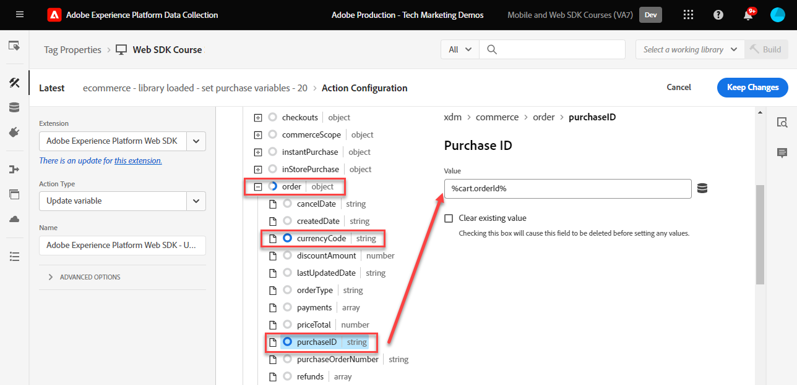

# タグルールの作成

タグルールを使用して、XDM オブジェクトと共にイベントを Platform Edge Networkに送信する方法を説明します。 タグルールは、イベント、条件、アクションを組み合わせたルールで、タグプロパティに対し、アクションの実行を指示します。 Platform Web SDK では、ルールを使用して、適切な XDM フィールドで Platform Edge Networkにイベントを送信します。

>[!NOTE]
>
> デモ目的で、このレッスンの演習は、前のレッスンを基に、上でユーザーからイベントを送信します [Luma デモサイト](https://luma.enablementadobe.com/content/luma/us/en.html){target="_blank"}.

## 学習目標

このレッスンを終了すると、次の操作を実行できます。

* タグ内でルールを管理する際は、命名規則を使用します
* 「変数を更新」アクションと「イベントを送信」アクションを使用して XDM フィールドでイベントを送信
* 複数のルールをまたいで複数の XDM フィールドセットをスタックする
* 個々または全体の配列データ要素の XDM オブジェクトへのマッピング
* 開発ライブラリへのタグルールの公開

## 前提条件

データ収集タグと [Luma デモサイト](https://luma.enablementadobe.com/content/luma/us/en.html) そして、チュートリアルの前のレッスンを完了している。

* [XDM スキーマの設定](configure-schemas.md)
* [ID 名前空間の設定](configure-identities.md)
* [データストリームの設定](configure-datastream.md)
* [Web SDK 拡張機能のインストール](install-web-sdk.md)
* [データ要素の作成](create-data-elements.md)
* [ID の作成](create-identities.md)

## 命名規則

タグのルールをより適切に管理するには、標準の命名規則に従うことをお勧めします。 このチュートリアルでは、5 つのパートで構成される命名規則を使用します。

* [**場所**] - [**イベント**] - [**目的**] - [**ツール**] - [**順序**]

ここで、

1. **場所** は、ルールが起動するサイトの 1 つまたは複数のページです
1. **イベント** ルールのトリガーです
1. **目的** ルールによって実行される主なアクションです
1. **ツール** は、そのルールのアクションステップで使用される特定のアプリケーションです。Web SDK ではまれです
1. **シーケンス** は、他のルールと関連してルールを実行する順序です
<!-- minor update -->

## タグルールの作成

タグでは、ルールを使用して、様々な条件下でアクション（呼び出し実行）を実行します。 Platform Web SDK タグ拡張機能には、このレッスンで使用する 2 つのアクションが含まれています。

* **[!UICONTROL 変数を更新]** データ要素を XDM フィールドにマッピングします
* **[!UICONTROL イベントを送信]** xdm オブジェクトをExperience PlatformEdge Networkに送信します

このレッスンの残りの部分では、以下を行います。

1. XDM フィールドの「グローバル設定」を定義するルールを作成します（を使用） [!UICONTROL 変数を更新] web サイトのすべてのページ（ページ名など）で次を使用して送信する **[!UICONTROL 変数を更新]** アクション。

1. 「グローバル設定」をオーバーライドする追加ルールを作成するか、追加の XDM フィールドを提供します（を使用） [!UICONTROL 変数を更新] ここでも）、特定の条件下でのみ関連します（例えば、製品ページに製品の詳細を追加するなど）。

1. 別のルールを作成するには **[!UICONTROL イベントを送信]** xdm オブジェクト全体をAdobe Experience Platform Edge Networkに送信するアクション。

これらのルールはすべて、「[!UICONTROL 順序]」オプションを選択します。

このビデオでは、プロセスの概要を説明します。

>[!VIDEO](https://video.tv.adobe.com/v/3427710/?learn=on)

### 変数ルールを更新

#### グローバル設定

グローバル XDM フィールドのタグルールを作成するには：

1. このチュートリアルで使用するタグプロパティを開きます

1. に移動 **[!UICONTROL ルール]** 左側のナビゲーションで

1. 「」を選択します **[!UICONTROL 新しいルールの作成]** ボタン

   

1. ルール名を設定します。`all pages - library loaded - set global variables - 1`

1. が含まれる **[!UICONTROL イベント]** セクションで選択 **[!UICONTROL 追加]**

   

1. の使用 **[!UICONTROL Core 拡張機能]** を選択して、 **[!UICONTROL ライブラリが読み込まれました（ページのトップ）]** as the **[!UICONTROL イベントタイプ]**

1. を選択 **[!UICONTROL 詳細]** ドロップダウンと入力 `1` as the **[!UICONTROL 順序]**

   >[!NOTE]
   >
   > 注文番号が小さいほど、早く実行されます。 したがって、「グローバル設定」には低い注文番号を付けます。

1. を選択 **[!UICONTROL 変更を保持]** ルールのメイン画面に戻るには
   

1. が含まれる **[!UICONTROL アクション]** セクションで選択 **[!UICONTROL 追加]**

1. として **[!UICONTROL 拡張機能]**&#x200B;を選択 **[!UICONTROL Adobe Experience Platform Web SDK]**

1. として **[!UICONTROL アクションタイプ]**&#x200B;を選択 **[!UICONTROL 変数を更新]**

1. として **[!UICONTROL データ要素]**&#x200B;を選択し、 `xdm.variable.content` 「」に作成しました [データ要素の作成](create-data-elements.md) レッスン

   

次に、 [!UICONTROL データ要素] に [!UICONTROL スキーマ] xdm オブジェクトで使用されます。

>[!NOTE]
> 
> 個々のプロパティまたはオブジェクト全体にマッピングできます。 この例では、個々のプロパティにマッピングします。

1. eventType フィールドを見つけて選択します

1. 値を入力 `web.webpagedetails.pageViews`

   >[!TIP]
   >
   > で入力する値を理解するには `eventType` フィールドに移動する必要があります。スキーマページに移動して、 `eventType` フィールドに入力すると、推奨値が右側のパネルに表示されます。 必要に応じて、新しい値を入力することもできます。
   > 

1. 次に、を見つけます `identityMap` スキーマ内のオブジェクトを選択し、以下の手順を実行します

1. をにマッピングします `identityMap.loginID` データ要素

   

   >[!TIP]
   >
   > データ要素が null の場合、XDM フィールドはネットワークリクエストに含まれません。 そのため、ユーザーが認証されない場合は、次のようになります。 `identityMap.loginID` データ要素が null で、 `identityMap` オブジェクトは送信されません。 これが、「グローバル設定」で定義できる理由です。

1. に到達するまで下にスクロールします。 **`web`** オブジェクト

1. 選択して開きます

1. 次のデータ要素を対応するにマッピングします `web` XDM 変数

   * **`web.webPageDetials.name`**&#x200B;コピー先：`%page.pageInfo.pageName%`
   * **`web.webPageDetials.server`**&#x200B;コピー先：`%page.pageInfo.server%`
   * **`web.webPageDetials.siteSection`**&#x200B;コピー先：`%page.pageInfo.hierarchie1%`

1. `web.webPageDetials.pageViews.value` を `1` に設定します。

   

   >[!TIP]
   >
   > も `eventType` をに設定 `web.webpagedetails.pageViews` nor `web.webPageDetials.pageViews.value` Adobe Analyticsがビーコンをページビューとして処理する際に必要です。他のダウンストリームアプリケーションのページビューを示す標準的な手段があると便利です。

1. を選択 **[!UICONTROL 変更を保持]** その後 **[!UICONTROL 保存]** ルールの作成を完了するための次の画面のルール

#### 製品ページフィールド

次に、を使用します **[!UICONTROL 変数を更新]** さらに、XDM オブジェクトをに送信する前に強化する順序付きルール [!UICONTROL Platform Edge Network].

>[!TIP]
>
>ルールの順序は、イベントがトリガーされたときに最初に実行されるルールを決定します。 2 つのルールのイベントタイプが同じ場合は、最も数字が小さいルールが最初に実行されます。
> 
>

まず、Luma の製品詳細ページで製品表示を追跡します。

1. を選択 **[!UICONTROL ルールを追加]**
1. 名前をつける  [!UICONTROL `ecommerce - library loaded - set product details variables - 20`]
1. 「」を選択します  「イベント」で新しいトリガーを追加
1. 次の下 **[!UICONTROL 拡張機能]**&#x200B;を選択 **[!UICONTROL コア]**
1. 次の下 **[!UICONTROL イベントタイプ]**&#x200B;を選択 **[!UICONTROL ライブラリが読み込まれました（ページのトップ）]**
1. 選択して開く **[!UICONTROL 詳細オプション]**，入力 `20`. これにより、ルールが次の後に実行されます `all pages - library loaded - set global variables - 1` グローバル設定を設定します。

   

1. 次の下 **[!UICONTROL 条件]**、を選択 **[!UICONTROL 追加]**
1. 移動 **[!UICONTROL 論理タイプ]** as **[!UICONTROL 標準]**
1. 移動 **[!UICONTROL 拡張機能]** as **[!UICONTROL コア]**
1. を選択 **[!UICONTROL 条件タイプ]** as **[!UICONTROL クエリ文字列を含まないパス]**
1. 右側で、 **[!UICONTROL 正規表現]** 切り替え
1. 次の下 **[!UICONTROL パスがと等しい]** set `/products/`. Luma デモサイトの場合、ルールが製品ページのトリガーのみになります
1. を選択 **[!UICONTROL 変更を保持]**

   

1. 次の下 **[!UICONTROL アクション]** 選択 **[!UICONTROL 追加]**
1. を選択 **[!UICONTROL Adobe Experience Platform Web SDK]** 拡張子
1. を選択 **[!UICONTROL アクションタイプ]** as **[!UICONTROL 変数を更新]**
1. にスクロール ダウンします。 `commerce` オブジェクト
1. を開きます **[!UICONTROL productViews]** オブジェクトとセット **[!UICONTROL value]** 対象： `1`

   

   >[!TIP]
   >
   >XDM で commerce.productViews.value=1 を設定すると、自動的ににマッピングされます `prodView` analytics のイベント

1. Scroll down to `eventType` およびを設定します `commerce.productViews`

   >[!NOTE]
   >
   >このルールは優先順位が高いので、次を上書きします `eventType` 「グローバル設定」ルールで設定します。 `eventType` には 1 つの値のみを含めることができます。最も高い値のイベントに設定することをお勧めします。

1. にスクロールし、を選択します。 `productListItems` 配列
1. を選択 **[!UICONTROL 個々の項目を指定]**
1. を選択 **[!UICONTROL 項目を追加]**

   

   >[!CAUTION]
   >
   >この **`productListItems`** は `array` データタイプを使用すると、データは要素の集まりとして取り込まれます。 Luma デモサイトのデータレイヤー構造と、Luma サイトで一度に 1 つの製品しか表示できないので、項目を個別に追加します。 独自の web サイトに実装する場合、データレイヤーの構造によっては、配列全体を指定できる場合があります。

1. 選択して開く **[!UICONTROL 項目 1]**
1. **`productListItems.item1.SKU`** を `%product.productInfo.sku%` にマッピングします

   

1. を選択 **[!UICONTROL 変更を保持]**

1. を選択 **[!UICONTROL 保存]** ルールを保存するには

#### 買い物かごフィールド

配列が XDM スキーマの形式と一致する場合は、配列全体を XDM オブジェクトにマッピングできます。 カスタムコードデータ要素 `cart.productInfo` 前の手順で、 `digitalData.cart.cartEntries` luma 上のデータレイヤーオブジェクトで、の必要な形式に変換します `productListItems` xdm スキーマのオブジェクト。

説明するには、以下の Luma サイトデータレイヤー（左）と翻訳済みデータ要素（右）の比較を参照してください。

データ要素とを比較します `productListItems` 構造（ヒント、一致する必要があります）。

>[!IMPORTANT]
>
>数値変数の翻訳方法と、データレイヤーの次のような文字列値に注意してください `price` および `qty` データ要素内の数値に再書式設定されます。 これらの形式要件は、Platform でのデータ整合性にとって重要であり、次の期間に決定されます [スキーマの設定](configure-schemas.md) ステップ。 この例では、 **[!UICONTROL 数量]** はを使用します **[!UICONTROL 整数]** データタイプ。
> 

次に、配列を XDM オブジェクトにマッピングします。

1. という名前の新しいルールを作成します。 `ecommerce - library loaded - set shopping cart variables - 20`
1. 「」を選択します  「イベント」で新しいトリガーを追加
1. 次の下 **[!UICONTROL 拡張機能]**&#x200B;を選択 **[!UICONTROL コア]**
1. 次の下 **[!UICONTROL イベントタイプ]**&#x200B;を選択 **[!UICONTROL ライブラリが読み込まれました（ページのトップ）]**
1. 選択して開く **[!UICONTROL 詳細オプション]**，入力 `20`
1. を選択 **[!UICONTROL 変更を保持]**

   

1. 次の下 **[!UICONTROL 条件]**、を選択 **[!UICONTROL 追加]**
1. 移動 **[!UICONTROL 論理タイプ]** as **[!UICONTROL 標準]**
1. 移動 **[!UICONTROL 拡張機能]** as **[!UICONTROL コア]**
1. を選択 **[!UICONTROL 条件タイプ]** as **[!UICONTROL クエリ文字列を含まないパス]**
1. 右に **実行しない** を有効にする **[!UICONTROL 正規表現]** 切り替え
1. 次の下 **[!UICONTROL パスがと等しい]** set `/content/luma/us/en/user/cart.html`. Luma デモサイトの場合、ルールが買い物かごページのトリガーのみになることを確認します
1. を選択 **[!UICONTROL 変更を保持]**

   

1. 次の下 **[!UICONTROL アクション]** 選択 **[!UICONTROL 追加]**
1. を選択 **[!UICONTROL Adobe Experience Platform Web SDK]** 拡張子
1. を選択 **[!UICONTROL アクションタイプ]** as **[!UICONTROL 変数を更新]**
1. にスクロール ダウンします。 `commerce` オブジェクトを選択し、をクリックして開きます。
1. を開きます **[!UICONTROL productListViews]** オブジェクトとセット **[!UICONTROL value]** 対象： `1`

   

   >[!TIP]
   >
   >XDM で commerce.productListViews.value=1 を設定すると、自動的ににマッピングされます `scView` analytics のイベント

1. を選択 `eventType` をに設定します。 `commerce.productListViews`

1. にスクロールし、を選択します。 **[!UICONTROL productListItems]** 配列

1. を選択 **[!UICONTROL アレイ全体を提供]**

1. マッピング先 **`cart.productInfo`** データ要素

1. を選択 **[!UICONTROL 変更を保持]**

1. を選択 **[!UICONTROL 保存]** ルールを保存するには

以下の違いを持つ同じパターンに従って、チェックアウトと購入のために他の 2 つのルールを作成します。

**ルール名**: `ecommerce  - library loaded - set checkout variables - 20`

1. **[!UICONTROL 条件]**: /content/luma/us/en/user/checkout.html
1. `eventType` を `commerce.checkouts` に設定します。
1. `commerce.checkout.value` を `1` に設定します。

   >[!TIP]
   >
   >これは、の設定と同じです。 `scCheckout` analytics のイベント

**ルール名**: `ecommerce - library loaded - set purchase variables -  20`

1. **[!UICONTROL 条件]**: /content/luma/us/en/user/checkout/order/thank-you.html
1. `eventType` を `commerce.purchases` に設定します。
1. `commerce.purchases.value` を `1` に設定します。

   >[!TIP]
   >
   >これは、の設定と同じです。 `purchase` analytics のイベント

1. を設定 `commerce.order.purchaseID` に `cart.orderId` データ要素
1. を設定 `commerce.order.currencyCode` ハードコードされた値に `USD`

   

   >[!TIP]
   >
   >これは、の設定と同じです。 `s.purchaseID` および `s.currencyCode` analytics の変数

1. にスクロールし、を選択します。 **[!UICONTROL productListItems]** 配列
1. を選択 **[!UICONTROL アレイ全体を提供]**
1. マッピング先 **`cart.productInfo.purchase`** データ要素
1. 「**[!UICONTROL 保存]**」を選択します

完了すると、次のルールが作成されます。

### イベントルールを送信

これで変数を設定できたので、完全な XDM オブジェクトを Platform Edge Networkに送信するルールを、 **[!UICONTROL イベントを送信]** アクション。

1. 右側で、を選択します **[!UICONTROL ルールを追加]** 別のルールを作成するには

1. ルール名を設定します。`all pages - library loaded - send event - 50`

1. が含まれる **[!UICONTROL イベント]** セクションで選択 **[!UICONTROL 追加]**

1. の使用 **[!UICONTROL Core 拡張機能]** を選択して、 `Library Loaded (Page Top)` as the **[!UICONTROL イベントタイプ]**

1. を選択 **[!UICONTROL 詳細]** ドロップダウンと入力 `50` 。対象： **[!UICONTROL 順序]**. これにより、トリガーにトリガーした最初のルールの後に、2 番目のルールの設定が保証されます `1`.

1. を選択 **[!UICONTROL 変更を保持]** ルールのメイン画面に戻るには
   

1. が含まれる **[!UICONTROL アクション]** セクションで選択 **[!UICONTROL 追加]**

1. として **[!UICONTROL 拡張機能]**&#x200B;を選択  **[!UICONTROL Adobe Experience Platform Web SDK]**

1. として  **[!UICONTROL アクションタイプ]**&#x200B;を選択  **[!UICONTROL イベントを送信]**

1. として **[!UICONTROL XDM]**&#x200B;を選択し、 `xdm.variable.content` 前のレッスンで作成したデータ要素

1. を選択 **[!UICONTROL 変更を保持]** ルールのメイン画面に戻るには

   
1. を選択 **[!UICONTROL 保存]** ルールを保存するには

   

## ライブラリへのルールの公開

次に、ルールを開発環境に公開して、ルールが機能することを検証します。

ライブラリを作成するには：

1. に移動 **[!UICONTROL 公開フロー]** 左側のナビゲーションで

1. を選択 **[!UICONTROL ライブラリを追加]**

   
1. の場合 **[!UICONTROL 名前]**、と入力します `Luma Web SDK Tutorial`
1. の場合 **[!UICONTROL 0.5511122]**&#x200B;を選択 `Development`
1. を選択  **[!UICONTROL 変更されたリソースをすべて追加]**

   >[!NOTE]
   >
   >    前のレッスンで作成したすべてのタグコンポーネントが表示されます。 Core 拡張機能には、すべての web タグプロパティに必要な基本 JavaScript が含まれています。

1. を選択 **[!UICONTROL 開発用に保存してビルド]**

   

ライブラリのビルドには数分かかる場合があり、完了すると、ライブラリ名の左側に緑のドットが表示されます。

ご覧のように [!UICONTROL 公開フロー] 画面では、このチュートリアルの範囲外にある公開プロセスについて詳しく説明します。 このチュートリアルでは、開発環境で 1 つのライブラリのみを使用します。

これで、Adobe Experience Platform Debuggerを使用してリクエスト内のデータを検証する準備が整いました。

[次 ](validate-with-debugger.md)

>[!NOTE]
>
>Adobe Experience Platform Web SDK の学習に時間を費やしていただき、ありがとうございます。 ご質問がある場合、一般的なフィードバックを共有したい場合、または将来のコンテンツに関するご提案がある場合は、このページでお知らせください [Experience League コミュニティ ディスカッションの投稿](https://experienceleaguecommunities.adobe.com/t5/adobe-experience-platform-launch/tutorial-discussion-implement-adobe-experience-cloud-with-web/td-p/444996)
