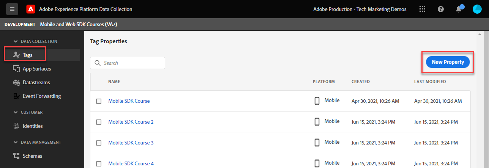

# Adobe Experience Platform Web SDK タグ拡張機能のインストール

Adobe Experience Platform Web SDK拡張機能をインストールして設定する方法について説明します。 Web SDKを実装する最も簡単な方法は、Adobeのタグマネージャー、タグ（旧称：Launch）を使用することです。 Platform Web SDK タグ拡張機能は _唯一のタグ拡張機能_ で、&lbrace;Analytics __ [、&lbrace;Target](setup-analytics.md)、[Audience Manager](setup-target.md)、Real-Time Customer Data Platform、[Journey Optimizer](setup-audience-manager.md) など、[ すべてのAdobe Experience Cloud アプリケーション ](setup-web-channel.md) にデータを送信するために必要です。

## 学習目標

このレッスンを最後まで学習すると、以下の内容を習得できます。

* データ収集インターフェイスでのタグプロパティの作成
* Platform Web SDK タグ拡張機能のインストール
* 以前に作成したデータストリームの拡張機能へのマッピング

## 前提条件

このチュートリアルの前のレッスンを完了している必要があります。

* [データストリームの設定](configure-datastream.md)

### タグプロパティの追加

まず、タグプロパティが必要です。 プロパティは、web ページから詳細を収集して様々な場所に送信するために必要なすべてのJavaScript、ルール、その他の機能のコンテナです。

チュートリアル用に新しいタグプロパティを作成します。

1. [ データ収集インターフェイス ](https://experience.adobe.com/data-collection/){target="_blank"} を開きます。
1. 左側のナビゲーションで **[!UICONTROL タグ]** を選択します
1. 「**[!UICONTROL 新しいプロパティ]**」ボタンを選択します
   
1. **[!UICONTROL 名前]** として、`Web SDK Course` と入力します（会社の複数のユーザーがこのチュートリアルを受講している場合は、最後に名前を追加します）。
1. **[!UICONTROL ドメイン]** として、`enablementadobe.com` と入力します（後で説明します）。
1. 「**[!UICONTROL 保存]**」を選択します
   

## Web SDK拡張機能を追加します

これで、XDM スキーマ、データストリーム、タグプロパティが作成されたので、Platform Web SDK拡張機能をインストールする準備が整いました。

1. 新しいタグプロパティを開きます
1. **[!UICONTROL 拡張機能]**/**[!UICONTROL カタログ]** に移動します。
1. `Adobe Experience Platform Web SDK` を検索
1. 「**[!UICONTROL インストール]**」を選択します。

   

## 拡張機能のデータストリームへのリンク

ほとんどの設定はデフォルトのままにし、必要に応じて後で更新します。 ここで行う必要があるのは、拡張機能をデータストリームにリンクすることです。

1. **[!UICONTROL データストリーム]** で、**[!UICONTROL リストから選択]** 入力メソッドを選択します
1. スキーマ、ID 名前空間、データストリームを作成したサンドボックスを選択します
1. 前に作成したデータストリームを選択します `Luma Web SDK`
1. 「**[!UICONTROL 保存]**」を選択します

   >[!NOTE]
   >
   > データストリームが見つからない場合は、[ データストリームの設定 ](configure-datastream.md) のレッスンに移動し、手順に従って作成します

   

拡張機能の各セクションについて詳しくは、[Adobe Experience Platform Web SDK拡張機能の設定 ](https://experienceleague.adobe.com/en/docs/experience-platform/tags/extensions/client/web-sdk/web-sdk-extension-configuration) を参照してください。

>[!NOTE]
>
>このレッスンの [!UICONTROL Edge ドメイン &#x200B;] 設定では CNAME を設定しませんでしたが、Adobeでは、独自の web サイトに Platform Web SDKを実装する際に CNAME を使用することをお勧めします。 CNAME 実装には Cookie の有効期間に関するメリットはありませんが、他にもメリットがある場合があります。これらのメリットには、広告ブロッカーや、トラッカーとして分類するドメインにデータが送信されるのを防ぐ一般的でないブラウザーなどが含まれます。 このような場合、CNAME を使用すると、これらのツールを使用しているユーザーのデータ収集が中断されるのを防ぐことができます。

>[!NOTE]
>
>このチュートリアルでは、1 つのデータストリームのみを設定し、すべてのタグ環境（開発、ステージ、実稼動）に関連付けます。 Platform Web SDKを独自の web サイトに実装する場合は、環境ごとに個別のデータストリームを設定し、それに応じて拡張機能の設定にマッピングする必要があります。

Platform Web SDKをインストールし、データストリームに関連付けたので、データの収集を開始する準備が整いました。

>[!NOTE]
>
>Adobe Experience Platform Web SDKの学習にご協力いただき、ありがとうございます。 ご不明な点がある場合や、一般的なフィードバックを共有したい場合、または今後のコンテンツに関するご提案がある場合は、この [Experience League Community Discussion の投稿でお知らせください ](https://experienceleaguecommunities.adobe.com/t5/adobe-experience-platform-data/tutorial-discussion-implement-adobe-experience-cloud-with-web/td-p/444996)
