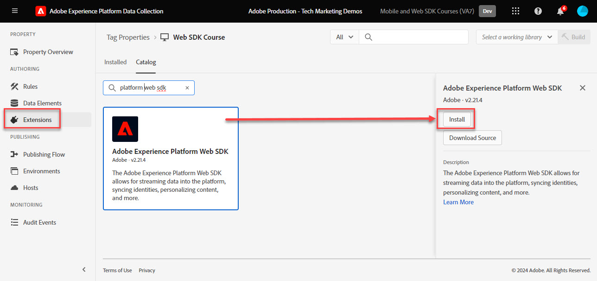

# Adobe Experience Platform Web SDK タグ拡張機能のインストール

データ収集インターフェイスで Platform Web SDK タグ拡張機能をインストールして設定する方法について説明します。 このタグ拡張は、 _タグ拡張のみ_ にデータを送信する必要がある _すべてのAdobe Experience Cloudアプリケーション_&#x200B;を含む [Analytics](setup-analytics.md), [ターゲット](setup-target.md), [Audience Manager](setup-audience-manager.md)、Real-time Customer Data Platform、Journey Optimizer!

## 学習内容

このレッスンを最後まで学習すると、以下の内容を習得できます。

* データ収集インターフェイスでのタグプロパティの作成
* Platform Web SDK タグ拡張機能のインストール
* 以前に作成したデータストリームを拡張機能にマッピングする

## 前提条件

このチュートリアルの前のレッスンを完了している。

* [権限の設定](configure-permissions.md)
* [XDM スキーマの設定](configure-schemas.md)
* [ID 名前空間の設定](configure-identities.md)
* [データストリームの設定](configure-datastream.md)

## Experience PlatformWeb SDK 拡張機能のインストール

### プロパティを追加する

まず、タグプロパティを持つ必要があります。 プロパティは、Web ページから詳細を収集して様々な場所に送信するために必要な、すべての JavaScript、ルールおよびその他の機能のコンテナです。

チュートリアル用に新しいタグプロパティを作成します。

1. を開きます。 [データ収集インターフェイス](https://launch.adobe.com/){target=&quot;_blank&quot;}
1. 選択 **[!UICONTROL タグ]** 左のナビゲーション
1. を選択します。 **[!UICONTROL 新しいプロパティ]** ボタン
   
1. を **[!UICONTROL 名前]**&#x200B;を入力して、 `Web SDK Course` （会社の複数の担当者がこのチュートリアルを受け取る場合は、名前を末尾に追加します）
1. を **[!UICONTROL ドメイン]**&#x200B;を入力して、 `enablementadobe.com` （後述）
1. 選択 **[!UICONTROL 保存]**
   

## Web SDK 拡張機能の追加

XDM スキーマ、データストリームおよびタグプロパティが作成されたので、Platform Web SDK 拡張機能をインストールする準備が整いました。

1. 新しいタグプロパティを開く
1. に移動します。 **[!UICONTROL 拡張機能]** > **[!UICONTROL カタログ]**
1. `Adobe Experience Platform Web SDK` を検索します
1. 選択 **[!UICONTROL インストール]**

   

## Platform Web SDK をデータストリームにリンクする

デフォルト設定のほとんどはそのままにし、必要に応じて後で更新します。 ここで行う必要があるのは、拡張機能をデータストリームにリンクすることだけです。

1. の下 **[!UICONTROL データストリーム]**&#x200B;を選択し、 **[!UICONTROL リストから選択]** 入力メソッド
1. 作成したデータストリームを選択します。 `Luma Web SDK`
1. 選択 **[!UICONTROL 保存]**
   >[!NOTE]
   >
   > データストリームが見つからない場合は、 [データストリームの設定](configure-datastream.md) レッスンを受け、手順に従って 1 つを作成します

   

これで、Platform Web SDK がインストールされ、データストリームに関連付けられました。作成したスキーマを使用して、データ要素の XDM オブジェクトへのマッピングを開始する準備が整いました。

>[!NOTE]
>
>このチュートリアルでは、1 つのデータストリームのみを設定し、それをすべてのタグ環境（開発、ステージング、実稼動）に関連付けます。 独自の Web サイトに Platform Web SDK を実装する場合は、各環境に対して個別のデータストリームを設定し、 **[!UICONTROL 入力メソッド]** > **[!UICONTROL 値を入力]**
>
>

>[!NOTE]
>
>ただし、 [!UICONTROL エッジドメイン] このレッスンでは、Adobeが独自の Web サイトに Platform Web SDK を実装する場合は、CNAME を使用することをお勧めします。 CNAME 実装には Cookie の有効期間に関するメリットはありませんが、他にもメリットがある場合があります。これらのメリットには、広告ブロッカーや、データがトラッカーとして分類するドメインに送信されるのを防ぐ一般的でないブラウザーなどが含まれます。このような場合、CNAME を使用すると、これらのツールを使用しているユーザーのデータ収集が中断されるのを防ぐことができます。

拡張機能の各セクションについて詳しくは、 [Adobe Experience Platform Web SDK 拡張機能の設定](https://experienceleague.adobe.com/docs/experience-platform/edge/extension/web-sdk-extension-configuration.html)

[次へ： ](create-data-elements.md)

>[!NOTE]
>
>Adobe Experience Platform Web SDK の学習に時間を割いていただき、ありがとうございます。 ご質問がある場合、一般的なフィードバックを共有したい場合、または今後のコンテンツに関する提案がある場合は、こちらで共有してください [Experience Leagueコミュニティディスカッション投稿](https://experienceleaguecommunities.adobe.com/t5/adobe-experience-platform-launch/tutorial-discussion-implement-adobe-experience-cloud-with-web/td-p/444996)
