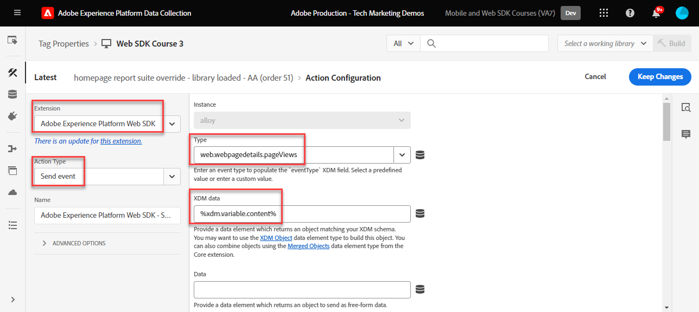
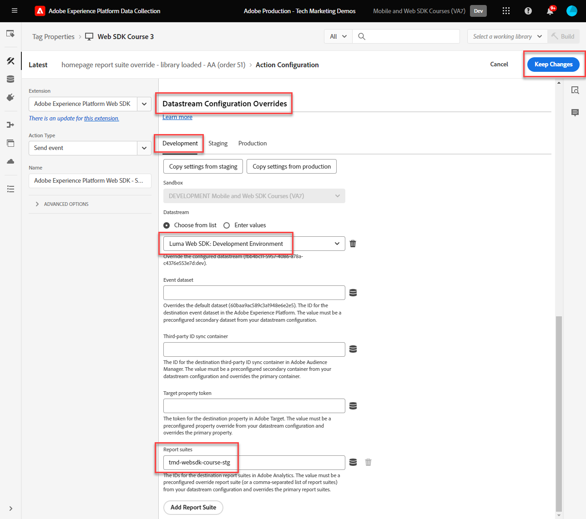
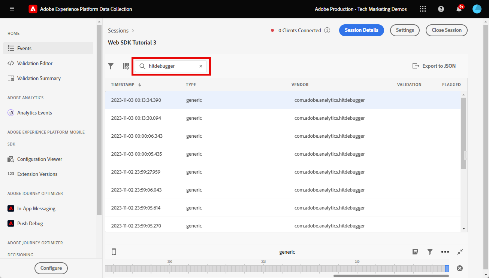

# Adobe Experience Platform Web SDKを使用したAdobe Analyticsの設定

[Adobe Experience Platform Web SDK](https://experienceleague.adobe.com/en/docs/platform-learn/data-collection/web-sdk/overview) を使用してAdobe Analyticsを設定する方法、Adobe Analyticsにデータを送信するタグルールを作成する方法、Analytics が期待どおりにデータをキャプチャしていることを検証する方法について説明します。

[Adobe Analytics](https://experienceleague.adobe.com/ja/docs/analytics) は業界をリードするアプリケーションであり、ユーザーとして顧客を理解し、顧客インテリジェンスを活用してビジネスを導くことができます。

## 学習目標

このレッスンを最後まで学習すると、以下の内容を習得できます。

* データストリームの設定によるAdobe Analyticsの有効化
* Analytics 変数に自動マッピングされる標準 XDM フィールドを把握する
* データオブジェクトへの Analytics 変数の設定
* データストリームを上書きして、別のレポートスイートにデータを送信する
* Debugger とAssuranceを使用したAdobe Analytics変数の検証

## 前提条件

このレッスンを完了するには、まず次の操作を行う必要があります。

* Adobe Analyticsに詳しく、アクセスできます。

* 少なくとも 1 つのテスト/開発レポートスイート ID がある。 このチュートリアルで使用できるテスト/開発レポートスイートがない場合は [ 作成してください ](https://experienceleague.adobe.com/en/docs/analytics/admin/admin-tools/manage-report-suites/c-new-report-suite/t-create-a-report-suite)。

* このチュートリアルの初期設定とタグの設定の節で前のレッスンを完了します。

## データストリームの設定

Platform Web SDKは、web サイトから Platform Edge Networkにデータを送信します。 次に、データストリームは、データの送信先のAdobe Analytics レポートスイートを Platform Edge Networkに伝えます。

1. [ データ収集 ](https://experience.adobe.com/#/data-collection){target="blank"} インターフェイスに移動
1. 左側のナビゲーションで「**[!UICONTROL データストリーム]**」を選択します
1. 以前に作成した `Luma Web SDK: Development Environment` データストリームを選択します

   。

1. 「**[!UICONTROL サービスを追加]**」を選択します。
   
1. **[!UICONTROL Adobe Analytics]** を **[!UICONTROL サービス]** として選択
1. 開発レポートスイートの **[!UICONTROL レポートスイート ID]** を入力します
1. 「**[!UICONTROL 保存]**」を選択します

   

   >[!TIP]
   >
   >**[!UICONTROL レポートスイートを追加]** を選択してさらにレポートスイートを追加することは、複数のスイートタグ付けと同等です。

>[!WARNING]
>
>このチュートリアルでは、開発環境のAdobe Analytics レポートスイートのみを設定します。 独自の web サイト用にデータストリームを作成する場合、ステージング環境と実稼動環境用に追加のデータストリームおよびレポートスイートを作成する必要があります。

## Analytics 変数の設定

Web SDK実装で Analytics 変数を設定する方法はいくつかあります。

1. XDM フィールドの Analytics 変数への自動マッピング（自動）。
1. `data` オブジェクトにフィールドを設定します（推奨）。
1. XDM フィールドを Analytics 処理ルールの Analytics 変数にマッピングします（推奨されなくなりました）。
1. XDM スキーマで Analytics 変数に直接マッピングします（推奨されなくなりました）。

2024 年 5 月をもって、Platform Web SDKでAdobe Analyticsを実装するための XDM スキーマを作成する必要がなくなりました。 `data` オブジェクト（および [ データ要素の作成 ](create-data-elements.md) のレッスンで作成した `data.variable` データ要素）を使用してすべてのカスタム Analytics 変数を設定できます。 データオブジェクトでこれらの変数を設定すると、既存の Analytics のお客様がよく知ることができ、処理ルールインターフェイスを使用するよりも効率的で、リアルタイム顧客プロファイルで不要なデータが領域を占有するのを防ぐことができます（Real-Time Customer Data PlatformまたはJourney Optimizerを使用している場合に重要です）。

### 自動的にマッピングされたフィールド

多くの XDM フィールドは、Analytics 変数に自動的にマッピングされます。 最新のマッピングのリストについては、[Adobe Experience Edgeの Analytics 変数のマッピング ](https://experienceleague.adobe.com/en/docs/experience-platform/edge/data-collection/adobe-analytics/automatically-mapped-vars) を参照してください。

この問題は _カスタムスキーマを定義していない場合でも_ 発生します。 Experience Platform Web SDKは、一部のデータを自動的に収集し、XDM フィールドとして Platform Edge Networkに送信します。 例えば、Web SDKは現在のページの URL を読み取り、XDM フィールド `web.webPageDetails.URL` として送信します。 このフィールドはAdobe Analyticsに転送され、Adobe Analyticsのページ URL レポートに自動的に入力されます。

このチュートリアルにあるように、XDM スキーマでAdobe Analyticsの Web SDKを実装する場合、次の表に示すように、Analytics 変数への自動マッピングがカスタム実装された XDM フィールドの一部が用意されています。

| XDM から Analytics への自動マッピング変数 | Adobe Analytics変数 |
|-------|---------|
| `identitymap.ecid.[0].id` | mid |
| `web.webPageDetails.name` | s.pageName |
| `web.webPageDetails.server` | s.server |
| `web.webPageDetails.siteSection` | s.channel |
| `commerce.productViews.value` | prodView |
| `commerce.productListViews.value` | scView |
| `commerce.checkouts.value` | scCheckout |
| `commerce.purchases.value` | 購入 |
| `commerce.order.currencyCode` | s.currencyCode |
| `commerce.order.purchaseID` | s.purchaseID |
| `productListItems[].SKU` | s.products=;product name;;;（プライマリ – 下のメモを参照） |
| `productListItems[].name` | s.products=;product name;;;（フォールバック – 以下のメモを参照） |
| `productListItems[].quantity` | s.products=;;product quantity;; |
| `productListItems[].priceTotal` | s.product=;;；製品価格；; |

Analytics 製品文字列の個々のセクションは、`productListItems` オブジェクトの下の様々な XDM 変数を介して設定されます。

>[!NOTE]
>
>2022 年 8 月 18 日（PT）現在、`productListItems[].SKU` は、s.products 変数の製品名へのマッピングを優先しています。
>>`productListItems[].name` に設定された値は、`productListItems[].SKU` が存在しない場合にのみ、製品名にマッピングされます。 それ以外の場合は、マッピングされず、コンテキストデータで使用できます。
>>`productListItems[].SKU` に空の文字列や null を設定しないでください。 これには、s.products 変数の製品名にマッピングするという望ましくない影響があります。

### データオブジェクトに変数を設定

evar、prop、event についてはどうでしょうか。 Web SDKでこれらの Analytics 変数を設定する場合は、`data` オブジェクトで変数を設定することをお勧めします。 データオブジェクトで変数を設定すると、自動的にマッピングされた変数もすべて上書きされる可能性があります。

まず、`data` のオブジェクトは何ですか？ どの web SDK イベントでも、カスタムデータを含む 2 つのオブジェクト（`xdm` オブジェクトと `data` オブジェクト）を送信できます。 どちらも Platform Edge Networkに送信されますが、Experience Platform データセットに送信されるのは `xdm` オブジェクトのみです。 `data` オブジェクトのプロパティは、データ収集用のデータ準備機能を使用して、Edgeで `xdm` フィールドにマッピングできますが、それ以外の場合は、Experience Platformに送信されません。 これにより、Experience Platform上にネイティブに構築されていない Analytics などのアプリケーションにデータを送信するのに理想的な方法になります。

一般的な web SDK呼び出しの 2 つのオブジェクトは次のとおりです。

Adobe Analyticsは、`data.__adobe.analytics` オブジェクト内のプロパティを探し、それらを Analytics 変数に使用するように設定されています。

次に、この仕組みを見てみましょう。 `eVar1` と `prop1` をページ名で設定して、XDM マッピングされた値を上書きする方法を見てみましょう

1. タグルール `all pages - library loaded - set global variables - 1` を開きます。
1. 新しい **[!UICONTROL アクション]** を追加
1. **[!UICONTROL Adobe Experience Platform Web SDK]** 拡張機能を選択します
1. **[!UICONTROL アクションタイプ]** を **[!UICONTROL 変数を更新]** として選択します
1. **[!UICONTROL データ要素]** として `data.variable` を選択します
1. **[!UICONTROL analytics]** オブジェクトを選択します
1. `eVar1` を `page.pageInfo.pageName` データ要素として設定します
1. `prop1` を設定して、`eVar1` の値をコピーします
1. XDM マッピング値の上書きをテストするには、「**[!UICONTROL 追加のプロパティ]**」セクションで、ページ名を静的な値 `test` として設定します
1. ルールの保存

ここで、送信イベントルールにデータオブジェクトを含める必要があります。

1. タグルール `all pages - library loaded - send event - 50` を開きます。
1. **[!UICONTROL イベントを送信]** アクションを開きます
1. **[!UICONTROL Data]** として `data.variable` を選択します
1. 「**[!UICONTROL 変更を保持]**」を選択します
1. 「**[!UICONTROL 保存]**」を選択します

<!--

### Map to Analytics variables with processing rules

All fields in the XDM schema become available to Adobe Analytics as Context Data Variables with the following prefix `a.x.`. For example, `a.x.web.webinteraction.region`

In this exercise, you map one XDM variable to a prop. Follow these same steps for any custom mapping that you must do for any `eVar`, `prop`, `event`, or variable accessible via Processing Rules.

1. Go to the Analytics interface
1. Go to [!UICONTROL Admin] > [!UICONTROL Admin Tools] > [!UICONTROL Report Suites ]
1. Select the dev/test report suite that you are using for the tutorial > [!UICONTROL Edit Settings] > [!UICONTROL General] > [!UICONTROL Processing Rules]

       

1. Create a rule to **[!UICONTROL Overwrite value of]** `[!UICONTROL Product SKU (prop1)]` to `a.x.productlistitems.0.sku`. Remember to add a note about why you are creating the rule and name your rule title. Select **[!UICONTROL Save]**

       

    >[!IMPORTANT]
    >
    >The first time you map to a processing rule, the UI does not show you the context data variables from the XDM object. To fix that select any value, Save, and come back to edit. All XDM variables should now appear.

### Map to Analytics variables using the Adobe Analytics field group

An alternative to processing rules is to map to Analytics variables in the XDM schema using the `Adobe Analytics ExperienceEvent Template` field group. This approach has gained popularity because many users find it simpler than configuring processing rules, however, by increasing the size of the XDM payload it could in turn increase the profile size in other applications like Real-Time CDP.

To add the `Adobe Analytics ExperienceEvent Template` field group to your schema:

1. Open the [Data Collection](https://experience.adobe.com/#/data-collection){target="blank"} interface
1. Select **[!UICONTROL Schemas]** from the left navigation
1. Make sure you are in the sandbox you are using from the tutorial
1. Open your `Luma Web Event Data` schema
1. In the **[!UICONTROL Field Groups]** section, select **[!UICONTROL Add]**
1. Find the `Adobe Analytics ExperienceEvent Template` field group and add it to your schema

Now, set a merchandising eVar in the product string. With the `Adobe Analytics ExperienceEvent Template` field group, you are able to map variables to merchandising eVars or events within the product string. This is also known as setting **Product Syntax Merchandising**. 

1. Go back to your tag property

1. Open the rule `ecommerce - library loaded - set product details variables - 20`

1. Open the **[!UICONTROL Set Variable]** action

1. Select to open `_experience > analytics > customDimensions > eVars > eVar1`

1. Set the **[!UICONTROL Value]** to `%product.productInfo.title%`

1. Select **[!UICONTROL Keep Changes]**

    

1. Select **[!UICONTROL Save]** to save the rule

As you just saw, basically all of the Analytics variables can be set in the `Adobe Analytics ExperienceEvent Template` field group.

>[!NOTE]
>
> Notice the `_experience` object under `productListItems` > `Item 1`. Setting any variable under this [!UICONTROL object] sets Product Syntax eVars or Events.

-->

## 別のレポートスイートへのデータの送信

訪問者が特定のページを閲覧した際に、どのAdobe Analytics レポートスイートデータを送信するかを変更することができます。 これには、データストリームとルールの両方で設定が必要です。

### レポートスイート上書きのデータストリームの設定

データストリームでAdobe Analytics レポートスイートの上書き設定を指定するには：

1. データストリームを開きます
1. ![ 詳細 ]**メニューを開いて**[!UICONTROL  編集 ]**を選択して、**[!UICONTROL  Adobe Analytics](https://spectrum.adobe.com/static/icons/workflow_18/Smock_More_18_N.svg) 設定を編集します

   

1. **[!UICONTROL 詳細オプション]** を選択して、**[!UICONTROL レポートスイートの上書き]** を開きます

1. 上書きするレポートスイートを選択します。 この場合、`Web SDK Course Dev` と `Web SDK Course Stg`

1. 「**[!UICONTROL 保存]**」を選択します

   

### レポートスイートの上書きに対するルールの設定

別のレポートスイートに追加のページビュー呼び出しを送信するルールを作成しましょう。 データストリームの上書き機能を使用して、「**[!UICONTROL イベントの送信]** アクションでページのレポートスイートを変更します。

1. 新しいルールを作成し、`homepage - library loaded - AA report suite override - 51` という名前を付けます

1. **[!UICONTROL イベント]** の下のプラス記号を選択して、新しいトリガーを追加します

1. **[!UICONTROL Extension]** で **[!UICONTROL Core]** を選択します。

1. **[!UICONTROL イベントタイプ]** で、「ライブラリの読み込み（ページのトップ）」 **[!UICONTROL Library Loaded （Page Top）]** を選択します。

1. 選択して **[!UICONTROL 詳細オプション]** を開き、`51` を入力します。 これにより、**[!UICONTROL 変数を更新]** アクションタイプを使用してベースライン XDM を設定する `all pages - library loaded - send event - 50` の後にルールが実行されます。
1. 「**[!UICONTROL 変更を保持]**」を選択します

   

1. **[!UICONTROL 条件]** で、「追加 **[!UICONTROL を選択し]** す

1. **[!UICONTROL 論理タイプ]** は **[!UICONTROL 標準]** のままにします

1. **[!UICONTROL 拡張機能]** は **[!UICONTROL コア]** のままにします

1. **[!UICONTROL 条件タイプ]** を **[!UICONTROL クエリ文字列なしのパス]** として選択

1. 右側で、「正規表現 **[!UICONTROL トグルを無効のままに]** ます

1. **[!UICONTROL path equals]** で `/content/luma/us/en.html` を設定します。 Luma デモサイトの場合、ルールがホームページにのみトリガーされるようにします

1. 「**[!UICONTROL 変更を保持]**」を選択します

   

1. **[!UICONTROL アクション]** で **[!UICONTROL 追加]** を選択します

1. **[!UICONTROL Extension]** として、「**[!UICONTROL Adobe Experience Platform Web SDK]**」を選択します

1. **[!UICONTROL アクションタイプ]** として、「**[!UICONTROL イベントを送信]**」を選択します

1. **[!UICONTROL XDM データ]** として、[ データ要素の作成 ](create-data-elements.md) レッスンで作成した `xdm.variable.content` データ要素を選択します

1. **[!UICONTROL データ]** として、[ データ要素の作成 ](create-data-elements.md) のレッスンで作成した `data.variable` データ要素を選択します

   

1. **[!UICONTROL データストリーム設定の上書き]** セクションまでスクロールします

1. 「**[!UICONTROL 開発]**」タブは選択したままにします。

   >[!TIP]
   >
   >    このタブは、上書きされるタグ環境を決定します。 この演習では開発環境のみを指定しますが、実稼動環境にデプロイする場合は、必ず **[!UICONTROL 実稼動]** 環境でも指定します。

1. チュートリアルに使用する **[!UICONTROL サンドボックス]** を選択します
1. **[!UICONTROL データストリーム]** （この場合は `Luma Web SDK: Development Environment`）を選択します。

1. 「**[!UICONTROL レポートスイート]**」で、上書きに使用するレポートサイトを選択します。 この場合は、`tmd-websdk-course-stg` です。

1. 「**[!UICONTROL 変更を保持]**」を選択します

1. ルールの **[!UICONTROL 保存]**

   

## 開発環境の構築

更新したルールを `Luma Web SDK Tutorial` タグライブラリに追加し、開発環境を再構築します。

おめでとうございます。次の手順では、Experience Platform Web SDKを使用してAdobe Analytics実装を検証します。

## Debugger を使用したAdobe Analyticsの検証

Experience Platform Debugger のEdge Trace 機能を使用して、Adobe Analyticsが ECID、ページビュー、製品文字列および e コマースイベントをキャプチャしていることを検証する方法について説明します。

[ デバッガー ](validate-with-debugger.md) のレッスンでは、Platform デバッガーとブラウザー開発者コンソールを使用してクライアントサイドの XDM リクエストを検査する方法を学びました。これは、`AppMeasurement.js` Analytics 実装をデバッグする方法に似ています。 また、Adobe アプリケーションに送信される Platform Edge Network サーバーサイドリクエストの検証と、Assuranceを使用して完全に処理されたペイロードを表示する方法についても学びました。

Experience Platform Web SDKを使用して Analytics がデータを適切に取得していることを検証するには、次の 2 つの手順を実行する必要があります。

1. Experience Platform Debugger のEdge Trace 機能を使用して、Platform Edge Network上の XDM オブジェクトによってデータが処理される方法を検証します
1. Adobe Experience Platform Assuranceを使用して、Analytics によるデータの完全な処理方法を検証

### Experience Cloud ID の検証

1. [Luma デモサイト ](https://luma.enablementadobe.com/content/luma/us/en.html){target="_blank"} に移動
1. 右上の「ログイン」ボタンを選択し、資格情報 u: test@test.com p: test を使用して認証します
1. Experience Platform Debugger を開き [ サイトのタグプロパティを独自の開発プロパティに切り替えます ](validate-with-debugger.md#use-the-experience-platform-debugger-to-map-to-your-tags-property)

1. Edge Trace を有効にするには、Experience Platform Debugger に移動し、左側のナビゲーションで「**[!UICONTROL ログ]**」を選択してから、「**[!UICONTROL Edge]**」タブを選択し、「**[!UICONTROL 接続]**」を選択します

   

1. 今のところ空になります

   

1. Luma ページを更新し、Experience Platform Debugger を再度確認します。データが入っていることを確認できます。 **[!UICONTROL Analytics 自動マッピング]** で始まる行がAdobe Analytics ビーコンです
1. `[!UICONTROL mappedQueryParams]` ドロップダウンと 2 番目のドロップダウンの両方を選択して開き、Analytics 変数を表示します

   

   >[!TIP]
   >
   >2 つ目のドロップダウンは、データの送信先の Analytics レポートスイート ID に対応します。 スクリーンショットではなく、独自のレポートスイートと一致する必要があります。

1. 下にスクロールして `[!UICONTROL c.a.x.identitymap.ecid.[0].id]` を検索します。 ECID をキャプチャするコンテキストデータ変数です
1. Analytics `[!UICONTROL mid]` 変数が表示されるまで下にスクロールします。 両方の ID がデバイスのExperience Cloud ID と一致します。
1. Luma サイトで：

   

   >[!NOTE]
   >
   >ログインしたので、`[!UICONTROL c.a.x.identitymap.lumacrmid.[0].id]` でも取得されたユーザーの認証済み ID `b642b4217b34b1e8d3bd915fc65c4452` を検証 **`test@test.com`** ます

### レポートスイート上書き検証

上記で、[Luma ホームページ ](https://luma.enablementadobe.com/content/luma/us/en.html) のデータストリーム上書きを設定しました。  この設定を検証するには

1. 上書きが適用された後、**[!UICONTROL データストリーム設定]** を含む行を探します。 ここには、プライマリレポートスイートと、レポートスイートの上書き用に設定された追加レポートスイートがあります。

   

1. **[!UICONTROL Analytics 自動マッピング]** で始まる行まで下にスクロールし、上書き設定で指定したレポートスイートが `[!UICONTROL reportSuiteIds]` に表示されていることを確認します

   

### コンテンツページビューの検証

[Didi Sport Watch 製品ページ ](https://luma.enablementadobe.com/content/luma/us/en/products/gear/watches/didi-sport-watch.html#24-WG02) などの製品ページに移動します。  コンテンツページビューが Analytics によってキャプチャされていることを検証します。

1. `[!UICONTROL c.a.x.web.webpagedetails.pageviews.value]=1` を探します。
1. 下にスクロールして、`[!UICONTROL gn]` 変数を表示します。 これは、`[!UICONTROL s.pageName]` 変数の Analytics 動的構文です。 ページ名をデータレイヤーからキャプチャします。

   >[!NOTE]
   >
   > 前の演習で、`xdm` オブジェクトを `data` オブジェクトで上書きした場合、`gn` の値は `test` になる可能性があります。

   

### 製品文字列および e コマースイベントの検証

ユーザーは既に商品ページを開いているので、この演習では引き続き同じEdge Trace を使用して、商品データが Analytics によって取得されることを検証します。 製品文字列イベントと e コマースイベントの両方が、XDM 変数として Analytics に自動的にマッピングされます。 [Platform 用の XDM スキーマの設定 ](setup-analytics.md#configure-an-xdm-schema-for-adobe-analytics) 中に適切な `productListItem` XDM 変数にマッピングしている限り、Adobe Analytics Edge Networkはデータを適切な Analytics 変数へのマッピングを行います。

**最初に `Product String` が設定されていることを検証する**

1. `[!UICONTROL c.a.x.productlistitems.][0].[!UICONTROL sku]` を探します。 変数は、このレッスンの前に `productListItems.item1.sku` にマッピングしたデータ要素の値を取得します
1. また、`[!UICONTROL c.a.x.productlistitems.][0].[!UICONTROL _experience.analytics.customdimensions.evars.evar1]` も探します。 変数は、`productListItems.item1._experience.analytics.customdimensions.evars.evar1` にマッピングしたデータ要素の値を取得します
1. 下にスクロールして、`[!UICONTROL pl]` 変数を表示します。 これは、Analytics 製品文字列変数の動的構文です
1. データレイヤーの製品名は、製品文字列の `[!UICONTROL c.a.x.productlistitems.][0].[!UICONTROL sku]` と `[!UICONTROL product]` パラメーターの両方にマッピングされます。  さらに、データレイヤーの製品タイトルが製品文字列のマーチャンダイジング evar1 にマッピングされます。

   

   Edge Trace では、`commerce` イベントの処理は `productList` ディメンションとは少し異なります。 上記でマッピングした製品名と同じ方法で、マッピングしたコンテキストデータ変数は表示さ `[!UICONTROL c.a.x.productlistitem.[0].name]` ません。 代わりに、Edge Trace は、Analytics `event` 変数に最終的なイベントの自動マッピングを表示します。 [Edge Network用にスキーマを設定 ](setup-analytics.md#configure-an-xdm-schema-for-adobe-analytics) するときに適切な XDM `commerce` 変数にマッピングする限り、Platform Adobe Analyticsはそれに応じてマッピングされます。この場合、`commerce.productViews.value=1` です。

1. Experience Platform Debugger ウィンドウに戻り、`[!UICONTROL events]` 変数まで下にスクロールします。この変数は `[!UICONTROL prodView]` に設定されています。

1. また、製品ページを開いているので、`[!UICONTROL c.a.x.eventType]` は `commerce.productViews` に設定されていることにも注意してください。

   >[!TIP]
   >
   > `ecommerce - library loaded - set product details variables - 20` ルールは、シーケンスの後半でトリガーに設定され `eventType` ので、`all pages - library loaded - set global variables - 1` ルールで設定された値を上書きします

   

**残りの e コマースイベントと製品文字列が Analytics に設定されていることを検証する**

1. [Didi Sport Watch](https://luma.enablementadobe.com/content/luma/us/en/products/gear/watches/didi-sport-watch.html#24-WG02) をカートに追加します
1. [ 買い物かごページ ](https://luma.enablementadobe.com/content/luma/us/en/user/cart.html) に移動し、次のEdge Trace を確認します

   * `eventType` を `commerce.productListViews` に設定
   * `[!UICONTROL events: "scView"]` および
   * 製品文字列が設定されます

   

1. チェックアウトに進み、Edge Trace で

   * `eventType` を `commerce.checkouts` に設定
   * `[!UICONTROL events: "scCheckout"]` および
   * 製品文字列が設定されます

   

1. 発送フォームの **名** フィールドと **姓** フィールドのみに入力して、「**続行**」を選択します。 次のページで、「注文する **を選択し** す
1. 確認ページで、「」のEdge Trace を確認します

   * `eventType` を `commerce.purchases` に設定
   * `[!UICONTROL events: "purchase"]` に設定されている購入イベント
   * `[!UICONTROL cc: "USD"]` に設定されている通貨コード変数
   * `[!UICONTROL pi]` で設定されている購入 ID
   * 製品名、数量および価格を設定するた `[!UICONTROL pl]` の製品文字列

   

## Assuranceを使用したAdobe Analyticsの検証

Adobe Experience Platform Assuranceは、web サイトやモバイルアプリケーションでデータを収集したりエクスペリエンスを提供したりする方法を検査、配達確認、シミュレートおよび検証するのに役立ちます。

前の演習では、Experience Platform Debugger のEdge Trace 機能を使用してAdobe Analyticsが ECID、ページビュー、製品文字列および e コマースイベントをキャプチャしていることを検証しました。  次に、Edge Trace で同じデータにアクセスするための代替インターフェイスであるAdobe Experience Platform Assuranceを使用して、これらの同じイベントを検証します。

[Assurance](validate-with-assurance.md) のレッスンで学んだように、Assurance セッションを開始する方法はいくつかあります。 前の演習から開始されたEdge Trace セッションで既にAdobe Experience Platform Debuggerを開いているので、Debugger を使用してAssuranceにアクセスすることをお勧めします。

**[!UICONTROL 「Web SDK チュートリアル 3」]** Assurance セッションで、イベント検索バーに **[!UICONTROL &quot;hitdebugger&quot;]** と入力し、結果をAdobe Analyticsの後処理済みデータにフィルタリングします。

### Experience Cloud ID の検証

Adobe Analyticsが ECID を取り込んでいることを検証するには、ビーコンを選択し、ペイロードを開きます。  このビーコンのベンダーは、**[!UICONTROL com.adobe.analytics.hitdebugger]** である必要があります。

次に、**[!UICONTROL mcvisId]** まで下にスクロールして、ECID が正しく取り込まれていることを検証します

### コンテンツページビューの検証

同じビーコンを使用して、コンテンツページビューが正しいAdobe Analytics変数にマッピングされていることを検証します。
**[!UICONTROL pageName]** まで下にスクロールして、`Page Name` が正しく取り込まれていることを確認します。

    >[!NOTE]
    >
    > 前の演習で「data」オブジェクトを使用して「xdm」オブジェクトを上書きした場合、「pageName」値は「test」になる可能性があります。
    
    ![Assuranceでのページ名の検証 ] （assets/assurance-hitdebugger-content-pagename.png） 

### 製品文字列および e コマースイベントの検証

上記でExperience Platform Debugger を使用して検証する場合と同じ検証ユースケースに従い、引き続き同じビーコンを使用して `Ecommerce Events` と `Product String` を検証します。

1. **[!UICONTROL events]** に `prodView` が含まれるペイロードを探します
   
1. **[!UICONTROL product-string]** までスクロールして、`Product String` を検証します。
   * `Product SKU` と `Merchandizing eVar1` をメモしておきます。
1. さらに下にスクロールして、前の節の処理ルールを使用して設定した `prop1` に `Product SKU` が含まれていることを確認します\
   

買い物かご、チェックアウト、購入のイベントを確認して、実装の検証を続行します。

1. **[!UICONTROL events]** に `scView` が含まれているペイロードを探し、製品文字列を検証します。
   
1. **[!UICONTROL events]** に `scCheckout` が含まれているペイロードを探し、製品文字列を検証します。
   
1. **[!UICONTROL events]** に `purchase` が含まれるペイロードを探します
   
1. `purchase` イベントを検証する場合、`Product String` には、`Product SKU`、`Product Quantity` および `Product Total Price` が含まれている必要があります。
1. さらに、の `purchase` では、`purchase-id` や `purchaseId` が設定されていることを検証します

おめでとうございます。お前がやった！ これでレッスンは終了です。これで、独自の web サイトに Platform Web SDKを使用してAdobe Analyticsを実装する準備が整いました。

[次へ： ](setup-audience-manager.md)

>[!NOTE]
>
>Adobe Experience Platform Web SDKの学習にご協力いただき、ありがとうございます。 ご不明な点がある場合や、一般的なフィードバックを共有したい場合、または今後のコンテンツに関するご提案がある場合は、この [Experience League Community Discussion の投稿でお知らせください ](https://experienceleaguecommunities.adobe.com/t5/adobe-experience-platform-data/tutorial-discussion-implement-adobe-experience-cloud-with-web/td-p/444996)
