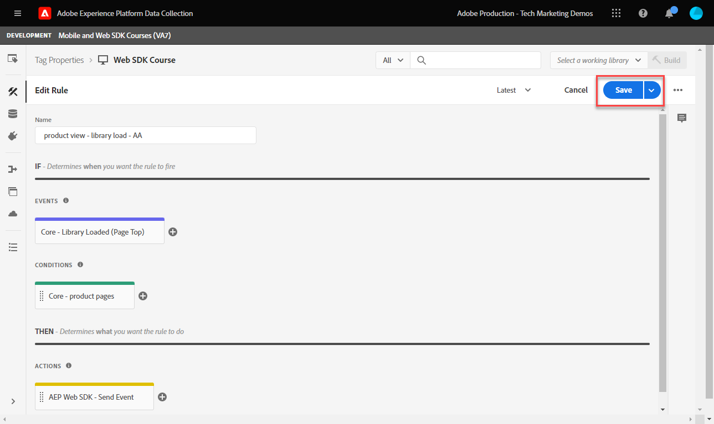
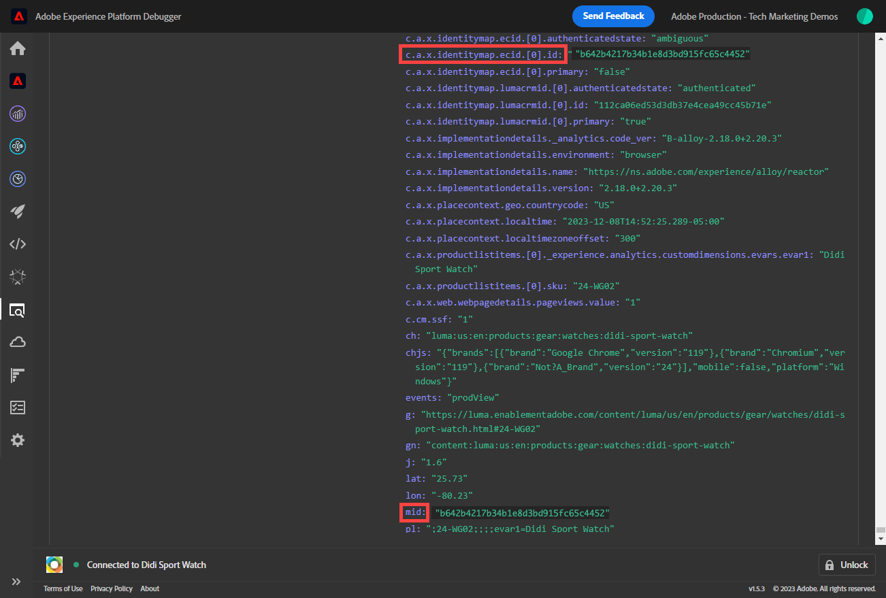
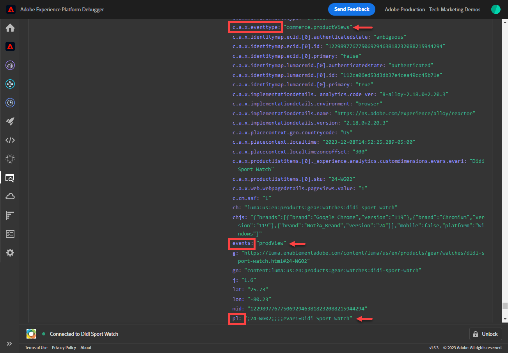

# Platform Web SDK でのAdobe Analyticsの設定

次を使用してAdobe Analyticsを設定する方法を説明します。 [Experience PlatformWeb SDK](https://experienceleague.adobe.com/docs/platform-learn/data-collection/web-sdk/overview.html)では、タグルールを作成してAdobe Analyticsにデータを送信し、Analytics が期待どおりにデータをキャプチャしていることを検証します。

[Adobe Analytics](https://experienceleague.adobe.com/docs/analytics.html?lang=ja) は、顧客像を把握し、顧客インテリジェンスを活用してビジネスを導く力をユーザーに提供する、業界最先端のアプリケーションです。

## 学習内容

このレッスンを最後まで学習すると、以下の内容を習得できます。

* Adobe Analytics用の XDM スキーマの設定と、自動マッピングと Analytics 用の手動でマッピングされた XDM 変数の違いについて説明します
* Adobe Analyticsを有効にするためのデータストリームの設定
* 個々のデータ要素または配列全体のデータ要素を XDM オブジェクトにマッピングする
* XDM オブジェクトを使用してAdobe Analyticsでページビューをキャプチャします
* Adobe Analytics製品文字列の XDM オブジェクトを使用した e コマースデータのキャプチャ
* Adobe Analytics変数が XDM オブジェクトで設定されていることを検証するには、Experience PlatformDebugger を使用します
* Adobe Analyticsの処理ルールを使用したカスタム変数の設定
* リアルタイムレポートを使用して、Adobe Analyticsがデータを取得したことを検証する

## 前提条件

タグ、Adobe Analytics、 [Luma デモサイト](https://luma.enablementadobe.com/content/luma/us/en.html){target=&quot;_blank&quot;} ログインおよびショッピング機能。

テスト/開発レポートスイート ID が少なくとも 1 つ必要です。 このチュートリアルで使用できるテスト/開発用レポートスイートがない場合は、 [1 つを作成してください](https://experienceleague.adobe.com/docs/analytics/admin/manage-report-suites/new-report-suite/t-create-a-report-suite.html?lang=ja).

チュートリアルの前の節のすべての手順を完了している。

* 初期設定
   * [権限の設定](configure-permissions.md)
   * [XDM スキーマの設定](configure-schemas.md)
   * [ID 名前空間の設定](configure-identities.md)
   * [データストリームの設定](configure-datastream.md)
* タグ設定
   * [Web SDK 拡張機能のインストール](install-web-sdk.md)
   * [データ要素の作成](create-data-elements.md)
   * [タグルールの作成](create-tag-rule.md)
   * [Adobe Experience Platform Debugger を使用した検証](validate-with-debugger.md)

## XDM スキーマと Analytics の変数

おめでとうございます。のAdobe Analyticsと互換性のあるスキーマを既に設定しています [スキーマの設定](configure-schemas.md) レッスン！

Platform Web SDK の実装は、できる限り製品に依存しない必要があります。 Adobe Analyticsの場合、マッピングされた eVar、prop およびイベントは、従来おこなわれていたように、スキーマの作成時やタグルールの設定時には発生しません。 代わりに、各 XDM キー値ペアは、次の 2 つの方法のいずれかで Analytics 変数にマッピングされるコンテキストデータ変数になります。

1. 予約 XDM フィールドを使用して自動的にマッピングされた変数
1. Analytics 処理ルールを使用して手動でマッピングした変数

Adobe Analyticsに自動マッピングされる XDM 変数については、 [Analytics で自動的にマッピングされる変数](https://experienceleague.adobe.com/docs/experience-platform/edge/data-collection/adobe-analytics/automatically-mapped-vars.html?lang=en). 自動マッピングされない変数は、手動でマッピングする必要があります。

で作成されたスキーマ [スキーマの設定](configure-schemas.md) レッスンには、次の表で概要を示すように、Analytics 変数に自動マッピングされるいくつかが含まれます。

| XDM から Analytics への自動マッピングされた変数 | Adobe Analytics変数 |
|-------|---------|
| `identitymap.ecid.[0].id` | mid |
| `web.webPageDetails.pageViews.value` | ページビュー s.t() の呼び出し |
| `web.webPageDetails.name` | s.pageName |
| `web.webPageDetails.server` | s.server |
| `web.webPageDetails.siteSection` | s.channel |
| `commerce.productViews.value` | prodView |
| `commerce.productListViews.value` | scView |
| `commerce.checkouts.value` | scCheckout |
| `commerce.purchases.value` | 購入 |
| `commerce.order.currencyCode` | s.currencyCode |
| `commerce.order.purchaseID` | s.purchaseID |
| `productListItems[].SKU` | s.products=;product name;;;（プライマリ — 後述の注意を参照） |
| `productListItems[].name` | s.products=;product name;;;（フォールバック — 以下の注意を参照） |
| `productListItems[].quantity` | s.products=;;product quantity;; |
| `productListItems[].priceTotal` | s.product=;;;product price;; |

>[!NOTE]
>
>Analytics 製品文字列の個々のセクションは、 `productListItems` オブジェクト。
>2022 年 8 月 18 日現在 `productListItems[].SKU` は、s.products 変数内の製品名へのマッピングを優先します。
>に設定された値 `productListItems[].name` は、次の場合にのみ製品名にマッピングされます： `productListItems[].SKU` は存在しません。 それ以外の場合は、マッピングが解除され、コンテキストデータで使用できます。
>空の文字列や null をに設定しないでください。  `productListItems[].SKU`. これにより、s.products 変数内の製品名にマッピングした場合に、望ましくない影響が生じます。


## データストリームの設定

Platform Web SDK は、Web サイトから Platform Edge Network にデータを送信します。 次に、データストリームが Platform Edge Network に対し、そのデータを転送する場所 ( この場合はAdobe Analyticsレポートスイート ) を伝えます。

1. に移動します。 [データ収集](https://experience.adobe.com/#/data-collection){target=&quot;blank&quot;} インターフェイス
1. 左側のナビゲーションで、「 **[!UICONTROL データストリーム]**
1. 以前に作成したを選択 `Luma Web SDK` datastream

   

1. 選択 **[!UICONTROL サービスを追加]**

   
1. 選択 **[!UICONTROL Adobe Analytics]** を **[!UICONTROL サービス]**
1. 次を入力します。  **[!UICONTROL レポートスイート ID]** （開発レポートスイートの）
1. 選択 **[!UICONTROL 保存]**

   

   >[!TIP]
   >
   >「 」を選択してレポートスイートを追加する **[!UICONTROL レポートスイートの追加]** は、複数のスイートタグ付けと同等です。

>[!WARNING]
>
>このチュートリアルでは、開発用Adobe Analyticsレポートスイートのみを設定します。 独自の Web サイトのデータストリームを作成する場合、ステージング環境と実稼動環境用に追加のデータストリームおよびレポートスイートを作成します。


## 追加のデータ要素の作成

次に、Luma データレイヤーから追加のデータをキャプチャし、Platform Edge ネットワークに送信します。 このレッスンでは、一般的なAdobe Analytics要件に焦点を当てていますが、取り込んだすべてのデータを、データストリーム設定に基づいて他の宛先に簡単に送信できます。 例えば、 Adobe Experience Platformレッスンを完了した場合、このレッスンでキャプチャした追加データも Platform に送信されます。

### e コマースデータ要素の作成

「データ要素の作成」レッスンでは、次の操作をおこないます。 [JavaScript データ要素の作成](create-data-elements.md#create-data-elements-to-capture-the-data-layer) がキャプチャしたコンテンツと id の詳細。 次に、e コマースデータをキャプチャするための追加のデータ要素を作成します。 これは、 [Luma デモサイト](https://luma.enablementadobe.com/content/luma/us/en.html){target=&quot;_blank&quot;} は、買い物かご内の製品詳細ページと製品に異なるデータレイヤー構造を使用します。各シナリオのデータ要素を作成する必要があります。 以下の提供されているコードスニペットを使用します。

1. チュートリアルに使用するタグプロパティを開きます。
1. に移動します。 **[!UICONTROL データ要素]**
1. 選択 **[!UICONTROL データ要素を追加]**
1. 名前を付ける **`product.productInfo.sku`**
1. 以下を使用： **[!UICONTROL カスタムコード]** **[!UICONTROL データ要素タイプ]**
1. 次のチェックボックスをオンにします。 **[!UICONTROL 強制的に小文字に変換値]** および **[!UICONTROL クリーンテキスト]** オフ
1. 終了 `None` を **[!UICONTROL ストレージ期間]** の設定は、ページごとにこの値が異なるので、
1. 選択 **[!UICONTROL 編集画面を開く]**

   

1. 次のコードをコピー&amp;ペーストします。

   ```javascript
   var cart = digitalData.product;
   var cartItem;
   cart.forEach(function(item){
   cartItem = item.productInfo.sku;
   });
   return cartItem;
   ```

1. 選択 **[!UICONTROL 保存]** カスタムコードを保存するには、以下を実行します。

   

1. 選択 **[!UICONTROL 保存]** データ要素を保存するには、以下を実行します。

同じ手順に従って、これらの追加のデータ要素を作成します。

* **`product.productInfo.title`**

   ```javascript
   var cart = digitalData.product;
   var cartItem;
   cart.forEach(function(item){
   cartItem = item.productInfo.title;
   });
   return cartItem;
   ```

* **`cart.productInfo`**

   ```javascript
   var cart = digitalData.cart.cartEntries;
   var cartItem = [];
   cart.forEach(function(item, index, array){
   var qty = parseInt(item.qty);
   var price = parseInt(item.price);
   cartItem.push({
   "SKU": item.sku,
   "name":item.title,
   "quantity":qty,
   "priceTotal":price
   });
   });
   return cartItem;
   ```

これらのデータ要素を追加し、 [データ要素の作成](create-data-elements.md) レッスンでは、次のデータ要素が必要になります。

| データ要素 |
-----------------------------|
| `cart.orderId` |
| `cart.productInfo` |
| `identityMap.loginID` |
| `page.pageInfo.hierarchie1` |
| `page.pageInfo.pageName` |
| `page.pageInfo.server` |
| `product.productInfo.sku` |
| `product.productInfo.title` |
| `user.profile.attributes.loggedIn` |
| `user.profile.attributes.username` |
| `xdm.content` |

>[!IMPORTANT]
>
>このチュートリアルでは、イベントごとに異なる XDM オブジェクトを作成します。 つまり、ページ名や identityMap など、すべてのヒットで「グローバル」に使用可能と見なされる変数を再マッピングする必要があります。 ただし、 [オブジェクトのマージ](https://experienceleague.adobe.com/docs/experience-platform/tags/extensions/adobe/core/overview.html#merged-objects) または [マッピングテーブル](https://exchange.adobe.com/experiencecloud.details.103136.mapping-table.html) 実際の状況で XDM オブジェクトをより効率的に管理する。 このレッスンでは、グローバル変数を次のように扱います。
>
>* **[!UICONTROL identityMap]** を使用して、 [ID マップデータ要素の作成](create-data-elements.md#create-identity-map-data-element) 運動 [データ要素の作成](create-data-elements.md) レッスン。
>* **[!UICONTROL web]** 次のようにコンテンツをキャプチャするオブジェクト [content XDM オブジェクト](create-data-elements.md#map-content-data-elements-to-XDM-Schema-individually) 運動 [データ要素の作成](create-data-elements.md) 上記のすべてのデータ要素に関するレッスンです。


### ページビュー数を増分

「データ要素の作成」レッスンでは、次の操作をおこないます。 [作成済み `xdm.content` データ要素](create-data-elements.md#map-content-data-elements-to-xdm-schema-individually) を使用して、コンテンツディメンションを取り込みます。 現在はAdobe Analyticsにデータを送信しているので、追加の XDM フィールドもマッピングして、ビーコンが Analytics のページビューとして処理される必要があることを示す必要があります。

1. を開きます。 `xdm.content` データ要素
1. 下にスクロールし、を選択して開くまで待ちます。 `web.webPageDetails`
1. を選択して、 **[!UICONTROL pageViews]** object
1. 設定 **[!UICONTROL 値]** から `1`
1. 選択 [!UICONTROL **保存**]

   

>[!TIP]
>
>このフィールドは、 **`s.t()`** を使用する Analytics のページビュービーコン `AppMeasurement.js`. リンククリックビーコンの場合、 `webInteraction.linkClicks.value` から `1`


### 製品文字列の設定

製品文字列にマッピングする前に、Adobe Analyticsと特別な関係を持つ e コマースデータを取得するために使用される、XDM スキーマ内に 2 つの主なオブジェクトがあることを理解しておくことが重要です。

1. この `commerce` オブジェクトは、次のような Analytics イベントを設定します。 `prodView`, `scView`、および `purchase`
1. この `productListItems` オブジェクトセット Analytics のディメンション ( 例： `productID`.

詳しくは、 [コマースおよび製品データの収集](https://experienceleague.adobe.com/docs/experience-platform/edge/data-collection/collect-commerce-data.html?lang=en) を参照してください。

また、次のことを理解することも重要です。 **[!UICONTROL 個々の属性を提供する]** 個々の XDM フィールドまたは **[!UICONTROL 配列全体を提供する]** を XDM オブジェクトに追加します。


### 個々の属性の XDM オブジェクトへのマッピング

個々の変数にマッピングして、Luma デモサイトの製品の詳細ページのデータをキャプチャできます。

1. の作成 **[!UICONTROL XDM オブジェクト]** **[!UICONTROL データ要素タイプ]** 名前付き **`xdm.commerce.prodView`**
1. 以前のレッスンで使用したのと同じ Platform サンドボックスと XDM スキーマを選択します
1. を開きます。 **[!UICONTROL commerce]** object
1. を開きます。 **[!UICONTROL productViews]** オブジェクトとセット **[!UICONTROL 値]** から `1`

   

   >[!TIP]
   >
   >この手順は、 `prodView` Analytics のイベント


1. 下にスクロールして、「 」を選択します。 `productListItems` 配列
1. 選択 **[!UICONTROL 個々の項目を指定]**
1. 選択 **[!UICONTROL 項目を追加]**

   

   >[!CAUTION]
   >
   >この **`productListItems`** は `array` データ型を使用することをお勧めします。 Luma デモサイトのデータレイヤー構造と、Luma サイトでは一度に 1 つの製品のみ表示できるので、項目を個別に追加します。 独自の Web サイトにを実装する場合、データレイヤーの構造に応じて、配列全体を提供できる場合があります。

1. 選択して開く **[!UICONTROL 項目 1]**
1. 次の XDM 変数をデータ要素にマッピングします

   * **`productListItems.item1.SKU`**&#x200B;コピー先：`%product.productInfo.sku%`
   * **`productListItems.item1.name`**&#x200B;コピー先：`%product.productInfo.title%`

   

   >[!IMPORTANT]
   >
   >この XDM オブジェクトを保存する前に、「グローバル」変数とページビュー増分も設定してください。
   >

1. 選択 **[!UICONTROL 保存]**

### 配列全体の XDM オブジェクトへのマッピング

前述のように、Luma デモサイトでは、買い物かご内の製品に異なるデータレイヤー構造を使用しています。 カスタムコードデータ要素 `cart.productInfo` 以前作成したデータ要素は、 `digitalData.cart.cartEntries` データレイヤーオブジェクトを作成し、必要な XDM オブジェクトスキーマに変換します。 新しい形式 **完全に一致する必要があります** で定義されたスキーマ `productListItems` XDM スキーマのオブジェクト。

例として、Luma サイトのデータレイヤー（左）と翻訳済みのデータ要素（右）の比較を参照してください。


データ要素と `productListItems` 構造（ヒント、一致する必要があります）。

>[!IMPORTANT]
>
>数値変数の変換方法に注意してください。データレイヤーには次のような文字列値があります。 `price` および `qty` データ要素の数値の形式に戻しました。 これらの形式の要件は、Platform のデータの整合性に重要で、 [スキーマの設定](configure-schemas.md) 手順 この例では、 **[!UICONTROL 量]** は **[!UICONTROL 整数]** データタイプ。
> 

次に、XDM オブジェクトを配列全体にマッピングします。 買い物かごページ上の製品を取り込む XDM オブジェクトデータ要素を作成します。

1. の作成 **[!UICONTROL XDM オブジェクト]** **[!UICONTROL データ要素タイプ]** 名前付き **`xdm.commerce.cartView`**
1. このチュートリアルで使用するのと同じ Platform サンドボックスと XDM スキーマを選択します
1. を開きます。 **[!UICONTROL commerce]** object
1. を開きます。 **[!UICONTROL productListViews]** オブジェクトとセット `value` から `1`

   >[!TIP]
   >
   >この手順は、 `scView` Analytics のイベント

1. 下にスクロールして、「 」を選択します。 **[!UICONTROL productListItems]** 配列
1. 選択 **[!UICONTROL アレイ全体を提供]**
1. マッピング先 **`cart.productInfo`** データ要素

   

   >[!IMPORTANT]
   >
   >この XDM オブジェクトを保存する前に、「グローバル」変数とページビュー増分も設定してください。
   >

1. 選択 **[!UICONTROL 保存]**

別の **[!UICONTROL XDM オブジェクト]**  **[!UICONTROL データ要素タイプ]** チェックアウトの対象： `xdm.commerce.checkout`. 今回は、 **[!UICONTROL commerce.checkouts.value]** から `1`，マップ **[!UICONTROL productListItems]** から **`cart.productInfo`** 先ほどおこなったように、「グローバル」変数とページビューカウンターを追加します。

>[!TIP]
>
>この手順は、 `scCheckout` Analytics のイベント


を取得するための追加の手順があります。 `purchase` イベント：

1. 別の  **[!UICONTROL XDM オブジェクト]**  **[!UICONTROL データ要素タイプ]** 次の購入： `xdm.commerce.purchase`
1. 開く **[!UICONTROL commerce]** object
1. を開きます。 **[!UICONTROL 注文]** object
1. マップ **[!UICONTROL purchaseID]** から `cart.orderId` データ要素
1. 設定 **[!UICONTROL currencyCode]** ハードコードされた値に `USD`

   

   >[!TIP]
   >
   >これは、 `s.purcahseID` および `s.currencyCode` Analytics の変数

1. を選択して、 `purchases` オブジェクトとセット `value` から `1`
   >[!TIP]
   >
   >これは、 `purchase` Analytics のイベント

   >[!IMPORTANT]
   >
   >この XDM オブジェクトを保存する前に、「グローバル」変数とページビュー増分も設定してください。
   >

1. 選択 **[!UICONTROL 保存]**

これらの手順の最後に、次の 5 つの XDM オブジェクトデータ要素を作成する必要があります。

| XDM オブジェクトのデータ要素 |
-----------------------------|
| `xdm.commerce.cartView` |
| `xdm.commerce.checkout` |
| `xdm.commerce.prodView` |
| `xdm.commerce.purchase` |
| `xdm.content` |


## Platform Web SDK 用の追加ルールの作成

複数の XDM オブジェクトデータ要素を作成したら、ルールを使用してビーコンを設定する準備が整いました。 この演習では、e コマースイベントごとに個々のルールを作成し、適切なページでルールが実行されるように条件を使用します。 まず、製品表示イベントを開始します。

1. 左側のナビゲーションから、 **[!UICONTROL ルール]** 次に、 **[!UICONTROL ルールを追加]**
1. 名前を付ける  [!UICONTROL `product view - library load - AA`]
1. の下 **[!UICONTROL イベント]**&#x200B;を選択します。 **[!UICONTROL 読み込まれたライブラリ（ページ上部）]**
1. の下 **[!UICONTROL 条件]**&#x200B;を選択して、 **[!UICONTROL 追加]**

   

1. 終了 **[!UICONTROL 論理タイプ]** as **[!UICONTROL 標準]**
1. 終了 **[!UICONTROL 拡張機能]** as **[!UICONTROL コア]**
1. 選択 **[!UICONTROL 条件タイプ]** as **[!UICONTROL Path Without Query String]**
1. 右側で、 **[!UICONTROL 正規表現]** 切り替え
1. の下 **[!UICONTROL パスが等しい]** 設定 `/products/`. Luma デモサイトの場合、ルールは製品ページ上のトリガーのみを確認します。
1. 選択 **[!UICONTROL 変更を保持]**

   

1. の下 **[!UICONTROL アクション]** 選択 **[!UICONTROL 追加]**
1. 選択 **[!UICONTROL Adobe Experience Platform Web SDK]** 拡張
1. 選択 **[!UICONTROL アクションタイプ]** as **[!UICONTROL イベントを送信]**
1. この **[!UICONTROL タイプ]** フィールドには、選択する値のドロップダウンリストが含まれます。 選択 `[!UICONTROL commerce.productViews]`

   >[!TIP]
   >
   >ここで選択した値は、データが Analytics にマッピングされる方法に影響しませんが、Adobe Experience Platformのセグメントビルダーインターフェイスで使用されるので、この変数を慎重に適用することをお勧めします。 選択した値は、 `[!UICONTROL c.a.x.eventtype]` コンテキストデータ変数のダウンストリーム。

1. の下 **[!UICONTROL XDM データ]**&#x200B;を選択し、 `[!UICONTROL xdm.commerce.prodView]` XDM オブジェクトのデータ要素
1. 選択 **[!UICONTROL 変更を保持]**

   

1. ルールは次のようになります。 選択 **[!UICONTROL 保存]**

   


次のパラメーターを使用して、他のすべての e コマースイベントに対しても同じ手順を繰り返します。

**ルール名**:買い物かご表示 — ライブラリ読み込み — AA

* **[!UICONTROL イベントタイプ]**:読み込まれたライブラリ（ページ上部）
* **[!UICONTROL 条件]**:/content/luma/us/en/user/cart.html
* **「Web SDK - Send Action」の値を入力します。**:commerce.productListViews
* **Web SDK — 送信アクションの XDM データ：** `%xdm.commerce.cartView%`

**ルール名**:checkout - library load - AA

* **[!UICONTROL イベントタイプ]**:読み込まれたライブラリ（ページ上部）
* **[!UICONTROL 条件]** /content/luma/us/en/user/checkout.html
* **Web SDK のタイプ — 送信アクション**:commerce.checkouts
* **Web SDK — 送信アクションの XDM データ：** `%xdm.commerce.checkout%`

**ルール名**:purchase - library load - AA

* **[!UICONTROL イベントタイプ]**:読み込まれたライブラリ（ページ上部）
* **[!UICONTROL 条件]** /content/luma/us/en/user/checkout/order/thank-you.html
* **Web SDK のタイプ — 送信アクション**:commerce.purchases
* **Web SDK — 送信アクションの XDM データ：** `%xdm.commerce.purchase%`

完了したら、次のルールが作成されます。


## 開発環境の構築

新しいデータ要素とルールを `Luma Web SDK Tutorial` タグライブラリを追加し、開発環境を再構築します。


## Adobe Analytics for Platform Web SDK の検証

内 [デバッガー](validate-with-debugger.md) レッスンでは、Platform Debugger とブラウザー開発者コンソールを使用して、クライアント側 XDM オブジェクトビーコンを検査する方法を学びました。これは、 `AppMeasurement.js` Analytics の実装。 Platform Web SDK を使用して Analytics がデータを適切にキャプチャしていることを検証するには、次の 2 つの手順に従う必要があります。

1. Platform Edge Network 上の XDM オブジェクトによってデータが処理される方法を検証するには、Experience Platformデバッガーの Edge Trace 機能を使用します。
1. 処理ルールとリアルタイムレポートを使用して、Analytics でのデータの処理方法を検証します。

### エッジトレースを使用

Experience Platformデバッガーの Edge Trace 機能を使用して、Adobe Analyticsが ECID、ページビュー、製品文字列、e コマースイベントを取り込んでいることを検証する方法について説明します。

### Experience CloudID の検証

1. 次に移動： [Luma デモサイト](https://luma.enablementadobe.com/content/luma/us/en.html){target=&quot;_blank&quot;} を使用し、Experience Platformデバッガーを [サイトのタグプロパティを独自の開発プロパティに切り替える](validate-with-debugger.md#use-the-experience-platform-debugger-to-map-to-your-tags-property)

   >[!WARNING]
   >
   >続行する前に、Luma サイトにログインしていることを確認します。  ログインしていない場合、Luma サイトではチェックアウトできません。
   >
   > 1. Luma で、右上のログインボタンを選択し、資格情報を使用します。 **u:test@adobe.com p:テスト** 認証する
   >
   > 1. 自動的に [Didi Sport Watch 製品ページ](https://luma.enablementadobe.com/content/luma/us/en/products/gear/watches/didi-sport-watch.html#24-WG02) 次のページ読み込み時


1. エッジトレースを有効にするには、「Experience Platformデバッガー」に移動し、左側のナビゲーションでを選択します。 **[!UICONTROL ログ]**&#x200B;を選択し、 **[!UICONTROL Edge]** 「 」タブで「 」を選択します。 **[!UICONTROL 接続]**

   

1. 現時点では空になります

   

1. 次を更新： [Didi Sport Watch 製品ページ](https://luma.enablementadobe.com/content/luma/us/en/products/gear/watches/didi-sport-watch.html#24-WG02) 「Experience Platformデバッガー」を再度チェックすると、データが表示されます。 次で始まる行 **[!UICONTROL Analytics の自動マッピング RSID]** はAdobe Analyticsビーコンです
1. を選択して、両方の `[!UICONTROL mappedQueryParams]` ドロップダウンと、Analytics 変数を表示する 2 番目のドロップダウン

   

   >[!TIP]
   >
   >2 番目のドロップダウンは、データの送信先の Analytics レポートスイート ID に対応しています。 スクリーンショットに示されているレポートスイートではなく、お客様独自のレポートスイートと一致する必要があります。

1. 下にスクロールして検索 `[!UICONTROL c.a.x.identitymap.ecid.[0].id]`. ECID を取り込むコンテキストデータ変数です
1. Analytics が表示されるまで下にスクロールし続けます `[!UICONTROL mid]` 変数を使用します。 両方の ID がデバイスのExperience CloudID と一致します。

   

   >[!NOTE]
   >
   >ログインしているので、認証済み ID を検証するために少し時間をかけます `112ca06ed53d3db37e4cea49cc45b71e` （ユーザー向け） **test@adobe.com** が `[!UICONTROL c.a.x.identitymap.lumacrmid.[0].id]`


### コンテンツページビュー数

同じビーコンを使用して、Analytics がコンテンツページビューを取り込んだことを検証します。

1. を探す `[!UICONTROL c.a.x.web.webpagedetails.pageviews.value]=1`. これは、 `s.t()` ページビュービーコンが Analytics に送信されています
1. 下にスクロールして、 `[!UICONTROL gn]` 変数を使用します。 これは、 `[!UICONTROL s.pageName]` 変数を使用します。 データレイヤーからページ名を取り込みます。

   

### 製品文字列および e コマースイベント

既に製品ページを使用しているので、この演習では、引き続き同じ Edge Trace を使用して、Analytics によって製品データがキャプチャされたことを検証します。 製品文字列イベントと e コマースイベントの両方が、XDM 変数を Analytics に自動的にマッピングします。 適切な `productListItem` XDM 変数を [Adobe Analytics用の XDM スキーマの設定](setup-analytics.md#configure-an-xdm-schema-for-adobe-analytics)を使用する場合、Platform Edge Network は、適切な分析変数へのデータのマッピングを処理します。

1. 最初に、 `Product String` 設定済み
1. を探す `[!UICONTROL c.a.x.productlistitems.][0].[!UICONTROL sku]`. 変数は、 `productListItems.item1.sku` このレッスンの前の
1. 下にスクロールして、 `[!UICONTROL pl]` 変数を使用します。 これは、Analytics 製品文字列変数の動的構文です。
1. 両方の値が、データレイヤーで使用可能な製品名に一致します

   

Edge Trace はを処理します。 `commerce` ～とは少し異なるイベント `productList` ディメンション。 マッピングされた製品名を確認するのと同じ方法でマッピングされたコンテキストデータ変数が表示されません `[!UICONTROL c.a.x.productlistitem.[0].name]` 上 代わりに、Edge Trace は Analytics で最終的なイベントの自動マッピングを表示します `event` 変数を使用します。 適切な XDM にマッピングしている限り、Platform Edge Network はそれに応じてマッピングします `commerce` 変数 [Adobe Analytics用のスキーマの設定](setup-analytics.md#configure-an-xdm-schema-for-adobe-analytics);この場合 `commerce.productViews.value=1`.

1. 「Experience Platformデバッガー」ウィンドウに戻り、 `[!UICONTROL event]` 変数の場合は、 `[!UICONTROL prodView]`

   

残りの e コマースイベントと製品文字列が Analytics に設定されていることを検証します。

1. 追加 [Didi Sport Watch](https://luma.enablementadobe.com/content/luma/us/en/products/gear/watches/didi-sport-watch.html#24-WG02) 買い物かごに
1. 次に移動： [買い物かごページ](https://luma.enablementadobe.com/content/luma/us/en/user/cart.html), Edge Trace for をチェック `[!UICONTROL events: "scView"]` と製品文字列

   

1. チェックアウトに進み、 Edge Trace for `[!UICONTROL events: "scCheckout"]` と製品文字列

   

1. 次の項目だけを入力します。 **名** および **姓** 配送先フォームのフィールドと **続行**. 次のページで、 **発注**
1. 確認ページで、「Edge Trace for 」をオンにします。

   * 設定中の購入イベント `[!UICONTROL events: "purchase"]`
   * 設定中の通貨コード変数 `[!UICONTROL cc: "USD"]`
   * で設定されている購入 ID `[!UICONTROL pi]`
   * 製品文字列 `[!UICONTROL pl]` 製品名、数量および価格の設定

   

## 処理ルールとリアルタイムレポート

これで、Edge Trace で Analytics ビーコンを検証したので、リアルタイムレポートを使用して Analytics がデータを処理していることを検証することもできます。 リアルタイムレポートを確認する前に、Analytics の処理ルールを設定する必要があります `props` 必要に応じて。

### カスタム Analytics マッピングの処理ルール

この演習では、1 つの XDM 変数を prop にマッピングし、リアルタイムレポートで表示できるようにします。 すべてのカスタムマッピングに対して同じ手順を実行します。 `eVar`, `prop`, `event`、または処理ルールからアクセス可能な変数。

1. Analytics UI で、に移動します。 [!UICONTROL 管理者] > [!UICONTROL 管理ツール] > [!UICONTROL レポートスイート ]
1. チュートリアルで使用する開発/テストレポートスイートを選択します。 > [!UICONTROL 設定を編集] > [!UICONTROL 一般] > [!UICONTROL 処理ルール]

   

1. ルールを作成して **[!UICONTROL 値を上書き]** `[!UICONTROL Product Name (prop1)]` から `a.x.productlistitems.0.name`. ルールを作成する理由を忘れずにメモを追加し、ルールのタイトルに名前を付けてください。 選択 **[!UICONTROL 保存]**

   

   >[!IMPORTANT]
   >
   >最初に処理ルールにマッピングしたとき、UI には XDM オブジェクトのコンテキストデータ変数が表示されません。 任意の値を選択する場合は、「保存」をクリックし、再び編集を開始します。 これで、すべての XDM 変数が表示されます。

1. に移動します。 [!UICONTROL 設定を編集] >  [!UICONTROL リアルタイム]. コンテンツページビュー、製品ビュー、購入を検証できるよう、3 つすべてを以下に示すパラメーターで設定します

   

1. 検証手順を繰り返し、それに応じてリアルタイムレポートにデータが入力されることを確認します。

   **ページビュー数**
   

   **製品表示**
   

   **購入**
   

1. Workspace UI で、購入した製品の e コマースフロー全体を表示するテーブルを作成します

   

XDM フィールドと Analytics 変数のマッピングについて詳しくは、ビデオを参照してください [Web SDK 変数のAdobe Analyticsへのマッピング](https://experienceleague.adobe.com/docs/analytics-learn/tutorials/analysis-use-cases/internal-site-search/map-web-sdk-variables-into-adobe-analytics.html).

おめでとうございます。これでレッスンが終了し、独自の Web サイト用にAdobe Analytics Platform Web SDK を実装する準備が整いました。

[次へ： ](setup-audience-manager.md)

>[!NOTE]
>
>Adobe Experience Platform Web SDK の学習に時間を割いていただき、ありがとうございます。 ご質問がある場合、一般的なフィードバックを共有したい場合、または今後のコンテンツに関する提案がある場合は、こちらで共有してください [Experience Leagueコミュニティディスカッション投稿](https://experienceleaguecommunities.adobe.com/t5/adobe-experience-platform-launch/tutorial-discussion-implement-adobe-experience-cloud-with-web/td-p/444996)
