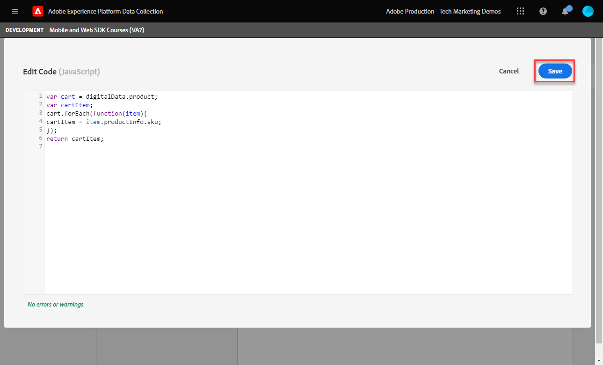
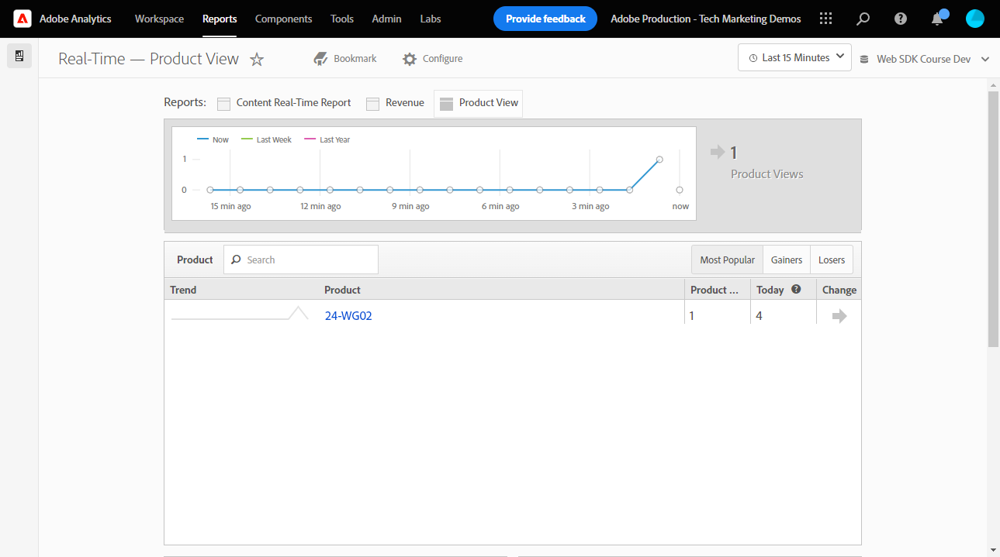

# Platform Web SDK を使用したAdobe Analyticsの設定


>[!CAUTION]
>
>このチュートリアルの大きな変更は、2024 年 4 月 23 日火曜日（PT）に公開される予定です。 その後、多くの演習が変更され、すべてのレッスンを完了するには、最初からチュートリアルを再開する必要が生じる場合があります。

を使用したAdobe Analyticsの設定方法を説明します [Web SDK のExperience Platform](https://experienceleague.adobe.com/docs/platform-learn/data-collection/web-sdk/overview.html?lang=ja)を選択し、タグルールを作成して Analytics にデータを送信し、Adobe Analyticsが期待どおりにデータをキャプチャしていることを検証します。

[Adobe Analytics](https://experienceleague.adobe.com/docs/analytics.html?lang=ja) は、顧客を人物として理解し、顧客インテリジェンスを使用してビジネスを導く力を与える、業界をリードするアプリケーションです。

## 学習目標

このレッスンを最後まで学習すると、以下の内容を習得できます。

* Analytics 用に XDM スキーマを設定し、Adobe Analytics用に自動マッピングされた XDM 変数と手動マッピングされた XDM 変数の違いを理解します
* データストリームの設定によるAdobe Analyticsの有効化
* 個々または全体の配列データ要素の XDM オブジェクトへのマッピング
* XDM オブジェクトを使用したAdobe Analyticsでのページビューのキャプチャ
* Adobe Analytics製品文字列用の XDM オブジェクトを使用して e コマースデータをキャプチャします
* Experience Platformデバッガーを使用して、Adobe Analytics変数が XDM オブジェクトで設定されていることを検証します。
* Adobe Analyticsの処理ルールを使用したカスタム変数の設定
* リアルタイムレポートを使用して、Adobe Analyticsで取得されたデータを検証します。

## 前提条件

タグ、Adobe Analyticsおよび [Luma デモサイト](https://luma.enablementadobe.com/content/luma/us/en.html){target="_blank"} ログインとショッピング機能。

少なくとも 1 つのテスト/開発レポートスイート ID が必要です。 このチュートリアルで使用できるテスト/開発レポートスイートがない場合、 [作成してください](https://experienceleague.adobe.com/docs/analytics/admin/manage-report-suites/new-report-suite/t-create-a-report-suite.html?lang=ja).

チュートリアルの前の節で説明したすべての手順を完了している必要があります。

* 初期設定
   * [権限の設定](configure-permissions.md)
   * [XDM スキーマの設定](configure-schemas.md)
   * [ID 名前空間の設定](configure-identities.md)
   * [データストリームの設定](configure-datastream.md)
* タグの設定
   * [Web SDK 拡張機能のインストール](install-web-sdk.md)
   * [データ要素の作成](create-data-elements.md)
   * [タグルールの作成](create-tag-rule.md)
   * [Adobe Experience Platform Debugger での検証](validate-with-debugger.md)

## XDM スキーマと Analytics の変数

おめでとうございます。でAdobe Analyticsと互換性のあるスキーマを既に設定しています [スキーマの設定](configure-schemas.md) レッスン！

Platform Web SDK の実装は、可能な限り製品に依存しないようにします。 Adobe Analyticsの場合、eVar、prop およびイベントのマッピングは、スキーマの作成時、または従来のようにタグルールを設定する際には行われません。 代わりに、すべての XDM キーと値のペアは、次の 2 つの方法のいずれかで Analytics 変数にマッピングされるコンテキストデータ変数になります。

1. 予約済みの XDM フィールドを使用した自動的にマッピングされた変数
1. Analytics の処理ルールを使用した手動でマッピングされた変数

Adobe Analyticsに自動マッピングされる XDM 変数については、以下を参照してください。 [Analytics で自動的にマッピングされる変数](https://experienceleague.adobe.com/docs/experience-platform/edge/data-collection/adobe-analytics/automatically-mapped-vars.html?lang=en). 自動マッピングされない変数は、手動でマッピングする必要があります。

で作成されたスキーマ [スキーマの設定](configure-schemas.md) このレッスンには、次の表に示すように、Analytics 変数に自動マッピングされるいくつかの項目が含まれます。

| XDM から Analytics への自動マッピング変数 | Adobe Analytics変数 |
|-------|---------|
| `identitymap.ecid.[0].id` | mid |
| `web.webPageDetails.pageViews.value` | ページビュー s.t （）呼び出し |
| `web.webPageDetails.name` | s.pageName |
| `web.webPageDetails.server` | s.server |
| `web.webPageDetails.siteSection` | s.channel |
| `commerce.productViews.value` | prodView |
| `commerce.productListViews.value` | scView |
| `commerce.checkouts.value` | scCheckout |
| `commerce.purchases.value` | 購入 |
| `commerce.order.currencyCode` | s.currencyCode |
| `commerce.order.purchaseID` | s.purchaseID |
| `productListItems[].SKU` | s.products=;product name;;;（プライマリ – 下のメモを参照） |
| `productListItems[].name` | s.products=;product name;;;（フォールバック – 以下のメモを参照） |
| `productListItems[].quantity` | s.products=;;product quantity;; |
| `productListItems[].priceTotal` | s.product=;;；製品価格；; |

>[!NOTE]
>
>Analytics 製品文字列の個々のセクションは、の下の様々な XDM 変数を介して設定されます `productListItems` オブジェクト。
>2022 年 8 月 18 日現在、 `productListItems[].SKU` s.products 変数内の製品名へのマッピングを優先します。
>設定された値 `productListItems[].name` 次の場合にのみ、製品名にマッピングされます `productListItems[].SKU` が存在しない。 それ以外の場合は、マッピングされず、コンテキストデータで使用できます。
>に空の文字列や null を設定しないでください。  `productListItems[].SKU`. これには、s.products 変数の製品名にマッピングするという望ましくない影響があります。


## データストリームの設定

Platform Web SDK は、web サイトから Platform Edge Networkにデータを送信します。 次に、データストリームは、そのデータを転送する場所（この場合は、Adobe Analytics レポートスイートの転送先）を Platform Edge Networkに指示します。

1. に移動 [データ収集](https://experience.adobe.com/#/data-collection){target="blank"} インターフェイス
1. 左側のナビゲーションで「」を選択します **[!UICONTROL データストリーム]**
1. 以前に作成したを選択します `Luma Web SDK` データストリーム

   

1. 「**[!UICONTROL サービスを追加]**」を選択します。
   
1. を選択 **[!UICONTROL Adobe Analytics]** as the **[!UICONTROL サービス]**
1. を入力  **[!UICONTROL レポートスイート ID]** 開発レポートスイートの
1. 「**[!UICONTROL 保存]**」を選択します

   

   >[!TIP]
   >
   >選択によるその他のレポートスイートの追加 **[!UICONTROL レポートスイートの追加]** は、マルチスイートタグ付けと同等です。

>[!WARNING]
>
>このチュートリアルでは、開発用Adobe Analytics レポートスイートのみを設定します。 独自の web サイト用にデータストリームを作成する場合は、ステージング環境と実稼動環境用に追加のデータストリームとレポートスイートを作成します。


## 追加のデータ要素の作成

次に、Luma データレイヤーから追加データをキャプチャし、Platform Edge Networkに送信します。 このレッスンでは、Adobe Analyticsの一般的な要件に焦点を当てますが、取り込まれたすべてのデータは、データストリーム設定に基づいて他の宛先に簡単に送信できます。 例えば、Adobe Experience Platformのレッスンを完了した場合、このレッスンで取得した追加のデータも Platform に送信されます。

### e コマースデータ要素の作成

データ要素の作成のレッスンでは、次の操作を行います [作成された JavaScript データ要素](create-data-elements.md#create-data-elements-to-capture-the-data-layer) これには、コンテンツと ID の詳細が含まれていました。 次に、e コマースデータを取り込むための追加のデータ要素を作成します。 なぜなら [Luma デモサイト](https://luma.enablementadobe.com/content/luma/us/en.html){target="_blank"} 製品の詳細ページと買い物かごの製品に異なるデータレイヤー構造を使用する場合は、シナリオごとにデータ要素を作成する必要があります。 Luma データレイヤーから必要なものを取得するには、いくつかのカスタムコードデータ要素を作成する必要があります。これは、自分のサイトに実装する場合に必要な場合とそうでない場合があります。 この場合、買い物かご項目の配列をループして、各製品の特定の詳細を取得する必要があります。 以下に提供されているコードスニペットを使用します。

1. チュートリアルに使用するタグプロパティを開きます
1. に移動 **[!UICONTROL データ要素]**
1. を選択 **[!UICONTROL データ要素を追加]**
1. 名前をつける **`product.productInfo.sku`**
1. の使用 **[!UICONTROL カスタムコード]** **[!UICONTROL データ要素タイプ]**
1. のチェックボックスをのままにします。 **[!UICONTROL 小文字の値を強制]** および **[!UICONTROL テキストをクリーン]** 未チェック
1. 移動 `None` as the **[!UICONTROL ストレージ期間]** この値はページごとに異なるので、を設定します
1. を選択 **[!UICONTROL エディターを開く]**

   

1. 次のコードをコピー&amp;ペーストします

   ```javascript
   var cart = digitalData.product;
   var cartItem;
   cart.forEach(function(item){
   cartItem = item.productInfo.sku;
   });
   return cartItem;
   ```

1. を選択 **[!UICONTROL 保存]** カスタムコードを保存するには：

   

1. を選択 **[!UICONTROL 保存]** データ要素を保存するには

同じ手順に従って、これらの追加のデータ要素を作成します。

* **`product.productInfo.title`**

  ```javascript
  var cart = digitalData.product;
  var cartItem;
  cart.forEach(function(item){
  cartItem = item.productInfo.title;
  });
  return cartItem;
  ```

* **`cart.productInfo`**

  ```javascript
  var cart = digitalData.cart.cartEntries;
  var cartItem = [];
  cart.forEach(function(item, index, array){
  var qty = parseInt(item.qty);
  var price = parseInt(item.price);
  cartItem.push({
  "SKU": item.sku,
  "name":item.title,
  "quantity":qty,
  "priceTotal":price
  });
  });
  return cartItem;
  ```

これらのデータ要素を追加し、で以前の要素を作成した後 [データ要素の作成](create-data-elements.md) レッスンでは、次のデータ要素が必要です。

| データ要素 |
-----------------------------|
| `cart.orderId` |
| `cart.productInfo` |
| `identityMap.loginID` |
| `page.pageInfo.hierarchie1` |
| `page.pageInfo.pageName` |
| `page.pageInfo.server` |
| `product.productInfo.sku` |
| `product.productInfo.title` |
| `user.profile.attributes.loggedIn` |
| `user.profile.attributes.username` |
| `xdm.content` |

>[!IMPORTANT]
>
>このチュートリアルでは、イベントごとに異なる XDM オブジェクトを作成します。 つまり、ページ名や identityMap など、すべてのヒットで「グローバル」に使用可能と見なされる変数を再マッピングする必要があります。 ただし、次の場合はかまいません [オブジェクトの結合](https://experienceleague.adobe.com/docs/experience-platform/tags/extensions/adobe/core/overview.html#merged-objects) または使用 [マッピングテーブル](https://exchange.adobe.com/experiencecloud.details.103136.mapping-table.html) 実際の状況で XDM オブジェクトをより効率的に管理する。 このレッスンでは、グローバル変数は次の意味を持ちます。
>
>* **[!UICONTROL identityMap]** に従って認証済み ID を取得します [Id マップデータ要素の作成](create-data-elements.md#create-identity-map-data-element) ～で運動する [データ要素の作成](create-data-elements.md) レッスン：
>* **[!UICONTROL web]** 次のようにコンテンツをキャプチャするオブジェクト [コンテンツ XDM オブジェクト](create-data-elements.md#map-content-data-elements-to-XDM-Schema-individually) ～で運動する [データ要素の作成](create-data-elements.md) 上記のすべてのデータ要素に関するレッスン。

### ページビューを増分

データ要素の作成レッスンでは、次の操作を行います [さんが、 `xdm.content` データ要素](create-data-elements.md#map-content-data-elements-to-xdm-schema-individually) コンテンツのサイズを取得します。 データを Analytics に送信するので、ビーコンをAdobe Analyticsのページビューとして処理する必要があることを示すために、追加の XDM フィールドもマッピングする必要があります。

1. を開きます `xdm.content` データ要素
1. 下にスクロールして、まで開くように選択します `web.webPageDetails`
1. を選択して、を開きます **[!UICONTROL pageViews]** オブジェクト
1. を設定 **[!UICONTROL value]** 対象： `1`
1. 「[!UICONTROL **保存**]」を選択します

   

>[!TIP]
>
>このフィールドは、を送信することと同等です。 **`s.t()`** を使用した Analytics のページビュービーコン `AppMeasurement.js`. リンククリックビーコンの場合、 `webInteraction.linkClicks.value` 対象： `1`


### 製品文字列を設定

製品文字列にマッピングする前に、Adobe Analyticsと特別な関係を持つ e コマースデータをキャプチャするために使用される XDM スキーマ内に 2 つの主なオブジェクトがあることを理解しておくことが重要です。

1. この `commerce` 次のような Analytics イベントを設定します `prodView`, `scView`、および `purchase`
1. この `productListItems` 次のような Analytics ディメンションを含むオブジェクトセット `productID`.

参照： [Commerceと商品データの収集](https://experienceleague.adobe.com/docs/experience-platform/edge/data-collection/collect-commerce-data.html?lang=en) を参照してください。

以下の点についても理解しておくことが重要です **[!UICONTROL 個々の属性を指定]** 個々の XDM フィールドまたは **[!UICONTROL アレイ全体を提供]** を XDM オブジェクトに追加します。


### 個々の属性の XDM オブジェクトへのマッピング

個々の変数にマッピングして、Luma デモサイトの製品の詳細ページでデータを取り込むことができます。

1. を作成 **[!UICONTROL XDM オブジェクト]** **[!UICONTROL データ要素タイプ]** 名前付き **`xdm.commerce.prodView`**
1. 以前のレッスンで使用したものと同じ Platform サンドボックスと XDM スキーマを選択します
1. を開きます **[!UICONTROL コマース]** オブジェクト
1. を開きます **[!UICONTROL productViews]** オブジェクトとセット **[!UICONTROL value]** 対象： `1`

   

   >[!TIP]
   >
   >この手順は、の設定と同等です。 `prodView` analytics のイベント


1. にスクロールし、を選択します。 `productListItems` 配列
1. を選択 **[!UICONTROL 個々の項目を指定]**
1. を選択 **[!UICONTROL 項目を追加]**

   

   >[!CAUTION]
   >
   >この **`productListItems`** は `array` データタイプを使用すると、データは要素の集まりとして取り込まれます。 Luma デモサイトのデータレイヤー構造と、Luma サイトで一度に 1 つの製品しか表示できないので、項目を個別に追加します。 独自の web サイトに実装する場合、データレイヤーの構造によっては、配列全体を指定できる場合があります。

1. 選択して開く **[!UICONTROL 項目 1]**
1. 次の XDM 変数をデータ要素にマッピングします

   * **`productListItems.item1.SKU`**&#x200B;コピー先：`%product.productInfo.sku%`
   * **`productListItems.item1.name`**&#x200B;コピー先：`%product.productInfo.title%`

   

   >[!IMPORTANT]
   >
   >この XDM オブジェクトを保存する前に、「global」変数とページビューの増分値も設定していることを確認してください。
   >

1. 「**[!UICONTROL 保存]**」を選択します

### 配列全体を XDM オブジェクトにマッピングする

前述のように、Luma デモサイトでは、買い物かご内の製品に異なるデータレイヤー構造を使用します。 カスタムコードデータ要素 `cart.productInfo` 前に作成したデータ要素は、 `digitalData.cart.cartEntries` データレイヤーオブジェクトを、必要な XDM オブジェクトスキーマに変換します。 新規形式 **完全に一致する必要があります** によって定義されるスキーマ `productListItems` xdm スキーマのオブジェクト。

説明するには、以下の Luma サイトデータレイヤー（左）と翻訳済みデータ要素（右）の比較を参照してください。


データ要素とを比較します `productListItems` 構造（ヒント、一致する必要があります）。

>[!IMPORTANT]
>
>数値変数の翻訳方法と、データレイヤーの次のような文字列値に注意してください `price` および `qty` データ要素内の数値に再書式設定されます。 これらの形式要件は、Platform でのデータ整合性にとって重要であり、次の期間に決定されます [スキーマの設定](configure-schemas.md) ステップ。 この例では、 **[!UICONTROL 数量]** はを使用します **[!UICONTROL 整数]** データタイプ。
> 

次に、XDM オブジェクトを配列全体にマッピングに戻ります。 XDM オブジェクトデータ要素を作成して、買い物かごページに商品を取り込みます。

1. を作成 **[!UICONTROL XDM オブジェクト]** **[!UICONTROL データ要素タイプ]** 名前付き **`xdm.commerce.cartView`**
1. このチュートリアルで使用するのと同じ Platform サンドボックスおよび XDM スキーマを選択します
1. を開きます **[!UICONTROL コマース]** オブジェクト
1. を開きます **[!UICONTROL productListViews]** オブジェクトとセット `value` 対象： `1`

   >[!TIP]
   >
   >この手順は、の設定と同等です。 `scView` analytics のイベント

1. にスクロールし、を選択します。 **[!UICONTROL productListItems]** 配列
1. を選択 **[!UICONTROL アレイ全体を提供]**
1. マッピング先 **`cart.productInfo`** データ要素

   

   >[!IMPORTANT]
   >
   >この XDM オブジェクトを保存する前に、「global」変数とページビューの増分値も設定していることを確認してください。
   >

1. 「**[!UICONTROL 保存]**」を選択します

別のを作成 **[!UICONTROL XDM オブジェクト]**  **[!UICONTROL データ要素タイプ]** チェックアウト時の呼び出し `xdm.commerce.checkout`. 今回は、 **[!UICONTROL commerce.checkouts.value]** 対象： `1`、マップ **[!UICONTROL productListItems]** 対象： **`cart.productInfo`** 先ほどと同様に、「global」変数とページビューカウンターを追加します。

>[!TIP]
>
>この手順は、の設定と同等です。 `scCheckout` analytics のイベント


を取得するには、さらに次の手順があります `purchase` イベント：

1. 別のを作成  **[!UICONTROL XDM オブジェクト]**  **[!UICONTROL データ要素タイプ]** （購入に対して） `xdm.commerce.purchase`
1. 開く **[!UICONTROL コマース]** オブジェクト
1. を開きます **[!UICONTROL 順序]** オブジェクト
1. マップ **[!UICONTROL purchaseID]** に `cart.orderId` データ要素
1. を設定 **[!UICONTROL currencyCode]** ハードコードされた値に `USD`

   

   >[!TIP]
   >
   >これは、の設定と同じです。 `s.purcahseID` および `s.currencyCode` analytics の変数

1. を選択して、を開きます `purchases` オブジェクトとセット `value` 対象： `1`
   >[!TIP]
   >
   >これは、の設定と同じです。 `purchase` analytics のイベント

   >[!IMPORTANT]
   >
   >この XDM オブジェクトを保存する前に、「global」変数とページビューの増分値も設定していることを確認してください。
   >

1. 「**[!UICONTROL 保存]**」を選択します

これらの手順の最後に、次の 5 つの XDM オブジェクトデータ要素が作成されています。

| XDM オブジェクトデータ要素 |
-----------------------------|
| `xdm.commerce.cartView` |
| `xdm.commerce.checkout` |
| `xdm.commerce.prodView` |
| `xdm.commerce.purchase` |
| `xdm.content` |


## Platform Web SDK 用の追加ルールの作成

複数の XDM オブジェクトデータ要素を作成したら、ルールを使用してビーコンを設定する準備が整います。 この演習では、e コマースイベントごとに個々のルールを作成し、適切なページでルールが実行されるように条件を使用します。 次に、製品表示イベントから始めましょう。

1. 左側のナビゲーションから「」を選択します **[!UICONTROL ルール]** を選択してから、 **[!UICONTROL ルールを追加]**
1. 名前をつける  [!UICONTROL `product view - library load - AA`]
1. 次の下 **[!UICONTROL イベント]**&#x200B;を選択 **[!UICONTROL ライブラリが読み込まれました（ページのトップ）]**
1. 次の下 **[!UICONTROL 条件]**、を選択 **[!UICONTROL 追加]**

   

1. 移動 **[!UICONTROL 論理タイプ]** as **[!UICONTROL 標準]**
1. 移動 **[!UICONTROL 拡張機能]** as **[!UICONTROL コア]**
1. を選択 **[!UICONTROL 条件タイプ]** as **[!UICONTROL クエリ文字列を含まないパス]**
1. 右側で、 **[!UICONTROL 正規表現]** 切り替え
1. 次の下 **[!UICONTROL パスがと等しい]** set `/products/`. Luma デモサイトの場合、ルールが製品ページのトリガーのみになります
1. を選択 **[!UICONTROL 変更を保持]**

   

1. 次の下 **[!UICONTROL アクション]** 選択 **[!UICONTROL 追加]**
1. を選択 **[!UICONTROL Adobe Experience Platform Web SDK]** 拡張子
1. を選択 **[!UICONTROL アクションタイプ]** as **[!UICONTROL イベントを送信]**
1. この **[!UICONTROL タイプ]** フィールドには、値のドロップダウンリストから選択できます。 `[!UICONTROL commerce.productViews]` を選択します。

   >[!TIP]
   >
   >ここで選択した値は、データが Analytics にマッピングされる方法には影響しませんが、Adobe Experience Platformのセグメントビルダーインターフェイスで使用されるので、この変数を慎重に適用することをお勧めします。 選択した値は、 `[!UICONTROL c.a.x.eventtype]` コンテキストデータ変数ダウンストリーム。

1. 次の下 **[!UICONTROL XDM データ]**&#x200B;を選択し、 `[!UICONTROL xdm.commerce.prodView]` XDM オブジェクトデータ要素
1. を選択 **[!UICONTROL 変更を保持]**

   

1. ルールは次のようになります。 「**[!UICONTROL 保存]**」を選択します

   


次のパラメーターを使用して、他のすべての e コマースイベントに対して同じ手順を繰り返します。

**ルール名**：買い物かご表示 – ライブラリの読み込み – AA

* **[!UICONTROL イベントタイプ]**：ライブラリが読み込まれました（ページのトップ）
* **[!UICONTROL 条件]**: /content/luma/us/en/user/cart.html
* **Web SDK – 送信アクションの値を入力**:commerce.productListViews
* **Web SDK の XDM データ – 送信アクション：** `%xdm.commerce.cartView%`

**ルール名**: チェックアウト – ライブラリの読み込み – AA

* **[!UICONTROL イベントタイプ]**：ライブラリが読み込まれました（ページのトップ）
* **[!UICONTROL 条件]** /content/luma/us/en/user/checkout.html
* **Web SDK のタイプ – 送信アクション**: commerce.checkouts
* **Web SDK の XDM データ – 送信アクション：** `%xdm.commerce.checkout%`

**ルール名**: purchase - library load - AA

* **[!UICONTROL イベントタイプ]**：ライブラリが読み込まれました（ページのトップ）
* **[!UICONTROL 条件]** /content/luma/us/en/user/checkout/order/thank-you.html
* **Web SDK のタイプ – 送信アクション**:commerce.purchases
* **Web SDK の XDM データ – 送信アクション：** `%xdm.commerce.purchase%`

完了すると、次のルールが作成されます。


## 開発環境の構築

新しいデータ要素とルールをに追加します `Luma Web SDK Tutorial` ライブラリをタグ付けし、開発環境を再構築します。


## Adobe Analytics for Platform Web SDK の検証

が含まれる [デバッガー](validate-with-debugger.md) レッスンでは、Platform Debugger とブラウザー開発者コンソールを使用してクライアントサイド XDM オブジェクトビーコンを検査する方法を学びました。これは、をデバッグする方法と似ています。 `AppMeasurement.js` Analytics の実装。 Platform Web SDK を使用して Analytics がデータを適切に取得していることを検証するには、次の 2 つの手順を実行する必要があります。

1. Experience Platformデバッガーのエッジトレース機能を使用して、Platform Edge Network上の XDM オブジェクトによってデータが処理される方法を検証します
1. 処理ルールとリアルタイムレポートを使用して、Analytics によるデータの処理方法を検証します。

### Edge Trace の使用

Experience Platformデバッガーのエッジトレース機能を使用して、Adobe Analyticsが ECID、ページビュー、商品文字列、e コマースイベントを取り込んでいることを検証する方法について説明します。

### Experience CloudID の検証

1. に移動します [Luma デモサイト](https://luma.enablementadobe.com/content/luma/us/en.html){target="_blank"} Experience Platformデバッガーを使用して、 [サイトのタグプロパティを独自の開発プロパティに切り替える](validate-with-debugger.md#use-the-experience-platform-debugger-to-map-to-your-tags-property)

   >[!WARNING]
   >
   >続行する前に、Luma サイトにログインしていることを確認します。  ログインしていない場合、Luma サイトはチェックアウトを許可しません。
   >
   > 1. Luma で、右上の「ログイン」ボタンを選択し、資格情報を使用します **u: test@adobe.com p: test** 認証する
   >
   > 1. 自動的ににリダイレクトされます [Didi Sport Watch 製品ページ](https://luma.enablementadobe.com/content/luma/us/en/products/gear/watches/didi-sport-watch.html#24-WG02) 次のページの読み込み時

1. Edge Trace を有効にするには、Experience Platformデバッガーの左側のナビゲーションで「」を選択します **[!UICONTROL ログ]**&#x200B;を選択してから、 **[!UICONTROL Edge]** tab キーを押して、 **[!UICONTROL 接続]**

   

1. 今のところ空になります

   

1. を更新 [Didi Sport Watch 製品ページ](https://luma.enablementadobe.com/content/luma/us/en/products/gear/watches/didi-sport-watch.html#24-WG02) Experience Platformーデバッガーを再度確認すると、データが経由していることがわかります。 で始まる行 **[!UICONTROL Analytics 自動マッピング RSID]** はAdobe Analytics ビーコンです
1. を選択して、両方の `[!UICONTROL mappedQueryParams]` ドロップダウンと 2 つ目のドロップダウンで Analytics 変数を表示

   

   >[!TIP]
   >
   >2 つ目のドロップダウンは、データの送信先の Analytics レポートスイート ID に対応します。 スクリーンショットではなく、独自のレポートスイートと一致する必要があります。

1. 下にスクロールして見つける `[!UICONTROL c.a.x.identitymap.ecid.[0].id]`. ECID をキャプチャするコンテキストデータ変数です
1. Analytics が表示されるまで下にスクロールします `[!UICONTROL mid]` 変数。 両方の ID がデバイスのExperience Cloud ID と一致します。

   

   >[!NOTE]
   >
   >ログインしているため、認証済み ID を検証します `112ca06ed53d3db37e4cea49cc45b71e` ユーザー用 **test@adobe.com** も同様にキャプチャされます。 `[!UICONTROL c.a.x.identitymap.lumacrmid.[0].id]`


### コンテンツページビュー

同じビーコンを使用して、コンテンツページビューが Analytics によってキャプチャされたことを検証します。

1. を検索 `[!UICONTROL c.a.x.web.webpagedetails.pageviews.value]=1`. これはあることを示している `s.t()` ページビュービーコンを Analytics に送信中です
1. 下にスクロールして、 `[!UICONTROL gn]` 変数。 次を行うための Analytics 動的構文です `[!UICONTROL s.pageName]` 変数。 ページ名をデータレイヤーからキャプチャします。

   

### 製品文字列と e コマースイベント

ユーザーは既に製品ページを開いているので、この演習では引き続き同じ Edge Trace を使用して、製品データが Analytics によって取得されることを検証します。 製品文字列イベントと e コマースイベントの両方が、XDM 変数として Analytics に自動的にマッピングされます。 適切にマッピングしている限り `productListItem` XDM 変数 while [Adobe Analytics用の XDM スキーマの設定](setup-analytics.md#configure-an-xdm-schema-for-adobe-analytics)は、PlatformEdge Networkによって、データが適切な Analytics 変数へのマッピングが行われます。

1. まず、を検証します `Product String` 設定済み
1. を検索 `[!UICONTROL c.a.x.productlistitems.][0].[!UICONTROL sku]`. 変数は、にマッピングしたデータ要素の値を取得します `productListItems.item1.sku` このレッスンの前半
1. 下にスクロールして、 `[!UICONTROL pl]` 変数。 これは、Analytics 製品文字列変数の動的構文です
1. どちらの値も、データレイヤーで使用可能な製品名に一致します

   

エッジトレースは、 `commerce` イベントの動作が `productList` ディメンション。 製品名のマッピング先とは異なり、コンテキストデータ変数はマッピングされません `[!UICONTROL c.a.x.productlistitem.[0].name]` 上。 代わりに、エッジトレースには、Analytics での最終的なイベント自動マッピングが表示されます `event` 変数。 適切な XDM にマッピングする限り、Platform Edge Networkはそれに応じてマッピングします `commerce` 変数 while [Adobe Analytics用のスキーマの設定](setup-analytics.md#configure-an-xdm-schema-for-adobe-analytics)この場合は、 `commerce.productViews.value=1`.

1. Experience Platform Debugger ウィンドウに戻り、下にスクロールしてまで移動します。 `[!UICONTROL event]` 変数。に設定されます。 `[!UICONTROL prodView]`

   

残りの e コマースイベントと製品文字列が Analytics に設定されていることを検証します。

1. 追加 [ディディスポーツウォッチ](https://luma.enablementadobe.com/content/luma/us/en/products/gear/watches/didi-sport-watch.html#24-WG02) カートに
1. に移動します [買い物かごページ](https://luma.enablementadobe.com/content/luma/us/en/user/cart.html), Edge Trace をチェックします `[!UICONTROL events: "scView"]` および製品文字列

   

1. チェックアウトに進み、Edge Trace でを確認します `[!UICONTROL events: "scCheckout"]` および製品文字列

   

1. を記入します。 **名前（名）** および **名前（姓）** 配送フォームのフィールドと選択 **続行**. 次のページで、 **注文する**
1. 確認ページで、「」の Edge Trace を確認します

   * 購入イベントを設定中 `[!UICONTROL events: "purchase"]`
   * 設定されている通貨コード変数 `[!UICONTROL cc: "USD"]`
   * で設定されている購入 ID `[!UICONTROL pi]`
   * 製品文字列 `[!UICONTROL pl]` 製品名、数量および価格の設定

   

## 処理ルールとリアルタイムレポート

Edge Trace を使用して Analytics ビーコンを検証したので、Analytics がデータを処理する際に、リアルタイムレポートを使用して検証することもできます。 リアルタイムレポートを確認する前に、Analytics の処理ルールを設定する必要があります `props` 必要に応じて。

### カスタム Analytics マッピングの処理ルール

この演習では、1 つの XDM 変数を prop にマッピングして、リアルタイムレポートで表示できるようにします。 カスタムマッピングで実行する必要がある場合は、同じ手順に従います `eVar`, `prop`, `event`、または処理ルールからアクセスできる変数。

1. Analytics UI で、に移動します。 [!UICONTROL Admin] > [!UICONTROL 管理ツール] > [!UICONTROL レポートスイート]
1. チュートリアルで使用する開発/テストレポートスイートを選択します。 [!UICONTROL 設定を編集] > [!UICONTROL 一般] > [!UICONTROL 処理ルール]

   

1. ルールを作成して **[!UICONTROL 値を上書き]** `[!UICONTROL Product Name (prop1)]` 対象： `a.x.productlistitems.0.name`. ルールを作成する理由をメモに追加し、ルールのタイトルに名前を付けてください。 「**[!UICONTROL 保存]**」を選択します

   

   >[!IMPORTANT]
   >
   >処理ルールに初めてマッピングする場合、UI には XDM オブジェクトからのコンテキストデータ変数は表示されません。 この問題を修正するには、任意の値を選択し、保存してから、編集に戻ります。 すべての XDM 変数が表示されます。

1. に移動 [!UICONTROL 設定を編集] >  [!UICONTROL リアルタイム]. 3 つすべてを以下に示すパラメーターを使用して設定すると、コンテンツページの表示、製品の表示および購入を検証できます

   

1. 検証手順を繰り返すと、リアルタイムレポートがデータを適切に入力することを確認できます。

   **ページビュー数**
   

   **製品表示回数**
   

   **購入**
   

1. ワークスペース UI で、購入した製品の完全な e コマースフローを表示するテーブルを作成します

   

XDM フィールドから Analytics 変数へのマッピングについて詳しくは、ビデオを参照してください [Web SDK 変数のAdobe Analyticsへのマッピング](https://experienceleague.adobe.com/docs/analytics-learn/tutorials/analysis-use-cases/internal-site-search/map-web-sdk-variables-into-adobe-analytics.html).

おめでとうございます。これでレッスンは終了です。独自の web サイトに Platform Web SDK を使用してAdobe Analyticsを実装する準備が整いました。

[次へ： ](setup-audience-manager.md)

>[!NOTE]
>
>Adobe Experience Platform Web SDK の学習に時間を費やしていただき、ありがとうございます。 ご質問がある場合、一般的なフィードバックを共有する場合、将来のコンテンツに関する提案がある場合は、このページで共有します [Experience League コミュニティ ディスカッションの投稿](https://experienceleaguecommunities.adobe.com/t5/adobe-experience-platform-launch/tutorial-discussion-implement-adobe-experience-cloud-with-web/td-p/444996)
