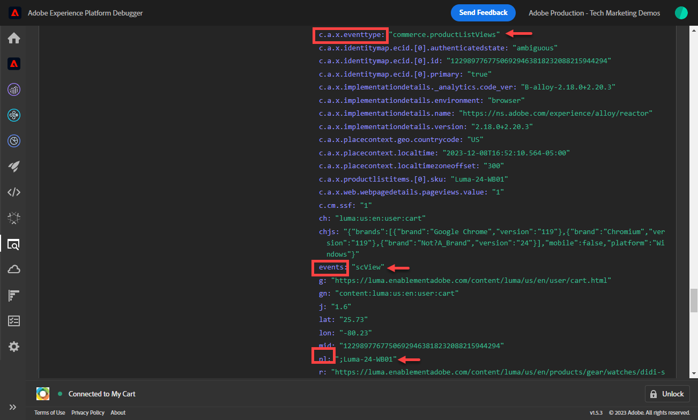

# Adobe Experience Platform Web SDK を使用したAdobe Analyticsの設定

を使用したAdobe Analyticsの設定方法を説明します [Adobe Experience Platform Web SDK](https://experienceleague.adobe.com/en/docs/platform-learn/data-collection/web-sdk/overview)を選択し、タグルールを作成して Analytics にデータを送信し、Adobe Analyticsが期待どおりにデータをキャプチャしていることを検証します。

[Adobe Analytics](https://experienceleague.adobe.com/ja/docs/analytics) は、顧客を人物として理解し、顧客インテリジェンスを使用してビジネスを導く力を与える、業界をリードするアプリケーションです。

## 学習目標

このレッスンを最後まで学習すると、以下の内容を習得できます。

* データストリームの設定によるAdobe Analyticsの有効化
* Analytics 変数に自動マッピングされる標準 XDM フィールドを把握する
* データオブジェクトへの Analytics 変数の設定
* データストリームを上書きして、別のレポートスイートにデータを送信する
* Debugger と Assurance を使用したAdobe Analytics変数の検証

## 前提条件

このレッスンを完了するには、まず次の操作を行う必要があります。

* Adobe Analyticsに詳しく、アクセスできます。

* 少なくとも 1 つのテスト/開発レポートスイート ID がある。 このチュートリアルで使用できるテスト/開発レポートスイートがない場合、 [作成してください](https://experienceleague.adobe.com/en/docs/analytics/admin/admin-tools/manage-report-suites/c-new-report-suite/t-create-a-report-suite).

* このチュートリアルの初期設定とタグの設定の節で前のレッスンを完了します。

## データストリームの設定

Platform Web SDK は、web サイトから Platform Edge Networkにデータを送信します。 次に、データストリームは、データの送信先のAdobe Analytics レポートスイートを Platform Edge Networkに伝えます。

1. に移動 [データ収集](https://experience.adobe.com/#/data-collection){target="blank"} インターフェイス
1. 左側のナビゲーションで「」を選択します **[!UICONTROL データストリーム]**
1. 以前に作成したを選択します `Luma Web SDK: Development Environment` データストリーム

   

1. を選択 **[!UICONTROL サービスを追加]**
   
1. を選択 **[!UICONTROL Adobe Analytics]** as the **[!UICONTROL サービス]**
1. を入力 **[!UICONTROL レポートスイート ID]** 開発レポートスイートの
1. を選択 **[!UICONTROL 保存]**

   

   >[!TIP]
   >
   >選択によるその他のレポートスイートの追加 **[!UICONTROL レポートスイートの追加]** は、マルチスイートタグ付けと同等です。

>[!WARNING]
>
>このチュートリアルでは、開発環境のAdobe Analytics レポートスイートのみを設定します。 独自の web サイト用にデータストリームを作成する場合、ステージング環境と実稼動環境用に追加のデータストリームおよびレポートスイートを作成する必要があります。

## Analytics 変数の設定

Web SDK 実装で Analytics 変数を設定する方法はいくつかあります。

1. XDM フィールドの Analytics 変数への自動マッピング（自動）。
1. でのフィールドの設定 `data` オブジェクト （推奨）。
1. XDM フィールドを Analytics 処理ルールの Analytics 変数にマッピングします（推奨されなくなりました）。
1. XDM スキーマで Analytics 変数に直接マッピングします（推奨されなくなりました）。

2024 年 5 月をもって、Platform Web SDK を使用してAdobe Analyticsを実装するための XDM スキーマを作成する必要がなくなりました。 この `data` オブジェクト （および `data.variable` このチュートリアルで作成したデータ要素）を使用して、すべてのカスタム Analytics 変数を設定できます。 データオブジェクトでこれらの変数を設定すると、既存の Analytics のお客様がよく知ることができ、処理ルールインターフェイスを使用するよりも効率的で、リアルタイム顧客プロファイルで不要なデータが領域を占有するのを防ぐことができます（Real-time Customer Data PlatformまたはJourney Optimizerを使用している場合に重要です）。

### 自動的にマッピングされたフィールド

多くの XDM フィールドは、Analytics 変数に自動的にマッピングされます。 最新のマッピングのリストについては、を参照してください。 [AdobeExperience Edge での Analytics 変数のマッピング](https://experienceleague.adobe.com/en/docs/experience-platform/edge/data-collection/adobe-analytics/automatically-mapped-vars).

これは、次の場合に発生します _カスタムスキーマを定義していない場合でも_. Experience Platform Web SDK は、一部のデータを自動的に収集し、XDM フィールドとして Platform Edge Networkに送信します。 例えば、Web SDK は現在のページの URL を読み取り、次のように送信します `web.webPageDetails.URL`. このフィールドはAdobe Analyticsに転送され、Adobe Analyticsのページ URL レポートに自動入力されます。

Analytics および Platform ベースのアプリケーション用に Web SDK を実装する場合は、このチュートリアルの内にあるように、カスタム XDM スキーマを作成します [スキーマの設定](configure-schemas.md) レッスン： 次の表に示すように、Analytics 変数への自動マッピングを実装した XDM フィールドの一部を次に示します。

| XDM から Analytics への自動マッピング変数 | Adobe Analytics変数 |
|-------|---------|
| `identitymap.ecid.[0].id` | mid |
| `web.webPageDetails.name` | s.pageName |
| `web.webPageDetails.server` | s.server |
| `web.webPageDetails.siteSection` | s.channel |
| `commerce.productViews.value` | prodView |
| `commerce.productListViews.value` | scView |
| `commerce.checkouts.value` | scCheckout |
| `commerce.purchases.value` | 購入 |
| `commerce.order.currencyCode` | s.currencyCode |
| `commerce.order.purchaseID` | s.purchaseID |
| `productListItems[].SKU` | s.products=;product name;;;（プライマリ – 下のメモを参照） |
| `productListItems[].name` | s.products=;product name;;;（フォールバック – 以下のメモを参照） |
| `productListItems[].quantity` | s.products=;;product quantity;; |
| `productListItems[].priceTotal` | s.product=;;；製品価格；; |

Analytics 製品文字列の個々のセクションは、の下の様々な XDM 変数を介して設定されます `productListItems` オブジェクト。

>2022 年 8 月 18 日現在、 `productListItems[].SKU` s.products 変数内の製品名へのマッピングを優先します。
>設定された値 `productListItems[].name` 次の場合にのみ、製品名にマッピングされます `productListItems[].SKU` が存在しない。 それ以外の場合は、マッピングされず、コンテキストデータで使用できます。
>に空の文字列や null を設定しないでください。 `productListItems[].SKU`. これには、s.products 変数の製品名にマッピングするという望ましくない影響があります。

### データオブジェクトに変数を設定

での変数の設定 `data` web SDK で Analytics 変数を設定する場合は、オブジェクトを使用することをお勧めします。 データオブジェクトで変数を設定すると、自動的にマッピングされた変数もすべて上書きされる可能性があります。

まず、とは何ですか `data` 対象？ どの Web SDK イベントでも、カスタムデータを含んだ 2 つのオブジェクトを送信できます。 `data` オブジェクトと `xdm` オブジェクト。 両方とも Platform Edge Networkに送信されますが、 `xdm` オブジェクトがExperience Platformデータセットに送信されます。 プロパティ： `data` オブジェクトはエッジ上でにマッピングできます。 `xdm` データ収集のためのデータ準備機能を使用するフィールドですが、それ以外のフィールドはExperience Platformに送信されません。 そのため、Experience Platform上でネイティブに構築されていない Analytics などのアプリケーションにデータを送信するのに最適な方法です。

汎用 Web SDK 呼び出しの 2 つのオブジェクトは次のとおりです。

プロパティを検索するようにAdobe Analyticsが設定されている `data.__adobe.analytics` オブジェクトを作成して、Analytics 変数に使用します。

それでは、これをやりましょう。

を使用します `data.variable` データ要素 t

<!--

### Map to Analytics variables with processing rules

All fields in the XDM schema become available to Adobe Analytics as Context Data Variables with the following prefix `a.x.`. For example, `a.x.web.webinteraction.region`

In this exercise, you map one XDM variable to a prop. Follow these same steps for any custom mapping that you must do for any `eVar`, `prop`, `event`, or variable accessible via Processing Rules.

1. Go to the Analytics interface
1. Go to [!UICONTROL Admin] > [!UICONTROL Admin Tools] > [!UICONTROL Report Suites ]
1. Select the dev/test report suite that you are using for the tutorial > [!UICONTROL Edit Settings] > [!UICONTROL General] > [!UICONTROL Processing Rules]

       

1. Create a rule to **[!UICONTROL Overwrite value of]** `[!UICONTROL Product SKU (prop1)]` to `a.x.productlistitems.0.sku`. Remember to add a note about why you are creating the rule and name your rule title. Select **[!UICONTROL Save]**

       

    >[!IMPORTANT]
    >
    >The first time you map to a processing rule, the UI does not show you the context data variables from the XDM object. To fix that select any value, Save, and come back to edit. All XDM variables should now appear.

### Map to Analytics variables using the Adobe Analytics field group

An alternative to processing rules is to map to Analytics variables in the XDM schema using the `Adobe Analytics ExperienceEvent Template` field group. This approach has gained popularity because many users find it simpler than configuring processing rules, however, by increasing the size of the XDM payload it could in turn increase the profile size in other applications like Real-Time CDP.

To add the `Adobe Analytics ExperienceEvent Template` field group to your schema:

1. Open the [Data Collection](https://experience.adobe.com/#/data-collection){target="blank"} interface
1. Select **[!UICONTROL Schemas]** from the left navigation
1. Make sure you are in the sandbox you are using from the tutorial
1. Open your `Luma Web Event Data` schema
1. In the **[!UICONTROL Field Groups]** section, select **[!UICONTROL Add]**
1. Find the `Adobe Analytics ExperienceEvent Template` field group and add it to your schema

Now, set a merchandising eVar in the product string. With the `Adobe Analytics ExperienceEvent Template` field group, you are able to map variables to merchandising eVars or events within the product string. This is also known as setting **Product Syntax Merchandising**. 

1. Go back to your tag property

1. Open the rule `ecommerce - library loaded - set product details variables - 20`

1. Open the **[!UICONTROL Set Variable]** action

1. Select to open `_experience > analytics > customDimensions > eVars > eVar1`

1. Set the **[!UICONTROL Value]** to `%product.productInfo.title%`

1. Select **[!UICONTROL Keep Changes]**

    

1. Select **[!UICONTROL Save]** to save the rule

As you just saw, basically all of the Analytics variables can be set in the `Adobe Analytics ExperienceEvent Template` field group.

>[!NOTE]
>
> Notice the `_experience` object under `productListItems` > `Item 1`. Setting any variable under this [!UICONTROL object] sets Product Syntax eVars or Events.

-->

## 別のレポートスイートへのデータの送信

訪問者が特定のページを閲覧した際に、どのAdobe Analytics レポートスイートデータを送信するかを変更することができます。 これには、データストリームとルールの両方で設定が必要です。

### レポートスイート上書きのデータストリームの設定

データストリームでAdobe Analytics レポートスイートの上書き設定を指定するには：

1. データストリームを開きます
1. を編集する **[!UICONTROL Adobe Analytics]** を開くことによる設定  メニューから選択 **[!UICONTROL 編集]**

   

1. 「」を選択します **[!UICONTROL 詳細オプション]** 開く **[!UICONTROL レポートスイートの上書き]**

1. 上書きするレポートスイートを選択します。 この場合、 `Web SDK Course Dev` および `Web SDK Course Stg`

1. を選択 **[!UICONTROL 保存]**

   

### レポートスイートの上書きに対するルールの設定

別のレポートスイートに追加のページビュー呼び出しを送信するルールを作成しましょう。 データストリームの上書き機能を使用して、ページのレポートスイートを **[!UICONTROL イベントを送信]** アクション。

1. 新しいルールを作成し、名前を付ける `homepage - library loaded - AA report suite override - 51`

1. の下のプラス記号を選択します **[!UICONTROL イベント]** 新しいトリガーを追加するには

1. 次の下 **[!UICONTROL 拡張機能]**&#x200B;を選択 **[!UICONTROL コア]**

1. 次の下 **[!UICONTROL イベントタイプ]**&#x200B;を選択 **[!UICONTROL ライブラリ読み込み]**

1. 選択して開く **[!UICONTROL 詳細オプション]**，入力 `51`. これにより、ルールが次の後に実行されます `all pages - library loaded - send event - 50` これにより、ベースライン XDM に **[!UICONTROL 変数を更新]** アクションタイプ。

   

1. 次の下 **[!UICONTROL 条件]**、を選択 **[!UICONTROL 追加]**

1. 移動 **[!UICONTROL 論理タイプ]** as **[!UICONTROL 標準]**

1. 移動 **[!UICONTROL 拡張機能]** as **[!UICONTROL コア]**

1. を選択 **[!UICONTROL 条件タイプ]** as **[!UICONTROL クエリ文字列を含まないパス]**

1. 右側で、 **[!UICONTROL 正規表現]** 無効の切り替え

1. 次の下 **[!UICONTROL パスがと等しい]** set `/content/luma/us/en.html`. Luma デモサイトの場合、ルールがホームページにのみトリガーされるようにします

1. を選択 **[!UICONTROL 変更を保持]**

   

1. 次の下 **[!UICONTROL アクション]** 選択 **[!UICONTROL 追加]**

1. として **[!UICONTROL 拡張機能]**&#x200B;を選択 **[!UICONTROL Adobe Experience Platform Web SDK]**

1. として **[!UICONTROL アクションタイプ]**&#x200B;を選択 **[!UICONTROL イベントを送信]**

1. として **[!UICONTROL タイプ]**&#x200B;を選択 `web.webpagedetails.pageViews`

1. として **[!UICONTROL XDM データ]**&#x200B;を選択し、 `xdm.variable.content` で作成したデータ要素 [データ要素の作成](create-data-elements.md) レッスン

   

1. にスクロール ダウンします。 **[!UICONTROL データストリーム設定の上書き]** セクション

1. を残す **[!UICONTROL 開発]** タブが選択されました。

   >[!TIP]
   >
   >    このタブは、上書きされるタグ環境を決定します。 この演習では開発環境のみを指定しますが、実稼動環境にデプロイする場合は、必ず **[!UICONTROL 実稼動]** 環境。

1. 「」を選択します **[!UICONTROL データストリーム]**、この場合は `Luma Web SDK: Development Environment`

1. 次の下 **[!UICONTROL レポートスイート]**&#x200B;で、上書きするために使用するレポートサイトを選択します。 この場合、 `tmd-websdk-course-stg`.

1. を選択 **[!UICONTROL 変更を保持]**

1. および **[!UICONTROL 保存]** ルール

   

## 開発環境の構築

新しいデータ要素とルールをに追加します `Luma Web SDK Tutorial` ライブラリをタグ付けし、開発環境を再構築します。

おめでとうございます。次の手順では、Experience Platform Web SDK を使用してAdobe Analytics実装を検証します。

## Debugger を使用したAdobe Analyticsの検証

Experience Platformデバッガーのエッジトレース機能を使用して、Adobe Analyticsが ECID、ページビュー、商品文字列、e コマースイベントを取り込んでいることを検証する方法について説明します。

が含まれる [デバッガー](validate-with-debugger.md) 教訓として、Platform デバッガーとブラウザー開発者コンソールを使用して、クライアントサイドの XDM リクエストを検査する方法を学びました。これは、をデバッグする方法と似ています。 `AppMeasurement.js` Analytics の実装。 また、Adobeアプリケーションに送信される Platform Edge Networkサーバーサイドリクエストの検証と、Assurance を使用して完全に処理されたペイロードを表示する方法についても学びました。

Experience Platform Web SDK を使用して Analytics がデータを適切に取得していることを検証するには、次の 2 つの手順を実行する必要があります。

1. Experience Platformデバッガーのエッジトレース機能を使用して、Platform Edge Network上の XDM オブジェクトによってデータが処理される方法を検証します
1. Adobe Experience Platform Assurance を使用して Analytics でデータが完全に処理される方法を検証する

### Experience CloudID の検証

1. に移動します [Luma デモサイト](https://luma.enablementadobe.com/content/luma/us/en.html){target="_blank"}
1. 右上の「ログイン」ボタンを選択し、資格情報 u: test@adobe.com p: test を使用して認証します
1. Experience Platformデバッガーを開き、 [サイトのタグプロパティを独自の開発プロパティに切り替える](validate-with-debugger.md#use-the-experience-platform-debugger-to-map-to-your-tags-property)

1. Edge Trace を有効にするには、Experience Platformデバッガーの左側のナビゲーションで「」を選択します **[!UICONTROL ログ]**&#x200B;を選択してから、 **[!UICONTROL Edge]** tab キーを押して、 **[!UICONTROL 接続]**

   

1. 今のところ空になります

   

1. Luma ページを更新し、Experience Platformデバッガーをもう一度確認します。データが入ってくることが確認できます。 で始まる行 **[!UICONTROL Analytics 自動マッピング]** はAdobe Analytics ビーコンです
1. を選択して、両方の `[!UICONTROL mappedQueryParams]` ドロップダウンと 2 つ目のドロップダウンで Analytics 変数を表示

   

   >[!TIP]
   >
   >2 つ目のドロップダウンは、データの送信先の Analytics レポートスイート ID に対応します。 スクリーンショットではなく、独自のレポートスイートと一致する必要があります。

1. 下にスクロールして見つける `[!UICONTROL c.a.x.identitymap.ecid.[0].id]`. ECID をキャプチャするコンテキストデータ変数です
1. Analytics が表示されるまで下にスクロールします `[!UICONTROL mid]` 変数。 両方の ID がデバイスのExperience Cloud ID と一致します。
1. Luma サイトで、

   

   >[!NOTE]
   >
   >ログインしているため、認証済み ID を検証します `112ca06ed53d3db37e4cea49cc45b71e` ユーザー用 **`test@adobe.com`** も同様にキャプチャされます。 `[!UICONTROL c.a.x.identitymap.lumacrmid.[0].id]`

### レポートスイート上書き検証

上記で、のデータストリーム上書きを設定しました。 [Luma ホームページ](https://luma.enablementadobe.com/content/luma/us/en.html).  この設定を検証するには

1. 次を含む列を検索 **[!UICONTROL 上書き適用後のデータストリーム設定]**. ここには、プライマリレポートスイートと、レポートスイートの上書き用に設定された追加レポートスイートがあります。

   

1. で始まる行まで下にスクロールします。 **[!UICONTROL Analytics 自動マッピング]**  を行い、 `[!UICONTROL reportSuiteIds]` 優先設定で指定したレポートスイートを表示します

   

### コンテンツページビューの検証

のような製品ページに移動します [Didi Sport Watch 製品ページ](https://luma.enablementadobe.com/content/luma/us/en/products/gear/watches/didi-sport-watch.html#24-WG02).  コンテンツページビューが Analytics によってキャプチャされていることを検証します。

1. を検索 `[!UICONTROL c.a.x.web.webpagedetails.pageviews.value]=1`.
1. 下にスクロールして、 `[!UICONTROL gn]` 変数。 次を行うための Analytics 動的構文です `[!UICONTROL s.pageName]` 変数。 ページ名をデータレイヤーからキャプチャします。

   

### 製品文字列および e コマースイベントの検証

ユーザーは既に製品ページを開いているので、この演習では引き続き同じ Edge Trace を使用して、製品データが Analytics によって取得されることを検証します。 製品文字列イベントと e コマースイベントの両方が、XDM 変数として Analytics に自動的にマッピングされます。 適切にマッピングしている限り `productListItem` XDM 変数 while [Adobe Analytics用の XDM スキーマの設定](setup-analytics.md#configure-an-xdm-schema-for-adobe-analytics)は、PlatformEdge Networkによって、データが適切な Analytics 変数へのマッピングが行われます。

**まず、を検証します `Product String` 設定済み**

1. を検索 `[!UICONTROL c.a.x.productlistitems.][0].[!UICONTROL sku]`. 変数は、にマッピングしたデータ要素の値を取得します `productListItems.item1.sku` このレッスンの前半
1. また、次も探します `[!UICONTROL c.a.x.productlistitems.][0].[!UICONTROL _experience.analytics.customdimensions.evars.evar1]`. 変数は、マッピング先のデータ要素の値を取得します `productListItems.item1._experience.analytics.customdimensions.evars.evar1`
1. 下にスクロールして、 `[!UICONTROL pl]` 変数。 これは、Analytics 製品文字列変数の動的構文です
1. データレイヤーの製品名は、の両方にマッピングされます。 `[!UICONTROL c.a.x.productlistitems.][0].[!UICONTROL sku]` および `[!UICONTROL product]` 製品文字列のパラメーター。  さらに、データレイヤーの製品タイトルが製品文字列のマーチャンダイジング evar1 にマッピングされます。

   

   エッジトレースは、 `commerce` イベントの動作が `productList` ディメンション。 製品名のマッピング先とは異なり、コンテキストデータ変数はマッピングされません `[!UICONTROL c.a.x.productlistitem.[0].name]` 上。 代わりに、エッジトレースには、Analytics での最終的なイベント自動マッピングが表示されます `event` 変数。 適切な XDM にマッピングする限り、Platform Edge Networkはそれに応じてマッピングします `commerce` 変数 while [Adobe Analytics用のスキーマの設定](setup-analytics.md#configure-an-xdm-schema-for-adobe-analytics)この場合は、 `commerce.productViews.value=1`.

1. Experience Platform Debugger ウィンドウに戻り、下にスクロールしてまで移動します。 `[!UICONTROL events]` 変数。に設定されます。 `[!UICONTROL prodView]`

1. また、次のことにも注意してください `[!UICONTROL c.a.x.eventType]` はに設定されています。 `commerce.productViews` 製品ページを開いているため。

   >[!TIP]
   >
   > この `ecommerce - pdp library loaded - AA (order 20)` ルールがの値を上書きしています `eventType` によって設定 `all pages global content variables - library loaded - AA (order 1)` シーケンスの後半でトリガーに設定されるルール

   

**残りの e コマースイベントと製品文字列が Analytics に設定されていることを検証します**

1. 追加 [ディディスポーツウォッチ](https://luma.enablementadobe.com/content/luma/us/en/products/gear/watches/didi-sport-watch.html#24-WG02) カートに
1. に移動します [買い物かごページ](https://luma.enablementadobe.com/content/luma/us/en/user/cart.html), Edge Trace をチェックします

   * `eventType` をに設定 `commerce.productListViews`
   * `[!UICONTROL events: "scView"]`、および
   * 製品文字列が設定されます

   

1. チェックアウトに進み、Edge Trace でを確認します

   * `eventType` をに設定 `commerce.checkouts`
   * `[!UICONTROL events: "scCheckout"]`、および
   * 製品文字列が設定されます

   

1. を記入します。 **名前（名）** および **名前（姓）** 配送フォームのフィールドと選択 **続行**. 次のページで、 **注文する**
1. 確認ページで、「」の Edge Trace を確認します

   * `eventType` をに設定 `commerce.purchases`
   * 購入イベントを設定中 `[!UICONTROL events: "purchase"]`
   * 設定されている通貨コード変数 `[!UICONTROL cc: "USD"]`
   * で設定されている購入 ID `[!UICONTROL pi]`
   * 製品文字列 `[!UICONTROL pl]` 製品名、数量および価格の設定

   

## Assurance を使用したAdobe Analyticsの検証

Adobe Experience Platform Assurance は、web サイトやモバイルアプリケーションでデータを収集したりエクスペリエンスを提供したりする方法を検査、配達確認、シミュレートおよび検証するのに役立ちます。

前の演習では、Adobe AnalyticsがExperience Platformデバッガーのエッジトレース機能を使用して、ECID、ページビュー、製品文字列および e コマースイベントをキャプチャしていることを検証しました。  次に、Edge Trace で同じデータにアクセスするための代替インターフェイスであるAdobe Experience Platform Assurance を使用して、これらの同じイベントを検証します。

で学んだように [Assurance](validate-with-assurance.md) 「Assurance セッションを開始するには、いくつかの方法があります。」 前の演習から開始された Edge Trace セッションで既にAdobe Experience Platform Debuggerを開いているので、Debugger を使用して Assurance にアクセスすることをお勧めします。

内 **[!UICONTROL &quot;Web SDK チュートリアル 3&quot;]** Assurance Session enter **[!UICONTROL &quot;hitdebugger&quot;]** をイベント検索バーに移動し、結果をAdobe Analyticsの後処理済みデータにフィルタリングします。

### Experience CloudID の検証

Adobe Analyticsが ECID を取り込んでいることを検証するには、ビーコンを選択し、ペイロードを開きます。  このビーコンの「ベンダー」は、 **[!UICONTROL com.adobe.analytics.hitdebugger]**

次に、以下までスクロールします **[!UICONTROL mcvisId]** ECID が正しくキャプチャされていることを検証するには

### コンテンツページビューの検証

同じビーコンを使用して、コンテンツページビューが正しいAdobe Analytics変数にマッピングされていることを検証します。
Scroll down to **[!UICONTROL pageName]** を検証します `Page Name` は正しくキャプチャされました

### 製品文字列および e コマースイベントの検証

上記のExperience Platformデバッガーで検証する場合と同じ検証ユースケースに従い、引き続き同じビーコンを使用して検証を行います `Ecommerce Events` および `Product String`.

1. 次のようなペイロードを探します **[!UICONTROL イベント]** contain `prodView`
   
1. Scroll down to **[!UICONTROL product-string]** を検証します `Product String`.
   * 「」に注目してください `Product SKU` および `Merchandizing eVar1`.
1. さらに下にスクロールして、以下を検証します `prop1`前の節で処理ルールを使用して設定したには、が含まれています `Product SKU`\
   

買い物かご、チェックアウト、購入のイベントを確認して、実装の検証を続行します。

1. 次のようなペイロードを探します **[!UICONTROL イベント]** contain `scView` 製品文字列を検証します。
   
1. 次のようなペイロードを探します **[!UICONTROL イベント]** contain `scCheckout` 製品文字列を検証します。
   
1. 次のようなペイロードを探します **[!UICONTROL イベント]** contain `purchase`
   
1. の検証時 `purchase` イベント名は、 `Product String` 次を含める必要があります `Product SKU`, `Product Quantity` 、および `Product Total Price`.
1. さらに、以下の場合： `purchase` を検証します `purchase-id` および/または `purchaseId` 設定済み

おめでとうございます。お前がやった！ これでレッスンは終了です。独自の web サイトに Platform Web SDK を使用してAdobe Analyticsを実装する準備が整いました。

[次へ： ](setup-audience-manager.md)

>[!NOTE]
>
>Adobe Experience Platform Web SDK の学習に時間を費やしていただき、ありがとうございます。 ご質問がある場合、一般的なフィードバックを共有したい場合、または将来のコンテンツに関するご提案がある場合は、このページでお知らせください [Experience League コミュニティ ディスカッションの投稿](https://experienceleaguecommunities.adobe.com/t5/adobe-experience-platform-data/tutorial-discussion-implement-adobe-experience-cloud-with-web/td-p/444996)
