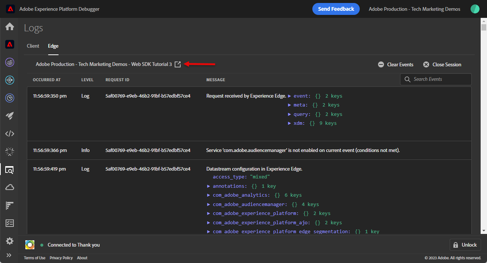

# Adobe Experience Platform Web SDK を使用したAdobe Analyticsの設定

を使用したAdobe Analyticsの設定方法を説明します [Adobe Experience Platform Web SDK](https://experienceleague.adobe.com/en/docs/platform-learn/data-collection/web-sdk/overview)を選択し、タグルールを作成して Analytics にデータを送信し、Adobe Analyticsが期待どおりにデータをキャプチャしていることを検証します。

[Adobe Analytics](https://experienceleague.adobe.com/ja/docs/analytics) は、顧客を人物として理解し、顧客インテリジェンスを使用してビジネスを導く力を与える、業界をリードするアプリケーションです。

## 学習目標

このレッスンを最後まで学習すると、以下の内容を習得できます。

* データストリームの設定によるAdobe Analyticsの有効化
* Analytics 変数に自動マッピングされる標準 XDM フィールドを把握する
* 「Adobe Analytics ExperienceEvent テンプレート」フィールドグループまたは処理ルールを使用して、カスタム Analytics 変数を設定します
* データストリームを上書きして、別のレポートスイートにデータを送信する
* Debugger と Assurance を使用したAdobe Analytics変数の検証

## 前提条件

このレッスンを完了するには、まず次の操作を行う必要があります。

* Adobe Analyticsに詳しく、アクセスできます。

* 少なくとも 1 つのテスト/開発レポートスイート ID がある。 このチュートリアルで使用できるテスト/開発レポートスイートがない場合、 [作成してください](https://experienceleague.adobe.com/en/docs/analytics/admin/admin-tools/manage-report-suites/c-new-report-suite/t-create-a-report-suite).

* このチュートリアルの初期設定とタグの設定の節で前のレッスンを完了します。

## データストリームの設定

Platform Web SDK は、web サイトから Platform Edge Networkにデータを送信します。 次に、データストリームは、データの送信先のAdobe Analytics レポートスイートを Platform Edge Networkに伝えます。

1. に移動 [データ収集](https://experience.adobe.com/#/data-collection){target="blank"} インターフェイス
1. 左側のナビゲーションで「」を選択します **[!UICONTROL データストリーム]**
1. 以前に作成したを選択します `Luma Web SDK: Development Environment` データストリーム

   

1. 「**[!UICONTROL サービスを追加]**」を選択します。
   
1. を選択 **[!UICONTROL Adobe Analytics]** as the **[!UICONTROL サービス]**
1. を入力 **[!UICONTROL レポートスイート ID]** 開発レポートスイートの
1. 「**[!UICONTROL 保存]**」を選択します

   

   >[!TIP]
   >
   >選択によるその他のレポートスイートの追加 **[!UICONTROL レポートスイートの追加]** は、マルチスイートタグ付けと同等です。

>[!WARNING]
>
>このチュートリアルでは、開発環境のAdobe Analytics レポートスイートのみを設定します。 独自の web サイト用にデータストリームを作成する場合、ステージング環境と実稼動環境用に追加のデータストリームおよびレポートスイートを作成する必要があります。

## XDM スキーマと Analytics 変数

おめでとうございます。でAdobe Analyticsと互換性のあるスキーマを既に設定しています [スキーマの設定](configure-schemas.md) レッスン！

しかし、あなたはどのように私はすべての prop、evar やイベントを設定するか、疑問に思うかもしれません？

同時に使用できる方法はいくつかあります。

1. 標準 XDM フィールドを設定すると、一部のフィールドが Analytics 変数に自動的にマッピングされます。
1. 追加の XDM フィールドを Analytics 処理ルールの Analytics 変数にマッピングします。
1. XDM スキーマの Analytics 変数に直接マッピングします。

<!-- Implementing Platform Web SDK should be as product-agnostic as possible. For Adobe Analytics, mapping eVars, props, and events doesn't occur during schema creation, nor during the tag rules configuration as it has been done traditionally. Instead, every XDM key-value pair becomes a Context Data Variable that maps to an Analytics variable in one of two ways: 

1. Automatically mapped variables using reserved XDM fields
1. Manually mapped variables using Analytics Processing Rules

To understand what XDM variables are auto-mapped to Adobe Analytics, please see [Variables automatically mapped in Analytics](https://experienceleague.adobe.com/en/docs/experience-platform/edge/data-collection/adobe-analytics/automatically-mapped-vars). Any variable that is not auto-mapped must be manually mapped. 

 1. **Product-agnostic XDM**: maintain a semantic key-value pair XDM schema and use [Adobe Analytics Processing Rules](https://experienceleague.adobe.com/en/docs/analytics/admin/admin-tools/manage-report-suites/edit-report-suite/report-suite-general/c-processing-rules/processing-rules) to map the XDM fields to eVars, props, and so on. By a semantic XDM schema, we mean that the field names themselves have meaning. For example, the field name `web.webPageDetails.pageName` has more meaning than say `prop1` or `evar3`.

 1. **Analytics-specific XDM**: Use a purpose-built Adobe Analytics field group in the XDM schema called `Adobe Analytics ExperienceEvent Template`
 
The approach Adobe has seen customers prefer is the **Analytics-specific XDM**, because it skips the mapping step in the Adobe Analytics Processing Rules interface. The steps in this lesson use the **Analytics-specific XDM** approach.
-->

### 自動的にマッピングされたフィールド

多くの XDM フィールドは、Analytics 変数に自動的にマッピングされます。

で作成されたスキーマ [スキーマの設定](configure-schemas.md) このレッスンには、次の表に示すように、Analytics 変数に自動マッピングされるいくつかの項目が含まれます。

| XDM から Analytics への自動マッピング変数 | Adobe Analytics変数 |
|-------|---------|
| `identitymap.ecid.[0].id` | mid |
| `web.webPageDetails.name` | s.pageName |
| `web.webPageDetails.server` | s.server |
| `web.webPageDetails.siteSection` | s.channel |
| `commerce.productViews.value` | prodView |
| `commerce.productListViews.value` | scView |
| `commerce.checkouts.value` | scCheckout |
| `commerce.purchases.value` | 購入 |
| `commerce.order.currencyCode` | s.currencyCode |
| `commerce.order.purchaseID` | s.purchaseID |
| `productListItems[].SKU` | s.products=;product name;;;（プライマリ – 下のメモを参照） |
| `productListItems[].name` | s.products=;product name;;;（フォールバック – 以下のメモを参照） |
| `productListItems[].quantity` | s.products=;;product quantity;; |
| `productListItems[].priceTotal` | s.product=;;；製品価格；; |

Analytics 製品文字列の個々のセクションは、の下の様々な XDM 変数を介して設定されます `productListItems` オブジェクト。
>2022 年 8 月 18 日現在、 `productListItems[].SKU` s.products 変数内の製品名へのマッピングを優先します。
>設定された値 `productListItems[].name` 次の場合にのみ、製品名にマッピングされます `productListItems[].SKU` が存在しない。 それ以外の場合は、マッピングされず、コンテキストデータで使用できます。
>に空の文字列や null を設定しないでください。 `productListItems[].SKU`. これには、s.products 変数の製品名にマッピングするという望ましくない影響があります。

最新のマッピングのリストについては、を参照してください。 [AdobeExperience Edge での Analytics 変数のマッピング](https://experienceleague.adobe.com/en/docs/experience-platform/edge/data-collection/adobe-analytics/automatically-mapped-vars).

### 処理ルールを使用した Analytics 変数へのマッピング

XDM スキーマのすべてのフィールドは、次のプレフィックスを持つコンテキストデータ変数としてAdobe Analyticsで使用できるようになります `a.x.`. 例：`a.x.web.webinteraction.region`

この演習では、1 つの XDM 変数を prop にマッピングします。 カスタムマッピングに対して実行する必要がある同じ手順に従います `eVar`, `prop`, `event`、または処理ルールからアクセスできる変数。

1. Analytics インターフェイスに移動します
1. に移動 [!UICONTROL Admin] > [!UICONTROL 管理ツール] > [!UICONTROL レポートスイート]
1. チュートリアルで使用する開発/テストレポートスイートを選択します。 [!UICONTROL 設定を編集] > [!UICONTROL 一般] > [!UICONTROL 処理ルール]

   

1. ルールを作成して **[!UICONTROL 値を上書き]** `[!UICONTROL Product SKU (prop1)]` 対象： `a.x.productlistitems.0.sku`. ルールを作成する理由についてのメモを忘れずに追加し、ルールのタイトルに名前を付けてください。 「**[!UICONTROL 保存]**」を選択します

   

   >[!IMPORTANT]
   >
   >処理ルールに初めてマッピングする場合、UI には XDM オブジェクトからのコンテキストデータ変数は表示されません。 この問題を修正するには、任意の値を選択し、保存してから、編集に戻ります。 すべての XDM 変数が表示されます。

### Adobe Analytics フィールドグループを使用した Analytics 変数へのマッピング

処理ルールの代わりに、を使用して XDM スキーマの Analytics 変数にマッピングすることもできます `Adobe Analytics ExperienceEvent Template` フィールドグループ。 このアプローチは、多くのユーザーが処理ルールを設定するよりも簡単だと思うようになったため、人気が高まりました。ただし、XDM ペイロードのサイズを増やすと、Real-Time CDPなどの他のアプリケーションでプロファイルサイズを増やすことができます。

を追加します `Adobe Analytics ExperienceEvent Template` フィールドグループをスキーマに追加します。

1. を開きます [データ収集](https://experience.adobe.com/#/data-collection){target="blank"} インターフェイス
1. を選択 **[!UICONTROL スキーマ]** 左側のナビゲーションから
1. チュートリアルで使用しているサンドボックスに属していることを確認します
1. を開きます `Luma Web Event Data` スキーマ
1. が含まれる **[!UICONTROL フィールドグループ]** セクションで選択 **[!UICONTROL 追加]**
1. の検索 `Adobe Analytics ExperienceEvent Template` フィールドグループを作成してスキーマに追加します

次に、製品文字列にマーチャンダイジングeVarを設定します。 （を使用） `Adobe Analytics ExperienceEvent Template` フィールドグループを使用すると、製品文字列内のマーチャンダイジング eVar またはイベントに変数をマッピングできます。 これは、設定とも呼ばれます **製品構文マーチャンダイジング**.

1. タグプロパティに戻る

1. ルールを開きます `ecommerce - library loaded - set product details variables - 20`

1. を開きます **[!UICONTROL 変数を設定]** アクション

1. 選択して開く `_experience > analytics > customDimensions > eVars > eVar1`

1. を **[!UICONTROL 値]** 対象： `%product.productInfo.title%`

1. を選択 **[!UICONTROL 変更を保持]**

   

1. を選択 **[!UICONTROL 保存]** ルールを保存するには

ご覧のように、基本的にすべての Analytics 変数は `Adobe Analytics ExperienceEvent Template` フィールドグループ。

>[!NOTE]
>
> に注意してください。 `_experience` 下のオブジェクト `productListItems` > `Item 1`. この下の任意の変数の設定 [!UICONTROL オブジェクト] product 構文の eVar またはイベントを設定します。

## 別のレポートスイートへのデータの送信

訪問者が特定のページを閲覧した際に、どのAdobe Analytics レポートスイートデータを送信するかを変更することができます。 これには、データストリームとルールの両方で設定が必要です。

### レポートスイート上書きのデータストリームの設定

データストリームでAdobe Analytics レポートスイートの上書き設定を指定するには：

1. データストリームを開きます
1. を編集する **[!UICONTROL Adobe Analytics]** を開くことによる設定  メニューから選択 **[!UICONTROL 編集]**

   

1. 「」を選択します **[!UICONTROL 詳細オプション]** 開く **[!UICONTROL レポートスイートの上書き]**

1. 上書きするレポートスイートを選択します。 この場合、 `Web SDK Course Dev` および `Web SDK Course Stg`

1. 「**[!UICONTROL 保存]**」を選択します

   

### レポートスイートの上書きに対するルールの設定

別のレポートスイートに追加のページビュー呼び出しを送信するルールを作成しましょう。 データストリームの上書き機能を使用して、ページのレポートスイートを **[!UICONTROL イベントを送信]** アクション。

1. 新しいルールを作成し、名前を付ける `homepage - library loaded - AA report suite override - 51`

1. の下のプラス記号を選択します **[!UICONTROL イベント]** 新しいトリガーを追加するには

1. 次の下 **[!UICONTROL 拡張機能]**&#x200B;を選択 **[!UICONTROL コア]**

1. 次の下 **[!UICONTROL イベントタイプ]**&#x200B;を選択 **[!UICONTROL ライブラリ読み込み]**

1. 選択して開く **[!UICONTROL 詳細オプション]**，入力 `51`. これにより、ルールが次の後に実行されます `all pages - library loaded - send event - 50` これにより、ベースライン XDM に **[!UICONTROL 変数を更新]** アクションタイプ。

   

1. 次の下 **[!UICONTROL 条件]**、を選択 **[!UICONTROL 追加]**

1. 移動 **[!UICONTROL 論理タイプ]** as **[!UICONTROL 標準]**

1. 移動 **[!UICONTROL 拡張機能]** as **[!UICONTROL コア]**

1. を選択 **[!UICONTROL 条件タイプ]** as **[!UICONTROL クエリ文字列を含まないパス]**

1. 右側で、 **[!UICONTROL 正規表現]** 無効の切り替え

1. 次の下 **[!UICONTROL パスがと等しい]** set `/content/luma/us/en.html`. Luma デモサイトの場合、ルールがホームページにのみトリガーされるようにします

1. を選択 **[!UICONTROL 変更を保持]**

   

1. 次の下 **[!UICONTROL アクション]** 選択 **[!UICONTROL 追加]**

1. として **[!UICONTROL 拡張機能]**&#x200B;を選択 **[!UICONTROL Adobe Experience Platform Web SDK]**

1. として **[!UICONTROL アクションタイプ]**&#x200B;を選択 **[!UICONTROL イベントを送信]**

1. として **[!UICONTROL タイプ]**&#x200B;を選択 `web.webpagedetails.pageViews`

1. として **[!UICONTROL XDM データ]**&#x200B;を選択し、 `xdm.variable.content` で作成したデータ要素 [データ要素の作成](create-data-elements.md) レッスン

   

1. にスクロール ダウンします。 **[!UICONTROL データストリーム設定の上書き]** セクション

1. を残す **[!UICONTROL 開発]** タブが選択されました。

   >[!TIP]
   >
   >    このタブは、上書きされるタグ環境を決定します。 この演習では開発環境のみを指定しますが、実稼動環境にデプロイする場合は、必ず **[!UICONTROL 実稼動]** 環境。

1. 「」を選択します **[!UICONTROL データストリーム]**、この場合は `Luma Web SDK: Development Environment`

1. 次の下 **[!UICONTROL レポートスイート]**&#x200B;で、上書きするために使用するレポートサイトを選択します。 この場合は、`tmd-websdk-course-stg`です。

1. を選択 **[!UICONTROL 変更を保持]**

1. および **[!UICONTROL 保存]** ルール

   

## 開発環境の構築

新しいデータ要素とルールをに追加します `Luma Web SDK Tutorial` ライブラリをタグ付けし、開発環境を再構築します。

おめでとうございます。次の手順では、Experience Platform Web SDK を使用してAdobe Analytics実装を検証します。

## Debugger を使用したAdobe Analyticsの検証

Experience Platformデバッガーのエッジトレース機能を使用して、Adobe Analyticsが ECID、ページビュー、商品文字列、e コマースイベントを取り込んでいることを検証する方法について説明します。

が含まれる [デバッガー](validate-with-debugger.md) 教訓として、Platform デバッガーとブラウザー開発者コンソールを使用して、クライアントサイドの XDM リクエストを検査する方法を学びました。これは、をデバッグする方法と似ています。 `AppMeasurement.js` Analytics の実装。 また、Adobeアプリケーションに送信される Platform Edge Networkサーバーサイドリクエストの検証と、Assurance を使用して完全に処理されたペイロードを表示する方法についても学びました。

Experience Platform Web SDK を使用して Analytics がデータを適切に取得していることを検証するには、次の 2 つの手順を実行する必要があります。

1. Experience Platformデバッガーのエッジトレース機能を使用して、Platform Edge Network上の XDM オブジェクトによってデータが処理される方法を検証します
1. Adobe Experience Platform Assurance を使用して Analytics でデータが完全に処理される方法を検証する

### Experience CloudID の検証

1. に移動します [Luma デモサイト](https://luma.enablementadobe.com/content/luma/us/en.html){target="_blank"}
1. 右上の「ログイン」ボタンを選択し、資格情報 u: test@adobe.com p: test を使用して認証します
1. Experience Platformデバッガーを開き、 [サイトのタグプロパティを独自の開発プロパティに切り替える](validate-with-debugger.md#use-the-experience-platform-debugger-to-map-to-your-tags-property)

1. Edge Trace を有効にするには、Experience Platformデバッガーの左側のナビゲーションで「」を選択します **[!UICONTROL ログ]**&#x200B;を選択してから、 **[!UICONTROL Edge]** tab キーを押して、 **[!UICONTROL 接続]**

   

1. 今のところ空になります

   

1. Luma ページを更新し、Experience Platformデバッガーをもう一度確認します。データが入ってくることが確認できます。 で始まる行 **[!UICONTROL Analytics 自動マッピング]** はAdobe Analytics ビーコンです
1. を選択して、両方の `[!UICONTROL mappedQueryParams]` ドロップダウンと 2 つ目のドロップダウンで Analytics 変数を表示

   

   >[!TIP]
   >
   >2 つ目のドロップダウンは、データの送信先の Analytics レポートスイート ID に対応します。 スクリーンショットではなく、独自のレポートスイートと一致する必要があります。

1. 下にスクロールして見つける `[!UICONTROL c.a.x.identitymap.ecid.[0].id]`. ECID をキャプチャするコンテキストデータ変数です
1. Analytics が表示されるまで下にスクロールします `[!UICONTROL mid]` 変数。 両方の ID がデバイスのExperience Cloud ID と一致します。
1. Luma サイトで、

   

   >[!NOTE]
   >
   >ログインしているため、認証済み ID を検証します `112ca06ed53d3db37e4cea49cc45b71e` ユーザー用 **`test@adobe.com`** も同様にキャプチャされます。 `[!UICONTROL c.a.x.identitymap.lumacrmid.[0].id]`

### レポートスイート上書き検証

上記で、のデータストリーム上書きを設定しました。 [Luma ホームページ](https://luma.enablementadobe.com/content/luma/us/en.html).  この設定を検証するには

1. 次を含む列を検索 **[!UICONTROL 上書き適用後のデータストリーム設定]**. ここには、プライマリレポートスイートと、レポートスイートの上書き用に設定された追加レポートスイートがあります。

   

1. で始まる行まで下にスクロールします。 **[!UICONTROL Analytics 自動マッピング]**  を行い、 `[!UICONTROL reportSuiteIds]` 優先設定で指定したレポートスイートを表示します

   

### コンテンツページビューの検証

のような製品ページに移動します [Didi Sport Watch 製品ページ](https://luma.enablementadobe.com/content/luma/us/en/products/gear/watches/didi-sport-watch.html#24-WG02).  コンテンツページビューが Analytics によってキャプチャされていることを検証します。

1. を検索 `[!UICONTROL c.a.x.web.webpagedetails.pageviews.value]=1`.
1. 下にスクロールして、 `[!UICONTROL gn]` 変数。 次を行うための Analytics 動的構文です `[!UICONTROL s.pageName]` 変数。 ページ名をデータレイヤーからキャプチャします。

   

### 製品文字列および e コマースイベントの検証

ユーザーは既に製品ページを開いているので、この演習では引き続き同じ Edge Trace を使用して、製品データが Analytics によって取得されることを検証します。 製品文字列イベントと e コマースイベントの両方が、XDM 変数として Analytics に自動的にマッピングされます。 適切にマッピングしている限り `productListItem` XDM 変数 while [Adobe Analytics用の XDM スキーマの設定](setup-analytics.md#configure-an-xdm-schema-for-adobe-analytics)は、PlatformEdge Networkによって、データが適切な Analytics 変数へのマッピングが行われます。

**まず、を検証します `Product String` 設定済み**

1. を検索 `[!UICONTROL c.a.x.productlistitems.][0].[!UICONTROL sku]`. 変数は、にマッピングしたデータ要素の値を取得します `productListItems.item1.sku` このレッスンの前半
1. また、次も探します `[!UICONTROL c.a.x.productlistitems.][0].[!UICONTROL _experience.analytics.customdimensions.evars.evar1]`. 変数は、マッピング先のデータ要素の値を取得します `productListItems.item1._experience.analytics.customdimensions.evars.evar1`
1. 下にスクロールして、 `[!UICONTROL pl]` 変数。 これは、Analytics 製品文字列変数の動的構文です
1. データレイヤーの製品名は、の両方にマッピングされます。 `[!UICONTROL c.a.x.productlistitems.][0].[!UICONTROL sku]` および `[!UICONTROL product]` 製品文字列のパラメーター。  さらに、データレイヤーの製品タイトルが製品文字列のマーチャンダイジング evar1 にマッピングされます。

   

   エッジトレースは、 `commerce` イベントの動作が `productList` ディメンション。 製品名のマッピング先とは異なり、コンテキストデータ変数はマッピングされません `[!UICONTROL c.a.x.productlistitem.[0].name]` 上。 代わりに、エッジトレースには、Analytics での最終的なイベント自動マッピングが表示されます `event` 変数。 適切な XDM にマッピングする限り、Platform Edge Networkはそれに応じてマッピングします `commerce` 変数 while [Adobe Analytics用のスキーマの設定](setup-analytics.md#configure-an-xdm-schema-for-adobe-analytics)この場合は、 `commerce.productViews.value=1`.

1. Experience Platform Debugger ウィンドウに戻り、下にスクロールしてまで移動します。 `[!UICONTROL events]` 変数。に設定されます。 `[!UICONTROL prodView]`

1. また、次のことにも注意してください `[!UICONTROL c.a.x.eventType]` はに設定されています。 `commerce.productViews` 製品ページを開いているため。

   >[!TIP]
   >
   > この `ecommerce - pdp library loaded - AA (order 20)` ルールがの値を上書きしています `eventType` によって設定 `all pages global content variables - library loaded - AA (order 1)` シーケンスの後半でトリガーに設定されるルール

   

**残りの e コマースイベントと製品文字列が Analytics に設定されていることを検証します**

1. 追加 [ディディスポーツウォッチ](https://luma.enablementadobe.com/content/luma/us/en/products/gear/watches/didi-sport-watch.html#24-WG02) カートに
1. に移動します [買い物かごページ](https://luma.enablementadobe.com/content/luma/us/en/user/cart.html), Edge Trace をチェックします

   * `eventType` を `commerce.productListViews` に設定
   * `[!UICONTROL events: "scView"]`、および
   * 製品文字列が設定されます

   

1. チェックアウトに進み、Edge Trace でを確認します

   * `eventType` を `commerce.checkouts` に設定
   * `[!UICONTROL events: "scCheckout"]`、および
   * 製品文字列が設定されます

   

1. を記入します。 **名前（名）** および **名前（姓）** 配送フォームのフィールドと選択 **続行**. 次のページで、 **注文する**
1. 確認ページで、「」の Edge Trace を確認します

   * `eventType` を `commerce.purchases` に設定
   * 購入イベントを設定中 `[!UICONTROL events: "purchase"]`
   * 設定されている通貨コード変数 `[!UICONTROL cc: "USD"]`
   * で設定されている購入 ID `[!UICONTROL pi]`
   * 製品文字列 `[!UICONTROL pl]` 製品名、数量および価格の設定

   

## Assurance を使用したAdobe Analyticsの検証

Adobe Experience Platform Assurance は、web サイトやモバイルアプリケーションでデータを収集したりエクスペリエンスを提供したりする方法を検査、配達確認、シミュレートおよび検証するのに役立ちます。

前の演習では、Adobe AnalyticsがExperience Platformデバッガーのエッジトレース機能を使用して、ECID、ページビュー、製品文字列および e コマースイベントをキャプチャしていることを検証しました。  次に、Edge Trace で同じデータにアクセスするための代替インターフェイスであるAdobe Experience Platform Assurance を使用して、これらの同じイベントを検証します。

で学んだように [Assurance](validate-with-assurance.md) 「Assurance セッションを開始するには、いくつかの方法があります。」 前の演習から開始された Edge Trace セッションで既にAdobe Experience Platform Debuggerを開いているので、Debugger を使用して Assurance にアクセスすることをお勧めします。

内 **[!UICONTROL &quot;Web SDK チュートリアル 3&quot;]** Assurance Session enter **[!UICONTROL &quot;hitdebugger&quot;]** をイベント検索バーに移動し、結果をAdobe Analyticsの後処理済みデータにフィルタリングします。

### Experience CloudID の検証

Adobe Analyticsが ECID を取り込んでいることを検証するには、ビーコンを選択し、ペイロードを開きます。  このビーコンの「ベンダー」は、 **[!UICONTROL com.adobe.analytics.hitdebugger]**

次に、以下までスクロールします **[!UICONTROL mcvisId]** ECID が正しくキャプチャされていることを検証するには

### コンテンツページビューの検証

同じビーコンを使用して、コンテンツページビューが正しいAdobe Analytics変数にマッピングされていることを検証します。
Scroll down to **[!UICONTROL pageName]** を検証します `Page Name` は正しくキャプチャされました

### 製品文字列および e コマースイベントの検証

上記のExperience Platformデバッガーで検証する場合と同じ検証ユースケースに従い、引き続き同じビーコンを使用して検証を行います `Ecommerce Events` および `Product String`.

1. 次のようなペイロードを探します **[!UICONTROL イベント]** contain `prodView`
   
1. Scroll down to **[!UICONTROL product-string]** を検証します `Product String`.
   * 「」に注目してください `Product SKU` および `Merchandizing eVar1`.
1. さらに下にスクロールして、以下を検証します `prop1`前の節で処理ルールを使用して設定したには、が含まれています `Product SKU`\
   

買い物かご、チェックアウト、購入のイベントを確認して、実装の検証を続行します。

1. 次のようなペイロードを探します **[!UICONTROL イベント]** contain `scView` 製品文字列を検証します。
   
1. 次のようなペイロードを探します **[!UICONTROL イベント]** contain `scCheckout` 製品文字列を検証します。
   
1. 次のようなペイロードを探します **[!UICONTROL イベント]** contain `purchase`
   
1. の検証時 `purchase` イベント名は、 `Product String` 次を含める必要があります `Product SKU`, `Product Quantity` 、および `Product Total Price`.
1. さらに、以下の場合： `purchase` を検証します `purchase-id` および/または `purchaseId` 設定済み

おめでとうございます。お前がやった！ これでレッスンは終了です。独自の web サイトに Platform Web SDK を使用してAdobe Analyticsを実装する準備が整いました。

[次へ： ](setup-audience-manager.md)

>[!NOTE]
>
>Adobe Experience Platform Web SDK の学習に時間を費やしていただき、ありがとうございます。 ご質問がある場合、一般的なフィードバックを共有したい場合、または将来のコンテンツに関するご提案がある場合は、このページでお知らせください [Experience League コミュニティ ディスカッションの投稿](https://experienceleaguecommunities.adobe.com/t5/adobe-experience-platform-data/tutorial-discussion-implement-adobe-experience-cloud-with-web/td-p/444996)
