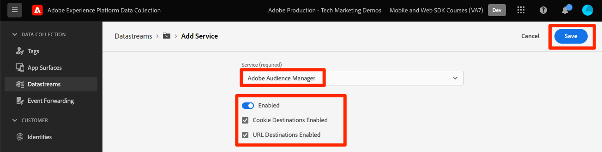
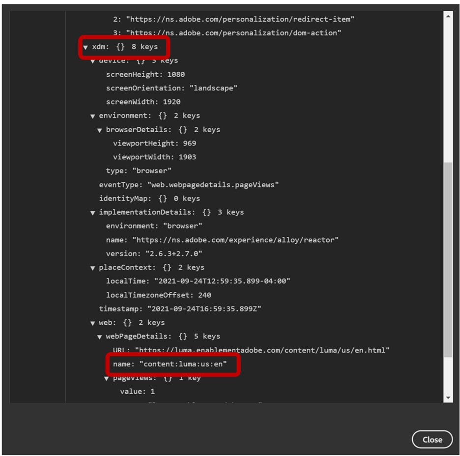
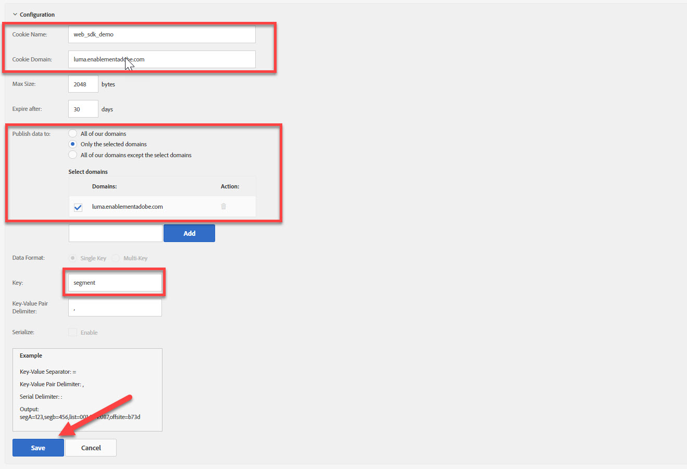

# Platform Web SDK を使用したAudience Managerの設定

Adobe Experience Platform Web SDK を使用してAdobe Audience Managerを設定し、cookie の宛先を使用して実装を検証する方法を説明します。

[Adobe Audience Manager](https://experienceleague.adobe.com/en/docs/audience-manager) は、サイト訪問者に関する商業的に関連性のある情報を収集し、市場性のあるセグメントを作成し、ターゲット広告やコンテンツを適切なオーディエンスに提供するために必要なすべてを提供するAdobe Experience Cloud ソリューションです。

## 学習目標

このレッスンを最後まで学習すると、以下の内容を習得できます。

* データストリームを設定してAudience Managerを有効にする
* Audience Managerでの cookie の宛先の有効化
* Adobe Experience Platform Debuggerでオーディエンスの選定を確認して、Audience Manager実装を検証します。

## 前提条件

このレッスンを完了するには、まず次の操作を行う必要があります。

* このチュートリアルの初期設定とタグの設定の節で前のレッスンを完了します。
* Adobe Audience Managerへのアクセス権と、特性、セグメントおよび宛先を作成、読み取りおよび書き込むための適切な権限を持っています。 詳しくは、を参照してください。 [Audience Managerの役割ベースのアクセス制御](https://experienceleague.adobe.com/en/docs/audience-manager-learn/tutorials/setup-and-admin/user-management/setting-permissions-with-role-based-access-control).

## データストリームの設定

Platform Web SDK を使用したAudience Manager実装は、を使用した実装とは異なります [サーバーサイド転送（SSF）](https://experienceleague.adobe.com/en/docs/analytics/admin/admin-tools/manage-report-suites/edit-report-suite/report-suite-general/server-side-forwarding/ssf). サーバーサイド転送は、Adobe Analytics リクエストデータをAudience Managerに渡します。 Platform Web SDK 実装は、Platform Edge Networkに送信された XDM データをAudience Managerに渡します。 データストリームでAudience Managerが有効になっています。

1. に移動 [データ収集](https://experience.adobe.com/#/data-collection){target="blank"} インターフェイス
1. 左側のナビゲーションで「」を選択します **[!UICONTROL データストリーム]**
1. 以前に作成したを選択します `Luma Web SDK: Development Environment` データストリーム

   

1. 「**[!UICONTROL サービスを追加]**」を選択します。
   
1. を選択 **[!UICONTROL Adobe Audience Manager]** as the **[!UICONTROL サービス]**
1. を確認します。 **[!UICONTROL Cookie 宛先が有効]** および **[!UICONTROL URL 宛先が有効]** が選択されました
1. 「**[!UICONTROL 保存]**」を選択します
   

## データソースの作成

次に、を作成します [データソース](https://experienceleague.adobe.com/en/docs/audience-manager/user-guide/features/data-sources/datasources-list-and-settings):Audience Manager内のデータを整理するための基本的なツール：

1. に移動します [Audience Manager](https://experience.adobe.com/#/audience-manager/) インターフェイス
1. を選択 **[!UICONTROL オーディエンスデータ]** 上部ナビゲーションから
1. 「」を選択します **[!UICONTROL データソース]** ドロップダウンメニューから
1. 「」を選択します **[!UICONTROL 新規を追加]** 「データソース」ページの上部にあるボタン

   

1. データソースにわかりやすい名前と説明を付けます。 初期設定では、この名前を付けることができます `Platform Web SDK tutorial`.
1. を設定 **[!UICONTROL ID タイプ]** 対象： **[!UICONTROL Cookie]**
1. が含まれる **[!UICONTROL データ書き出しコントロール]** セクションで選択 **[!UICONTROL 制限なし]**

   

1. **[!UICONTROL 保存]** データソース

## 特性の作成

データソースを保存した後、 [特性](https://experienceleague.adobe.com/en/docs/audience-manager/user-guide/features/traits/traits-overview). 特性は、Audience Managerにおける 1 つ以上のシグナルの組み合わせです。 ホームページ訪問者の特性を作成します。

>[!NOTE]
>
>データストリームですべての XDM データが有効な場合、Audience Managerに送信されますが、未使用のシグナル レポートで使用できるようになるまで 24 時間かかる場合があります。 この演習で説明しているように、Audience Managerですぐに使用する XDM データの明示的な特性を作成します。

1. を選択 **[!UICONTROL オーディエンスデータ]** >  **[!UICONTROL 特性]**
1. を選択 **[!UICONTROL 新規を追加]** >  **[!UICONTROL ルールベース]** 特性

   

1. 特性にわかりやすい名前と説明を付けます。 `Luma homepage view`
1. 「」を選択します **[!UICONTROL データソース]** 前の節で作成しました。
1. **[!UICONTROL フォルダーを選択]** 右側のパネルに特性を保存する場所。 次の方法でフォルダーを作成できます。 **「+」アイコンを選択** 既存の親フォルダーの横。 この新しいフォルダーに名前を付けることができます `Platform Web SDK tutorial`.
1. を展開します。 **[!UICONTROL 特性式]** キャレットと選択 **[!UICONTROL 式ビルダー]** ホームページの訪問を示すキーと値のペアを指定する必要があります。
1. を開きます [Luma ホームページ](https://luma.enablementadobe.com/content/luma/us/en.html) （タグプロパティにマッピング）および **Adobe Experience Platform Debugger** ページを更新します。
1. Platform Web SDK のネットワークリクエストとイベントの詳細を調べて、ホームページのキーと名前の値を見つけます。
   
1. Audience ManagerUI の式ビルダーに戻り、キーをに入力します **`web.webPageDetails.name`** およびの値 **`content:luma:us:en`**. この手順により、ホームページを読み込むたびに特性を実行するようにします。
1. **[!UICONTROL 保存]** 特性。

## セグメントの作成

次の手順では、を作成します **セグメント** そして、新しく定義した特性をこのセグメントに割り当てます。

1. を選択 **[!UICONTROL オーディエンスデータ]** 上部のナビゲーションでを選択し、 **[!UICONTROL セグメント]**
1. を選択 **[!UICONTROL 新規を追加]** ページの左上でセグメントビルダーを開く
1. 次のように、セグメントにわかりやすい名前と説明を指定します `Platform Web SDK - Homepage visitors`
1. **[!UICONTROL フォルダーを選択]** ここで、セグメントは右側のパネルに保存されます。 次の方法でフォルダーを作成できます。 **「+」アイコンを選択** 既存の親フォルダーの横。 この新しいフォルダーに名前を付けることができます `Platform Web SDK tutorial`.
1. 統合コードを追加します。この場合は、数字のランダムセットです。
1. が含まれる **[!UICONTROL データソース]** セクションで選択 **[!UICONTROL Audience Manager]** と、前の手順で作成したデータソース
1. を展開します。 **[!UICONTROL 特性]** を選択し、作成した特性を検索します
1. を選択 **[!UICONTROL 特性を追加]**.
1. を選択 **[!UICONTROL 保存]** ページの下部

   

   

## 宛先の作成

次に、を作成します **cookie ベースの宛先** の使用 **宛先ビルダー**. 宛先ビルダーを使用すると、Cookie、URL およびサーバー間の宛先を作成および管理できます。

1. 次を選択して、宛先ビルダーを開きます **[!UICONTROL 宛先]** 内 **オーディエンスデータ** 上部ナビゲーションのメニュー
1. を選択 **[!UICONTROL 宛先を作成]**
1. 名前と説明を入力します。 `Platform Web SDK tutorial`
1. として **[!UICONTROL カテゴリ]**&#x200B;を選択 **[!UICONTROL カスタム]**
1. として **[!UICONTROL タイプ]**&#x200B;を選択 **[!UICONTROL Cookie]**

   

1. を開きます **[!UICONTROL 設定]** cookie の宛先に関する詳細を入力するセクション
1. cookie にわかりやすい名前を付け、 `platform_web_sdk_tutorial`
1. として **[!UICONTROL Cookie ドメイン]**&#x200B;を開き、統合を計画しているサイトのドメインを追加します。チュートリアルでは Luma ドメインを入力します。 `luma.enablementadobe.com`
1. として **[!UICONTROL へのデータの公開]** オプション、を選択 **[!UICONTROL 選択したドメインのみ]**
1. まだ追加していない場合は、ドメインを選択します
1. として **[!UICONTROL データ形式]**&#x200B;を選択 **[!UICONTROL 単一のキー]** cookie にキーを渡します。 このチュートリアルではを使用します `segment` キー値として。
1. 最後に、を選択します **[!UICONTROL 保存]** 宛先設定の詳細を保存します。

   

<!--
   

   
-->

1. が含まれる **[!UICONTROL セグメントマッピング]** セクションで、 **[!UICONTROL セグメントの検索と追加]** 以前に作成したを検索する機能 `Platform Web SDK - Homepage visitors` を選択して、 **[!UICONTROL 追加]**.

1. セグメントを追加すると、ポップアップが開き、Cookie に対する期待値を指定する必要があります。 この演習では、「hpvisitor」という値を入力します。

1. 「**[!UICONTROL 保存]**」を選択します

1. を選択 **[!UICONTROL 完了]**
   

セグメントマッピング期間をアクティブ化するには数時間かかります。 完了したら、Audience Managerインターフェイスを更新して、 **マッピングされたセグメント** リストが更新されました。

## セグメントの検証

セグメントの最初の作成から数時間後に、セグメントが正しく動作していることを検証できます。

まず、セグメントに適合できることを確認します

1. を開きます [Luma デモサイトのホームページ](https://luma.enablementadobe.com/content/luma/us/en.html) を新しく作成したセグメントに適合するように、タグプロパティにマッピングします。
1. ブラウザーのを開きます **開発者ツール**  > **ネットワーク** タブ
1. を使用して、Platform Web SDK リクエストにフィルタリングします。 `interact` テキストフィルターとして
1. 呼び出しを選択し、 **プレビュー** tab キーを押すと応答の詳細を表示できます
1. を展開します。 **ペイロード** で以前にAudience Managerで設定したように、想定される cookie の詳細を表示します。 この例では、想定される cookie 名が表示されます `platform_web_sdk_tutorial`.

   

1. を開きます **用途** tab キーを押して開きます **の Cookie** から **ストレージ** メニュー。
1. 「」を選択します **`https://luma.enablementadobe.com`** をドメインに登録し、cookie がリストに適切に記述されていることを確認します

   

最後に、Audience Managerインターフェイスでセグメントを開き、次のことを確認する必要があります **セグメント母集団** が増分しました：

このレッスンを完了すると、Platform Web SDK がデータをAudience Managerに渡す方法を確認し、cookie の送信先を使用してセグメント固有のファーストパーティ cookie を設定できるようになります。

[次へ： ](setup-target.md)

>[!NOTE]
>
>Adobe Experience Platform Web SDK の学習に時間を費やしていただき、ありがとうございます。 ご質問がある場合、一般的なフィードバックを共有したい場合、または将来のコンテンツに関するご提案がある場合は、このページでお知らせください [Experience League コミュニティ ディスカッションの投稿](https://experienceleaguecommunities.adobe.com/t5/adobe-experience-platform-data/tutorial-discussion-implement-adobe-experience-cloud-with-web/td-p/444996)
