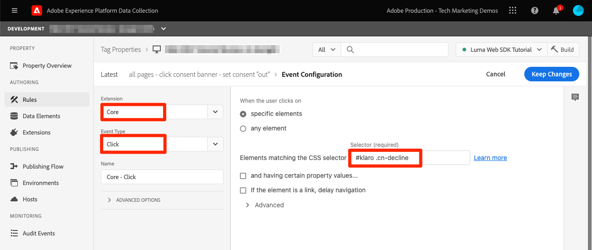

# Platform Web SDK を使用した同意の設定

Experience PlatformWeb SDK タグ拡張機能のプライバシー設定の指定方法について説明します。 訪問者による同意管理プラットフォーム（CMP）のバナーとのインタラクションに基づいて同意を設定します。

>[!NOTE]
> 
>このチュートリアルでは、デモンストレーションの目的で、を使用します [クラロ](https://heyklaro.com/) cmp として。 Klaro または Web サイトで使用する CMP を使用して進めることができます。


## 学習目標

このレッスンを終了すると、次の操作を実行できます。

* タグを使用した CMP の読み込み
* Experience PlatformWeb SDK タグ拡張機能のプライバシー設定
* 訪問者のアクションに基づいてExperience PlatformWeb SDK に同意を設定します

## 前提条件

タグの知識と、ルールやデータ要素の作成、環境へのライブラリのビルド、Experience Platformデバッガーを使用したタグライブラリの切り替えの手順を理解している必要があります。

プライバシー設定の設定と同意を設定するためのルールの作成を開始する前に、同意管理プラットフォームスクリプトが web サイトに挿入され、正しく機能していることを確認します。 CMP は、サイト開発者の助けを借りてソースコード内に直接読み込むか、タグ自体を介して読み込むことができます。 このレッスンでは、後者のアプローチを示します。
>[!NOTE]
> 
>1. 同意管理プラットフォーム（CMP）は、web サイトやアプリなどのオンラインソースから訪問者データを収集、共有または販売する前に、訪問者の同意オプションを法的にドキュメント化および管理するために組織で使用されます。
>
>2. CMP を挿入する方法として推奨されるのは、タグマネージャースクリプトの前にソースコードを直接実行する方法です。

### Klaro の設定

タグ設定に進む前に、このチュートリアルの Klaro で使用する同意管理プラットフォームの詳細を確認してください。

1. 訪問 [クラロ](https://heyklaro.com/) そして、アカウントを設定します。
1. に移動 **プライバシーマネージャー** 指示に従ってインスタンスを作成します。
1. の使用 **統合コード** で、タグプロパティに Klaro を挿入します（手順は次の演習で説明します）。
1. をスキップ **スキャン** セクションを参照してください。タグプロパティは、Luma デモ web サイトでハードコードされており、このチュートリアル用に作成したものではないことが検出されます。
1. というサービスを追加します。 `aep web sdk` を切り替えます。 **サービスの既定の状態**. オンにすると、デフォルトの同意値はになります `true`そうでない場合は、 `false`. この設定は、web アプリケーションに対する（訪問者の同意の前の）デフォルトの同意状態を決定する場合に便利です。 例：
   * CCPA の場合、通常、デフォルトの同意は次のように設定されています。 `true`. このシナリオは、次のように参照します **暗黙のオプトイン** このチュートリアル全体を通して
   * GDPR の場合、デフォルトの同意は通常、次のように設定されています。 `false`. このシナリオは、次のように参照します **暗黙のオプトアウト** このチュートリアル全体を通して。

<!--
    This consent value can be verified by returning the JavaScript object ```klaro.getManager().consents``` in the browser's developer console.
-->
    >[！注意 ]
    >
    > 通常、上記の手順は、OneTrust や TrustArc など CMP を扱うチームまたは個人が実行し、注意を払います。

## CMP の挿入

>[!WARNING]
>
>同意管理プラットフォームを実装するベストプラクティスは、通常、CMP を読み込むことです _次の前_ タグマネージャーを読み込んでいます。 このチュートリアルを容易にするために、CMP を読み込みます _（を使用）_ タグマネージャー。 このレッスンは、Platform Web SDK の同意機能の使用方法を示すように設計されており、Klaro やその他の CMP を正しく設定するためのガイドとしては使用しないでください。


Klaro の設定が完了したら、次の設定でタグルールを作成します。

* [!UICONTROL 名前]：`all pages - library load - Klaro`
* [!UICONTROL イベント]: [!UICONTROL ライブラリが読み込まれました（ページのトップ）] （を使用） [!UICONTROL 詳細オプション] > [!UICONTROL 順序] 1 に設定
* [!UICONTROL アクション]: [!UICONTROL カスタムコード], [!UICONTROL 言語]:CMP スクリプトを読み込むHTML。


カスタムコードブロックは次のようになります。


次に、このルールを保存して開発ライブラリに作成します。タグライブラリを Luma サイトから独自のサイトに切り替えて、同意バナーが表示されていることを検証します。 以下のような CMP バナーが web サイトに表示されます。 現在の訪問者の同意権限を確認するには、ブラウザーのコンソールで次のスニペットを使用します。

```javascript
    klaro.getManager().consents 
```


デバッグモードに入るには、Adobe Experience Platform debugger で次のチェックボックスを使用します。


また、訪問者の同意値がここに保存されるので、このチュートリアルを進めながら、Cookie とローカルストレージを複数回消去する必要がある場合もあります。 これは、次のようにして実行できます。


## 同意シナリオ

GDPR、CCPA などのプライバシー上の行為は、同意実装の設計方法において重要な役割を果たします。 このレッスンでは、2 つの最も目立つプライバシー行為の下で、訪問者が同意バナーとやり取りする方法を調べます。


### シナリオ 1：暗黙のオプトイン

黙示的なオプトインとは、企業がデータを収集する前に訪問者の同意を得る必要がない（または「オプトイン」）ことを意味し、web サイトへのすべての訪問者はデフォルトでオプトインとして扱われます。 ただし、訪問者は同意バナーを通じて cookie を拒否することでオプトアウトできます。 このユースケースは CCPA に似ています。

次に、このシナリオの同意を設定して実装します。

1. が含まれる **[!UICONTROL プライバシー]** セクション（Experience PlatformWeb SDK タグ拡張機能）で、  **[!UICONTROL デフォルトの同意]** はに設定されています。 **[!UICONTROL 対象：]** :


   

   >[!NOTE]
   > 
   >動的ソリューションの場合は、「データ要素を提供」オプションを選択し、の値を返すデータ要素を渡します。 ```klaro.getManager().consents```
   >
   >このオプションは、CMP がソースコードに挿入されている場合に使用されます *次の前* Experience PlatformWeb SDK 拡張機能が読み込みを開始する前にデフォルトの同意を使用できるようにする、タグ埋め込みコード。 この例では、CMP がタグでロードされタグの前にロードされていないので、このオプションを使用できません。


2. この変更を保存し、タグライブラリにビルドします
3. Luma デモサイトでタグライブラリを読み込みます
4. Luma サイトでタグデバッグを有効にし、ページをリロードします。 ブラウザーの開発者コンソールで、defaultConsent が次と等しいことがわかります **[!UICONTROL 対象：]**
5. この設定では、訪問者が Cookie を拒否してオプトアウトしない限り、Experience PlatformWeb SDK 拡張機能は引き続きネットワークリクエストを送信します。

   


訪問者がオプトアウト（トラッキング cookie の拒否）を決定した場合、次の同意を変更する必要があります **[!UICONTROL Out]**. 次の手順に従って、同意設定を変更します。

<!--
1. Create a data element to store the consent value of the visitor. Let's call it `klaro consent value`. Use the code snippet to create a custom code type data element:
    
    ```javascript
    return klaro.getManager().consents["aep web sdk"]
    ```

    


1. Create another custom code data element, `consent confirmed`, with the following snippet which returns ```true``` only after a visitor confirms consent:

    
    ```javascript
    return klaro.getManager().confirmed
    ```

    
-->

1. 訪問者がクリックしたときにトリガーとなるルールを作成する **私は断る**.  このルールに次の名前を付ける： `all pages - click consent banner - set consent "out"`

1. として **[!UICONTROL イベント]**、を使用 **[!UICONTROL クリック]** 日付： **[!UICONTROL CSS セレクターに一致する要素]** `#klaro .cn-decline`

   

1. 次に、Experience PlatformWeb SDK を使用します。 [!UICONTROL 同意を設定] [!UICONTROL アクションタイプ] 同意を「out」に設定するには：

   

1. を選択 **[!UICONTROL ライブラリに保存してビルド]**:

   

これで、訪問者がオプトアウトすると、上記の方法で設定されたルールが起動し、Web SDK の同意をとして設定します **[!UICONTROL Out]**.

Luma デモサイトに移動して検証し、Cookie を拒否し、オプトアウト後に Web SDK リクエストが実行されないことを確認します。

### シナリオ 2：暗黙のオプトアウト


暗黙オプトアウトとは、訪問者をデフォルトでオプトアウトとして扱い、cookie を設定しないようにすることを意味します。 Web SDK リクエストは、訪問者が同意バナーを通じて cookie を受け入れて手動でオプトインすることを決定しない限り、実行されません。 GDPR が適用される EU 地域では、このようなユースケースに対処する必要が生じる場合があります。

次に、暗黙のオプトアウトシナリオの設定を行う方法を示します。

1. Klaro で、 **サービスの既定の状態** が含まれる `aep web sdk` サービスを実行して、更新された設定を保存します。

1. 対象： **[!UICONTROL プライバシー]** セクション（Experience PlatformWeb SDK 拡張機能）では、デフォルトの同意を次のように設定します **[!UICONTROL Out]** または **[!UICONTROL 保留中]** 必要に応じて、

   

1. **保存** タグライブラリの更新後の設定を再度作成します。

   この設定を使用すると、Experience PlatformWeb SDK は、同意権限が次のように変更されない限り、リクエストを実行しないようにします **[!UICONTROL 対象：]**. これは、訪問者がオプトインして手動で Cookie を受け入れた結果として発生する可能性があります。

1. Debugger で、Luma サイトがタグプロパティにマッピングされ、タグの console-logging がオンになっていることを確認します。
1. ブラウザーの開発者コンソールを使用して、次の操作を行います **サイトデータのクリア** 。対象： **用途** > **ストレージ**

1. Luma サイトをリロードすると、次の内容が表示されます `defaultConsent` はに設定されています。 **[!UICONTROL Out]** Web SDK リクエストが行われていません

   

訪問者がオプトイン （トラッキング cookie を受け入れる）を決定した場合、同意を変更し、に設定する必要があります **[!UICONTROL 対象：]**. これをルールで行う方法を次に示します。

1. 訪問者がクリックしたときにトリガーとなるルールを作成する **いいよ**.  このルールに次の名前を付ける： `all pages - click consent banner - set consent "in"`

1. として **[!UICONTROL イベント]**、を使用 **[!UICONTROL クリック]** 日付： **[!UICONTROL CSS セレクターに一致する要素]** `#klaro .cm-btn-success`

   

1. Experience PlatformWeb SDK を使用したアクションの追加 [!UICONTROL 拡張機能], **[!UICONTROL アクションタイプ]** 件中 **[!UICONTROL 同意を設定]**, **[!UICONTROL 一般的な同意]** as **[!UICONTROL 対象：]**.

   

   ここで注意すべきことの 1 つは、次のとおりです [!UICONTROL 同意を設定] アクションは、最初に送信され、id を確立するリクエストになります。 このため、最初のリクエスト自体で ID を同期することが重要な場合があります。 ID マップは次の場所に追加できます [!UICONTROL 同意を設定] id タイプデータ要素を渡すことによるアクション。

1. を選択 **[!UICONTROL ライブラリに保存してビルド]**:

   

1. **[!UICONTROL 保存]** ルールをライブラリに追加し、再構築します。

このルールを設定したら、訪問者がオプトインしたときにイベントコレクションが開始されます。


Web SDK の同意について詳しくは、次を参照してください： [顧客の同意環境設定のサポート](https://experienceleague.adobe.com/en/docs/experience-platform/edge/consent/supporting-consent).


の詳細 [!UICONTROL 同意を設定] アクション、を参照 [同意を設定](https://experienceleague.adobe.com/en/docs/experience-platform/edge/extension/action-types#set-consent).

[次へ： ](setup-event-forwarding.md)

>[!NOTE]
>
>Adobe Experience Platform Web SDK の学習に時間を費やしていただき、ありがとうございます。 ご質問がある場合、一般的なフィードバックを共有したい場合、または将来のコンテンツに関するご提案がある場合は、このページでお知らせください [Experience League コミュニティ ディスカッションの投稿](https://experienceleaguecommunities.adobe.com/t5/adobe-experience-platform-launch/tutorial-discussion-implement-adobe-experience-cloud-with-web/td-p/444996)
