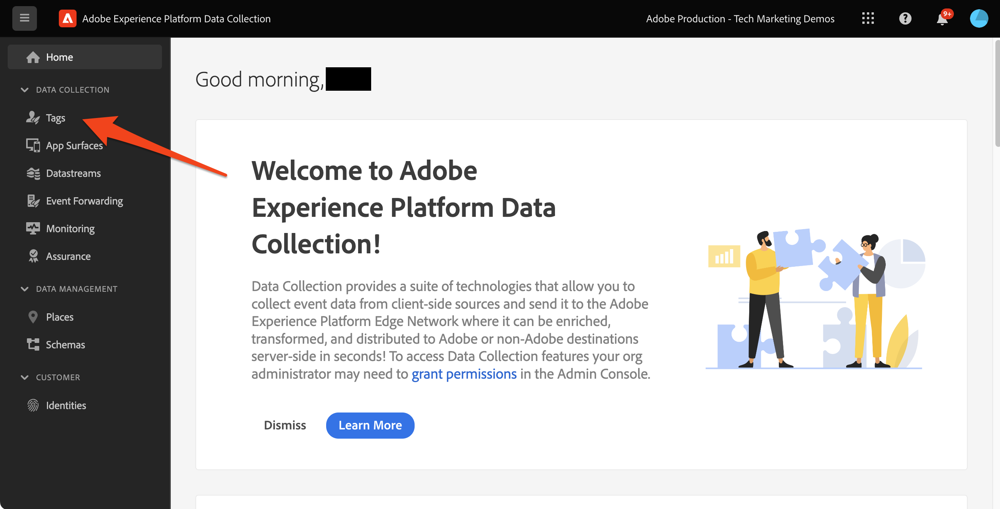

# Platform Web SDK を使用した意思決定管理の設定

Platform Web SDK を使用して意思決定管理を実装する方法を説明します。 このガイドでは、基本的な意思決定管理の前提条件、設定の詳細な手順およびロイヤルティステータスに基づくユースケースを詳しく説明します。

このチュートリアルに従うと、Journey Optimizerのユーザーは、offer decisioning機能を効果的に適用し、顧客とのやり取りのパーソナライゼーションと関連性を高めることができます。


## 学習内容

このレッスンを終了すると、次の操作を実行できます。

* Adobe Journey Optimizer内の意思決定管理の中心概念とAdobe Experience Platform Web SDK との統合を把握します。

* Journey Optimizerとのシームレスな統合を確実に行い、Offer decisioning用に Web SDK を設定する手順を説明します。

* ロイヤルティステータスオファーを中心とした詳細なユースケースを探索し、オファー、決定およびプレースメントの作成および管理に関するインサイトを得ます。

* 意思決定管理フレームワーク内の重要な用語とその意味を理解します。

* 適切なオファーを適切なユーザーに配信する際の、決定ルール、コレクション修飾子、フォールバックオファーの重要性を理解します。

* シミュレーションやカスタムイベントデータ収集などの高度なトピックを掘り下げ、オファー配信メカニズムをテスト、検証および強化できるようにします。

## 前提条件

このセクションのレッスンを完了するには、まず次の操作を行う必要があります。

* Adobe Journey Optimizer Ultimate （Journey OptimizerとOffer decisioning）またはAdobe Experience PlatformおよびOffer decisioningアプリケーションサービスのアドオンへのアクセス権が組織にあることを確認します。

* Platform Web SDK の初期設定について、すべてのレッスンを完了してください。

* 組織の Edge Decisioning を有効にします。

* プレースメントを設定し、決定範囲の JSON 内でプレースメント ID とアクティビティ ID をインスタンス化する方法を理解します。

## 制限事項

次の制限事項に注意してください。

* イベントベースのオファーは、現在Adobe Journey Optimizerではサポートされていません。 イベントに基づいて決定ルールを作成した場合、それをオファーに適用することはできません。

## 意思決定管理へのアクセスの許可

意思決定管理機能へのアクセスを許可するには、以下を作成する必要があります。 **製品プロファイル** 対応する権限をユーザーに割り当てます。 [Journey Optimizer ユーザーと権限の管理について詳しくは、この節を参照してください](https://experienceleague.adobe.com/docs/journey-optimizer/using/access-control/privacy/high-low-permissions.html?lang=en#decisions-permissions).

## データストリームの設定

でOffer decisioningを有効にする必要があります **データストリーム** platform Web SDK で意思決定管理アクティビティを配信する前の設定。

データストリームでOffer decisioningを設定するには：

1. に移動します [データ収集](https://experience.adobe.com/#/data-collection) インターフェイス。

1. 左側のナビゲーションで「」を選択します **データストリーム**.

1. 以前に作成した Luma Web SDK データストリームを選択します。

   

1. を選択 **編集** 内 **Adobe Experience Platform サービス**.

   

1. を確認します **Offer decisioning** ボックス。

   

1. 「**保存**」を選択します。

これにより、Journey Optimizerのインバウンドイベントがで正しく処理されます **Adobe Experience Platform Edge**.

## 意思決定管理の SDK の設定

意思決定管理には、Web SDK 実装タイプに応じて、追加の SDK 手順が必要です。 意思決定管理の SDK を設定する際に使用できるオプションは 2 つあります。

* SDK スタンドアロンインストール
   1. の設定 `sendEvent` のアクション `decisionScopes`.

      ```javascript
      alloy("sendEvent", {
         ...
         "decisionScopes": [
            "[DECISION SCOPE 1]",
            "[DECISION SCOPE 2]"
         ]
      })
      ```

* SDK タグのインストール
   1. データ収集インターフェイスに移動します。

   1. 左側のナビゲーションで「」を選択します **タグ**.

      

   1. 「」を選択します **タグプロパティ**.

   1. を作成 **ルール**.
      * Platform Web SDK の追加 **イベント送信アクション** および関連するを追加します `decisionScopes` をアクションの設定に追加します。

   1. の作成と公開 **ライブラリ** 関連するすべてを含む **ルール**, **データ要素**、および **拡張機能** が設定されました。

## 用語

まず、意思決定管理インターフェイスで使用される用語を理解する必要があります。

* **Capping**：オファーの表示頻度を示す制約。 2 種類：
   * 合計制限数：ターゲットオーディエンス全体で 1 つのオファーを表示できる最大回数。
   * プロファイルキャップ：特定のユーザーに対してオファーを表示できる回数。
* **コレクション**：マーケターが設定した特定の条件（オファーカテゴリなど）別にグループ化されたオファーのサブセット。
* **決定**：オファーの選択を指示するロジック。
* **決定ルール**：ユーザーの適格性を確認するためのオファーに対する制約。
* **実施要件を満たすオファー**：事前設定された制約に一致し、ユーザーに表示できるオファー。
* **意思決定管理**：ビジネスロジックと決定ルールを使用して、パーソナライズされたオファーを作成し、配信するシステム。
* **フォールバックオファー**：ユーザーがコレクション内のオファーの対象とならない場合に表示されるデフォルトのオファー。
* **オファー**：ビューアを決定する潜在的な実施要件ルールを含むマーケティングメッセージ。
* **オファーライブラリ**：オファー、決定および関連するルールを管理する一元的なリポジトリー。
* **パーソナライズされたオファー**：実施要件の制約に基づいてカスタマイズされたカスタムマーケティングメッセージ。
* **Placements**：オファーがユーザーに表示される設定またはシナリオ。
* **優先度**：実施要件やキャッピングなどの様々な制約を考慮したオファーのランキング指標。
* **表示域**：チャネル固有の情報（場所や言語など）で、オファーの表示をガイドします。

## ユースケースの概要 – ロイヤルティ報酬

このレッスンでは、サンプルのロイヤルティ報酬ユースケースを実装して、Web SDK を使用した意思決定管理を理解します。

この使用例では、一元化されたオファーライブラリとオファー決定エンジンを利用して、Journey Optimizerが顧客に最適なオファーを提供する方法をより深く理解できます。

>[!NOTE]
>
> このチュートリアルは実装者向けなので、このレッスンにはJourney Optimizerでの実質的なインターフェイス作業が含まれていることは注目に値します。 通常、このようなインターフェイスタスクはマーケターが処理しますが、長期的には意思決定管理キャンペーンの作成に責任を負わない場合でも、実装者がプロセスに関するインサイトを得ることは有益です。

## コンポーネント

オファーの作成を開始する前に、いくつかの前提条件コンポーネントを定義する必要があります。

### ロイヤルティオファーのプレースメントの作成

**Placements** は、オファーの紹介に使用するコンテナです。 この例では、Luma サイトの上部にプレースメントを作成します。

プレースメントのリストには&#x200B;**コンポーネント**&#x200B;メニューからアクセスできます。フィルターは、特定のチャネルやコンテンツに従ってプレースメントを取得するのに役立ちます。


プレースメントを作成するには、次の手順に従います。

1. 「**プレースメントを作成**」をクリックします。

   

1. プレースメントのプロパティを定義します。
   * **名前**：プレースメントの名前。サンプルプレースメントを呼び出しましょう *&#39;ホームページバナー&#39;*.
   * **チャネルタイプ**：プレースメントが使用されるチャネル。 使ってみましょう *&#39;Web&#39;* オファーは Luma の web サイトに表示されるので、
   * **コンテンツタイプ**：プレースメントに表示できるコンテンツのタイプ（テキスト、HTML、画像リンク、JSON のいずれか）。 次を使用できます *&#39;HTML&#39;* オファー用。
   * **説明**：プレースメントの説明（オプション）。

   

1. 「**保存**」をクリックします。
1. プレースメントが作成されると、プレースメント リストに表示されます。
1. 新しいプレースメントを含む行を選択し、プレースメント ID をメモします。これは、決定範囲内での設定に必要になる場合があります。

   

### ロイヤルティステータスの決定ルール

**決定ルール** オファーを提示する条件を指定します。 この例では、ユーザーのロイヤルティステータスに応じて異なるオファーを提供する決定ルールを作成します。

決定ルールのリストには、「」でアクセスできます **Components** メニュー。

決定ルールを作成するには、次の手順に従います。

1. に移動します。 **ルール** タブをクリックし、 **ルールを作成**.

   

1. 最初のルールに「」という名前を付けます&#x200B;*ゴールド ロイヤルティ状態ルール*&#39;. XDM フィールドを使用してルールを定義できます。 Adobe Experience Platform **セグメントビルダー** は、ルール条件の作成に使用できる直感的なインターフェイスです。

   

1. クリック **保存** ルール条件を確認します。
1. 新しく保存された「*ゴールド ロイヤルティ状態ルール*&#39;はに表示されます **ルールリスト**. 選択すると、プロパティが表示されます。

   

1. 次に、ユースケースに残りのロイヤルティオファールール条件を作成します。


### コレクション修飾子

**コレクション修飾子** を使用すると、オファーライブラリ内のオファーを簡単に整理および検索できます。 この例では、ロイヤルティ報酬オファーにコレクション修飾子を追加して、オファー組織を改善します。

コレクション修飾子のリストには、 **Components** メニュー。

ロイヤルティ報酬コレクション修飾子を作成するには、次の手順に従います。

1. に移動します。 **コレクション修飾子** タブをクリックし、 **コレクション修飾子を作成**.

   

1. コレクション修飾子に「」という名前を付けましょう&#x200B;*ロイヤルティ報酬*&#39;

   

1. 新しいコレクション修飾子がに表示されます。 **コレクション修飾子** タブ

## オファー

次に、ロイヤルティ報酬オファーを作成します。

オファーのリストには、「」でアクセスできます **オファー** メニュー。


### 様々なロイヤルティ層用のオファーの作成

まず、様々な Luma ロイヤルティ層用にパーソナライズされたオファーを作成します。

最初のを作成するには **オファー**&#x200B;は、次の手順に従います。

1. 「**オファーを作成**」をクリックし、「**パーソナライズされたオファー**」を選択します。

1. 最初のオファーに「」という名前を付けましょう&#x200B;*Luma ロイヤルティ層 – ゴールド*&#39;. このオファーの開始日時/終了日時を指定する必要があります。 を関連付ける必要もあります **コレクション修飾子** &#39;*ロイヤルティ報酬*」をオファーに追加することで、内をより適切に整理 **オファーライブラリ**. その後、をクリックします **次**.

   

1. 次に、を追加する必要があります **表示域** オファーの表示場所を定義します。 を選択します **web チャネル**. また、「」を選択します&#x200B;*ホームページバナー*&#39; **配置** が既に設定されています。 選択された **配置** はHTMLタイプなので、HTML、JSON またはテキストのコンテンツをエディターに直接追加し、 **カスタム** ラジオボタン。

   

1. オファーコンテンツをで直接編集します。 **式エディター**. このプレースメントには、HTML、JSON、TEXT のいずれかのコンテンツを追加できます。 正しいを選択していることを確認します **モード** コンテンツタイプに応じて、エディターの下部に表示されます。 をヒットすることもできます **validate** エラーがないことを確認します。

   

1. また、式エディターを使用して、Adobe Experience Platformに保存されている属性を取得することもできます。 オファーのコンテンツにプロファイルの名を追加して、1:1 レベルのロイヤルティメンバー向けにパーソナライズしましょう。

   

1. 制約を追加して、「」に適合するプロファイルにのみオファーを表示します。*ゴールド ロイヤルティ状態ルール*&#39;.

   

1. オファーのレビューが完了したら、 **終了**. 「**保存して承認**」を選択します。

次に、様々な Luma ロイヤルティ層用に残りのオファーを作成します

### フォールバックオファー

引き続き、Luma サイトへの Luma 以外のロイヤルティ訪問者にオファーを提供する必要があります。 これを行うには、 **フォールバックオファー** キャンペーン用。

フォールバックオファーを作成するには、次の手順に従います。

1. 「**オファーの作成**」をクリックし、「**フォールバックオファー**」を選択します。
   <!--
      
   -->
1. フォールバックオファーに「という名前を付けましょう&#x200B;*Luma 以外のロイヤルティ*&#39;. 以前に作成したを関連付けることもできます **コレクション修飾子**, &#39;*ロイヤルティ報酬*&#x200B;オファーを整理しやすくするためのフォールバックオファーに。
   <!--
      
   -->
1. フォールバックオファーのコンテンツのへの追加 **式エディター**. このプレースメントには、HTML、JSON、TEXT の各コンテンツを追加できます。 正しいを選択していることを確認します **モード** コンテンツタイプに応じて、エディターの下部に表示されます。 をヒットすることもできます **validate** エラーがないことを確認します。
   <!--
      
   -->
1. すべてが正しく設定されている場合は、 **終了** その後 **保存して承認**.
<!--
   
-->

## 決定

**決定** は、ターゲットに応じて顧客が利用できる最適なオファーを選択するオファーのコンテナです。

決定のリストは、 **決定** タブ **オファー** メニュー。
<!--
   
-->

### ロイヤルティオファーの決定の作成

Luma ロイヤルティ報酬のユースケースの決定を作成しましょう。

決定を作成するには、次の手順に従います。

1. クリック **決定を作成**.
   <!--
      
   -->
1. 決定を、と呼びましょう。*12 月の Luma ロイヤルティオファー*&#39;. オファーは 1 か月間実行されるので、ここで指定します。
   <!--
      
   -->
1. 次に、 **決定範囲**. まず、プレースメントを選択します。 以前に作成したを使用できます&#39;*ホームページバナー*&#39;.
   <!--
      
   -->
1. 次に、以下を追加する必要があります **評価条件** を決定範囲に使用します。 クリック **追加** 以前に作成した「」を選択します。*ロイヤルティ報酬*&#39; **collection** 考慮するすべてのロイヤルティオファーが含まれます。
   <!--
      
   -->
1. 「」内&#x200B;*ロイヤルティ報酬*「コレクション」で「実施要件」フィールドを使用して、オファー配信を Luma 訪問者のサブセットに制限できます。 ただし、このユースケースでは、すべての訪問者にいずれかのオファーを受け取ってもらいます。 を設定しました。 **フォールバックオファー** すべての非ロイヤルティ訪問者の場合。 実施要件を「なし」に設定します。
   <!--
      
   -->
1. また、 **ランキング方法** ユーザーとプレースメントの組み合わせに対して実施要件を満たすオファーが複数ある場合、各 Luma 訪問者に最適なオファーを選択するためのフィールド。 このユースケースでは、を使用できます **オファーの優先度** メソッド。オファーで定義された値を使用して最適なオファーを提供します。
   <!--
      
   -->
1. 次に、 **フォールバックオファー** を決定に追加します。 フォールバックオファーは、Luma ロイヤルティオーディエンスに該当しない場合に Luma の訪問者に表示されるデフォルトのオファーであることを思い出してください。 「」を選択&#x200B;*Luma 以外のロイヤルティ*」を使用可能なフォールバックオファーのリストから&#x200B;*ホームページバナー*&#39;配置。
   <!--
      
   -->
1. 決定をアクティブ化する前に、決定範囲、フォールバックオファー、使用可能なオファーのプレビューを確認し、認定プロファイルを推定します。 問題がないようであれば、以下をクリックします。 **終了** および **保存してアクティブ化**.
<!--
   
-->

## シミュレーション

ベストプラクティスとして、Luma ロイヤルティ決定ロジックを検証して、適切なオファーが適切なロイヤルティオーディエンスに確実に配信されるようにする必要があります。 これを行うには、を使用します。 **テストプロファイル**. 新しいオファーバージョンを実稼動環境にプッシュする前に、テストプロファイルを通じてオファーへの変更をテストすることもお勧めします。

テストを開始するには、 **シミュレーション** tab キーを押して **オファー** メニュー。

### ロイヤルティオファーのテスト

1. シミュレーションに使用するテストプロファイルを選択します。 クリック **プロファイルを管理**. [オファーテスト用の新しいテストプロファイルを作成または指定するには、このガイドに従ってください。](https://experienceleague.adobe.com/docs/journeys/using/building-journeys/about-journey-building/creating-test-profiles.html?lang=en#create-test-profiles-csv).
   <!--
      
   -->
1. 1 つ以上のテストプロファイルをシミュレーションに追加し、選択内容を保存します。 ユースケーステストでは、Luma ロイヤルティ報酬オーディエンスごとにテストプロファイルが設定されていることを確認する必要があります。
   <!--
      
   -->
1. テストする決定範囲を選択します。 「**決定範囲を追加**」を選択します。
   <!--
      
   -->
1. 以前に作成した「」を選択&#x200B;*ホームページバナー*&#39;配置。
   <!--
      
   -->
1. 使用可能な決定が表示されるので、以前に作成した「」を選択します&#x200B;*12 月の Luma ロイヤルティオファー*&#39;決定し、クリックする **追加**.
   <!--
      
   -->
1. テストプロファイルを選択したら、 **結果を表示**. 「の選択したテストプロファイルに、利用可能な最適なオファーが表示されます。*12 月の Luma ロイヤルティオファー*&#39;決定。
   <!--
      
   -->
1. 別のテストプロファイルを選択し、 **結果を表示**. テストプロファイルのロイヤルティ層に応じて、別のシミュレートされたオファーが表示されるのが理想です。

## Adobe Experience Platform Debuggerを使用した意思決定管理の検証

この **Adobe Experience Platform Debugger** この拡張機能は Chrome と Firefox の両方で使用でき、web ページを分析してAdobe Experience Cloud ソリューションの実装の問題を特定します。

Luma サイトでデバッガーを使用して、実稼動環境で意思決定ロジックを検証できます。 これは、ロイヤルティ報酬のユースケースを立ち上げて実行し、すべてが正しく設定されていることを確認した後のベストプラクティスです。

[こちらのガイドを使用して、ブラウザーでデバッガーを設定する方法を説明します](https://experienceleague.adobe.com/docs/platform-learn/data-collection/debugger/overview.html?lang=en).

デバッガーを使用して検証を開始するには：

1. オファープレースメントを使用して Luma web ページに移動します。
   <!--
      
   -->
1. Web ページで、を開きます **Adobe Experience Platform debugger**.
   <!--
      
   -->
1. に移動します。 **概要**. を確認します **データストリーム ID** 次に一致 **データストリーム** 。対象： **Adobeデータ収集** に対してOffer decisioningを有効にしました。
   <!--
      
   -->
1. 次の下 **解決策** に移動します。 **Web SDK のExperience Platform**.
   <!--
      
   -->
1. 内 **設定** タブ、切り替えオン **デバッグの有効化**. これにより、内のセッションのログが **Adobe Experience Platform Assurance** セッション。
   <!--
      
   -->
1. その後、様々な Luma ロイヤルティアカウントでサイトにログインし、デバッガーを使用して、に送信されたリクエストを検証できます **Adobe Experience Platform Edge Network**. これらのリクエストはすべて、次の場所で取得する必要があります。 **Assurance** （ログトラッキング用）。
<!--
   
-->

[次へ： ](setup-consent.md)

>[!NOTE]
>
>Adobe Experience Platform Web SDK の学習に時間を費やしていただき、ありがとうございます。 ご質問がある場合、一般的なフィードバックを共有したい場合、または将来のコンテンツに関するご提案がある場合は、このページでお知らせください [Experience League コミュニティ ディスカッションの投稿](https://experienceleaguecommunities.adobe.com/t5/adobe-experience-platform-launch/tutorial-discussion-implement-adobe-experience-cloud-with-web/td-p/444996)
