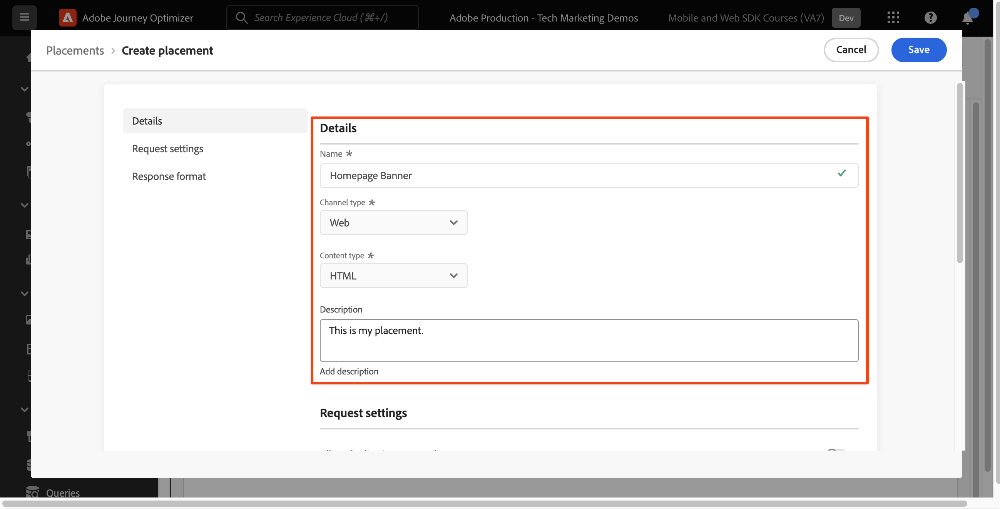
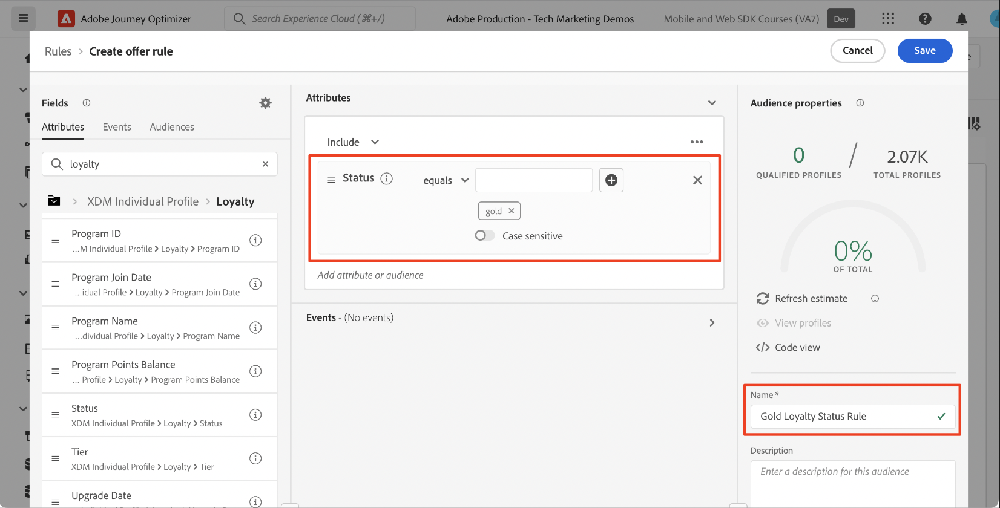
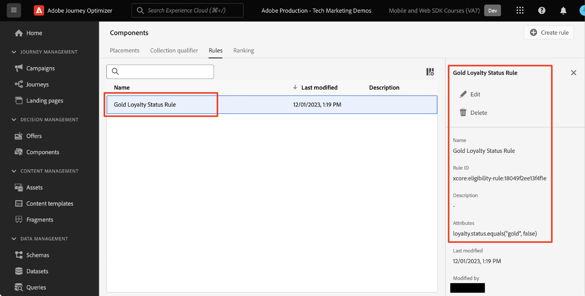
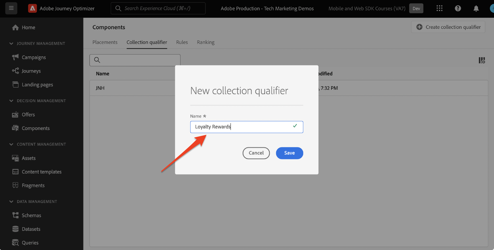

# Platform Web SDK を使用した意思決定管理の設定

Platform Web SDK を使用して、Adobe Journey Optimizerの意思決定管理機能を実装する方法を説明します。 このガイドでは、基本的な意思決定管理の前提条件、設定の詳細な手順およびロイヤルティステータスに基づくユースケースを詳しく説明します。

このチュートリアルに従うと、Journey Optimizer ユーザーは意思決定管理機能を使用できるようになり、顧客とのやり取りのパーソナライズ機能と関連性が高まります。


## 学習内容

このレッスンを終了すると、次の操作を実行できます。

* Adobe Journey Optimizer内の意思決定管理の中心概念とAdobe Experience Platform Web SDK との統合を把握します。

* Journey Optimizerとのシームレスな統合を確実に行い、Offer decisioning用に Web SDK を設定する手順を説明します。

* ロイヤルティステータスオファーを中心とした詳細なユースケースを探索し、オファー、決定およびプレースメントの作成および管理に関するインサイトを得ます。

* 意思決定管理フレームワーク内の重要な用語とその意味を理解します。

* 適切なオファーを適切なユーザーに配信する際の、決定ルール、コレクション修飾子、フォールバックオファーの重要性を理解します。

* シミュレーションやカスタムイベントデータ収集などの高度なトピックを掘り下げ、オファー配信メカニズムをテスト、検証および強化できるようにします。

## 前提条件

このセクションのレッスンを完了するには、まず次の操作を行う必要があります。

* Adobe Journey Optimizer Ultimate （Journey OptimizerとOffer decisioning）またはAdobe Experience PlatformおよびOffer decisioningアドオンへのアクセス権が組織にあることを確認します。

* Platform Web SDK の初期設定について、すべてのレッスンを完了してください。

* 組織のEdge Decisioning を有効にします。

* プレースメントを設定し、決定範囲の JSON 内でプレースメント ID とアクティビティ ID をインスタンス化する方法を理解します。

## 制限事項

イベントベースのオファーは、現在Adobe Journey Optimizerではサポートされていません。 イベントに基づいて決定ルールを作成した場合、それをオファーに適用することはできません。

## 意思決定管理へのアクセスの許可

意思決定管理機能へのアクセス権を付与するには、**製品プロファイル** を作成し、対応する権限をユーザーに割り当てる必要があります。 [Journey Optimizer ユーザーと権限の管理について詳しくは、この節を参照してください ](https://experienceleague.adobe.com/ja/docs/journey-optimizer/using/access-control/privacy/high-low-permissions#decisions-permissions)。

## データストリームの設定

Platform Web SDK で意思決定管理アクティビティを配信するには、Offer decisioningを **datastream** 設定で有効にする必要があります。

データストリームでOffer decisioningを設定するには：

1. [ データ収集 ](https://experience.adobe.com/#/data-collection) インターフェイスに移動します。

1. 左側のナビゲーションで「**データストリーム**」を選択します。

1. 以前に作成した Luma Web SDK データストリームを選択します。

   

1. **2&rbrace;Adobe Experience Platform サービス** 内の「編集 **を選択します。**

   

1. 「**Offer decisioning**」ボックスをオンにします。

   

1. 「**保存**」を選択します。

これにより、**Adobe Experience Platform Edge** でJourney Optimizerのインバウンドイベントが正しく処理されます。

## 意思決定管理の SDK の設定

意思決定管理には、Web SDK 実装タイプに応じて、追加の SDK 手順が必要です。 意思決定管理の SDK を設定する際に使用できるオプションは 2 つあります。

* SDK スタンドアロンインストール
   1. `decisionScopes` で `sendEvent` アクションを設定します。

      ```javascript
      alloy("sendEvent", {
         ...
         "decisionScopes": [
            "[DECISION SCOPE 1]",
            "[DECISION SCOPE 2]"
         ]
      })
      ```

* SDK タグのインストール
   1. データ収集インターフェイスに移動します。

   1. 左側のナビゲーションで「**タグ**」を選択します。

      

   1. **タグプロパティ** を選択します。

   1. **ルール** を作成します。
      * Platform Web SDK **イベントを送信アクション** を追加し、関連する `decisionScopes` をアクションの設定に追加します。

   1. 設定したすべての関連する **ルール**、**データ要素**、**拡張機能** を含む **ライブラリ** を作成して公開します。

## 用語

まず、意思決定管理インターフェイスで使用される用語を理解する必要があります。

* **キャッピング**：オファーの表示頻度を指示する制約。 2 種類：
   * 合計制限数：ターゲットオーディエンス全体で 1 つのオファーを表示できる最大回数。
   * プロファイルキャップ：特定のユーザーに対してオファーを表示できる回数。
* **コレクション**：マーケターが設定した特定の条件（オファーカテゴリなど）別にグループ化されたオファーのサブセット。
* **決定**：オファーの選択を指示するロジック。
* **決定ルール**：ユーザーの実施要件を確認するためのオファーに対する制約。
* **実施要件を満たすオファー**：事前に設定された制約に一致し、ユーザーに表示できるオファー。
* **意思決定管理**：ビジネスロジックと決定ルールを使用して、パーソナライズされたオファーを作成し、配信するシステム。
* **フォールバックオファー**：ユーザーがコレクション内のどのオファーにも適合しない場合に表示されるデフォルトのオファー。
* **オファー**：ビューアを決定する潜在的な実施要件ルールを含むマーケティングメッセージ。
* **オファーライブラリ**：オファー、決定および関連するルールを管理する一元的なリポジトリです。
* **パーソナライズされたオファー**：実施要件の制約に基づいてカスタマイズされたカスタムマーケティングメッセージ。
* **プレースメント**：オファーがユーザーに表示される設定またはシナリオ。
* **優先度**：実施要件やキャッピングなどの様々な制約を考慮したオファーのランキング指標。
* **表示域**：チャネル固有の情報（場所や言語など）。オファーの表示をガイドします。

## ユースケースの概要 – ロイヤルティ報酬

このレッスンでは、サンプルのロイヤルティ報酬ユースケースを実装して、Web SDK を使用した意思決定管理を理解します。

この使用例では、一元化されたオファーライブラリと意思決定管理の意思決定エンジンを利用して、Journey Optimizerが顧客に最適なオファーを提供する方法をより深く理解できます。

>[!NOTE]
>
> このチュートリアルは実装者向けなので、このレッスンにはJourney Optimizerでの実質的なインターフェイス作業が含まれていることは注目に値します。 通常、このようなインターフェイスタスクはマーケターが処理しますが、長期的には意思決定管理キャンペーンの作成に責任を負わない場合でも、実装者がプロセスに関するインサイトを得ることは有益です。

## コンポーネント

オファーの作成を開始する前に、いくつかの前提条件コンポーネントを定義する必要があります。

### ロイヤルティオファーのプレースメントの作成

**プレースメント** は、オファーの表示に使用するコンテナです。 この例では、Luma サイトの上部にプレースメントを作成します。

プレースメントのリストには&#x200B;**コンポーネント**&#x200B;メニューからアクセスできます。フィルターは、特定のチャネルやコンテンツに従ってプレースメントを取得するのに役立ちます。


プレースメントを作成するには、次の手順に従います。

1. 「**プレースメントを作成**」をクリックします。

   

1. プレースメントのプロパティを定義します。
   * **名前**：プレースメントの名前。例のプレースメントを「ホームペ *ジのバナー」と呼びま* ょう。
   * **チャネルタイプ**：プレースメントが使用されるチャネル。 オファーは Luma *web サイトに表示されるので、* の web を使用します。
   * **コンテンツタイプ**：プレースメントに表示できるコンテンツのタイプ（テキスト、HTML、画像リンク、JSON のいずれか）。 オファーには *のHTML* 使用できます。
   * **説明**：プレースメントの説明（オプション）。

   

1. 「**保存**」をクリックします。
1. プレースメントが作成されると、プレースメント リストに表示されます。
1. 新しいプレースメントを含む行を選択し、プレースメント ID をメモします。これは、決定範囲内での設定に必要になる場合があります。

    を参照

### ロイヤルティステータスの決定ルール

**決定ルール** は、オファーを提示する条件を指定します。 この例では、ユーザーのロイヤルティステータスに応じて異なるオファーを提供する決定ルールを作成します。

決定ルールのリストには、**コンポーネント** メニューからアクセスできます。

決定ルールを作成するには、次の手順に従います。

1. 「**ルール**」タブに移動し、「**ルールを作成**」をクリックします。

   

1. 最初のルールに「*ゴールドロイヤルティステータスルール*」という名前を付けましょう。 XDM フィールドを使用してルールを定義できます。 Adobe Experience Platform **セグメントビルダー** は、ルール条件の作成に使用できる直感的なインターフェイスです。

   

1. 「**保存**」をクリックして、ルール条件を確定します。
1. 新しく保存した「*ゴールドロイヤルティステータスルール*」が **ルールリスト** に表示されます。 選択すると、プロパティが表示されます。

   

1. 次に、ユースケースに残りのロイヤルティオファールール条件を作成します。


### コレクション修飾子

**コレクション修飾子** を使用すると、オファーライブラリ内のオファーを簡単に整理および検索できます。 この例では、ロイヤルティ報酬オファーにコレクション修飾子を追加して、オファー組織を改善します。

コレクション修飾子のリストには、**コンポーネント** メニューからアクセスできます。

ロイヤルティ報酬コレクション修飾子を作成するには、次の手順に従います。

1. 「**コレクション修飾子**」タブに移動し、「**コレクション修飾子を作成**」をクリックします。

   

1. コレクション修飾子に「*ロイヤルティ報酬*」という名前を付けましょう

   

1. 新しいコレクション修飾子が「**コレクション修飾子** タブに表示されます

## オファー

次に、ロイヤルティ報酬オファーを作成します。

オファーのリストには、「**オファー** メニューでアクセスできます。


### 様々なロイヤルティ層用のオファーの作成

まず、様々な Luma ロイヤルティ層用にパーソナライズされたオファーを作成します。

最初の **オファー** を作成するには、次の手順に従います。

1. 「**オファーを作成**」をクリックし、「**パーソナライズされたオファー**」を選択します。

1. 最初のオファーに「*Luma ロイヤルティ層 – ゴールド*」という名前を付けましょう。 このオファーの開始日時/終了日時を指定する必要があります。 また、**コレクション修飾子** 「*ロイヤルティ報酬*」をオファーに関連付けて、**オファーライブラリ** 内をより適切に整理できるようにする必要があります。 その後、「**次へ**」をクリックします。

   

1. 次に、**表示域** を追加して、オファーの表示場所を定義する必要があります。 **web チャネル** を選択します。 また、以前に設定した「*ホームページバナー*」 **プレースメント** を選択します。 選択した **プレースメント** はHTMLタイプなので、HTML、JSON、TEXT の各コンテンツをエディターに直接追加し、「**カスタム**」ラジオボタンを使用してオファーを作成できます。

   

1. オファーコンテンツを **式エディター** で直接編集します。 このプレースメントには、HTML、JSON、TEXT のいずれかのコンテンツを追加できます。 エディターの下部で、コンテンツタイプに応じて正しい **モード** を選択してください。 また、**validate** をクリックして、エラーがないことを確認することもできます。

   

1. また、式エディターを使用して、Adobe Experience Platformに保存されている属性を取得することもできます。 オファーのコンテンツにプロファイルの名を追加して、1:1 レベルのロイヤルティメンバー向けにパーソナライズしましょう。

   

1. 制約を追加して、「*ゴールドのロイヤルティステータスルール*」に適合するプロファイルにのみオファーを表示します。

   

1. オファーのレビューが完了したら、「**終了**」をクリックします。 「**保存して承認**」を選択します。

次に、様々な Luma ロイヤルティ層用に残りのオファーを作成します

### フォールバックオファー

引き続き、Luma サイトへの Luma 以外のロイヤルティ訪問者にオファーを提供する必要があります。 これを行うには、キャンペーンの **フォールバックオファー** を設定します。

フォールバックオファーを作成するには、次の手順に従います。

1. 「**オファーの作成**」をクリックし、「**フォールバックオファー**」を選択します。
   <!--
      
   -->
1. フォールバックオファーに「Luma 以外のロイヤルティ *という名前を付け* しょう。 また、以前に作成した **コレクション修飾子**、「*ロイヤルティ報酬*」をフォールバックオファーに関連付けて、オファーの組織を容易にすることもできます。
   <!--
      
   -->
1. フォールバックオファーのコンテンツを **式エディター** に追加します。 このプレースメントには、HTML、JSON、TEXT の各コンテンツを追加できます。 エディターの下部で、コンテンツタイプに応じて正しい **モード** を選択してください。 また、**validate** をクリックして、エラーがないことを確認することもできます。
   <!--
      
   -->
1. すべてが正しく設定されている場合は、**終了**、**保存して承認** の順にクリックします。
<!--
   
-->

## 決定

**決定** とは、顧客が利用できる最適なオファーをターゲットに応じて選択するオファーのコンテナです。

決定のリストは、**オファー** メニューの「**決定**」タブに表示されます。
<!--
   
-->

### ロイヤルティオファーの決定の作成

Luma ロイヤルティ報酬のユースケースの決定を作成しましょう。

決定を作成するには、次の手順に従います。

1. **決定を作成** をクリックします。
   <!--
      
   -->
1. 決定を「*Luma ロイヤルティオファーの 12 月*」と呼びましょう。 オファーは 1 か月間実行されるので、ここで指定します。
   <!--
      
   -->
1. 次に、**決定範囲** を定義する必要があります。 まず、プレースメントを選択します。 以前に作成した「ホームページバナー *」を使用でき* す。
   <!--
      
   -->
1. 次に、決定範囲に **評価条件** を追加する必要があります。 「**追加**」をクリックし、以前に作成した「*ロイヤルティ報酬*」**コレクションを選択します。これには、考慮するすべてのロイヤルティオファーが含まれています。
   <!--
      
   -->
1. 「*ロイヤルティ報酬*」コレクション内で実施要件フィールドを使用して、オファー配信を Luma 訪問者のサブセットに制限できます。 ただし、このユースケースでは、すべての訪問者にいずれかのオファーを受け取ってもらいます。 ロイヤルティ以外のすべての訪問者に対して **フォールバックオファー** を設定しました。 実施要件を「なし」に設定します。
   <!--
      
   -->
1. また、「**ランキングメソッド**」フィールドを使用して、ユーザーとプレースメントの組み合わせに対して複数のオファーが適格な場合に、各 Luma 訪問者に最適なオファーを選択できます。 この使用例では、**オファーの優先度** メソッドを使用します。このメソッドは、オファーで定義された値を使用して最適なオファーを提供します。
   <!--
      
   -->
1. 次に、決定に **フォールバックオファー** を追加します。 フォールバックオファーは、Luma ロイヤルティオーディエンスに該当しない場合に Luma の訪問者に表示されるデフォルトのオファーであることを思い出してください。 「*ホームページバナー*」プレースメントに使用可能なフォールバックオファーのリストから、「*Luma 以外のロイヤルティ*」を選択します。
   <!--
      
   -->
1. 決定をアクティブ化する前に、決定範囲、フォールバックオファー、使用可能なオファーのプレビューを確認し、認定プロファイルを推定します。 問題がなければ、「完了 **」をクリックし、「保存してアクティベート** をクリックして **アクティベート** します。
<!--
   
-->

## シミュレーション

ベストプラクティスとして、Luma ロイヤルティ決定ロジックを検証して、適切なオファーが適切なロイヤルティオーディエンスに配信されるようにします。 この検証を行うには、**テストプロファイル** を使用します。 新しいオファーバージョンを実稼動環境にプッシュする前に、テストプロファイルを通じてオファーへの変更をテストすることもお勧めします。

テストを開始するには、**オファー** メニューから「**シミュレーション**」タブを選択します。

### ロイヤルティオファーのテスト

1. シミュレーションに使用するテストプロファイルを選択します。 **プロファイルを管理** をクリックします。 [ オファーテスト用の新しいテストプロファイルを作成または指定するには、このガイドに従ってください ](https://experienceleague.adobe.com/ja/docs/journeys/using/building-journeys/about-journey-building/creating-test-profiles#create-test-profiles-csv)。
   <!--
      
   -->
1. 1 つ以上のテストプロファイルをシミュレーションに追加し、選択内容を保存します。 ユースケーステストでは、Luma ロイヤルティ報酬オーディエンスごとにテストプロファイルが設定されていることを確認する必要があります。
   <!--
      
   -->
1. テストする決定範囲を選択します。 「**決定範囲を追加**」を選択します。
   <!--
      
   -->
1. 以前に作成した「*ホームページバナー*」プレースメントを選択します。
   <!--
      
   -->
1. 使用可能な決定が表示され、以前に作成した「*December Luma ロイヤルティオファー*」決定を選択し、「追加 **をクリックし** す。
   <!--
      
   -->
1. テストプロファイルを選択したら、「**結果を表示**」をクリックします。 「*Luma ロイヤルティオファー 12 月*」の決定に対して選択したテストプロファイルに、利用可能な最適なオファーが表示されます。
   <!--
      
   -->
1. 別のテストプロファイルを選択し、「**結果を表示**」をクリックします。 テストプロファイルのロイヤルティ層に応じて、別のシミュレートされたオファーが表示されるのが理想です。

## Adobe Experience Platform Debuggerを使用した意思決定管理の検証

Chromeと Firefox の両方で利用できる **Adobe Experience Platform Debugger** 拡張機能は、web ページを分析して、Adobe Experience Cloud ソリューションの実装に関する問題を特定します。

Luma サイトでデバッガーを使用して、実稼動環境で意思決定ロジックを検証できます。 この検証は、ロイヤルティ報酬のユースケースを立ち上げて実行し、すべてが正しく設定されていることを確認した後のベストプラクティスです。

[ こちらのガイドを使用して、ブラウザーでデバッガーを設定する方法を説明します ](https://experienceleague.adobe.com/ja/docs/platform-learn/data-collection/debugger/overview)。

デバッガーを使用して検証を開始するには：

1. オファープレースメントを使用して Luma web ページに移動します。
   <!--
      
   -->
1. Web ページで、**Adobe Experience Platform debugger** を開きます。
   <!--
      
   -->
1. **概要** に移動します。 **データストリーム ID** が、Offer decisioningを有効にした **Adobeデータ収集** の **データストリーム** と一致することを確認します。
   <!--
      
   -->
1. **ソリューション** の下の **Experience PlatformWeb SDK** に移動します。
   <!--
      
   -->
1. 「**設定**」タブ内で、「デバッグを有効にする **を切り替え** ます。 これにより、**Adobe Experience Platform Assurance** セッション内のセッションのログが有効になります。
   <!--
      
   -->
1. その後、様々な Luma ロイヤルティアカウントでサイトにログインし、デバッガーを使用して、**Adobe Experience Platform Edge network** に送信されたリクエストを検証できます。 ログトラッキング用に、これらのリクエストをすべて **Assurance** に取り込む必要があります。
<!--
   
-->

[次へ： ](setup-consent.md)

>[!NOTE]
>
>Adobe Experience Platform Web SDK の学習に時間を費やしていただき、ありがとうございます。 ご不明な点がある場合や、一般的なフィードバックを投稿したい場合、または今後のコンテンツに関するご提案がある場合は、この [Experience League コミュニティ ディスカッションの投稿でお知らせください ](https://experienceleaguecommunities.adobe.com/t5/adobe-experience-platform-data/tutorial-discussion-implement-adobe-experience-cloud-with-web/td-p/444996?profile.language=ja)
