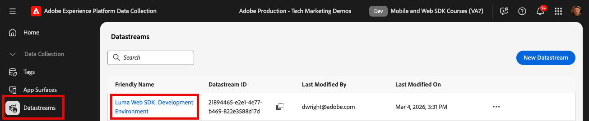
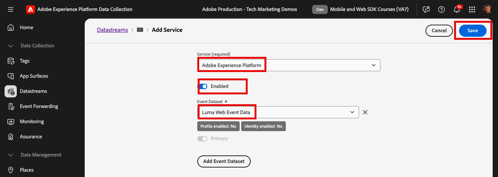

# Web SDKを使用したExperience Platformへのデータのストリーミング

Platform Web SDK を使用して Adobe Experience Platform に web データをストリーミングする方法について説明します。

Experience Platformは、Adobe Real-Time Customer Data Platform、Adobe Customer Journey Analytics、Adobe Journey Optimizerなど、すべての新しいExperience Cloud アプリケーションのバックボーンです。 これらのアプリケーションは、web データ収集の最適な方法として Platform Web SDKを使用するように設計されています。

Experience Platformは、以前に作成したのと同じ XDM スキーマを使用して、Luma web サイトからイベントデータを取得します。 そのデータが Platform Edge Networkに送信されると、データストリーム設定によってExperience Platformに転送できます。

## 学習目標

このレッスンを最後まで学習すると、以下の内容を習得できます。

* Adobe Experience Platform内でのデータセットの作成
* Web SDK データをAdobe Experience Platformに送信するためのデータストリームを設定する
* リアルタイム顧客プロファイル用のストリーミング web データを有効にする
* データが Platform データセットとリアルタイム顧客プロファイルの両方に到達したことを検証します
* Platform へのサンプルロイヤルティプログラムデータの取り込み
* シンプルな Platform オーディエンスの作成

## 前提条件

このレッスンを完了するには、まず次の操作を行う必要があります。

* Real-Time Customer Data Platform、Journey Optimizer、Customer Journey AnalyticsなどのAdobe Experience Platform アプリケーションにアクセスできる
* このチュートリアルの初期設定とタグの設定の節で前のレッスンを完了します。

>[!NOTE]
>
>Platform アプリケーションがない場合は、このレッスンをスキップするか、先に読み進めることができます。

## データセットの作成

Adobe Experience Platformに正常に取り込まれたすべてのデータは、データレイク内にデータセットとして保持されます。 [ データセット ](https://experienceleague.adobe.com/ja/docs/experience-platform/catalog/datasets/overview) は、データのコレクション、通常、スキーマ（列）とフィールド（行）を含むテーブルのストレージおよび管理用の構成体です。 データセットには、保存するデータの様々な側面を記述したメタデータも含まれます。

Luma web イベントデータのデータセットを設定しましょう。

1. [Experience Platform](https://experience.adobe.com/platform/) または [Journey Optimizer](https://experience.adobe.com/journey-optimizer/) インターフェイスに移動します
1. このチュートリアルに使用する開発用サンドボックスに属していることを確認します
1. 左側のナビゲーションから **[!UICONTROL データ管理/データセット]** を開きます
1. **[!UICONTROL データセットを作成]** を選択します。

   

1. 「**[!UICONTROL スキーマからデータセットを作成]**」オプションを選択します

   

1. `Luma Web Event Data` 前のレッスン [ で作成した ](configure-schemas.md) スキーマを選択し、「**[!UICONTROL 次へ]**」を選択します。

   

1. データセットの **[!UICONTROL 名前]** とオプションの **[!UICONTROL 説明]** を入力します。 この演習では、`Luma Web Event Data` を使用し、「**[!UICONTROL 終了]**」を選択します

   

これで、Platform Web SDK実装からデータの収集を開始するようにデータセットが設定されました。

## データストリームの設定

[!UICONTROL  データストリーム ] を設定して、[!UICONTROL Adobe Experience Platform] にデータを送信できるようになりました。 データストリームは、タグプロパティ、Platform Edge NetworkおよびExperience Platform データセットの間のリンクです。

1. [ データ収集 ](https://experience.adobe.com/#/data-collection){target="blank"} インターフェイスを開きます
1. 左側のナビゲーションから **[!UICONTROL データストリーム]** を選択します
1. [ データストリームの設定 ](configure-datastream.md) のレッスン（）で作成したデータストリームを開きます `Luma Web SDK: Development Environment`

   。

1. 「**[!UICONTROL サービスを追加]**」を選択します。
   
1. **[!UICONTROL Adobe Experience Platform]** を **[!UICONTROL サービス]** として選択
1. **[!UICONTROL 有効]** を選択します
1. `Luma Web Event Data` イベントデータセット **[!UICONTROL として「]**」を選択します

1. 「**[!UICONTROL 保存]**」を選択します

   

タグプロパティにマッピングされた [Luma デモ web サイト ](https://luma.enablementadobe.com) でトラフィックを生成すると、データがExperience Platformのデータセットに入力されます。

## データセットの検証

この手順は、データがデータセットに取り込まれていることを確認するために重要です。 データセットに送信されたデータのパスを検証する方法は複数あります。

* [!UICONTROL Experience Platform Debugger] を使用した検証
* [!UICONTROL Experience Platform Assurance] を使用した検証
* [!UICONTROL  データセットをプレビュー ] を使用して検証
* [!UICONTROL  クエリサービス ] を使用した検証

### Debugger

これらの手順は、[ デバッガーのレッスン ](validate-with-debugger.md) で行った手順と多少同じです。 ただし、データはデータストリームで有効にした後にのみ Platform に送信されるので、さらにサンプルデータを生成する必要があります。

1. [Luma デモ web サイト ](https://luma.enablementadobe.com) を開き、[!UICONTROL Experience Platform Debugger] 拡張機能アイコンを選択します

1. *Debugger を使用した検証* のレッスンの説明に従って、タグプロパティを [ 自分の ](validate-with-debugger.md) 開発環境にマッピングするように Debugger を設定します

   

1. Web サイトを参照します。 製品をいくつか表示し、買い物かごに追加します

1. デバッガーで、「events」行を開いて、XDM 変数の一部を探します

データがブラウザーを離れ、データストリームに送信されたことを検証しました。

### Assurance

データストリームでサービスを有効にしたので、Assuranceでは他にも次のように表示されます。

1. Assurance セッションを開くか、新しいセッションを開始します
1. **[!UICONTROL datastream]** イベントを開きます
1. ここでは、このレッスンの前半で作成したデータストリームの ID など、Platform サービスの設定を確認できます。

   

1. **[!UICONTROL com.adobe.streaming.validation]** ベンダーに属する **[!UICONTROL generic]** イベントを開きます。 これは、リクエストが、付随する XDM データと共にデータセットに送信されたことを示しています

   

リクエストが Platform Edge Networkによって受信され、Platform データセットに転送されたことを検証しました。

### データセットのプレビュー

次に、実際にデータセットを見てみましょう。 簡単なオプションとして、**[!UICONTROL データセットをプレビュー]** 機能を使用できます。 Web SDK データは、データレイクにマイクロバッチされ、Platform インターフェイスで定期的に更新されます。 生成したデータが表示されるまで、10～15 分かかる場合があります。

1. [Experience Platform](https://experience.adobe.com/platform/) インターフェイスの左側のナビゲーションで **[!UICONTROL データ管理/データセット]** を選択して、**[!UICONTROL データセット]** ダッシュボードを開きます。

   ダッシュボードリストは、組織で使用可能なすべてのデータセットを管理します。リストに表示された各データセットに関する詳細（名前、データセットが適用されるスキーマ、最新の取り込み実行のステータスなど）が表示されます。

1. `Luma Web Event Data` データセットを選択して、その **[!UICONTROL データセットアクティビティ]** 画面を開きます。

   

   アクティビティ画面には、消費されるメッセージの割合を視覚化したグラフと、成功および失敗したバッチのリストが含まれます。
1. これは新しいデータセットなので、レコードが取り込まれたバッチが 1 つでも表示される場合は、正符号になります。

1. **[!UICONTROL データセットアクティビティ]** 画面で、画面の右上隅付近の **[!UICONTROL データセットをプレビュー]** を選択し、最大 100 行のデータをプレビューします。 データセットが空の場合、プレビューリンクは非アクティブになります。

   

1. クエリを実行して、データセットから最近の 100 行のデータを取り込みます。 web.webPageDetails.name など、個々の XDM フィールドにドリルダウンできます。

   

### データのクエリ

データに対してカスタムクエリを実行し、データ取り込みを検証することもできます。

1. [Experience Platform](https://experience.adobe.com/platform/) インターフェイスの左側のナビゲーションで **[!UICONTROL データ管理/ クエリ]** を選択して、**[!UICONTROL クエリ]** 画面を開きます。
1. 「**[!UICONTROL クエリを作成]**」を選択します。
1. まず、クエリを実行して、データレイク内のテーブルのすべての名前を表示します。 クエリエディターに `SHOW TABLES` と入力し、再生アイコンをクリックしてクエリを実行します。
1. 結果で、テーブルの名前がどのように `luma_web_event_data` しいかに注目してください
1. 次に、テーブルを参照する単純なクエリでテーブルをクエリします（デフォルトでは、クエリは 100 件の結果に制限されます）。`SELECT * FROM "luma_web_event_data"`
1. しばらくすると、web データのサンプルレコードが表示されます。

   

>[!ERROR]
>
>「テーブルがプロビジョニングされていません」というエラーが発生した場合は、テーブルの名前を再度確認します。 また、データのマイクロバッチがまだデータレイクに到達していない可能性もあります。 10～15 分後にもう一度試してください。

>[!INFO]
>
>  クエリサービスは、データエンジニアやアナリストにとって非常に強力なツールです。 Adobe Experience Platformのクエリサービスについて詳しくは、Platform チュートリアルの節の [ データの調査 ](https://experienceleague.adobe.com/en/docs/platform-learn/tutorials/queries/explore-data) を参照してください。

>[!NOTE]
>
>Adobe Experience Platform Web SDKの学習にご協力いただき、ありがとうございます。 ご不明な点がある場合や、一般的なフィードバックを共有したい場合、または今後のコンテンツに関するご提案がある場合は、この [Experience League Community Discussion の投稿でお知らせください ](https://experienceleaguecommunities.adobe.com/adobe-experience-platform-18/tutorial-discussion-implement-adobe-experience-cloud-with-web-sdk-tutorial-248848)
