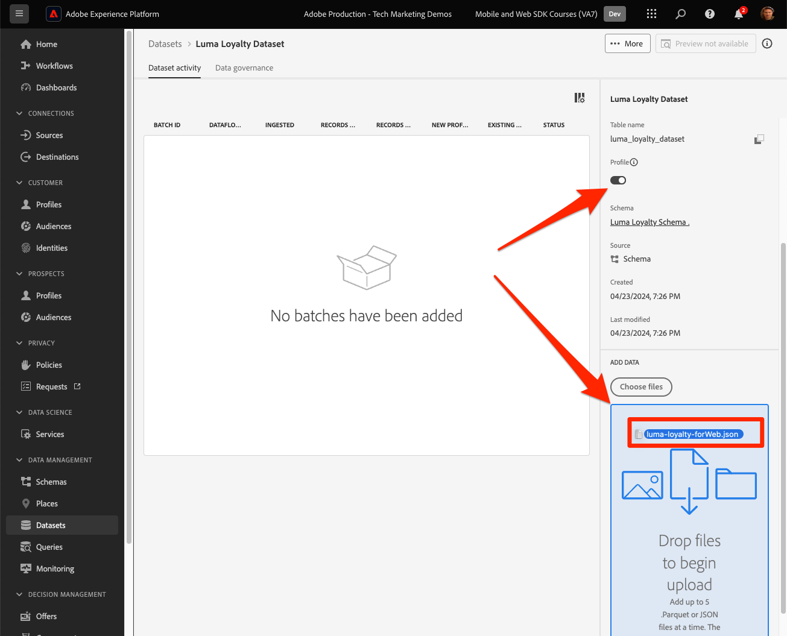
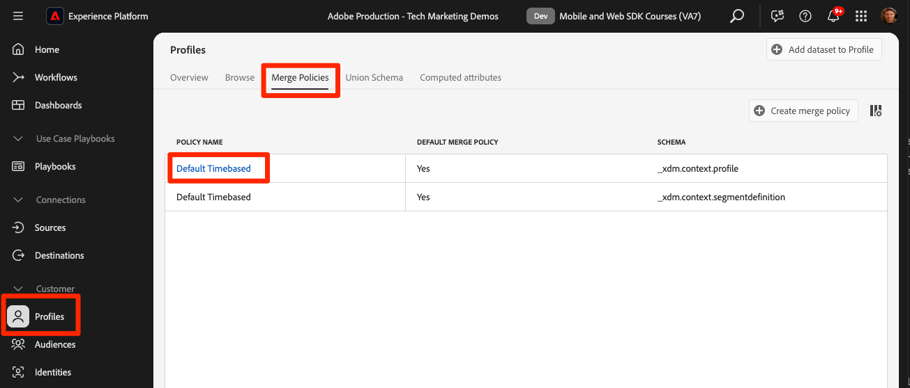
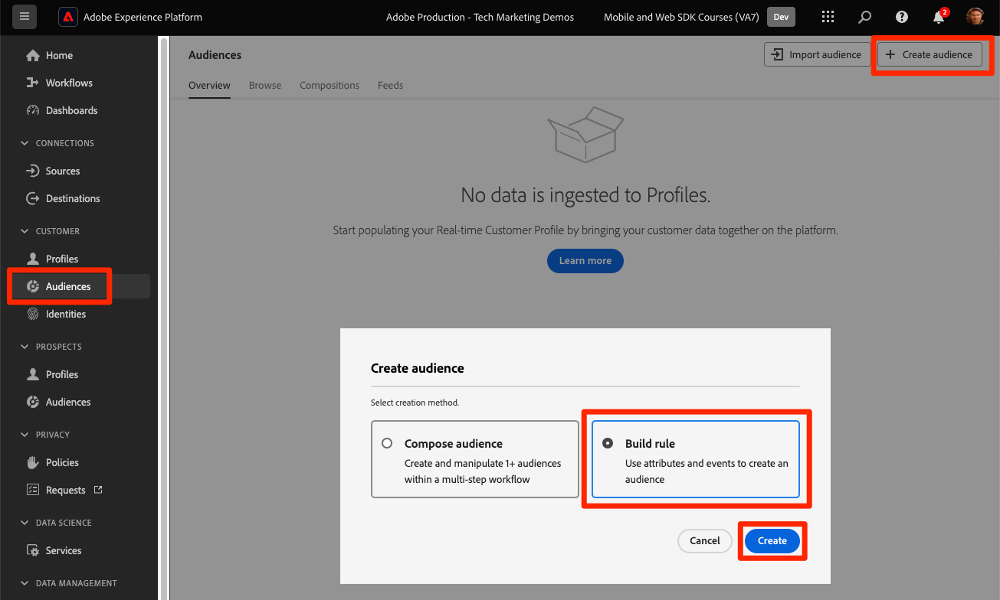

# Web SDKを使用したExperience Platformへのデータのストリーミング

Platform Web SDK を使用して Adobe Experience Platform に web データをストリーミングする方法について説明します。

Experience Platformは、Adobe Real-Time Customer Data Platform、Adobe Customer Journey Analytics、Adobe Journey Optimizerなど、すべての新しいExperience Cloud アプリケーションのバックボーンです。 これらのアプリケーションは、web データ収集の最適な方法として Platform Web SDKを使用するように設計されています。

Experience Platformは、以前に作成したのと同じ XDM スキーマを使用して、Luma web サイトからイベントデータを取得します。 そのデータが Platform Edge Networkに送信されると、データストリーム設定によってExperience Platformに転送できます。

## 学習目標

このレッスンを最後まで学習すると、以下の内容を習得できます。

* Adobe Experience Platform内でのデータセットの作成
* Web SDK データをAdobe Experience Platformに送信するためのデータストリームを設定する
* リアルタイム顧客プロファイル用のストリーミング web データを有効にする
* データが Platform データセットとリアルタイム顧客プロファイルの両方に到達したことを検証します
* Platform へのサンプルロイヤルティプログラムデータの取り込み
* シンプルな Platform オーディエンスの作成

## 前提条件

このレッスンを完了するには、まず次の操作を行う必要があります。

* Real-Time Customer Data Platform、Journey Optimizer、Customer Journey AnalyticsなどのAdobe Experience Platform アプリケーションにアクセスできる
* このチュートリアルの初期設定とタグの設定の節で前のレッスンを完了します。

>[!NOTE]
>
>Platform アプリケーションがない場合は、このレッスンをスキップするか、先に読み進めることができます。

## データセットの作成

Adobe Experience Platformに正常に取り込まれたすべてのデータは、データレイク内にデータセットとして保持されます。 [ データセット ](https://experienceleague.adobe.com/ja/docs/experience-platform/catalog/datasets/overview) は、データのコレクション、通常、スキーマ（列）とフィールド（行）を含むテーブルのストレージおよび管理用の構成体です。 データセットには、保存するデータの様々な側面を記述したメタデータも含まれます。

Luma web イベントデータのデータセットを設定しましょう。

1. [Experience Platform](https://experience.adobe.com/platform/) または [Journey Optimizer](https://experience.adobe.com/journey-optimizer/) インターフェイスに移動します
1. このチュートリアルに使用する開発用サンドボックスに属していることを確認します
1. 左側のナビゲーションから **[!UICONTROL データ管理/データセット]** を開きます
1. **[!UICONTROL データセットを作成]** を選択します。

   

1. 「**[!UICONTROL スキーマからデータセットを作成]**」オプションを選択します

   

1. [ 前のレッスン ](configure-schemas.md) で作成した `Luma Web Event Data` スキーマを選択し、「**[!UICONTROL 次へ]**」を選択します。

   

1. データセットの **[!UICONTROL 名前]** とオプションの **[!UICONTROL 説明]** を入力します。 この演習では、`Luma Web Event Data` を使用し、「**[!UICONTROL 終了]**」を選択します

   

これで、Platform Web SDK実装からデータの収集を開始するようにデータセットが設定されました。

## データストリームの設定

[!UICONTROL &#x200B; データストリーム &#x200B;] を設定して、[!UICONTROL Adobe Experience Platform] にデータを送信できるようになりました。 データストリームは、タグプロパティ、Platform Edge NetworkおよびExperience Platform データセットの間のリンクです。

1. [ データ収集 ](https://experience.adobe.com/#/data-collection){target="blank"} インターフェイスを開きます
1. 左側のナビゲーションから **[!UICONTROL データストリーム]** を選択します
1. [ データストリームの設定 ](configure-datastream.md) のレッスン（）で作成したデータストリームを開きます `Luma Web SDK`

   。

1. 「**[!UICONTROL サービスを追加]**」を選択します。
   
1. **[!UICONTROL Adobe Experience Platform]** を **[!UICONTROL サービス]** として選択
1. **[!UICONTROL イベントデータセット]** として「`Luma Web Event Data`」を選択します

1. 「**[!UICONTROL 保存]**」を選択します。

   

タグプロパティにマッピングされた [Luma デモサイト ](https://luma.enablementadobe.com/content/luma/us/en.html) でトラフィックを生成すると、Experience Platformのデータセットにデータが入力されます。

## データセットの検証

この手順は、データがデータセットに取り込まれていることを確認するために重要です。 データセットに送信されたデータの検証には、2 つの側面があります。

* [!UICONTROL Experience Platform Debugger] を使用した検証
* [!UICONTROL &#x200B; データセットをプレビュー &#x200B;] を使用して検証
* [!UICONTROL &#x200B; クエリサービス &#x200B;] を使用した検証

### Experience Platform Debugger

これらの手順は、[ デバッガーのレッスン ](validate-with-debugger.md) で行った手順と多少同じです。 ただし、データはデータストリームで有効にした後にのみ Platform に送信されるので、さらにサンプルデータを生成する必要があります。

1. [Luma デモサイト ](https://luma.enablementadobe.com/content/luma/us/en.html) を開き、[!UICONTROL Experience Platform Debugger] 拡張機能アイコンを選択します

1. [Debugger を使用した検証 ](validate-with-debugger.md) のレッスンの説明に従って、タグプロパティを *自分の* 開発環境にマッピングするように Debugger を設定します

   

1. 資格情報（`test@test.com`／`test`）を使用して Luma サイトにログインします。

1. [Luma のホームページ](https://luma.enablementadobe.com/content/luma/us/en.html)に戻ります。

1. デバッガーによって表示される Platform Web SDK ネットワークビーコン内で、「events」行を選択してポップアップで詳細を展開します

   

1. ポップアップ内で「identityMap」を検索します。 authenticatedState、id、および primary の 3 つのキーを持つ lumaCrmId が表示されます
   

これで、`Luma Web Event Data` データセットにデータが入力され、「データセットをプレビュー」の検証の準備が整いました。

### データセットのプレビュー

データが Platform のデータレイクに到達したことを確認するには、**[!UICONTROL データセットをプレビュー]** 機能を使用する簡単なオプションがあります。 Web SDK データは、データレイクにマイクロバッチされ、Platform インターフェイスで定期的に更新されます。 生成したデータが表示されるまで、10～15 分かかる場合があります。

1. [Experience Platform](https://experience.adobe.com/platform/) インターフェイスの左側のナビゲーションで **[!UICONTROL データ管理/データセット]** を選択して、**[!UICONTROL データセット]** ダッシュボードを開きます。

   ダッシュボードリストは、組織で使用可能なすべてのデータセットを管理します。リストに表示された各データセットに関する詳細（名前、データセットが適用されるスキーマ、最新の取得実行のステータスなど）が表示されます。

1. `Luma Web Event Data` データセットを選択して、その **[!UICONTROL データセットアクティビティ]** 画面を開きます。

   

   アクティビティ画面には、消費されるメッセージの割合を視覚化したグラフと、成功および失敗したバッチのリストが含まれます。

1. **[!UICONTROL データセットアクティビティ]** 画面で、画面の右上隅付近の **[!UICONTROL データセットをプレビュー]** を選択し、最大 100 行のデータをプレビューします。 データセットが空の場合、プレビューリンクは非アクティブになります。

   

   プレビューウィンドウの右側に、データセットのスキーマの階層表示が表示されます。

   

### データのクエリ

1. [Experience Platform](https://experience.adobe.com/platform/) インターフェイスで、左側のナビゲーションで **[!UICONTROL データ管理/クエリ]** を選択して **[!UICONTROL クエリ]** 画面を開きます。
1. 「**[!UICONTROL クエリを作成]**」を選択します。
1. まず、クエリを実行して、データレイク内のテーブルのすべての名前を表示します。 クエリエディターに `SHOW TABLES` と入力し、再生アイコンをクリックしてクエリを実行します。
1. 結果で、テーブルの名前が `luma_web_event_data` のようになります
1. 次に、テーブルを参照する単純なクエリでテーブルをクエリします（デフォルトでは、クエリは 100 件の結果に制限されます）。`SELECT * FROM "luma_web_event_data"`
1. しばらくすると、web データのサンプルレコードが表示されます。

>[!ERROR]
>
>「テーブルがプロビジョニングされていません」というエラーが発生した場合は、テーブルの名前を再度確認します。 また、データのマイクロバッチがまだデータレイクに到達していない可能性もあります。 10～15 分後にもう一度試してください。

>[!INFO]
>
>  Adobe Experience Platformのクエリサービスについて詳しくは、Platform チュートリアルの節の [ データの調査 ](https://experienceleague.adobe.com/ja/docs/platform-learn/tutorials/queries/explore-data) を参照してください。

## リアルタイム顧客プロファイルのデータセットとスキーマを有効にする

Real-Time Customer Data PlatformおよびJourney Optimizerのお客様に対して、次の手順では、リアルタイム顧客プロファイルのデータセットとスキーマを有効にします。 Web SDKからのデータストリーミングは、Platform に流入する多数のデータソースの 1 つになり、web データを他のデータソースと結合して 360 度の顧客プロファイルを作成する必要があります。 リアルタイム顧客プロファイルについて詳しくは、次の短いビデオをご覧ください。

>[!VIDEO](https://video.tv.adobe.com/v/27251?learn=on&captions=eng)

>[!CAUTION]
>
>独自の web サイトとデータを操作する場合は、リアルタイム顧客プロファイルに対してデータを有効にする前に、データのより堅牢な検証をお勧めします。

**データセットを有効にするには：**

1. 作成したデータセットを開きます `Luma Web Event Data`

1. **[!UICONTROL プロファイル切り替え]** を選択してオンにします

   

1. データセットを **[!UICONTROL 有効]** することを確認します

   

**スキーマを有効にするには：**

1. 作成したスキーマを開きます `Luma Web Event Data`

1. **[!UICONTROL プロファイル切り替え]** を選択してオンにします

   

1. 「**[!UICONTROL このスキーマのデータには、identityMap フィールドにプライマリ ID が含まれます]**」を選択します。

   >[!IMPORTANT]
   >
   >    リアルタイムプライマリプロファイルに送信されるすべてのレコードに顧客 ID が必要です。 通常、ID フィールドは、スキーマ内でラベル付けされます。 ただし、ID マップを使用する場合、ID フィールドはスキーマ内に表示されません。 このダイアログは、プライマリ ID を念頭に置いており、データの送信時に ID マップでプライマリ ID を指定することを確認するためのものです。 ご存知のように、Web SDKは、Experience Cloud ID （ECID）をデフォルトのプライマリ ID として、認証済み ID を利用可能な場合はプライマリ ID として持つ ID マップを使用します。

1. 選択 **[!UICONTROL 有効にする]**

   

1. 「**[!UICONTROL 保存]**」を選択して、更新されたスキーマを保存します

これで、プロファイルに対してスキーマも有効になります。

>[!IMPORTANT]
>
>    プロファイルに対してスキーマを有効にすると、サンドボックス全体をリセットまたは削除しない限り、スキーマを無効または削除することはできません。 また、この時点より後にフィールドをスキーマから削除することはできません。
>
>   
> 独自のデータを操作する場合は、次の順序で作業を行うことをお勧めします。
> 
> * まず、データセットにデータを取り込みます。
> * データ取り込みプロセス中に発生した問題（データの検証やマッピングの問題など）に対処します。
> * プロファイル用のデータセットとスキーマの有効化
> * 必要に応じて、データを再度取り込みます。

### プロファイルの検証

Platform インターフェイス（またはJourney Optimizer インターフェイス）で顧客プロファイルを検索して、データがリアルタイム顧客プロファイルに到達したことを確認できます。 名前が示すように、プロファイルはリアルタイムで入力されるため、データセット内のデータの検証のように遅延はありません。

最初に、サンプルデータをさらに生成する必要があります。 このレッスンの前の手順を繰り返し、タグプロパティにマッピングされたときに Luma web サイトにログインします。 Platform Web SDK リクエストを調べて、`lumaCRMId` でデータが送信されていることを確認します。

1. [Experience Platform](https://experience.adobe.com/platform/) インターフェイスの左側のナビゲーションで **[!UICONTROL 顧客]** / **[!UICONTROL プロファイル]** を選択します

1. **[!UICONTROL ID 名前空間]** として、`lumaCRMId` を使用します
1. Experience Platform Debugger で調べた呼び出しで渡された `lumaCRMId` の値（この場合は `b642b4217b34b1e8d3bd915fc65c4452`）をコピーして貼り付けます。

   

1. `lumaCRMId` のプロファイルに有効な値がある場合、プロファイル ID がコンソールに入力されます。

   

1. 各 ID のすべての **[!UICONTROL 顧客プロファイル]** を表示するには、メインウィンドウで **[!UICONTROL プロファイル ID]** を選択します。

   >[!NOTE]
   >
   >プロファイル ID のハイパーリンクを選択できます。行を選択すると、右側のメニューが開き、プロファイル ID のハイパーリンクを選択できます
   > 

   ここでは、`ECID` など、`lumaCRMId` にリンクされているすべての ID が表示されます。

   

これで、Experience Platform（およびReal-Time CDP）用の Platform Web SDKを有効にしました。 Journey Optimizer! とCustomer Journey Analytics!）。

## Edgeで評価されたオーディエンスの作成

Real-Time Customer Data PlatformおよびJourney Optimizerのお客様は、この演習を完了することをお勧めします。

Web SDK データを Platform に取り込むと、Adobe Experience Platformに取り込んだ他のデータソースによってデータが強化される場合があります。 例えば、ユーザーが Luma サイトにログインすると、Experience Platformで ID グラフが作成され、他のすべてのプロファイル対応データセットを結合してリアルタイム顧客プロファイルを作成できる場合があります。 これを実際に確認するには、サンプルのロイヤルティデータを含む別のデータセットをAdobe Experience Platformですばやく作成して、Real-Time Customer Data PlatformとJourney Optimizerでリアルタイム顧客プロファイルを使用できるようにします。 次に、このデータに基づいてオーディエンスを作成します。

### ロイヤルティスキーマの作成とサンプルデータの取り込み

あなたはすでに同様の演習をしたので、指示は簡単になります。

ロイヤルティスキーマを作成します。

1. 新しいスキーマの作成
1. **[!UICONTROL 基本クラス]** として [!UICONTROL &#x200B; 個人プロファイル &#x200B;] を選択します
1. スキーマに `Luma Loyalty Schema` という名前を付けます
1. [!UICONTROL &#x200B; ロイヤルティの詳細 &#x200B;] フィールドグループを追加します
1. [!UICONTROL &#x200B; デモグラフィックの詳細 &#x200B;] フィールドグループを追加します
1. 「`Person ID`」フィールドを選択し、`Luma CRM Id` [!UICONTROL ID 名前空間 &#x200B;] を使用して、[!UICONTROL ID] および [!UICONTROL プライマリ ID] としてマークします。
1. [!UICONTROL &#x200B; プロファイル &#x200B;] のスキーマを有効にします。 「プロファイル」切替スイッチが見つからない場合は、左上のスキーマ名をクリックしてみてください。
1. スキーマの保存

   

データセットを作成してサンプルデータを取り込むには：

1. `Luma Loyalty Schema` ージから新しいデータセットを作成
1. データセットに `Luma Loyalty Dataset` という名前を付けます
1. [!UICONTROL &#x200B; プロファイル &#x200B;] のデータセットを有効にする
1. サンプルファイル [luma-loyalty-forWeb.json](assets/luma-loyalty-forWeb.json) をダウンロードします。
1. ファイルをデータセットにドラッグ&amp;ドロップします
1. データが正常に取り込まれていることを確認します

   

### アクティブオンEdge結合ポリシーの設定

すべてのオーディエンスは結合ポリシーを使用して作成されます。 結合ポリシーは、プロファイルの異なる「ビュー」を作成し、データセットのサブセットを含めることができ、異なるデータセットが同じプロファイル属性に寄与する場合に優先順位を指定できます。 エッジ上で評価されるようにするには、オーディエンスは **[!UICONTROL Edge上でアクティブ化結合ポリシー]** 設定の結合ポリシーを使用する必要があります。

>[!IMPORTANT]
>
>**[!UICONTROL Active-On-Edge結合ポリシー]** 設定を持つことができるのは、サンドボックスごとに 1 つの結合ポリシーのみです

1. Experience PlatformまたはJourney Optimizerのインターフェイスを開き、チュートリアルに使用する開発環境にいることを確認します。
1. **[!UICONTROL 顧客]**/**[!UICONTROL プロファイル]**/**[!UICONTROL 結合ポリシー]** ページに移動します
1. **[!UICONTROL デフォルトの結合ポリシー]** （通常は `Default Timebased`）を開きます。
   
1. **[!UICONTROL Edge上でアクティブ化結合ポリシー]** 設定を有効にします
1. 「**[!UICONTROL 次へ]**」を選択します。

   
1. 引き続き「**[!UICONTROL 次へ]**」を選択してワークフローの他のステップを続行し、「**[!UICONTROL 完了]**」を選択して設定を保存します
   

これで、Edgeで評価されるオーディエンスを作成できるようになりました。

### オーディエンスの作成

オーディエンスは、プロファイルを共通の特性に基づいてグループ化します。 Real-Time CDPまたはJourney Optimizerで使用できるシンプルなオーディエンスを作成します。

1. Experience PlatformまたはJourney Optimizerのインターフェイスで、左側のナビゲーションの **[!UICONTROL 顧客]**/**[!UICONTROL オーディエンス]** に移動します
1. 「**[!UICONTROL オーディエンスを作成]**」を選択します。
1. 「**[!UICONTROL ルールを作成]**」を選択します
1. 「**[!UICONTROL 作成]**」を選択します。

   

1. **[!UICONTROL 属性]** を選択します。
1. **[!UICONTROL ロイヤルティ]** / **[!UICONTROL 層]** フィールドを見つけて、「**[!UICONTROL 属性]**」セクションにドラッグします
1. オーディエンスを `tier` が `gold` のユーザーとして定義
1. オーディエンスに `Luma Loyalty Rewards – Gold Status` という名前を付ける
1. **[!UICONTROL Evaluation method]** として **[!UICONTROL Edge]** を選択します
1. 「**[!UICONTROL 保存]**」を選択します

   

>[!NOTE]
>
> デフォルトの結合ポリシーを **[!UICONTROL アクティブ – オン – Edge結合ポリシー]** に設定したので、作成したオーディエンスはこの結合ポリシーに自動的に関連付けられます。

これは非常に単純なオーディエンスなので、Edgeの評価方法を使用できます。 Edge オーディエンスはエッジで評価されるので、Web SDKが Platform Edge Networkに対して行うのと同じリクエストで、オーディエンス定義を評価し、ユーザーが適格かどうかを直ちに確認できます。

[次へ： ](setup-analytics.md)

>[!NOTE]
>
>Adobe Experience Platform Web SDKの学習にご協力いただき、ありがとうございます。 ご不明な点がある場合や、一般的なフィードバックを共有したい場合、または今後のコンテンツに関するご提案がある場合は、この [Experience League Community Discussion の投稿でお知らせください ](https://experienceleaguecommunities.adobe.com/t5/adobe-experience-platform-data/tutorial-discussion-implement-adobe-experience-cloud-with-web/td-p/444996?profile.language=ja)
