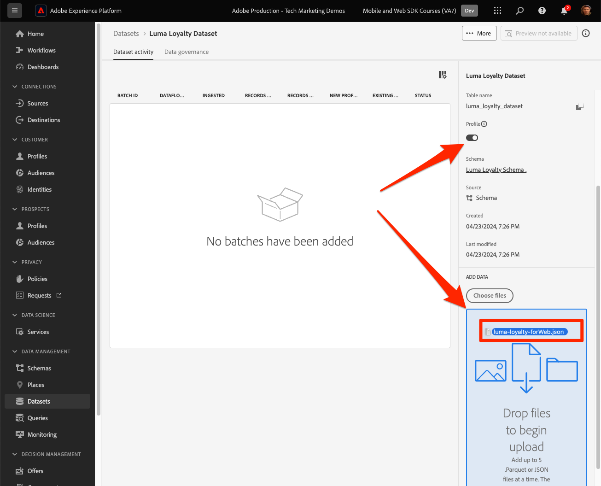

# リアルタイム顧客プロファイルとEdgeのセグメント化

## リアルタイム顧客プロファイルのデータセットとスキーマを有効にする

Real-Time Customer Data PlatformおよびJourney Optimizerのお客様に対して、次の手順では、リアルタイム顧客プロファイルのデータセットとスキーマを有効にします。 Web SDKからのデータストリーミングは、Platform に流入する多数のデータソースの 1 つになり、web データを他のデータソースと結合して 360 度の顧客プロファイルを作成する必要があります。 リアルタイム顧客プロファイルについて詳しくは、次の短いビデオをご覧ください。

>[!VIDEO](https://video.tv.adobe.com/v/31660?learn=on&captions=jpn)

>[!CAUTION]
>
>独自の web サイトとデータを操作する場合は、リアルタイム顧客プロファイルに対してデータを有効にする前に、データのより堅牢な検証をお勧めします。

### スキーマの有効化

プロファイルのスキーマを有効にするには：

1. 作成したスキーマを開きます `Luma Web Event Data`

1. **[!UICONTROL プロファイル切り替え]** を選択してオンにします

   

1. 「**[!UICONTROL このスキーマのデータには、identityMap フィールドにプライマリ ID が含まれます]**」を選択します。

1. 選択 **[!UICONTROL 有効にする]**

   

   >[!IMPORTANT]
   >
   >    リアルタイムプライマリプロファイルに送信されるすべてのレコードに顧客 ID が必要です。 各レコードは「プロファイルフラグメント」になり、これらのフラグメントを検索するためのキーは主な ID になります。
   > 
   > 一部のタイプのデータでは、ID フィールドはスキーマ内でラベル付けされます。 ただし、Experience Platform SDK で取得されたイベントデータを使用すると、ID マップは一般的であり、ID フィールドはスキーマ内では表示されません。
   >
   > このダイアログは、プライマリ ID を念頭に置いていることを確認し、データの送信時にそれを ID マップで指定すること、ID グラフリンクルールを使用してそれを設定すること、またはその両方を行うことを確認します。 両方を実行することをお勧めします。
   >
   > ご存知のように、Luma 実装では、利用可能な場合に認証済み lumaCrmId をプライマリ ID とする ID マップを使用します。それ以外の場合は、デフォルトでExperience Cloud ID （ECID）が使用されます。

1. 「**[!UICONTROL 保存]**」を選択して、更新されたスキーマを保存します

これで、プロファイルに対してスキーマが有効になります。

### データセットの有効化

データセットを有効にするには：

1. 作成したデータセットを開きます `Luma Web Event Data`

1. **[!UICONTROL プロファイル切り替え]** を選択してオンにします

   

1. データセットを **[!UICONTROL 有効]** することを確認します

>[!IMPORTANT]
>
>  プロファイルに対してスキーマが有効になり、データがデータセットに取り込まれると、サンドボックス全体をリセットまたは削除しない限り、スキーマを無効にしたり削除したりすることはできません。 また、この時点より後に、データを受信したフィールドをスキーマから削除することはできません。
>
>   
> 独自のデータを操作する場合は、次の順序で作業を行うことをお勧めします。
> 
> * まず、データセットにデータを取り込みます。
> * データ取り込みプロセス中に発生した問題（データの検証やマッピングの問題など）に対処します。
> * プロファイル用のデータセットとスキーマの有効化
> * 必要に応じて、データを再度取り込みます。

### プロファイルの検証

Platform インターフェイス（またはJourney Optimizer インターフェイス）で顧客プロファイルを検索して、データがリアルタイム顧客プロファイルに到達したことを確認できます。 名前が示すように、プロファイルはリアルタイムで入力されるため、データセット内のデータの検証のように遅延はありません。

まず、プロファイル対応データセットにさらにサンプルデータを生成する必要があります。

1. [Luma デモ web サイト &#x200B;](https://luma.enablementadobe.com) を開き、[!UICONTROL Experience Platform Debugger] 拡張機能アイコンを選択します

1. *Debugger を使用した検証* のレッスンの説明に従って、タグプロパティを [&#x200B; 自分の &#x200B;](validate-with-debugger.md) 開発環境にマッピングするように Debugger を設定します

   

1. Web サイトを参照します。 商品をいくつか表示し、買い物かごに追加します。

1. 資格情報 `test@test.com`/`test` を使用して Luma サイトにログインします（「無効なメールまたはパスワード」というメッセージが表示された場合は、その資格情報を使用してアカウントを作成します）。

1. 「イベント」行を開いて、XDM 変数の一部を探します
1. ポップアップ内で「identityMap」を検索します。 authenticatedState、id、および primary の 3 つのキーを持つ lumaCrmId が表示されます。 このログインの lumaCrmId の値が `f660ab912ec121d1b1e928a0bb4bc61b` であることに注意してください。

   

次に、Experience Platformでプロファイルを探します。

1. [Experience Platform](https://experience.adobe.com/platform/) インターフェイスの左側のナビゲーションで **[!UICONTROL 顧客]** / **[!UICONTROL プロファイル]** を選択します

1. **[!UICONTROL ID 名前空間]** として、`Luma CRM ID` を使用します
1. Experience Platform Debugger で調べた呼び出しで渡された `lumaCrmId` の値（この場合は `f660ab912ec121d1b1e928a0bb4bc61b`）をコピーして貼り付けます。

1. `lumaCRMId` のプロファイルに有効な値がある場合、プロファイル ID がコンソールに入力されます

1. **[!UICONTROL 顧客プロファイル]** 全体を表示するには、「**[!UICONTROL 表示]**」を選択します。

   

1. まず、プロファイルの概要が表示されます。 このプロファイルにはまだ多くはありませんが、プロファイルでリンクされた ID、`lumaCRMId` および `ECID` は次のとおりです。

   

1. この時点で、使用可能なプロファイルデータのほとんどは、web アクティビティからのイベントデータです。 **[!UICONTROL イベント]** を選択して、クリックストリームデータを表示します。

   

## プロファイルの折りたたみを回避

次に、自分の実装では決して見たくないものについて見てみましょう。グラフが折りたたまれます。

### 問題を理解する

まず、問題を確認できるように、さらにサンプルデータを生成します。

1. Cookie や localStorage オブジェクトを削除せずに、[Luma デモ web サイト &#x200B;](https://luma.enablementadobe.com) を開き、[!UICONTROL Experience Platform Debugger] 拡張機能アイコンをクリックします

1. *Debugger を使用した検証* のレッスンの説明に従って、タグプロパティを [&#x200B; 自分の &#x200B;](validate-with-debugger.md) 開発環境にマッピングするように Debugger を設定します

   

1. 資格情報 `test@test.com`/`test` を使用して Luma サイトにまだログインしていることを願っています。 そうでない場合は、ログインし直します。

1. Web サイトを参照します。 商品をいくつか表示し、買い物かごに追加します。

1. 今すぐログアウトしてください。

1. 別のユーザーとしてアカウントを作成して、もう一度ログインします（`spouse@test.com/test`）。 これを実現するために、「共有デバイス」シナリオをレプリケートします。このシナリオでは、2 人のユーザーが同じ web ブラウザーを共有し、同じ web サイトに対して認証を行い、同じ `ECID` 値を共有します。
1. `98d73957f59c67617611d56ba7e8dbaa` の `spouse@test.com/test` に、別の lumaCrmId があることをデバッガーで確認します。

   

1. その他の製品の表示

次に、プロファイルを再度検索します。

1. `Luma CRM ID` が `f660ab912ec121d1b1e928a0bb4bc61b` に等しいを再度検索します
1. プロファイルが 2 つの異なる Luma CRM ID にリンクされました

1. 「**[!UICONTROL ID グラフの表示]**」を選択します

   

1. ID グラフは、デバイスの共有により、2 つの `lumaCrmId` 値が共通の `ECID` 値で結合される、このプロファイルを視覚化するのに役立ちます。

   

これは、Experience Platformの実装では大きな問題となる可能性があります。 両方のユーザーのイベントデータが 1 つのプロファイルに結合されるだけでなく、これらの `lumaCrmId` 値を使用して Platform に取り込まれた他のタイプのデータも結合されます。

### ID グラフリンクルールで修正

グラフの折りたたみの問題に事前に対処するには、web SDK実装を有効にする前に、Adobe Experience Platformの ID グラフリンクルール機能を使用します。

>[!WARNING]
>
> これらの手順は、通常、Platform 実装全体を管理するデータアーキテクトが設定します。 この機能には、ここに示すよりも多くのことがあり、多くの複雑なシナリオがあるので、最初に慎重にシミュレーションする必要があります。
>
> これらの手順は、このチュートリアルの完了後に削除できる専用の開発用サンドボックスでこのチュートリアルを完了している場合にのみ実行してください。 サンドボックスに対するこれらの変更は、元に戻すことはできません。 詳しくは、[ID グラフリンクルールチュートリアル &#x200B;](https://experienceleague.adobe.com/ja/docs/platform-learn/tutorials/identities/graph-linking-rules/overview) を参照してください。

ID グラフリンクルールを有効にするには：

1. 任意の ID 画面から、**[!UICONTROL 設定]** を開きます。

   

1. モーダルで警告を確認し、「**[!UICONTROL 続行]**」を選択します
1. リスト内で最も優先度の高い名前空間になるように `Luma CRM ID` をドラッグします
1. **[!UICONTROL の]** グラフごとに一意 `Luma CRM ID` 設定を確認します
1. 「**[!UICONTROL 次へ]**」を選択します。
   
1. モーダルをレビューし **[!UICONTROL 確認]** します
1. 「**[!UICONTROL 次へ]**」を選択すると、シミュレーション手順がスキップされます

   >[!WARNING]
   >
   > 繰り返しますが、独自の専用開発サンドボックスで作業していない場合は、このワークフローを完了してこれらの ID 設定を有効にしないでください。

1. サンドボックス名を入力し、「**[!UICONTROL 確認]**」を選択します。

   

24 時間後にサイトに戻り、`test@test.com` または `spouse@test.com` としてログインし直して、プロファイルが分離されているかどうかを確認します。

## Edgeで評価されたオーディエンスの作成

Real-Time Customer Data PlatformおよびJourney Optimizerのお客様は、この演習を完了することをお勧めします。

Web SDK データを Platform に取り込むと、Adobe Experience Platformに取り込んだ他のデータソースによってデータが強化される場合があります。 例えば、ユーザーが Luma サイトにログインすると、Experience Platformで ID グラフが作成され、他のすべてのプロファイル対応データセットを結合してリアルタイム顧客プロファイルを作成できる場合があります。 これを実際に確認するには、サンプルのロイヤルティデータを含む別のデータセットをAdobe Experience Platformですばやく作成して、Real-Time Customer Data PlatformとJourney Optimizerでリアルタイム顧客プロファイルを使用できるようにします。 次に、このデータに基づいてオーディエンスを作成します。

### ロイヤルティスキーマの作成とサンプルデータの取り込み

あなたはすでに同様の演習をしたので、指示は簡単になります。

ロイヤルティスキーマを作成します。

1. 新しいスキーマの作成
1. **[!UICONTROL 基本クラス]** として [!UICONTROL &#x200B; 個人プロファイル &#x200B;] を選択します
1. スキーマに `Luma Loyalty Schema` という名前を付けます
1. [!UICONTROL &#x200B; ロイヤルティの詳細 &#x200B;] フィールドグループを追加します
1. [!UICONTROL &#x200B; デモグラフィックの詳細 &#x200B;] フィールドグループを追加します
1. 「`Person ID`」フィールドを選択し、ID 名前空間 [!UICONTROL &#x200B; を使用して、]ID`Luma CRM Id` および [!UICONTROL プライマリ ID] としてマークします。
1. [!UICONTROL &#x200B; プロファイル &#x200B;] のスキーマを有効にします。 「プロファイル」切替スイッチが見つからない場合は、左上のスキーマ名をクリックしてみてください。
1. スキーマの保存

   

データセットを作成してサンプルデータを取り込むには：

1. `Luma Loyalty Schema` ージから新しいデータセットを作成
1. データセットに `Luma Loyalty Dataset` という名前を付けます
1. [!UICONTROL &#x200B; プロファイル &#x200B;] のデータセットを有効にする
1. サンプルファイル [luma-loyalty-forWeb.json](assets/luma-loyalty-forWeb.json) をダウンロードします。
1. ファイルをデータセットにドラッグ&amp;ドロップします
1. データが正常に取り込まれていることを確認します

   

### アクティブオンEdge結合ポリシーの設定

すべてのオーディエンスは結合ポリシーを使用して作成されます。 結合ポリシーは、プロファイルの異なる「ビュー」を作成し、データセットのサブセットを含めることができ、異なるデータセットが同じプロファイル属性に寄与する場合に優先順位を指定できます。 エッジ上で評価されるようにするには、オーディエンスは **[!UICONTROL Edge上でアクティブ化結合ポリシー]** 設定の結合ポリシーを使用する必要があります。

>[!IMPORTANT]
>
>**[!UICONTROL Active-On-Edge結合ポリシー]** 設定を持つことができるのは、サンドボックスごとに 1 つの結合ポリシーのみです

1. Experience PlatformまたはJourney Optimizerのインターフェイスを開き、チュートリアルに使用する開発環境にいることを確認します。
1. **[!UICONTROL 顧客]**/**[!UICONTROL プロファイル]**/**[!UICONTROL 結合ポリシー]** ページに移動します
1. **[!UICONTROL デフォルトの結合ポリシー]** （通常は `Default Timebased`）を開きます。
   
1. **[!UICONTROL Edge上でアクティブ化結合ポリシー]** 設定を有効にします
1. 「**[!UICONTROL 次へ]**」を選択します。

   
1. 引き続き「**[!UICONTROL 次へ]**」を選択してワークフローの他のステップを続行し、「**[!UICONTROL 完了]**」を選択して設定を保存します
   

これで、Edgeで評価されるオーディエンスを作成できるようになりました。

### オーディエンスの作成

オーディエンスは、プロファイルを共通の特性に基づいてグループ化します。 Real-Time CDPまたはJourney Optimizerで使用できるシンプルなオーディエンスを作成します。

1. Experience PlatformまたはJourney Optimizerのインターフェイスで、左側のナビゲーションの **[!UICONTROL 顧客]**/**[!UICONTROL オーディエンス]** に移動します
1. 「**[!UICONTROL オーディエンスを作成]**」を選択します。
1. 「**[!UICONTROL ルールを作成]**」を選択します
1. 「**[!UICONTROL 作成]**」を選択します。

   

1. **[!UICONTROL 属性]** を選択します。
1. **[!UICONTROL ロイヤルティ]** / **[!UICONTROL 層]** フィールドを見つけて、「**[!UICONTROL 属性]**」セクションにドラッグします
1. オーディエンスを `tier` が `gold` のユーザーとして定義
1. オーディエンスに `Luma Loyalty Rewards – Gold Status` という名前を付ける
1. **[!UICONTROL Evaluation method]** として **[!UICONTROL Edge]** を選択します
1. 「**[!UICONTROL 保存]**」を選択します

   

>[!NOTE]
>
> デフォルトの結合ポリシーを **[!UICONTROL アクティブ – オン – Edge結合ポリシー]** に設定したので、作成したオーディエンスはこの結合ポリシーに自動的に関連付けられます。

これは非常に単純なオーディエンスなので、Edgeの評価方法を使用できます。 Edge オーディエンスはエッジで評価されるので、Web SDKが Platform Edge Networkに対して行うのと同じリクエストで、オーディエンス定義を評価し、ユーザーが適格かどうかを直ちに確認できます。

>[!NOTE]
>
>Adobe Experience Platform Web SDKの学習にご協力いただき、ありがとうございます。 ご不明な点がある場合や、一般的なフィードバックを共有したい場合、または今後のコンテンツに関するご提案がある場合は、この [Experience League Community Discussion の投稿でお知らせください &#x200B;](https://experienceleaguecommunities.adobe.com/adobe-experience-platform-18/tutorial-discussion-implement-adobe-experience-cloud-with-web-sdk-tutorial-248848)
