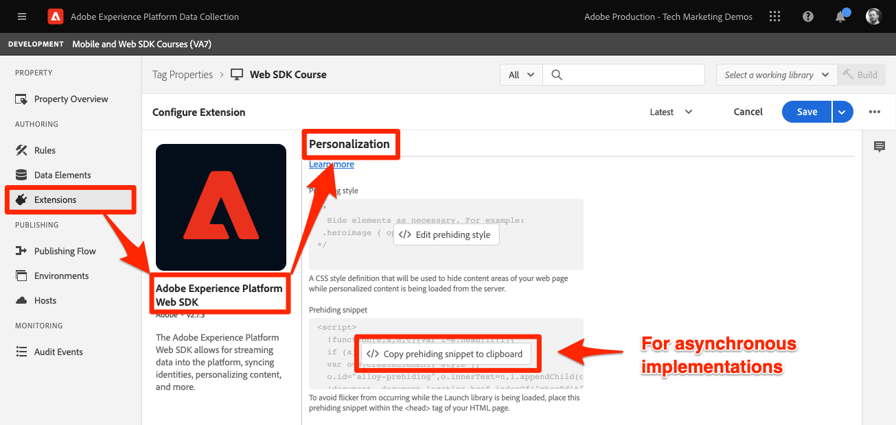
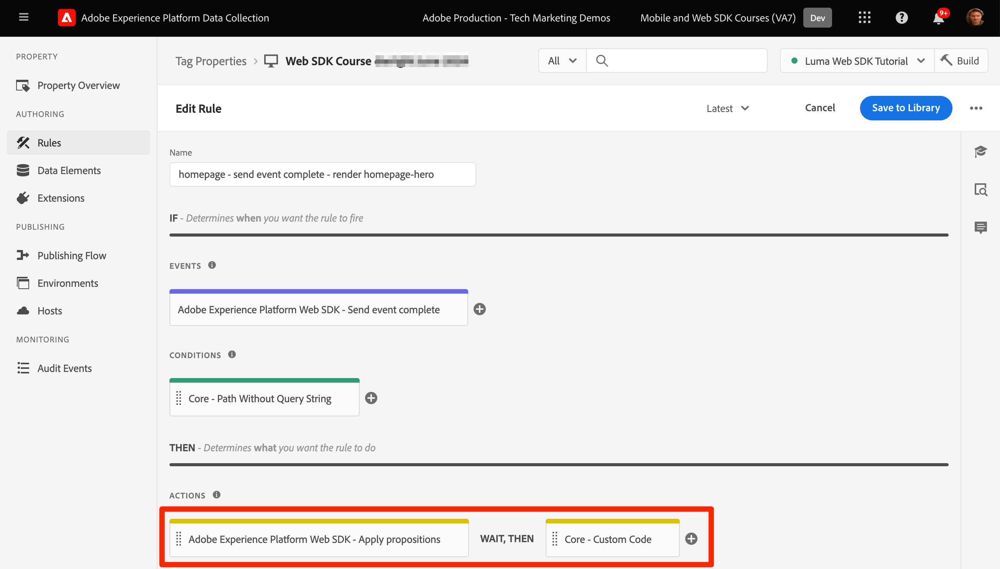

# Platform Web SDKを使用したAdobe Targetの設定

Adobe Experience Platform Web SDK を使用してAdobe Target を実装する方法について説明します。エクスペリエンスを配信する方法と、追加パラメーターを Target に渡す方法について説明します。

[Adobe Target](https://experienceleague.adobe.com/en/docs/target/using/target-home) は、顧客のエクスペリエンスのカスタマイズやパーソナライズに必要なすべてのツールを提供するAdobe Experience Cloud アプリケーションです。Web サイト、モバイル サイト、アプリ、その他のデジタル チャネルでの収益性を最大化することができます。


## 学習目標

このレッスンの最後では、Target の Web SDK実装を使用して、以下の操作を実行できます。

* ちらつきを防ぐために、事前非表示のスニペットを追加
* データストリームの設定による Target 機能の有効化
* Visual experience composer アクティビティのレンダリング
* フォームコンポーザーアクティビティのレンダリング
* XDM データを Target に渡し、Target パラメーターへのマッピングを理解します。
* プロファイルやエンティティパラメーターなどのカスタムデータを Target に渡す
* Target 実装の検証
* パーソナライゼーションリクエストと Analytics リクエストの分離

>[!TIP]
>
>既存の at.js 実装を移行する手順については、[at.js 2.x から Platform web SDKへの Target の移行 ](/help/tutorial-migrate-target-websdk/introduction.md) チュートリアルを参照してください。


## 前提条件

このセクションのレッスンを完了するには、まず次の操作を行う必要があります。

* データ要素とルールの設定を含む、Platform web SDKの初期設定に関するすべてのレッスンを実施します。
* Adobe Targetに [ 編集者または承認者の役割 ](https://experienceleague.adobe.com/en/docs/target/using/administer/manage-users/enterprise/properties-overview#section_8C425E43E5DD4111BBFC734A2B7ABC80) があることを確認します。
* Google Chrome ブラウザーを使用している場合は、[Visual Experience Composer ヘルパー拡張機能 ](https://experienceleague.adobe.com/en/docs/target/using/experiences/vec/troubleshoot-composer/vec-helper-browser-extension) をインストールします。
* Target でアクティビティを設定する方法を理解する 復習が必要な場合は、次のチュートリアルとガイドがこのレッスンに役立ちます。
   * [Visual Experience Composer （VEC） Helper 拡張機能の使用 ](https://experienceleague.adobe.com/en/docs/target/using/experiences/vec/troubleshoot-composer/vec-helper-browser-extension)
   * [Visual Experience Composer の使用](https://experienceleague.adobe.com/en/docs/target-learn/tutorials/experiences/use-the-visual-experience-composer)
   * [ フォームベースの Experience Composer の使用 ](https://experienceleague.adobe.com/en/docs/target-learn/tutorials/experiences/use-the-form-based-experience-composer)
   * [エクスペリエンスのターゲット設定アクティビティの作成](https://experienceleague.adobe.com/ja/docs/target-learn/tutorials/activities/create-experience-targeting-activities)

## ちらつき処理の追加

開始する前に、タグライブラリの読み込み方法に応じて、追加のちらつき処理ソリューションが必要かどうかを確認します。

>[!NOTE]
>
>このチュートリアルでは、[Luma web サイト ](https://luma.enablementadobe.com/content/luma/us/en.html){target=_blank} を使用します。このサイトでは、タグとちらつきの軽減が非同期で実装されています。 この節では、ちらつきの軽減が Platform Web SDKでどのように機能するかを説明します。


### 非同期実装

タグライブラリが非同期で読み込まれると、Target がデフォルトのコンテンツをパーソナライズされたコンテンツに置き換える前に、ページのレンダリングが終了する場合があります。 この動作により、「ちらつき」と呼ばれる現象が発生する可能性があり、パーソナライズされたコンテンツに置き換えられる前に、デフォルトのコンテンツが短時間表示されます。 このちらつきを回避するには、Adobeでは、非同期タグ埋め込みコードの直前に、事前に非表示になる特別なスニペットを追加することをお勧めします。

このスニペットは既に Luma サイトに存在しますが、このコードの機能を詳しく見ていきます。

```html
<script>
  !function(e,a,n,t){var i=e.head;if(i){
  if (a) return;
  var o=e.createElement("style");
  o.id="alloy-prehiding",o.innerText=n,i.appendChild(o),setTimeout(function(){o.parentNode&&o.parentNode.removeChild(o)},t)}}
  (document, document.location.href.indexOf("adobe_authoring_enabled") !== -1, ".personalization-container { opacity: 0 !important }", 3000);
</script>
```

事前に非表示になるスニペットは、選択した CSS 定義を使用してページの先頭にスタイルタグを作成します。 Target からの応答を受け取ったり、タイムアウトに達したりすると、このスタイルタグは削除されます。

事前に非表示にする動作は、スニペットの最後にある 2 つの設定によって制御されます。

* `body { opacity: 0 !important }` は、Target が読み込まれるまで事前非表示にするために使用する CSS 定義を指定します。 デフォルトでは、ページ全体が非表示になります。 この定義を、事前に非表示にするセレクターと、非表示にする方法に更新できます。 この値は、事前非表示のスタイルタグに挿入されるだけなので、複数の定義を含めることができます。 ナビゲーションの下のコンテンツをラップする、識別しやすいコンテナ要素がある場合、この設定を使用して、事前非表示をそのコンテナ要素に制限できます。
* `3000` は、事前非表示のタイムアウトをミリ秒単位で指定します。 タイムアウトの前に Target からの応答を受け取らない場合、事前に非表示になるスタイルタグは削除されます。 このタイムアウトに達することはまれです。

>[!NOTE]
>
>Platform Web SDKの事前非表示のスニペットは、Target の at.js ライブラリで使用されるスニペットとは少し異なります。 `alloy-prehiding` の異なるスタイル ID を使用するので、Platform Web SDKには正しいスニペットを使用してください。 at.js の事前非表示スニペットを使用すると、正しく機能しない場合があります。

事前に非表示になるスニペットは、タグ内でも使用できます。

1. タグの **[!UICONTROL 拡張機能]** セクションに移動します
1. Adobe Experience Platform Web SDK拡張機能の **[!UICONTROL 設定]** を選択します
1. **[!UICONTROL 事前非表示のスニペットをクリップボードにコピー]** ボタンを選択します

   

   >[!NOTE]
   >
   >Platform Web SDK拡張機能からコピーされたデフォルトの事前非表示スニペットには、サイトに存在しない CSS 定義（`.personalization-container { opacity: 0 !important }` など）が含まれている場合があります。 事前に非表示になるスニペットを確認し、サイトに合わせて変更してください。

### 同期実装

Adobeでは、Luma サイトで示されているように、タグを非同期で実装することをお勧めします。 ただし、タグライブラリが同期的に読み込まれる場合、事前に非表示になるスニペットは必要ありません。 代わりに、事前非表示のスタイルが Platform Web SDK拡張機能の設定で指定されます。

同期実装の事前非表示スタイルは、次のように設定できます。

1. タグの **[!UICONTROL 拡張機能]** セクションに移動します
1. Platform Web SDK拡張機能の「**[!UICONTROL 設定]**」ボタンを選択します
1. **[!UICONTROL 事前非表示スタイルを編集]** ボタンを選択します

   

1. CSS を変更して、使用するセレクターと非表示メソッドを含めます。例えば、ページの本文全体をあらかじめ非表示にする場合は、`body { opacity: 0 !important }` を指定します。
1. 変更を保存し、ライブラリにビルドします

>[!NOTE]
>
>事前非表示のスタイル設定は、同期実装でのみ使用されます。 タグの非同期実装を使用している場合、このスタイルは空白にするかコメントアウトする必要があります。

Platform web SDKによるちらつきの管理方法について詳しくは、ガイドの節 [ パーソナライズされたエクスペリエンスのためのちらつきの管理 ](https://experienceleague.adobe.com/en/docs/experience-platform/edge/personalization/manage-flicker) を参照してください。


## データストリームの設定

Platform Web SDKで Target アクティビティを配信するには、事前にデータストリーム設定で Target を有効にする必要があります。

データストリームで Target を設定するには：

1. [ データ収集 ](https://experience.adobe.com/#/data-collection){target="blank"} インターフェイスに移動します
1. 左側のナビゲーションで「**[!UICONTROL データストリーム]**」を選択します
1. 以前に作成した `Luma Web SDK: Development Environment` データストリームを選択します

   。

1. 「**[!UICONTROL サービスを追加]**」を選択します。
   
1. **[!UICONTROL Adobe Target]** を **[!UICONTROL サービス]** として選択
1. 必要に応じて、以下のガイダンスに従って、Target 実装に関するオプションの詳細を入力します。
1. 「**[!UICONTROL 保存]**」を選択します

   

### プロパティトークン

Target Premiumのお客様は、プロパティを使用してユーザー権限を管理することができます。 Target プロパティを使用すると、ユーザーが Target アクティビティを実行できる場所の境界を確立できます。 詳しくは、Target ドキュメントの [ エンタープライズ権限 ](https://experienceleague.adobe.com/en/docs/target/using/administer/manage-users/enterprise/properties-overview) の節を参照してください。

プロパティトークンを設定または検索するには、**Adobe Target**/**[!UICONTROL 管理]**/**[!UICONTROL プロパティ]** に移動します。 「`</>`」アイコンに実装コードが表示されます。 `at_property` の値は、データストリームで使用するプロパティトークンです。


<a id="advanced-pto"></a>

データストリームごとに 1 つのプロパティトークンのみを指定できますが、プロパティトークンのオーバーライドを使用すると、データストリームで定義されたプライマリプロパティトークンを置き換える代替プロパティトークンを指定できます。 データストリームを上書きするには、`sendEvent` アクションの更新も必要です。


### ターゲット環境 ID

Target の [ 環境 ](https://experienceleague.adobe.com/en/docs/target/using/administer/environments) を使用すると、開発のすべてのステージを通じて実装を管理できます。 このオプション設定は、各データストリームで使用しようとしている Target 環境を指定します。

Adobeでは、物事をシンプルに保つために、開発環境、ステージング環境、実稼動のデータストリームごとにターゲット環境 ID を異なる方法で設定することをお勧めします。 または、[hosts](https://experienceleague.adobe.com/en/docs/target/using/administer/hosts) 機能を使用して、Target インターフェイスで環境を整理することもできます。

環境 ID を設定または検索するには、**Adobe Target**/**[!UICONTROL 管理]**/**[!UICONTROL 環境]** に移動します。


>[!NOTE]
>
>ターゲット環境 ID が指定されていない場合、実稼動ターゲット環境が想定されます。

### Target サードパーティ ID 名前空間

このオプション設定を使用すると、ターゲットサードパーティ ID に使用する ID 記号を指定できます。 Target は、単一の ID 記号または名前空間でのプロファイル同期のみをサポートします。 詳しくは、Target ガイドの [mbox3rdPartyId のリアルタイムプロファイル同期 ](https://experienceleague.adobe.com/en/docs/target/using/audiences/visitor-profiles/3rd-party-id) の節を参照してください。

ID 記号は、**データ収集**/**[!UICONTROL 顧客]**/**[!UICONTROL ID]** の下の ID リストにあります。


Luma サイトを使用するこのチュートリアルでは、[ID](configure-identities.md) に関す `lumaCrmId` レッスンで設定した ID 記号を使用します。


## ビジュアルパーソナライゼーションの決定のレンダリング

Visual Personalization の決定は、Adobe Targetの visual experience composer で作成されたエクスペリエンスを参照します。 まず、Target インターフェイスとタグインターフェイスで使用される用語を理解する必要があります。

* **アクティビティ**:1 人以上のオーディエンスをターゲットとした一連のエクスペリエンス。 例えば、単純な A/B テストは、2 つのエクスペリエンスを持つアクティビティにすることができます。
* **エクスペリエンス**:1 つ以上の場所または決定範囲をターゲットとした一連のアクション。
* **決定範囲**:Target エクスペリエンスが配信される場所。 古いバージョンの Target の使用に詳しい場合、決定範囲は「mbox」と同等です。
* **Personalizationの決定**: サーバーが適用する必要があると判断したアクション。 これらの決定は、オーディエンスの条件や、ターゲットアクティビティの優先順位に基づいて行われます。
* **提案**：サーバーが行った決定の結果で、Platform web SDKの応答で配信されます。 例えば、バナー画像を入れ替えると、提案になります。

### [!UICONTROL  イベントを送信 ] アクションを更新

Target からのビジュアルパーソナライゼーションの決定は、データストリームで Target が有効になっている場合、Platform Web SDKによって配信されます。 ただし、_自動的にはレンダリングされません_。 自動レンダリングを有効にするには、[!UICONTROL  イベントを送信 ] アクションを更新する必要があります。

1. [Data Collection](https://experience.adobe.com/#/data-collection){target="blank"} インターフェイスで、このチュートリアルで使用するタグプロパティを開きます
1. `all pages - library loaded - send event - 50` ルールを開きます
1. `Adobe Experience Platform Web SDK - Send event` アクションを選択します
1. チェックボックスを使用して **[!UICONTROL ビジュアルパーソナライゼーション決定をレンダリング]** を有効にします

   

<!--
1. In the **[!UICONTROL Datastream configuration overrides**] the **[!UICONTROL Target Property Token]** can be overridden either as a static value or with a data element. Only property tokens defined in the [**Advanced Property Token Overrides**](#advanced-pto) section in **Datastream Configuration** will return results.
   
   
   -->

1. 変更を保存し、ライブラリにビルドします

Visual Personalization 決定のレンダリング設定では、Target Visual Experience Composer または「グローバル mbox」を使用して指定された変更が Platform Web SDKによって自動的に適用されます。

>[!NOTE]
>
>通常、[!UICONTROL  ビジュアルパーソナライゼーション決定をレンダリング ] 設定は、完全なページ読み込みごとに 1 つの送信イベント アクションに対してのみ有効にする必要があります。 この設定が有効になっている送信イベント アクションが複数ある場合、以降のレンダリング要求は無視されます。

カスタムコードを使用して、これらの決定に対するレンダリングやアクションを自分で行う場合は、「[!UICONTROL  ビジュアルパーソナライゼーション決定をレンダリング ] 設定を無効のままにできます。 Platform Web SDKは柔軟性が高く、ユーザーが完全に制御できるようにこの機能を提供します。 パーソナライズされたコンテンツの手動によるレンダリング [ について詳しくは、ガイドを参照し ](https://experienceleague.adobe.com/en/docs/experience-platform/edge/personalization/rendering-personalization-content) ください。


### Visual Experience Composer を使用した Target アクティビティの設定

これで基本実装部分が完了したので、Target でエクスペリエンスのターゲット設定（XT）アクティビティを作成して、すべてが正しく動作していることを検証します。 サポートが必要な場合は、Target のチュートリアルで [ エクスペリエンスのターゲット設定アクティビティの作成 ](https://experienceleague.adobe.com/ja/docs/target-learn/tutorials/activities/create-experience-targeting-activities) を参照してください。

>[!NOTE]
>
>ブラウザーとしてGoogle Chromeを使用している場合、VEC で編集できるようにサイトを正しく読み込むには、[Visual Experience Composer （VEC）ヘルパー拡張機能 ](https://experienceleague.adobe.com/en/docs/target/using/experiences/vec/troubleshoot-composer/vec-helper-browser-extension) が必要です。

1. Adobe Target インターフェイスに移動します
1. アクティビティ URL の Luma ホームページを使用して、エクスペリエンスのターゲット設定（XT）アクティビティを作成します

   

1. ページを変更します。例えば、ホームページのヒーローバナーのテキストを変更します。  終了したら「**[!UICONTROL 保存]**」を選択し、「次へ **[!UICONTROL を選択]** ます。

   

1. イベント名を更新し、「**[!UICONTROL 次へ]**」を選択します。

   

1. 適切なレポートスイートと目標として注文指標を使用して、レポートソースとして「Adobe Analytics」を選択します

   

   >[!NOTE]
   >
   >Adobe Analyticsを使用しない場合は、レポートソースとしてターゲットを選択し、代わりに **エンゲージメント/ページビュー** など、別の指標を選択します。 アクティビティを保存およびプレビューするには、目標指標が必要です。

1. アクティビティの保存
1. 変更に慣れている場合は、アクティビティをアクティブ化できます。 ライセンス認証せずにエクスペリエンスをプレビューする場合は、[QA プレビュー URL](https://experienceleague.adobe.com/en/docs/target/using/activities/activity-qa/activity-qa) をコピーできます。
1. Luma ホームページを読み込むと、変更が適用されていることがわかります
1. 数時間後に、Adobe Analyticsで Target アクティビティのデータとコンバージョンを確認できます。 詳しくは、Target ガイド [Analytics for Target （A4T）レポート ](https://experienceleague.adobe.com/en/docs/target/using/integrate/a4t/reporting) を参照してください。


### デバッガーでの検証

アクティビティを設定すると、ページにコンテンツがレンダリングされます。 ただし、ライブのアクティビティがない場合でも、イベントを送信ネットワーク呼び出しを調べて、Target が正しく設定されていることを確認できます。

>[!CAUTION]
>
>[Visual Experience Composer （VEC） ヘルパー拡張機能 ](https://experienceleague.adobe.com/en/docs/target/using/experiences/vec/troubleshoot-composer/vec-helper-browser-extension) がインストールされているGoogle Chromeを使用する場合は、「**Target ライブラリを挿入**」設定が無効になっていることを確認します。 この設定を有効にすると、追加の Target リクエストが発生します。

1. Adobe Experience Platform Debugger ブラウザー拡張機能を開きます。
1. [Luma デモサイト ](https://luma.enablementadobe.com/content/luma/us/en.html) に移動し、デバッガーを使用して [ サイトのタグプロパティを独自の開発プロパティに切り替える ](validate-with-debugger.md#use-the-experience-platform-debugger-to-map-to-your-tags-property)
1. ページをリロードします。
1. デバッガーで **[!UICONTROL ネットワーク]** ツールを選択します。
1. **[!UICONTROL Experience Platform Web SDK]** でフィルタリング
1. 最初の呼び出しのイベント行の値を選択

   

1. `query` > `personalization` の下にキーがあり、`decisionScopes` の値は `__view__` であることに注意してください。 このスコープは `target-global-mbox` と同等です。 この Platform Web SDK呼び出しでは、Target からの決定が要求されました。

   decisionScope リク 

1. オーバーレイを閉じ、2 番目のネットワーク呼び出しのイベントの詳細を選択します。 この呼び出しは、Target がアクティビティを返した場合にのみ存在します。
1. Target から返されるアクティビティとエクスペリエンスに関する詳細があることに注意してください。 この Platform Web SDK呼び出しは、Target アクティビティがレンダリングされたことを示す通知をユーザーに送信し、インプレッションを増分します。

   

## カスタム決定範囲の設定とレンダリング

カスタム決定範囲（旧称「mbox」）は、Target フォームベースの Experience Composer を使用して、HTMLまたは JSON コンテンツを構造化された方法で配信するために使用できます。 これらのカスタム範囲のいずれかに配信されるコンテンツは、Platform Web SDKでは自動的にレンダリングされません。 タグのアクションを使用してレンダリングできます。

### [!UICONTROL  イベントを送信アクション ] に範囲を追加する

ページ読み込みルールを変更して、カスタムの決定範囲を追加します。

1. `all pages - library loaded - send event - 50` ルールを開きます
1. `Adobe Experience Platform Web SDK - Send Event` アクションを選択します
1. 使用する 1 つ以上のスコープを追加します。 この例では、`homepage-hero` を使用します。

   

1. 変更を保存し、ライブラリにビルドします

>[!TIP]
>
>このチュートリアルでは、デモ用に手動で定義された単一の範囲を使用します。 特定のページを対象とする複数の決定範囲を使用する場合は、ページパスに応じて条件付きで範囲の配列を返すデータ要素の使用を検討する必要があります。 このアプローチにより、実装をシンプルでスケーラブルに保つことができます。

### Target からの応答を処理

`homepage-hero` スコープのコンテンツをリクエストするように Platform Web SDKを設定したので、次は、応答で何らかの処理を行う必要があります。 Platform Web SDK タグ拡張機能には、[!UICONTROL Send Event Complete] イベントが用意されています。このイベントは、[!UICONTROL Send Event] アクションからのレスポンスを受信したときに新しいルールを直ちにトリガーするために使用できます。

1. `homepage - send event complete - render homepage-hero` という名前のルールを作成します。
1. ルールにイベントを追加します。 **Adobe Experience Platform Web SDK** 拡張機能と **[!UICONTROL Send event complete]** イベントタイプを使用します。
1. ルールを Luma ホームページに制限する条件を追加します（クエリ文字列のないパスは `/content/luma/us/en.html` になります）。
1. ルールにアクションを追加します。 **Adobe Experience Platform Web SDK** 拡張機能および **提案を適用** アクションタイプを使用します。

   

   >[!TIP]
   >
   >デフォルトの名前を使用する代わりに、わかりやすい名前をルールイベント、条件およびアクションに付けます。 堅牢なルールコンポーネント名を使用すると、検索結果がはるかに役に立ちます。

1. このルールのトリガーとして「Send event complete」イベントを使用するので、「Propositions」フィールドに `%event.propositions%` を入力します。
1. 「提案メタデータ」セクションで、「**[!UICONTROL フォームを使用]**」を選択します
1. **[!UICONTROL 範囲]** フィールド入力 `homepage-hero` ードの場合
1. **[!UICONTROL セレクター]** フィールドの入力 `div.heroimage`
1. 「**[!UICONTROL アクションタイプ]**」で「**[!UICONTROL HTMLを設定]**」を選択します。
1. 「**[!UICONTROL 変更を保持]**」を選択します

   

   アクティビティのレンダリングに加えて、Target を追加呼び出して、フォームベースのアクティビティがレンダリングされたことを示す必要があります。

1. ルールに別のアクションを追加します。 **コア** 拡張機能と **[!UICONTROL カスタムコード]** アクションタイプを使用します。
1. 次のJavaScript コードを貼り付けます。

   ```javascript
   var propositions = event.propositions;
   var heroProposition;
   if (propositions) {
      // Find the hero proposition, if it exists.
      for (var i = 0; i < propositions.length; i++) {
         var proposition = propositions[i];
         if (proposition.scope === "homepage-hero") {
            heroProposition = proposition;
            break;
         }xw
      }
   }
   // Send a "display" event
   if (heroProposition !== undefined){
      alloy("sendEvent", {
         xdm: {
            eventType: "display",
            _experience: {
               decisioning: {
                  propositions: [{
                     id: heroProposition.id,
                     scope: heroProposition.scope,
                     scopeDetails: heroProposition.scopeDetails
                  }]
               }
            }
         }
      });
   }
   ```

   

1. 「**[!UICONTROL 変更を保持]**」を選択します

1. 変更を保存し、ライブラリにビルドします
1. Luma ホームページを数回読み込みます。これは、Target インターフェイスで新しい `homepage-hero` の決定範囲を登録するのに十分です。


### フォームベースの Experience Composer を使用した Target アクティビティの設定

これで、カスタム決定範囲を手動でレンダリングするルールができたので、Target に別のエクスペリエンスのターゲット設定（XT）アクティビティを作成できます。 ここでは、フォームベースの Experience Composer を使用します。

1. [Adobe Target](https://experience.adobe.com/target) を開く
1. 前のレッスンで使用したアクティビティを非アクティブ化します
1. フォームベースの Experience Composer オプションを使用して、エクスペリエンスのターゲット設定（XT）アクティビティを作成します

   

1. 場所ドロップダウンから **`homepage-hero`** の場所を選択し、「コンテンツ」ドロップダウンから **[!UICONTROL HTML オファーを作成]** を選択します。 この場所が使用できない場合は、を入力します。 Target は、その場所または範囲のリクエストを受信した後、新しい場所名を定期的に入力します。

   

1. 次のコードを「コンテンツ」ボックスに貼り付けます。 このコードは、異なる背景画像を持つ基本的なヒーローバナーです。

   ```html
   <div class="we-HeroImage jumbotron" style="background-image: url('/content/luma/us/en/women/_jcr_content/root/hero_image.coreimg.jpeg');">
      <div class="container cq-dd-image">
         <div class="we-HeroImage-wrapper">
            <p class="h3">New Luma Yoga Collection</p>
            <strong class="we-HeroImage-title h1">Be active with style&nbsp;</strong>
            <p>
               <a class="btn btn-primary btn-action" href="/content/luma/us/en/products.html" role="button">Shop Now</a>
            </p>
         </div>
      </div>
   </div>
   ```

1. [!UICONTROL  目標と設定 ] ステップで、レポートソースとして「Adobe Target」を選択し、目標として [!UICONTROL  エンゲージメント ]/[!UICONTROL  ページビュー ] を選択します
1. アクティビティの保存
1. 変更に慣れている場合は、アクティビティをアクティブ化できます。 ライセンス認証せずにエクスペリエンスをプレビューする場合は、[QA プレビュー URL](https://experienceleague.adobe.com/en/docs/target/using/activities/activity-qa/activity-qa) をコピーできます。
1. Luma ホームページを読み込むと、変更が適用されていることがわかります

>[!NOTE]
>
>「mbox をクリック」コンバージョン目標は自動的には機能しません。 Platform Web SDKはカスタム範囲を自動的にレンダリングしないので、コンテンツを適用するために選択した場所へのクリックを追跡しません。 「クリック」 `eventType` ールと `sendEvent` アクションを使用した該当する `_experience` の詳細を使用して、各範囲に対して独自のクリックの追跡を作成できます。

### デバッガーでの検証

アクティビティをアクティブ化すると、ページにコンテンツがレンダリングされるのが確認できます。 ただし、ライブのアクティビティがない場合でも、[!UICONTROL  イベントの送信 ] ネットワーク呼び出しを確認して、Target がカスタム範囲に対してコンテンツをリクエストしていることを確認できます。

1. Adobe Experience Platform デバッガーブラウザー拡張機能を開きます。
1. [Luma デモサイト ](https://luma.enablementadobe.com/content/luma/us/en.html) に移動し、デバッガーを使用して [ サイトのタグプロパティを独自の開発プロパティに切り替える ](validate-with-debugger.md#use-the-experience-platform-debugger-to-map-to-your-tags-property)
1. ページをリロードします。
1. デバッガーで **[!UICONTROL ネットワーク]** ツールを選択します。
1. **[!UICONTROL Adobe Experience Platform Web SDK]** でフィルタリング
1. 最初の呼び出しのイベント行の値を選択

   

1. `query`/`personalization` の下にキーがあり、`decisionScopes` の値は以前と同様に `__view__` ですが、現在は `homepage-hero` 範囲も含まれています。 この Platform Web SDK呼び出しでは、VEC と特定の `homepage-hero` の場所を使用して行われた変更に関する決定が Target から要求されました。

   decisionScope リク 

1. オーバーレイを閉じ、2 番目のネットワーク呼び出しのイベントの詳細を選択します。 この呼び出しは、Target がアクティビティを返した場合にのみ存在します。
1. Target から返されるアクティビティとエクスペリエンスに関する詳細があることに注意してください。 この Platform Web SDK呼び出しは、Target アクティビティがレンダリングされたことを示す通知をユーザーに送信し、インプレッションを増分します。 これは、以前に追加したカスタムコードアクションアクションによって開始されました。

   

## Target へのパラメーターの送信

この節では、Target 固有のデータを渡し、XDM データが Target パラメーターにどのようにマッピングされるかを詳しく見ていきます。

### ページ（mbox）パラメーターと XDM

すべての XDM フィールドは、[ ページパラメーター ](https://experienceleague.adobe.com/en/docs/target-dev/developer/implementation/methods/page-parameters) または mbox パラメーターとして自動的に Target に渡されます。

これらの XDM フィールドの一部は、Target のバックエンドの特別なオブジェクトにマッピングされます。 例えば、`web.webPageDetails.URL` は、URL ベースのターゲティング条件を作成したり、プロファイルスクリプトを作成するときに `page.url` オブジェクトとして自動的に使用できるようになります。

また、データオブジェクトを使用してページパラメーターを追加することもできます。

### 特殊パラメーターおよびデータオブジェクト

XDM オブジェクトからマッピングされていない Target に役立つデータポイントがいくつかあります。 これらの特別な Target パラメーターには、以下が含まれます。

* [プロファイル属性](https://experienceleague.adobe.com/en/docs/target-dev/developer/implementation/methods/in-page-profile-attributes)
* [Recommendations エンティティの属性 ](https://experienceleague.adobe.com/en/docs/target/using/recommendations/entities/entity-attributes)
* [Recommendations 予約パラメーター ](https://experienceleague.adobe.com/en/docs/target/using/recommendations/plan-implement#pass-behavioral)
* のカテゴリ値 [ カテゴリの親和性 ](https://experienceleague.adobe.com/en/docs/target/using/audiences/visitor-profiles/category-affinity)

これらのパラメーターは、`xdm` オブジェクトではなく `data` オブジェクトで送信する必要があります。 また、`data` オブジェクトに page （または mbox）パラメーターを含めることもできます。

データオブジェクトにデータを入力するには、次のデータ要素を作成します。その際、[ データ要素の作成 ](create-data-elements.md) レッスンで作成したデータ要素を再利用します。

* 次のカスタムコードを使用して **`data.content`** きます。

  ```javascript
  var data = {
     __adobe: {
        target: {
           "entity.id": _satellite.getVar("product.productInfo.sku"),
           "entity.name": _satellite.getVar("product.productInfo.title"),
           "profile.loggedIn": _satellite.getVar("user.profile.attributes.loggedIn"),
           "user.categoryId": _satellite.getVar("product.category")
        }
     }
  }
  return data;
  ```


### ページ読み込みルールの更新

XDM オブジェクトの外部で Target に追加データを渡すには、適用可能なルールを更新する必要があります。 この例では、必要な変更は、新しい **data.content** データ要素を汎用のページ読み込みルールと製品ページ表示ルールに含めることだけです。

1. `all pages - library loaded - send event - 50` ルールを開きます
1. `Adobe Experience Platform Web SDK - Send event` アクションを選択します
1. `data.content` データ要素をデータフィールドに追加します

   

1. 変更を保存し、ライブラリにビルドします

>[!NOTE]
>
>上記の例では、すべてのページタイプで完全には入力されていない `data` オブジェクトを使用しています。 タグはこの状況を適切に処理し、未定義の値を持つキーを省略します。 例えば、`entity.id` と `entity.name` は、製品の詳細以外のページには渡されません。


## Personalizationおよび Analytics リクエストの分割

Luma サイトのデータレイヤーは、タグ埋め込みコードの前に完全に定義されます。 これにより、1 回の呼び出しを使用して、パーソナライズされたコンテンツの取得（Adobe Targetからなど）と、分析データの送信（Adobe Analyticsへなど）の両方を行うことができます。

ただし、多くの web サイトでは、データレイヤーを十分に早く読み込んだり、両方のアプリケーションで 1 回の呼び出しを使用するのに十分な速度で読み込んだりすることはできません。 このような状況では、1 回のページ読み込みで 2 つの [!UICONTROL  イベントを送信 ] アクションを使用し、1 つ目をパーソナライゼーションに、2 つ目を分析に使用できます。 この方法でイベントを分割すると、Analytics イベントを送信する前にデータレイヤーが完全に読み込まれるのを待ちながら、パーソナライゼーションイベントをできるだけ早く実行できます。 これは、Adobe Targetがページの上部で `target-global-mbox` を実行し、Adobe Analyticsがページの下部で `s.t()` 呼び出しを実行する、多くの Web SDK以前の実装に似ています

パーソナライゼーションオントップリクエストを作成するには：

1. `all pages - library loaded - send event - 50` ルールを開きます
1. **イベントを送信** アクションを開きます
1. **[!UICONTROL ガイド付きイベントを使用]** を選択してから、「**[!UICONTROL パーソナライゼーションをリクエスト]** を選択します
1. これにより、**Type** が **[!UICONTROL Decisioning Proposition Fetch]** としてロックされます

   

Analytics-on-bottom リクエストを作成するには：

1. `all pages - page bottom - send event - 50` という名前の新しいルールを作成します。
1. ルールにイベントを追加します。 **Core** 拡張機能と **[!UICONTROL Page Bottom]** イベントタイプの使用
1. ルールにアクションを追加します。 **Adobe Experience Platform Web SDK** 拡張機能および **イベントを送信** アクションタイプを使用します
1. **[!UICONTROL ガイド付きイベントを使用]** を選択してから、「**[!UICONTROL 分析を収集]** を選択します
1. これにより、「保留中の表示通知を含める **[!UICONTROL チェックボックスが選択され]** ロックされ、決定リクエストからのキュー内の表示通知が送信されます。


>[!TIP]
>
>決定の提案を取得するイベントの後にAdobe Analytics イベントがない場合は、**ガイド付きイベントスタイル****[!UICONTROL ガイドなし – すべてのフィールドを表示]** を使用します。 すべてのオプションを手動で選択する必要がありますが、オプションのロックが解除され、取得リクエストと共に **[!UICONTROL 表示通知が自動的に送信]** されます。


### デバッガーでの検証

これでルールが更新されたので、Adobe Debuggerを使用してデータが正しく渡されているかどうかを検証できます。

1. [Luma デモサイト ](https://luma.enablementadobe.com/content/luma/us/en.html) に移動し、メール `test@test.com` とパスワード `test` を使用してログインします
1. 製品詳細ページへの移動
1. Adobe Experience Platform Debugger ブラウザー拡張機能を開き [ タグプロパティを独自の開発プロパティに切り替えます ](validate-with-debugger.md#use-the-experience-platform-debugger-to-map-to-your-tags-property)
1. ページをリロードします。
1. デバッガーで **ネットワーク** ツールを選択し、**Adobe Experience Platform web SDKでフィルタリングします**
1. 最初の呼び出しのイベント行の値を選択
1. `data`/`__adobe`/`target` の下にキーがあり、製品、カテゴリ、ログイン状態に関する情報が入力されていることに注意してください。

   decisionScope リク 

### Target インターフェイスでの検証

次に、Target インターフェイスで、データを受信し、オーディエンスやアクティビティで使用できることを確認します。 XDM データは、カスタムターゲットパラメーターに自動的にマッピングされます。 XDM データが Target によって受信され、オーディエンスを作成することで利用可能であることを検証できます。

1. [Adobe Target](https://experience.adobe.com/target) を開く
1. **[!UICONTROL オーディエンス]** セクションに移動します。
1. オーディエンスを作成し、「**[!UICONTROL カスタム]**」属性タイプを選択します
1. 「**[!UICONTROL パラメーター]**」フィールドで `web` を検索します。 ドロップダウンメニューには、web ページの詳細に関連するすべての XDM フィールドが入力されます。

   

次に、ログイン状態プロファイル属性が正常に渡されたことを検証します。

1. **[!UICONTROL 訪問者プロファイル]** 属性タイプを選択します
2. `loggedIn` を検索します。 属性がドロップダウンメニューで使用可能な場合、その属性は Target に正しく渡されました。 新しい属性が Target UI で使用可能になるまで数分かかる場合があります。

   

Target Premiumがある場合は、エンティティデータが正しく渡され、商品データが Recommendations の商品カタログに書き込まれたことを検証することもできます。

1. **[!UICONTROL Recommendations]** セクションに移動します
1. 左側のナビゲーションの **[!UICONTROL カタログ検索]** を選択します。
1. Luma サイトで以前訪問した製品 SKU または製品名を検索します。 製品が製品カタログに表示されます。 新製品が Recommendations 製品カタログで検索可能になるまで、数分かかる場合があります。

   

### Assurance での検証

さらに、必要に応じてAssuranceを使用して、Target Decisioning リクエストで正しいデータが取得され、サーバー側の変換が正しく行われていることを確認できます。 Target Decisioning とAdobe Analyticsの呼び出しが別々に送信された場合でも、キャンペーンとエクスペリエンスの情報がAdobe Analyticsの呼び出しに含まれていることを確認することもできます。

1. [Assurance](https://experience.adobe.com/assurance) を開く
1. 新しいアシュランスセッションを開始し、**[!UICONTROL セッション名]** を入力して、サイトまたはテストしているその他のページの **[!UICONTROL ベース url]** を入力します
1. 「**[!UICONTROL 次へ]**」をクリックします。

   

1. 接続方法を選択します。この例では、**[!UICONTROL コピーリンクを使用し]** す。
1. リンクをコピーして、新しいブラウザータブに貼り付けます
1. 「**[!UICONTROL 完了]**」をクリックします。

   

1. Assurance セッションが開始されると、「イベント」タブにイベントが入力されます
1. 「tnta」でフィルタリング
1. 最新の呼び出しを選択し、メッセージを展開して入力が正しいことを確認し、「tnta」値に注意します

   

1. 次に、「タグ」フィルターを保持し、先ほど表示したターゲットイベントの後に発生する analytics.mapping イベントを選択します。
1. 「context.mappedQueryParams」を調べます。確認する\&lt;yourSchemaName\>&quot;値には、「tnta」属性と、前のターゲットイベントで見つかった「tnta」値に一致する連結文字列が含まれています。

   

これは、Target Decisioning 呼び出しを行ったときに後で送信するためにキューに入れられた A4T 情報が、Analytics トラッキングコールが後でページで実行されたときに正しく送信されたことを確認します。

このレッスンを完了したので、Platform Web SDKを使用したAdobe Targetの実用的な実装が得られました。

[次へ： ](setup-web-channel.md)

>[!NOTE]
>
>Adobe Experience Platform Web SDKの学習にご協力いただき、ありがとうございます。 ご不明な点がある場合や、一般的なフィードバックを共有したい場合、または今後のコンテンツに関するご提案がある場合は、この [Experience League Community Discussion の投稿でお知らせください ](https://experienceleaguecommunities.adobe.com/t5/adobe-experience-platform-data/tutorial-discussion-implement-adobe-experience-cloud-with-web/td-p/444996)
