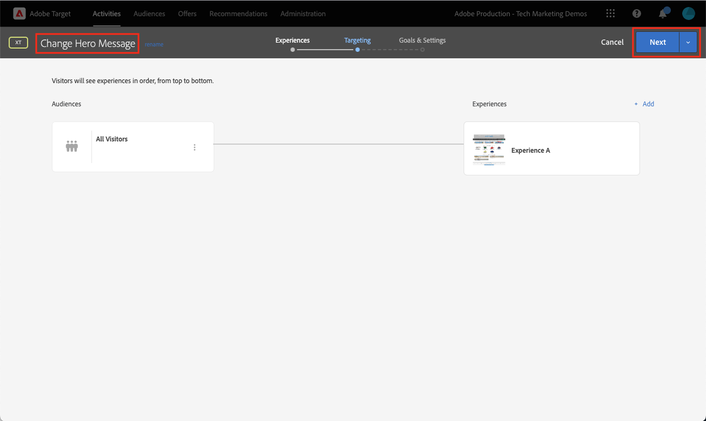
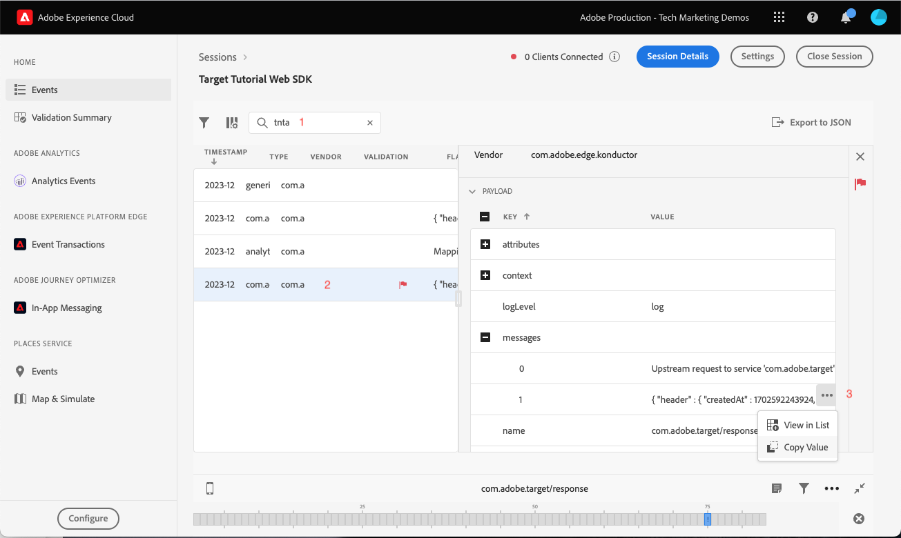

# Platform Web SDK を使用したAdobe Targetの設定

Platform Web SDK を使用してAdobe Targetを実装する方法について説明します。 エクスペリエンスを配信する方法と、追加のパラメーターを Target に渡す方法について説明します。

[Adobe Target](https://experienceleague.adobe.com/docs/target/using/target-home.html?lang=ja) は、顧客のエクスペリエンスのカスタマイズやパーソナライズに必要なすべてのツールを提供するAdobe Experience Cloud アプリケーションです。Web サイト、モバイルサイト、アプリおよびその他のデジタルチャネルでの収益性を最大化できます。


## 学習目標

このレッスンの最後では、Target の Web SDK 実装を使用して、次の操作を実行できるようになります。

* ちらつきを防ぐために、事前非表示のスニペットを追加
* データストリームの設定による Target 機能の有効化
* Visual experience composer アクティビティのレンダリング
* フォームコンポーザーアクティビティのレンダリング
* XDM データを Target に渡し、Target パラメーターへのマッピングを理解します。
* プロファイルやエンティティパラメーターなどのカスタムデータを Target に渡す
* Target 実装の検証
* パーソナライゼーションリクエストと Analytics リクエストの分離

>[!TIP]
>
>のを表示 [Target を at.js 2.x から Platform Web SDK に移行する](/help/tutorial-migrate-target-websdk/introduction.md) 既存の at.js 実装を移行する手順ガイドのチュートリアル。


## 前提条件

このセクションのレッスンを完了するには、まず次の操作を行う必要があります。

* データ要素とルールの設定を含む、Platform Web SDK の初期設定に関するすべてのレッスンを完了します。
* 次を確保します [編集者または承認者の役割](https://experienceleague.adobe.com/docs/target/using/administer/manage-users/enterprise/properties-overview.html#section_8C425E43E5DD4111BBFC734A2B7ABC80) Adobe Targetで。
* のインストール [Visual Experience Composer ヘルパー拡張機能](https://experienceleague.adobe.com/docs/target/using/experiences/vec/troubleshoot-composer/vec-helper-browser-extension.html) Google Chrome ブラウザーを使用している場合。
* Target でアクティビティを設定する方法を理解する 復習が必要な場合は、次のチュートリアルとガイドがこのレッスンに役立ちます。
   * [Visual Experience Composer （VEC） Helper 拡張機能の使用](https://experienceleague.adobe.com/docs/target/using/experiences/vec/troubleshoot-composer/vec-helper-browser-extension.html)
   * [Visual Experience Composer の使用](https://experienceleague.adobe.com/docs/target-learn/tutorials/experiences/use-the-visual-experience-composer.html)
   * [フォームベースの Experience Composer の使用](https://experienceleague.adobe.com/docs/target-learn/tutorials/experiences/use-the-form-based-experience-composer.html)
   * [エクスペリエンスのターゲット設定アクティビティの作成](https://experienceleague.adobe.com/docs/target-learn/tutorials/activities/create-experience-targeting-activities.html)

## ちらつき処理の追加

開始する前に、タグライブラリの読み込み方法に応じて、追加のちらつき処理ソリューションが必要かどうかを確認します。

>[!NOTE]
>
>このチュートリアルでは、を使用します [Luma サイト](https://luma.enablementadobe.com/content/luma/us/en.html) には、タグおよびちらつきの軽減が非同期で実装されています。 この節では、ちらつきの軽減が Platform Web SDK でどのように機能するかを説明します。


### 非同期実装

タグライブラリが非同期で読み込まれると、Target がデフォルトのコンテンツをパーソナライズされたコンテンツに置き換える前に、ページのレンダリングが終了する場合があります。 この動作により、Target で指定し、パーソナライズされたコンテンツに置き換えられる前に、デフォルトのコンテンツが短時間表示される、「ちらつき」と呼ばれる現象が発生する可能性があります。 このちらつきを回避するには、Adobeでは、非同期タグ埋め込みコードの直前に、事前に非表示になる特別なスニペットを追加することをお勧めします。

このスニペットは既に Luma サイトに存在しますが、このコードの機能を詳しく見ていきます。

```html
<script>
  !function(e,a,n,t){var i=e.head;if(i){
  if (a) return;
  var o=e.createElement("style");
  o.id="alloy-prehiding",o.innerText=n,i.appendChild(o),setTimeout(function(){o.parentNode&&o.parentNode.removeChild(o)},t)}}
  (document, document.location.href.indexOf("adobe_authoring_enabled") !== -1, ".personalization-container { opacity: 0 !important }", 3000);
</script>
```

事前に非表示になるスニペットは、選択した CSS 定義を使用してページの先頭にスタイルタグを作成します。 Target からの応答を受け取ったり、タイムアウトに達したりすると、このスタイルタグは削除されます。

事前に非表示にする動作は、スニペットの最後にある 2 つの設定によって制御されます。

* `body { opacity: 0 !important }` target が読み込まれるまで事前非表示にするために使用する CSS 定義を指定します。 デフォルトでは、ページ全体が非表示になります。 この定義を、事前に非表示にするセレクターと、非表示にする方法に更新できます。 この値は、事前非表示のスタイルタグに挿入されるだけなので、複数の定義を含めることができます。 ナビゲーションの下のコンテンツをラップする、識別しやすいコンテナ要素がある場合、この設定を使用して、事前非表示をそのコンテナ要素に制限できます。
* `3000` 事前非表示のタイムアウトをミリ秒単位で指定します。 タイムアウトの前に Target からの応答を受け取らない場合、事前に非表示になるスタイルタグは削除されます。 このタイムアウトに達することはまれです。

>[!NOTE]
>
>Platform Web SDK の事前非表示のスニペットは、Target の at.js ライブラリで使用されるスニペットとは少し異なります。 Platform Web SDK は次の異なるスタイル ID を使用するので、必ず正しいスニペットを使用してください。 `alloy-prehiding`. at.js の事前非表示スニペットを使用すると、正しく機能しない場合があります。

事前に非表示になるスニペットは、タグ内でも使用できます。

1. に移動します **[!UICONTROL 拡張機能]** タグのセクション
1. を選択 **[!UICONTROL 設定]** （Adobe Experience Platform Web SDK 拡張機能の場合）
1. 「」を選択します **[!UICONTROL 事前非表示のスニペットをクリップボードにコピー]** ボタン

   

   >[!NOTE]
   >
   >Platform Web SDK 拡張機能からコピーされたデフォルトの事前非表示スニペットには、など、サイトに存在しない CSS 定義が含まれている場合があります `.personalization-container { opacity: 0 !important }`. 事前に非表示になるスニペットを確認し、サイトに合わせて変更してください。

### 同期実装

Adobeでは、Luma サイトで示されているように、タグを非同期で実装することをお勧めします。 ただし、タグライブラリが同期的に読み込まれる場合、事前に非表示になるスニペットは必要ありません。 代わりに、Platform Web SDK 拡張機能の設定で事前非表示のスタイルが指定されます。

同期実装の事前非表示スタイルは、次のように設定できます。

1. に移動します **[!UICONTROL 拡張機能]** タグのセクション
1. 「」を選択します **[!UICONTROL 設定]** platform Web SDK 拡張機能のボタン
1. 「」を選択します **[!UICONTROL 事前非表示スタイルを編集]** ボタン

   

1. CSS を変更して、使用するセレクターと非表示メソッドを含めます。例： `body { opacity: 0 !important }` ページの本文全体を事前に非表示にする場合。
1. 変更を保存し、ライブラリにビルドします

>[!NOTE]
>
>事前非表示のスタイル設定は、同期実装でのみ使用されます。 タグの非同期実装を使用している場合、このスタイルは空白にするかコメントアウトする必要があります。

Platform Web SDK でちらつきを管理する方法について詳しくは、ガイドの節を参照してください。 [パーソナライズされたエクスペリエンス向けのちらつきの管理](https://experienceleague.adobe.com/docs/experience-platform/edge/personalization/manage-flicker.html).


## データストリームの設定

Platform Web SDK で Target アクティビティを配信するには、事前にデータストリーム設定で Target を有効にする必要があります。

データストリームで Target を設定するには：

1. に移動します [データ収集](https://experience.adobe.com/#/data-collection){target="blank"} インターフェイス
1. 左側のナビゲーションで「」を選択します **[!UICONTROL データストリーム]**
1. 以前に作成したを選択します `Luma Web SDK: Development Environment` データストリーム

   

1. 「**[!UICONTROL サービスを追加]**」を選択します。
   
1. を選択 **[!UICONTROL Adobe Target]** as the **[!UICONTROL サービス]**
1. 必要に応じて、以下のガイダンスに従って、Target 実装に関するオプションの詳細を入力します。
1. 「**[!UICONTROL 保存]**」を選択します

   

### プロパティトークン

Target Premium のお客様は、プロパティを使用してユーザー権限を管理できます。 Target プロパティを使用すると、ユーザーが Target アクティビティを実行できる場所の境界を確立できます。 を参照してください。 [Enterprise 権限](https://experienceleague.adobe.com/docs/target/using/administer/manage-users/enterprise/properties-overview.html?lang=ja) 詳しくは、Target ドキュメントのの節を参照してください。

プロパティトークンを設定または検索するには、に移動します。 **Adobe Target** > **[!UICONTROL 管理]** > **[!UICONTROL プロパティ]**. この `</>` アイコン実装コードを表示します。 この `at_property` 値は、データストリームで使用するプロパティトークンです。


<a id="advanced-pto"></a>

データストリームごとに 1 つのプロパティトークンのみを指定できますが、プロパティトークンのオーバーライドを使用すると、データストリームで定義されたプライマリプロパティトークンを置き換える代替プロパティトークンを指定できます。 の更新 `sendEvent` データストリームを上書きするには、アクションも必要です。


### ターゲット環境 ID

[環境](https://experienceleague.adobe.com/docs/target/using/administer/environments.html) target では、開発のすべてのステージを通じて実装を管理するのに役立ちます。 このオプション設定は、各データストリームで使用しようとしている Target 環境を指定します。

Adobeでは、物事をシンプルに保つために、開発環境、ステージング環境、実稼動のデータストリームごとにターゲット環境 ID を異なる方法で設定することをお勧めします。 または、Target インターフェイスで以下を使用して環境を整理することもできます。 [ホスト](https://experienceleague.adobe.com/docs/target/using/administer/hosts.html?lang=ja) 機能

環境 ID を設定または検索するには、次に移動します： **Adobe Target** > **[!UICONTROL 管理]** > **[!UICONTROL 環境]**.


>[!NOTE]
>
>ターゲット環境 ID が指定されていない場合、実稼動ターゲット環境が想定されます。

### Target サードパーティ ID 名前空間

このオプション設定を使用すると、ターゲットサードパーティ ID に使用する ID 記号を指定できます。 Target は、単一の ID 記号または名前空間でのプロファイル同期のみをサポートします。 詳細については、を参照してください [mbox3rdPartyId のリアルタイムプロファイル同期](https://experienceleague.adobe.com/docs/target/using/audiences/visitor-profiles/3rd-party-id.html?lang=ja) この Target ガイドの節を参照してください。

ID 記号は、の下の ID リストにあります **データ収集** > **[!UICONTROL 顧客]** > **[!UICONTROL ID]**.


Luma サイトを使用したこのチュートリアルでは、ID シンボルを使用します `lumaCrmId` ～についての授業で設定される [ID](configure-identities.md).


## ビジュアルパーソナライゼーションの決定のレンダリング

Visual Personalization の決定とは、Adobe Targetの visual experience composer で作成されるエクスペリエンスを指します。 まず、Target インターフェイスとタグインターフェイスで使用される用語を理解する必要があります。

* **Activity**:1 つ以上のオーディエンスをターゲットとした一連のエクスペリエンス。 例えば、単純な A/B テストは、2 つのエクスペリエンスを持つアクティビティにすることができます。
* **経験**:1 つ以上の場所または決定範囲をターゲットとしたアクションのセット。
* **決定範囲**:Target エクスペリエンスが配信される場所。 古いバージョンの Target の使用に詳しい場合、決定範囲は「mbox」と同等です。
* **パーソナライズの決定**：サーバーが適用する必要があると判断したアクション。 これらの決定は、オーディエンスの条件や、ターゲットアクティビティの優先順位に基づいて行われます。
* **提案**:Platform Web SDK 応答で配信される、サーバーによる決定の結果。 例えば、バナー画像を入れ替えると、提案になります。

### を更新 [!UICONTROL イベントを送信] アクション

Target からのビジュアルパーソナライゼーションの決定は、データストリームで Target が有効になっている場合、Platform Web SDK によって配信されます。 ただし、 _自動的にはレンダリングされません_. を更新する必要があります [!UICONTROL イベントを送信] 自動レンダリングを有効にするアクション。

1. が含まれる [データ収集](https://experience.adobe.com/#/data-collection){target="blank"} インターフェイスで、このチュートリアルで使用するタグプロパティを開きます。
1. を開きます `all pages - library loaded - send event - 50` ルール
1. 「」を選択します `Adobe Experience Platform Web SDK - Send event` アクション
1. Enable （有効） **[!UICONTROL ビジュアルパーソナライゼーションの決定のレンダリング]** （チェックボックス付き）

   

<!--
1. In the **[!UICONTROL Datastream configuration overrides**] the **[!UICONTROL Target Property Token]** can be overridden either as a static value or with a data element. Only property tokens defined in the [**Advanced Property Token Overrides**](#advanced-pto) section in **Datastream Configuration** will return results.
   
   
   -->

1. 変更を保存し、ライブラリにビルドします

Visual Personalization 決定のレンダリング設定では、Target Visual Experience Composer または「グローバル mbox」を使用して指定された変更が Platform Web SDK によって自動的に適用されます。

>[!NOTE]
>
>通常、は [!UICONTROL ビジュアルパーソナライゼーションの決定のレンダリング] 設定は、完全なページ読み込みごとに 1 つの送信イベント アクションに対してのみ有効にする必要があります。 この設定が有効になっている送信イベント アクションが複数ある場合、以降のレンダリング要求は無視されます。

カスタムコードを使用して、これらの決定に対するレンダリングやアクションを自分で行う場合は、 [!UICONTROL ビジュアルパーソナライゼーションの決定のレンダリング] 設定が無効です。 Platform Web SDK は柔軟性が高く、完全に制御するためにこの機能を提供します。 について詳しくは、ガイドを参照してください [パーソナライズされたコンテンツの手動レンダリング](https://experienceleague.adobe.com/docs/experience-platform/edge/personalization/rendering-personalization-content.html).


### Visual Experience Composer を使用した Target アクティビティの設定

これで基本実装部分が完了したので、Target でエクスペリエンスのターゲット設定（XT）アクティビティを作成して、すべてが正しく動作していることを検証します。 については、Target のチュートリアルを参照してください。 [エクスペリエンスのターゲット設定アクティビティの作成](https://experienceleague.adobe.com/docs/target-learn/tutorials/activities/create-experience-targeting-activities.html) サポートが必要な場合

>[!NOTE]
>
>Google Chrome をブラウザーとして使用している場合、 [Visual Experience Composer （VEC）ヘルパー拡張機能](https://experienceleague.adobe.com/docs/target/using/experiences/vec/troubleshoot-composer/vec-helper-browser-extension.html?lang=en) は、VEC で編集するために適切にサイトを読み込む必要があります。

1. Adobe Target インターフェイスに移動します
1. アクティビティ URL の Luma ホームページを使用して、エクスペリエンスのターゲット設定（XT）アクティビティを作成します

   

1. ページを変更します。例えば、ホームページのヒーローバナーのテキストを変更します。  終了したら、 **[!UICONTROL 保存]** その後 **[!UICONTROL 次]**.

   

1. イベント名を更新し、を選択します。 **[!UICONTROL 次]**.

   

1. 適切なレポートスイートと目標として注文指標を使用して、レポートソースとして「Adobe Analytics」を選択します

   

   >[!NOTE]
   >
   >Adobe Analyticsを使用しない場合は、レポートソースとして Target を選択し、次のように別の指標を選択します **エンゲージメント > ページビュー** その代わり。 アクティビティを保存およびプレビューするには、目標指標が必要です。

1. アクティビティの保存
1. 変更に慣れている場合は、アクティビティをアクティブ化できます。 有効にせずにエクスペリエンスをプレビューする場合は、をコピーできます [QA プレビュー URL](https://experienceleague.adobe.com/docs/target/using/activities/activity-qa/activity-qa.html).
1. Luma ホームページを読み込むと、変更が適用されていることがわかります
1. 数時間後に、Adobe Analyticsで Target アクティビティのデータとコンバージョンを確認できます。 以下について詳しくは、Target ガイドを参照してください [Analytics for Target （A4T）レポート](https://experienceleague.adobe.com/docs/target/using/integrate/a4t/reporting.html?lang=en).


### デバッガーでの検証

アクティビティを設定すると、ページにコンテンツがレンダリングされます。 ただし、ライブのアクティビティがない場合でも、イベントを送信ネットワーク呼び出しを調べて、Target が正しく設定されていることを確認できます。

>[!CAUTION]
>
>Google Chrome を使用していて、 [Visual Experience Composer （VEC）ヘルパー拡張機能](https://experienceleague.adobe.com/docs/target/using/experiences/vec/troubleshoot-composer/vec-helper-browser-extension.html?lang=en) インストール済みです。次のことを確認してください **Target ライブラリの挿入** 設定は無効です。 この設定を有効にすると、追加の Target リクエストが発生します。

1. Adobe Experience Platform Debuggerブラウザー拡張機能を開く
1. に移動します [Luma デモサイト](https://luma.enablementadobe.com/content/luma/us/en.html) デバッガーを使用して次の操作を行います [サイトのタグプロパティを独自の開発プロパティに切り替える](validate-with-debugger.md#use-the-experience-platform-debugger-to-map-to-your-tags-property)
1. ページをリロードします。
1. 「」を選択します **[!UICONTROL ネットワーク]** デバッガー内のツール
1. フィルター条件 **[!UICONTROL Adobe Experience Platform Web SDK]**
1. 最初の呼び出しのイベント行の値を選択

   

1. の下にキーがあります `query` > `personalization` および  `decisionScopes` の値はです `__view__`. このスコープは、 `target-global-mbox`. この Platform Web SDK 呼び出しでは、Target からの決定が要求されました。

   

1. オーバーレイを閉じ、2 番目のネットワーク呼び出しのイベントの詳細を選択します。 この呼び出しは、Target がアクティビティを返した場合にのみ存在します。
1. Target から返されるアクティビティとエクスペリエンスに関する詳細があることに注意してください。 この Platform Web SDK 呼び出しでは、Target アクティビティがユーザーにレンダリングされたことを示す通知が送信され、インプレッションが増分されます。

   

## カスタム決定範囲の設定とレンダリング

カスタム決定範囲（以前の「mbox」）は、Target フォームベースの Experience Composer を使用して構造化された方法でHTMLまたは JSON コンテンツを配信するために使用できます。 これらのカスタム範囲のいずれかに配信されるコンテンツは、Platform Web SDK によって自動的にはレンダリングされません。 タグのアクションを使用してレンダリングできます。

### に範囲を追加する [!UICONTROL イベント送信アクション]

ページ読み込みルールを変更して、カスタムの決定範囲を追加します。

1. を開きます `all pages - library loaded - send event - 50` ルール
1. 「」を選択します `Adobe Experience Platform Web SDK - Send Event` アクション
1. 使用する 1 つ以上のスコープを追加します。 この例では、を使用します `homepage-hero`.

   

1. 変更を保存し、ライブラリにビルドします

>[!TIP]
>
>このチュートリアルでは、デモ用に手動で定義された単一の範囲を使用します。 特定のページを対象とする複数の決定範囲を使用する場合は、ページパスに応じて条件付きで範囲の配列を返すデータ要素の使用を検討する必要があります。 このアプローチにより、実装をシンプルでスケーラブルに保つことができます。

### Target からの応答を処理

これで、のコンテンツをリクエストするように Platform Web SDK を設定しました `homepage-hero` スコープでは、応答で何らかの処理を行う必要があります。 Platform Web SDK タグ拡張機能は、を提供します [!UICONTROL イベント完了の送信] からの応答があった場合に新しいルールにすぐにトリガーを付けるために使用できるイベント。 [!UICONTROL イベントを送信] アクションを受信しました。

1. という名前のルールの作成 `homepage - send event complete - render homepage-hero`.
1. ルールにイベントを追加します。 の使用 **Adobe Experience Platform Web SDK** 拡張機能と **[!UICONTROL 送信イベントの完了]** イベントタイプ。
1. ルールを Luma ホームページに制限する条件（クエリ文字列がに等しくないパス）を追加します `/content/luma/us/en.html`）に設定します。
1. ルールにアクションを追加します。 の使用 **Adobe Experience Platform Web SDK** 拡張機能と **提案の適用** アクションタイプ。

   

   >[!TIP]
   >
   >デフォルトの名前を使用する代わりに、わかりやすい名前をルールイベント、条件およびアクションに付けます。 堅牢なルールコンポーネント名を使用すると、検索結果がはるかに役に立ちます。

1. Enter `%event.propositions%` 「Send event complete」イベントをこのルールのトリガーとして使用しているため、「Propositions」フィールドに移動します。
1. 「提案メタデータ」セクションで、 **[!UICONTROL フォームを使用]**
1. の場合 **[!UICONTROL 範囲]** フィールド入力 `homepage-hero`
1. の場合 **[!UICONTROL セレクター]** フィールド入力 `div.heroimage`
1. の場合 **[!UICONTROL アクションタイプ]** 選択 **[!UICONTROL HTMLを設定]**

   

1. 変更を保存し、ライブラリにビルドします
1. Luma ホームページを数回読み込みます。これは、新しいを作成するのに十分です。 `homepage-hero` 決定範囲 Target インターフェイスで登録します。

### フォームベースの Experience Composer を使用した Target アクティビティの設定

これで、カスタム決定範囲を手動でレンダリングするルールができたので、Target に別のエクスペリエンスのターゲット設定（XT）アクティビティを作成できます。 ここでは、フォームベースの Experience Composer を使用します。

1. 開く [Adobe Target](https://experience.adobe.com/target)
1. 前のレッスンで使用したアクティビティを非アクティブ化します
1. フォームベースの Experience Composer オプションを使用して、エクスペリエンスのターゲット設定（XT）アクティビティを作成します

   

1. 「」を選択します **`homepage-hero`** 場所ドロップダウンからの場所 **[!UICONTROL HTMLオファーを作成]** コンテンツ ドロップダウンから選択します。 この場所が使用できない場合は、を入力します。 Target は、その場所または範囲のリクエストを受信した後、新しい場所名を定期的に入力します。

   

1. 次のコードを「コンテンツ」ボックスに貼り付けます。 このコードは、異なる背景画像を持つ基本的なヒーローバナーです。

   ```html
   <div class="we-HeroImage jumbotron" style="background-image: url('/content/luma/us/en/women/_jcr_content/root/hero_image.coreimg.jpeg');">
      <div class="container cq-dd-image">
         <div class="we-HeroImage-wrapper">
            <p class="h3">New Luma Yoga Collection</p>
            <strong class="we-HeroImage-title h1">Be active with style&nbsp;</strong>
            <p>
               <a class="btn btn-primary btn-action" href="/content/luma/us/en/products.html" role="button">Shop Now</a>
            </p>
         </div>
      </div>
   </div>
   ```

1. 日 [!UICONTROL 目標と設定] 手順で、レポートソースとして「Adobe Target」を選択し、 [!UICONTROL エンゲージメント] > [!UICONTROL ページビュー] 目標として
1. アクティビティの保存
1. 変更に慣れている場合は、アクティビティをアクティブ化できます。 有効にせずにエクスペリエンスをプレビューする場合は、をコピーできます [QA プレビュー URL](https://experienceleague.adobe.com/docs/target/using/activities/activity-qa/activity-qa.html).
1. Luma ホームページを読み込むと、変更が適用されていることがわかります

>[!NOTE]
>
>「mbox をクリック」コンバージョン目標は自動的には機能しません。 Platform Web SDK はカスタム範囲を自動的にレンダリングしないので、コンテンツの適用に選択した場所へのクリックを追跡しません。 「クリック」を使用して、範囲ごとに独自のクリックの追跡を作成できます。 `eventType` （該当するもの） `_experience` を使用した詳細 `sendEvent` アクション。

### デバッガーでの検証

アクティビティをアクティブ化すると、ページにコンテンツがレンダリングされるのが確認できます。 ただし、ライブのアクティビティがない場合でも、 [!UICONTROL イベントを送信] target がカスタム範囲のコンテンツをリクエストしていることを確認するネットワーク呼び出し。

1. Adobe Experience Platform デバッガーブラウザー拡張機能を開きます。
1. に移動します [Luma デモサイト](https://luma.enablementadobe.com/content/luma/us/en.html) デバッガーを使用して次の操作を行います [サイトのタグプロパティを独自の開発プロパティに切り替える](validate-with-debugger.md#use-the-experience-platform-debugger-to-map-to-your-tags-property)
1. ページをリロードします。
1. 「」を選択します **[!UICONTROL ネットワーク]** デバッガーのツール
1. フィルター条件 **[!UICONTROL Adobe Experience Platform Web SDK]**
1. 最初の呼び出しのイベント行の値を選択

   

1. の下にキーがあります `query` > `personalization` および  `decisionScopes` の値はです `__view__` 以前と同様ですが、現在はもあります `homepage-hero` スコープが含まれます。 この Platform Web SDK 呼び出しでは、VEC およびを使用して行われた変更に関する決定が Target からリクエストされました `homepage-hero` 場所。

   

1. オーバーレイを閉じ、2 番目のネットワーク呼び出しのイベントの詳細を選択します。 この呼び出しは、Target がアクティビティを返した場合にのみ存在します。
1. Target から返されるアクティビティとエクスペリエンスに関する詳細があることに注意してください。 この Platform Web SDK 呼び出しでは、Target アクティビティがユーザーにレンダリングされたことを示す通知が送信され、インプレッションが増分されます。

   

## Target へのパラメーターの送信

この節では、Target 固有のデータを渡し、XDM データが Target パラメーターにどのようにマッピングされるかを詳しく見ていきます。

### ページ（mbox）パラメーターと XDM

すべての XDM フィールドは、次のように自動的に Target に渡されます [ページのパラメーター](https://experienceleague.adobe.com/en/docs/target-dev/developer/implementation/methods/page) または mbox パラメーター。

これらの XDM フィールドの一部は、Target のバックエンドの特別なオブジェクトにマッピングされます。 例： `web.webPageDetails.URL` は、URL ベースのターゲティング条件を作成したり、として自動的に使用できるようになります `page.url` プロファイルスクリプトの作成時はオブジェクト。

### 特殊パラメーターおよびデータオブジェクト

XDM オブジェクトからマッピングされていない Target に役立つデータポイントがいくつかあります。 これらの特別な Target パラメーターには、以下が含まれます。

* [プロファイル属性](https://experienceleague.adobe.com/docs/target/using/implement-target/before-implement/methods/in-page-profile-attributes.html?lang=en)
* [Recommendations エンティティの属性](https://experienceleague.adobe.com/docs/target/using/recommendations/entities/entity-attributes.html?lang=en)
* [Recommendationsの予約済みパラメーター](https://experienceleague.adobe.com/docs/target/using/recommendations/plan-implement.html?lang=en#pass-behavioral)
* のカテゴリ値 [カテゴリ親和性](https://experienceleague.adobe.com/docs/target/using/audiences/visitor-profiles/category-affinity.html?lang=en)

これらのパラメーターは、 `data` の代わりにのオブジェクト `xdm` オブジェクト。 また、page （または mbox）パラメーターをに含めることもできます `data` オブジェクト。

データオブジェクトにデータを入力するには、次のデータ要素を作成し、で作成されたデータ要素を再利用します。 [データ要素の作成](create-data-elements.md) レッスン :

* **`data.content`** 次のカスタムコードを使用します。

  ```javascript
  var data = {
     __adobe: {
        target: {
           "entity.id": _satellite.getVar("product.productInfo.sku"),
           "entity.name": _satellite.getVar("product.productInfo.title"),
           "profile.loggedIn": _satellite.getVar("user.profile.attributes.loggedIn"),
           "user.categoryId": _satellite.getVar("product.category")
        }
     }
  }
  return data;
  ```


### ページ読み込みルールの更新

XDM オブジェクトの外部で Target に追加データを渡すには、適用可能なルールを更新する必要があります。 この例では、必要な変更は新規のを含めることのみです **data.content** データ要素を汎用ページ読み込みルールと製品ページ表示ルールに追加します。

1. を開きます `all pages - library loaded - send event - 50` ルール
1. 「」を選択します `Adobe Experience Platform Web SDK - Send event` アクション
1. を追加 `data.content` データフィールドに対するデータ要素

   

1. 変更を保存し、ライブラリにビルドします
1. について、手順 1 ～ 4 を繰り返します **e コマース – ライブラリの読み込み – 製品詳細変数の設定 – 20** ルール

>[!NOTE]
>
>上記の例では、を使用しています。 `data` すべてのページタイプに完全には入力されていないオブジェクト。 タグはこの状況を適切に処理し、未定義の値を持つキーを省略します。 例： `entity.id` および `entity.name` は、製品の詳細以外のページには渡されません。


## Personalization 要求と Analytics 要求の分割

Luma サイトのデータレイヤーは、タグ埋め込みコードの前に完全に定義されます。 これにより、1 回の呼び出しを使用して、パーソナライズされたコンテンツの取得（Adobe Targetからなど）と、分析データの送信（Adobe Analyticsへなど）の両方を行うことができます。

ただし、多くの web サイトでは、データレイヤーを十分に早く読み込んだり、両方のアプリケーションで 1 回の呼び出しを使用するのに十分な速度で読み込んだりすることはできません。 このような場合、次の 2 つを使用できます [!UICONTROL イベントを送信] 1 回のページ読み込みでアクションを実行し、最初のアクションはパーソナライゼーションに使用し、2 番目のアクションは分析に使用します。 この方法でイベントを分割すると、Analytics イベントを送信する前にデータレイヤーが完全に読み込まれるのを待ちながら、パーソナライゼーションイベントをできるだけ早く実行できます。 これは、Adobe Targetが呼び出す多くの Web 以前の SDK 実装に似ています `target-global-mbox` ページの上部で、Adobe Analyticsがを実行します `s.t()` ページの下部を呼び出す

パーソナライゼーションオントップリクエストを作成するには：

1. を開きます `all pages - library loaded - send event - 50` ルール
1. を開きます **イベントを送信** アクション
1. を選択 **[!UICONTROL ガイドイベントを使用]** を選択してから、 **[!UICONTROL リクエストのパーソナライゼーション]**
1. これにより、 **タイプ** as **[!UICONTROL 決定の提案の取得]**

   

Analytics-on-bottom リクエストを作成するには：

1. という名前の新しいルールの作成 `all pages - page bottom - send event - 50`
1. ルールにイベントを追加します。 の使用 **コア** 拡張機能と **[!UICONTROL Page Bottom]** イベントタイプ
1. ルールにアクションを追加します。 の使用 **Adobe Experience Platform Web SDK** 拡張機能と **イベントを送信** アクションタイプ
1. を選択 **[!UICONTROL ガイドイベントを使用]** を選択してから、 **[!UICONTROL 分析を収集]**
1. これにより、 **[!UICONTROL 保留中の表示通知を含める]** チェックボックスを選択すると、決定リクエストのキューに入った表示通知が送信されます。


>[!TIP]
>
>の決定の提案を取得しているイベントに、続くAdobe Analytics イベントがない場合は、を使用します **ガイド付きイベントのスタイル** **[!UICONTROL ガイドなし – すべてのフィールドを表示]**. すべてのオプションを手動で選択する必要がありますが、この操作によってオプションのロックが解除され、 **[!UICONTROL 自動的に表示通知を送信]** 取得リクエストと共に使用します。


### デバッガーでの検証

ルールが更新されたので、Adobe Debuggerを使用してデータが正しく渡されているかどうかを検証できます。

1. に移動します。 [Luma デモサイト](https://luma.enablementadobe.com/content/luma/us/en.html) とメールでのログイン `test@adobe.com` とパスワード `test`
1. 製品詳細ページへの移動
1. Adobe Experience Platform Debugger ブラウザー拡張機能を開き、 [タグプロパティを独自の開発プロパティに切り替える](validate-with-debugger.md#use-the-experience-platform-debugger-to-map-to-your-tags-property)
1. ページをリロードします。
1. 「」を選択します **ネットワーク** デバッガーのツールとフィルター基準 **Adobe Experience Platform Web SDK**
1. 最初の呼び出しのイベント行の値を選択
1. の下にキーがあります `data` > `__adobe` > `target` さらに、製品、カテゴリ、ログイン状態に関する情報が入力されます。

   

### Target インターフェイスでの検証

次に、Target インターフェイスで、データを受信し、オーディエンスやアクティビティで使用できることを確認します。 XDM データは、カスタムターゲットパラメーターに自動的にマッピングされます。 XDM データが Target によって受信され、オーディエンスを作成することで利用可能であることを検証できます。

1. 開く [Adobe Target](https://experience.adobe.com/target)
1. に移動します。 **[!UICONTROL オーディエンス]** セクション
1. オーディエンスを作成し、 **[!UICONTROL カスタム]** 属性タイプ
1. を検索 **[!UICONTROL パラメーター]** のフィールド `web`. ドロップダウンメニューには、web ページの詳細に関連するすべての XDM フィールドが入力されます。

   

次に、ログイン状態プロファイル属性が正常に渡されたことを検証します。

1. を選択します。 **[!UICONTROL 訪問者プロファイル]** 属性タイプ
2. `loggedIn` を検索します。属性がドロップダウンメニューで使用可能な場合、その属性は Target に正しく渡されました。 新しい属性が Target UI で使用可能になるまで数分かかる場合があります。

   

Target Premium を使用している場合は、エンティティデータが正しく渡され、商品データがRecommendations商品カタログに書き込まれたことを検証することもできます。

1. に移動します。 **[!UICONTROL Recommendations]** セクション
1. を選択 **[!UICONTROL カタログ検索]** 左側のナビゲーションで
1. Luma サイトで以前訪問した製品 SKU または製品名を検索します。 製品が製品カタログに表示されます。 新製品がRecommendations商品カタログで検索可能になるまで、数分かかる場合があります。

   

### Assurance で検証

さらに、必要に応じて Assurance を使用して、Target 判定リクエストが正しいデータを取得し、サーバー側の変換が正しく行われていることを確認できます。 Target Decisioning とAdobe Analyticsの呼び出しが別々に送信された場合でも、キャンペーンとエクスペリエンスの情報がAdobe Analyticsの呼び出しに含まれていることを確認することもできます。

1. 開く [Assurance](https://experience.adobe.com/assurance)
1. 新しいアシュランスセッションを開始し、を入力します。 **[!UICONTROL セッション名]** を入力します。 **[!UICONTROL ベース url]** サイトまたはテストしている他のページの場合
1. 「**[!UICONTROL 次へ]**」をクリックします。

   

1. 接続方法を選択します。ここでは、を使用します **[!UICONTROL リンクをコピー]**
1. リンクをコピーして、新しいブラウザータブに貼り付けます
1. 「**[!UICONTROL 完了]**」をクリックします。

   

1. Assurance セッションが開始されると、「イベント」タブにイベントが入力されます
1. 「tnta」でフィルタリング
1. 最新の呼び出しを選択し、メッセージを展開して入力が正しいことを確認し、「tnta」値に注意します

   

1. 次に、「タグ」フィルターを保持し、先ほど表示したターゲットイベントの後に発生する analytics.mapping イベントを選択します。
1. 「context.mappedQueryParams」を調べます。\&lt;yourschemaname>確認する値には、前のターゲットイベントで見つかった値「tnta」に一致する、連結された文字列を持つ属性「tnta」が含まれています。

   

これは、Analytics トラッキングコールが後でページで発生したときに、target Decisioning 呼び出しを行ったときに後で送信するためにキューに入れられた A4T 情報が、正しく送信されたことを確認します。

このレッスンを完了したので、Platform Web SDK を使用したAdobe Targetの実用的な実装が得られます。

[次へ： ](setup-web-channel.md)

>[!NOTE]
>
>Adobe Experience Platform Web SDK の学習に時間を費やしていただき、ありがとうございます。 ご質問がある場合、一般的なフィードバックを共有したい場合、または将来のコンテンツに関するご提案がある場合は、このページでお知らせください [Experience League コミュニティ ディスカッションの投稿](https://experienceleaguecommunities.adobe.com/t5/adobe-experience-platform-launch/tutorial-discussion-implement-adobe-experience-cloud-with-web/td-p/444996)
