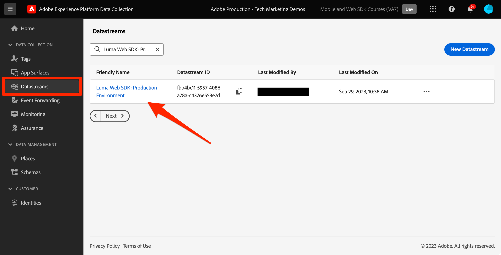
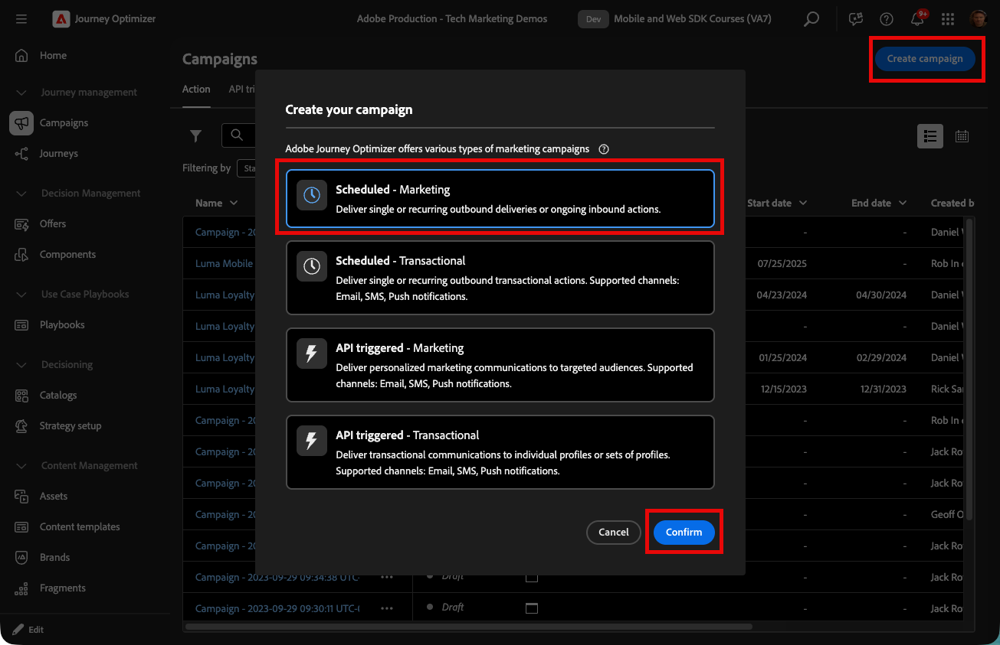
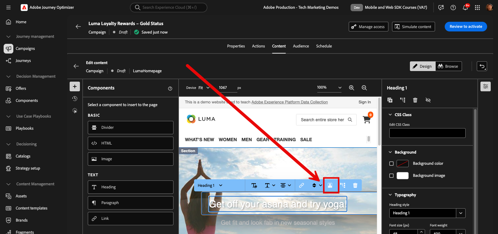
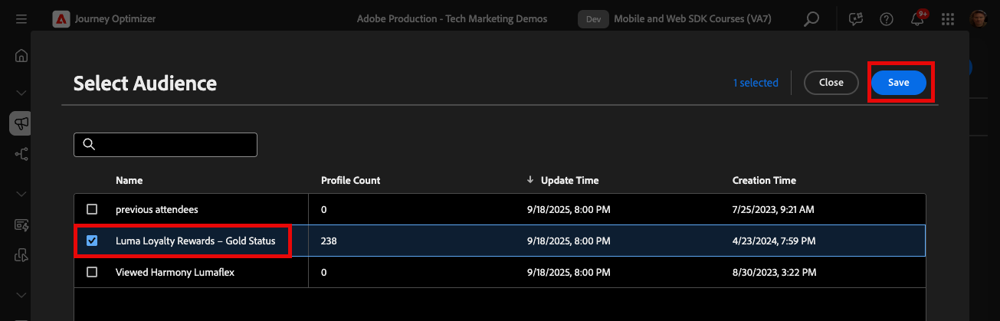
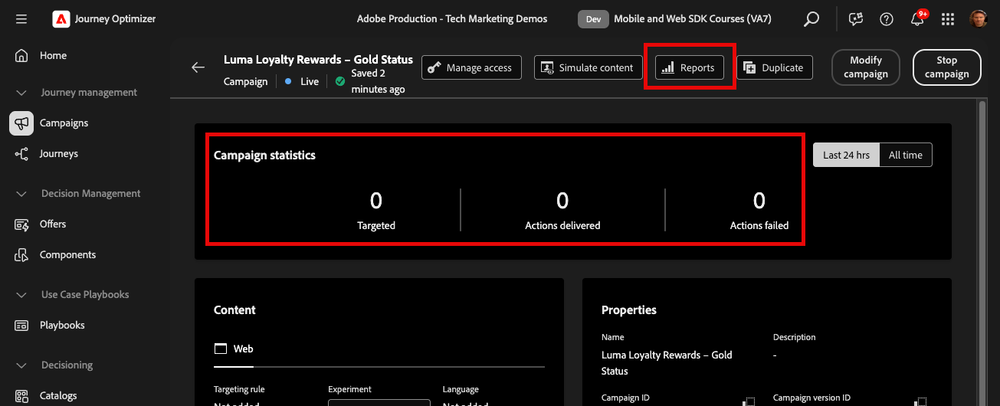

# Web SDKを使用したJourney Optimizer web チャネルの設定

Adobe Experience Platform Web SDKを使用してAdobe Journey Optimizer[web チャネル ](https://experienceleague.adobe.com/en/docs/journey-optimizer/using/web/get-started-web) を実装する方法について説明します。 このレッスンでは、基本的な web チャネルの前提条件、設定の詳細な手順、ロイヤルティステータスに基づくユースケースを詳しく説明します。

このレッスンに従うと、Journey Optimizerのユーザーは、Journey Optimizer web デザイナーを使用した高度なオンラインパーソナライゼーションのために web チャネルを使用できるようになります。

## 学習内容

このレッスンを終了すると、次の操作を実行できます。

* Web チャネルエクスペリエンスを提供する際の Web SDKの機能と重要性を理解します。
* サンプルの Luma ロイヤルティ報酬ユースケースを利用して、web チャネルキャンペーンを最初から最後まで作成するプロセスを説明します。
* インターフェイス内でキャンペーンのプロパティ、アクション、スケジュールを設定します。
* Adobe Experience Cloud Visual Editing Helper 拡張機能の機能とメリットを説明します。
* Web デザイナーを使用して、画像、ヘッダー、その他の要素などの web ページコンテンツを編集する方法を説明します。
* オファーの決定コンポーネントを使用して Web ページにオファーを挿入する方法を説明します。
* Web チャネルキャンペーンの品質と成功を確保するためのベストプラクティスを確認します。

## 前提条件

このセクションのレッスンを完了するには、まず次の操作を行う必要があります。

* データ要素とルールの設定を含む、Platform web SDKの初期設定に関するすべてのレッスンを実施します。
* Adobe Experience Platform Web SDK タグ拡張機能のバージョンが 2.16 以上であることを確認します。
* `Luma Loyalty Rewards – Gold Status` オーディエンスを作成するための演習を含め、Experience Platformの設定のレッスンを完了します。
* [Adobe Experience Cloud Visual Editing Helper ブラウザー拡張機能 ](https://chromewebstore.google.com/detail/adobe-experience-cloud-vi/kgmjjkfjacffaebgpkpcllakjifppnca) をダウンロードして有効にします。
* Journey Optimizer Web Designer を使用して web チャネルエクスペリエンスを作成する場合は、Google ChromeまたはMicrosoft® Edge ブラウザーを使用していることを確認してください。
* ブラウザーでサードパーティ Cookie が許可されていることを確認します。 ブラウザーで広告ブロッカーを無効にする必要がある場合もあります。

  >[!CAUTION]
  >
  > Journey Optimizer Web Designer では、次のいずれかの理由により、特定の web サイトが確実に開かない場合があります。
  > 
  > 1. Web サイトには、厳格なセキュリティポリシーがあります。
  > 1. web サイトは iframe 内に埋め込まれます。
  > 1. 顧客の QA またはステージサイトは、外部からアクセスできません（内部サイトです）。

* Web エクスペリエンスを作成し、Adobe Experience Manager Assets Essentials ライブラリのコンテンツを含める場合は、[ このコンテンツを公開するためのサブドメインを設定 ](https://experienceleague.adobe.com/en/docs/journey-optimizer/using/web/configure-web-channel/web-delegated-subdomains) する必要があります。
* コンテンツ実験機能を使用する場合は、web データセットもレポート設定に含まれていることを確認してください。
* 現在、web プロパティで web チャネルキャンペーンのオーサリングと配信を可能にする、次の 2 種類の実装がサポートされています。
   * クライアント側のみ：Web サイトを変更するには、Adobe Experience Platform Web SDKを実装する必要があります。
   * ハイブリッドモード：Platform Edge Network Server API を使用して、パーソナライゼーションサーバーサイドをリクエストできます。 次に、API からの応答がAdobe Experience Platform Web SDKに提供され、クライアントサイドで変更をレンダリングします。 詳しくは、Adobe Experience Platform Edge Network Server API ドキュメントを参照してください。 ハイブリッドモードの追加の詳細と実装サンプルについては、このブログ投稿を参照してください。

  >[!NOTE]
  >
  >サーバーサイドのみの実装は、現在、サポートされていません。

## 用語

まず、web チャネルキャンペーンで使用される用語を理解する必要があります。

* **Web チャネル**:web を介したコンテンツの通信または配信の媒体。 このガイドのコンテキストでは、Adobe Journey Optimizer内で Platform Web SDKを使用してパーソナライズされたコンテンツが web サイトの訪問者に配信されるメカニズムを指します。
* **web サーフェス**：コンテンツが配信される URL で識別される web プロパティを参照します。 1 つまたは複数の web ページを含めることができます。
* **Journey Optimizer Web Designer**: ユーザーが web チャネルエクスペリエンスをデザインできる、Journey Optimizer内の特定のツールまたはインターフェイスです。
* **Adobe Experience Cloud Visual Editing Helper**: web チャネルエクスペリエンスの視覚的な編集とデザインを支援するブラウザー拡張機能。
* **データストリーム**:web チャネルエクスペリエンスを確実に配信できるようにする、Adobe Experience Platform サービス内の設定です。
* **結合ポリシー**：インバウンドキャンペーンの正確なアクティブ化と公開を確実にする設定。
* **オーディエンス**：特定の条件を満たすユーザーまたはサイト訪問者の特定のセグメント。
* **Web デザイナー**：コードを深く掘り下げることなく、web エクスペリエンスの視覚的な編集やデザインを支援するインターフェイスやツール。
* **式エディター**：ユーザーがデータ属性やその他の条件に基づいて、web コンテンツにパーソナライゼーションを追加できる Web デザイナー内のツール。
* **オファー決定コンポーネント**：意思決定管理に基づいて、特定の訪問者に表示するのに最適なオファーを決定するのに役立つ Web デザイナー内のコンポーネント。
* **コンテンツ実験**：様々なコンテンツのバリエーションをテストして、インバウンドクリック数など、目的の指標に関して最も効果が高いコンテンツを見つける方法。
* **処理**：コンテンツ実験のコンテキストでは、処理とは、別の実験に対してテストされるコンテンツの特定のバリエーションを指します。
* **シミュレーション**：ライブオーディエンスに対してアクティブ化する前に web チャネルのエクスペリエンスを視覚化するプレビューメカニズム。

## データストリームの設定

Adobe Experience Platform サービスは既にデータストリームに追加されています。 次に、「Adobe Journey Optimizer」オプションを有効にして、web チャネルエクスペリエンスを提供できるようにする必要があります。

データストリームでAdobe Journey Optimizerを設定するには：

1. [ データ収集 ](https://experience.adobe.com/#/data-collection){target="blank"} インターフェイスに移動します。
1. 左側のナビゲーションで「**[!UICONTROL データストリーム]**」を選択します。
1. 以前に作成した Luma Web SDK データストリームを選択します。

   

1. Adobe Experience Platform サービス内で **[!UICONTROL 編集]** を選択します。

   

1. 「**[!UICONTROL Adobe Journey Optimizer]**」ボックスをオンにします。

1. 更新した設定を **[!UICONTROL 保存]** します。

   

これにより、Journey OptimizerのインバウンドイベントがAdobe Experience Platform Edge Networkで正しく処理されます。

## 結合ポリシーの設定

「**[!UICONTROL Active-On-Edge結合ポリシー]**」オプションが有効になっている結合ポリシーが定義されていることを確認します。 この結合ポリシーオプションは、Journey Optimizer インバウンドチャネルで使用され、エッジでのインバウンドキャンペーンの正確なアクティブ化と公開を確保します。

結合ポリシーでオプションを設定するには：

1. Experience PlatformまたはJourney Optimizer インターフェイスの **[!UICONTROL 顧客]** / **[!UICONTROL プロファイル]** ページに移動します。
1. チュートリアルに使用するサンドボックスに属していることを確認します
1. 「**[!UICONTROL 結合ポリシー]**」タブを選択します。
1. ポリシーを選択し（通常は [!UICONTROL  デフォルトの時間ベース ] ポリシーを使用するのが最適です）、「**[!UICONTROL 設定]**」ステップの **[!UICONTROL Edge上でアクティブ化結合ポリシー]** オプションを切り替えます。

   

## コンテンツ実験用の web データセットの設定

Web チャネルキャンペーン内でコンテンツ実験を使用するには、使用する web データセットがレポート設定にも含まれていることを確認する必要があります。 Journey Optimizer レポートシステムは、データセットを読み取り専用で使用して、標準のコンテンツ実験レポートを生成します。

[ コンテンツ実験レポート用のデータセットの追加について詳しくは、この節を参照してください ](https://experienceleague.adobe.com/en/docs/journey-optimizer/using/reporting/channel-report/reporting-configuration#add-datasets)。

## ユースケースの概要 – ロイヤルティ報酬

このレッスンでは、サンプルのロイヤルティ報酬のユースケースを使用して、web SDKを使用した web チャネルエクスペリエンスの実装を詳細に説明します。

この使用例を使用すると、Journey Optimizer キャンペーンと Web デザイナーを活用して、Journey Optimizerが最適なインバウンドエクスペリエンスを顧客に提供するのにどのように役立つかをより深く理解できます。

このチュートリアルは実装者向けなので、このレッスンにはJourney Optimizerでの実質的なインターフェイス作業が含まれていることは注目に値します。 このようなインターフェイスタスクは通常マーケターが処理しますが、web チャネルキャンペーンの作成を通常担当していない実装者でも、insightをプロセスに参加させることが有益な場合があります。

### ロイヤルティ報酬キャンペーンの作成

サンプルロイヤルティデータを取り込んでセグメントを作成したら、Adobe Journey Optimizerでロイヤルティ報酬 web チャネルキャンペーンを作成します。

サンプルキャンペーンを作成するには：

1. [Journey Optimizer](https://experience.adobe.com/journey-optimizer/home){target="_blank"} インターフェイスを開きます

   >[!NOTE]
   >
   > スキーマ、データセット、オーディエンスも、すべて一般的なExperience Platformの構成要素なので、Journey Optimizer インターフェイスで構築できます。

1. 左側のナビゲーションで **[!UICONTROL ジャーニー管理]** / **[!UICONTROL キャンペーン]** に移動します
1. 右上の **[!UICONTROL キャンペーンを作成]** をクリックします。
1. キャンペーンのタイプを選択します。 ロイヤルティ報酬のユースケースについては、「**スケジュール済み – マーケティング**」を選択します。

   

1. 新しい web チャネルキャンペーンにいくつかの追加の詳細を追加します。 まず、キャンペーンに名前を付けます。 `Luma Loyalty Rewards – Gold Status` と呼んで。 オプションで、キャンペーンに説明を追加できます。 また、**[!UICONTROL タグ]** を追加して、キャンペーン全体の分類を改善します。

   

1. **[!UICONTROL アクション]** タブに移動します
1. **[!UICONTROL アクション名]** として **[!UICONTROL Web]** を選択します。
1. **[!UICONTROL 新しい設定を作成]** を **[!UICONTROL Web 設定]** として選択します。
1. 「チャネル設定の詳細」として、次の情報を入力します。
   1. `LumaHomepage`Name **[!UICONTROL として]** を設定します。
   1. **[!UICONTROL Web]** を **[!UICONTROL Channel]** として使用します。
   1. **[!UICONTROL マーケティングアクション]** として **[!UICONTROL オンサイトPersonalization]**。
   1. **[!UICONTROL Web 設定]** として **[!UICONTROL 単一ページ]**。
   1. `https://luma.enablementadobe.com/index.html` ページ URL **[!UICONTROL として]** します。
1. **[!UICONTROL 送信]** 新しいチャネル設定

   
1. Campaign のブラウザータブで、新しい `LumaHomepage` 設定を選択します

   >[!TIP]
   >
   > 新しい設定がドロップダウンに表示されない場合は、「[!UICONTROL  プロパティ ]」タブに移動し、「[!UICONTROL  アクション ]」タブに戻って、ドロップダウンをもう一度確認します。

## ロイヤルティ報酬コンテンツを試す

[!UICONTROL Web 設定 ] を選択したので、「**[!UICONTROL アクション]**」セクションで実験を作成し、`Luma Loyalty Rewards – Gold Status` オーディエンスに対してどのコンテンツがより効果的かをテストできます。 キャンペーン設定のコンポーネントとして、2 つの処理を作成してテストします。

コンテンツ実験を作成するには：

1. 「**[!UICONTROL 実験を作成]**」をクリックします。

   

1. 最初に **[!UICONTROL 成功指標]** を選択します。 これは、コンテンツの有効性を判断するための指標です。 **[!UICONTROL ユニーククリック数]** を選択して、web エクスペリエンスCTAでより多くのクリック数を生成するコンテンツ処理を確認します。

1. 必要に応じて、2 つの処理のどちらも受け取らない **[!UICONTROL 除外]** を指定できます。 今のところ、これをオフのままにします。

1. また、オプションで「均等に配分 **[!UICONTROL を選択]** ます。 このオプションを選択すると、処理の分割が常に均等に分割されます。

1. **[!UICONTROL 処理を追加]** を選択すると、実験に 2 つの処理があります。

1. 「**[!UICONTROL 作成]**」を選択します。

   

[Adobe Journey Optimizer web チャネルでのコンテンツ実験の詳細を説明します ](https://experienceleague.adobe.com/ja/docs/journey-optimizer/using/content-management/content-experiment/get-started-experiment)。

### Visual Helper を使用したコンテンツの編集

次に、web チャネルエクスペリエンスを作成します。 まず、Google Chrome用の [Adobe Experience Cloud Visual Editing Helper](https://chromewebstore.google.com/detail/adobe-experience-cloud-vi/kgmjjkfjacffaebgpkpcllakjifppnca) ブラウザー拡張機能と、Edge®Microsoft用の  ブラウザー拡張機能をまだインストールしていない場合は、インストールします。 インストールが完了したら、Journey Optimizer インターフェイスで次の手順を実行します。

1. **[!UICONTROL コンテンツを編集]** を選択（またはキャンペーンの「コンテンツ」タブに移動）します。 サーフェスとして 1 ページの URL を入力したので、コンポーザーで作業を開始する準備が整っています。

   

1. **[!UICONTROL Web ページを編集]** をクリックして、エクスペリエンスの処理 A のオーサリングを開始します。

   

1. まず、web コンポーザーを使用していくつかの要素を編集します。 コンテキストメニューを使用して、Luma ヒーロー画像ヘッダーを編集します。 右側のコンテキストパネルのスタイルを調整します。

   

1. また、**[!UICONTROL 式エディター]** を使用して、コンテナにパーソナライゼーションを追加します。

   。
   

1. クリック数に関してエクスペリエンスが適切に追跡されていることを確認します。 コンテキストメニューから **[!UICONTROL クリック追跡要素]** を選択します。

   

メッセージをパーソナライズするために使用できるオプションは多数あります。

### HTML デザインの変更

ロイヤルティ報酬キャンペーンのコンポーネントとしてサイトにさらに高度な変更やカスタム変更を加える場合は、いくつかの方法を使用できます。 治療 B でこれらのいくつかを調べてください。

**[!UICONTROL コンポーネント]** パネルを使用して、HTMLまたは他のコンテンツを Luma サイトに直接追加します。

新しいHTML コンポーネントをページ上部に追加します。 **[!UICONTROL 式エディター]** を再度開いて、HTMLを編集します。

。

または、**[!UICONTROL 変更]** パネルからHTMLの編集内容を追加します。 このパネルを使用すると、ページ上のコンポーネントを選択し、Designer インターフェイスから編集できます。

エディター内で、`Luma Loyalty Rewards – Gold Status` オーディエンスのHTMLを追加します。 「**[!UICONTROL 検証]**」を選択します。

次に、新しいカスタム HTML コンポーネントでフィット感と操作性を確認します。

### オーディエンスに対するキャンペーンのターゲット設定

デフォルトでは、キャンペーンはすべてのサイト訪問者に対してアクティブです。 このユースケースでは、ゴールドステータス報酬メンバーにのみエクスペリエンスが表示されます。 このオーディエンスにコンテンツをターゲット設定するには：

1. 「**[!UICONTROL オーディエンス]** タブに移動します。

1. **[!UICONTROL ID 名前空間]** フィールドで、選択したセグメント内の個人を識別する名前空間を選択します。 Luma サイトにキャンペーンをデプロイするので、ECID 名前空間を選択できます。 `Luma Loyalty Rewards – Gold Status` オーディエンス内のプロファイルのうち、様々な ID の中で ECID 名前空間が欠落しているものは、web チャネルキャンペーンのターゲットになりません。

1. **[!UICONTROL オーディエンスの選択]**

   

1. `Luma Loyalty Rewards - Gold Status`Experience Platformの設定 [ のレッスンで作成した ](setup-experience-platform.md) オーディエンスを選択します。
1. キャンペーンへのオーディエンスの **[!UICONTROL 保存]**

   

<!--
### Simulate Loyalty Rewards Content

Look at a preview of the modified web page before activating the campaign. Keep in mind that you must have test profiles configured to simulate web channel experiences.

To simulate the experience:

1. Select **[!UICONTROL Simulate content]** within the campaign.

    

1. Choose a test profile to receive the simulation. Keep in mind that the test profile should be in the `Luma Loyalty Rewards – Gold Status` audience to receive the proper treatment.

1. The preview is displayed for the test profile.

1. Select the [!UICONTROL Content] tab

1. Choose the **[!UICONTROL Page URL]** web surface option to deploy the experience on one page for this campaign. Enter the URL for the Luma page, `https://luma.enablementadobe.com`

1. Once the web surface is defined, select **[!UICONTROL Create]**.

    
-->

### キャンペーンのスケジュール

デフォルトでは、キャンペーンを手動でアクティブ化および非アクティブ化すると、キャンペーンは開始および停止します。 ただし、特定の日時に開始および停止するようにスケジュールするオプションがあります。 デフォルト設定のままにし、「**アクティブ化するレビュー**」を選択します。

>[!NOTE]
>
>Web チャネルキャンペーンの場合、訪問者がページを開くと、web エクスペリエンスが表示されることに注意してください。 したがって、Adobe Journey Optimizerの他のタイプのキャンペーンとは異なり、「アクショントリガーー **[!UICONTROL セクションは設定]** きません。

### ロイヤルティ報酬キャンペーンのアクティブ化

最後に、キャンペーンの詳細を確認するプロンプトが表示されます。 **[!UICONTROL アクティブ化]** を選択します。 キャンペーンがサイト上でライブになるまでに最大 15 分かかることがあります。

### ロイヤルティ報酬 QA

「ゴールドステータス」のユーザーをシミュレートし、キャンペーンに適格にするために使用できるログインがいくつかあります。 これらが機能するには、[Experience Platformの設定 ](setup-experience-platform.md) にサンプルデータをアップロードし、web サイトでこれらの資格情報を使用してアカウントを作成する必要があります。

1. `cleavlandeuler@emailsim.io`/`test`
1. `leftybeagen@emailsim.io`/`test`
1. `jenimartinho@emailsim.io`/`test`

ベストプラクティスとして、起動後にキャンペーンの概要画面で **[!UICONTROL Web]** キャンペーン統計を監視するか、**[!UICONTROL レポート]** をクリックして、より詳細なレポートを作成します。

### Adobe Experience Platform Debuggerを使用した web チャネル検証

Adobe Experience Platform Debugger拡張機能はChromeと Firefox の両方で使用でき、web ページを分析してAdobe Experience Cloud ソリューションの実装に関する問題を特定します。

Luma サイトでデバッガーを使用すると、実稼動環境での web チャネルエクスペリエンスを検証できます。 これは、ロイヤルティ報酬のユースケースを立ち上げて実行し、すべてが正しく設定されていることを確認した後のベストプラクティスです。

[ こちらのガイドを使用して、ブラウザーでデバッガーを設定する方法を説明します ](https://experienceleague.adobe.com/en/docs/platform-learn/data-collection/debugger/overview)。

デバッガーを使用して検証を開始するには：

1. Web チャネルエクスペリエンスを持つ Luma Web ページに移動します。
   <!--
    
    -->
1. Web ページで、**[!UICONTROL Adobe Experience Platform Debugger]** を開きます。
   <!--
    
    -->
1. **概要** に移動します。 **[!UICONTROL データストリーム ID]** が、Adobe Journey Optimizerを有効にした **[!UICONTROL 4}Adobe Data Collection} の]** データストリーム **[!UICONTROL と一致することを確認します。]**
   <!--
    
    -->
1. その後、様々な Luma ロイヤルティアカウントでサイトにログインし、デバッガーを使用して、Adobe Experience Platform Edge Networkに送信されるリクエストを検証できます。
   <!--
    
    -->
1. **[!UICONTROL ソリューション]** で、**[!UICONTROL Experience Platform Web SDK]** に移動します。
   <!--
    
    -->
1. 「**設定**」タブ内で、「デバッグを有効にする **[!UICONTROL を切り替え]** ます。 これにより、**[!UICONTROL Adobe Experience Platform Assurance]** セッション内のセッションのログが有効になります。
   <!--
    
    -->
1. 様々な Luma ロイヤルティアカウントでサイトにログインし、デバッガーを使用して、**[!UICONTROL Adobe Experience Platform Edge network]** に送信されるリクエストを検証します。 ログトラッキングのために、これらのリクエストはすべて **[!UICONTROL 0}Assurance} に取り込む必要があります。]**
<!--
   
-->

>[!NOTE]
>
>Adobe Experience Platform Web SDKの学習にご協力いただき、ありがとうございます。 ご不明な点がある場合や、一般的なフィードバックを共有したい場合、または今後のコンテンツに関するご提案がある場合は、この [Experience League Community Discussion の投稿でお知らせください ](https://experienceleaguecommunities.adobe.com/adobe-experience-platform-18/tutorial-discussion-implement-adobe-experience-cloud-with-web-sdk-tutorial-248848)
