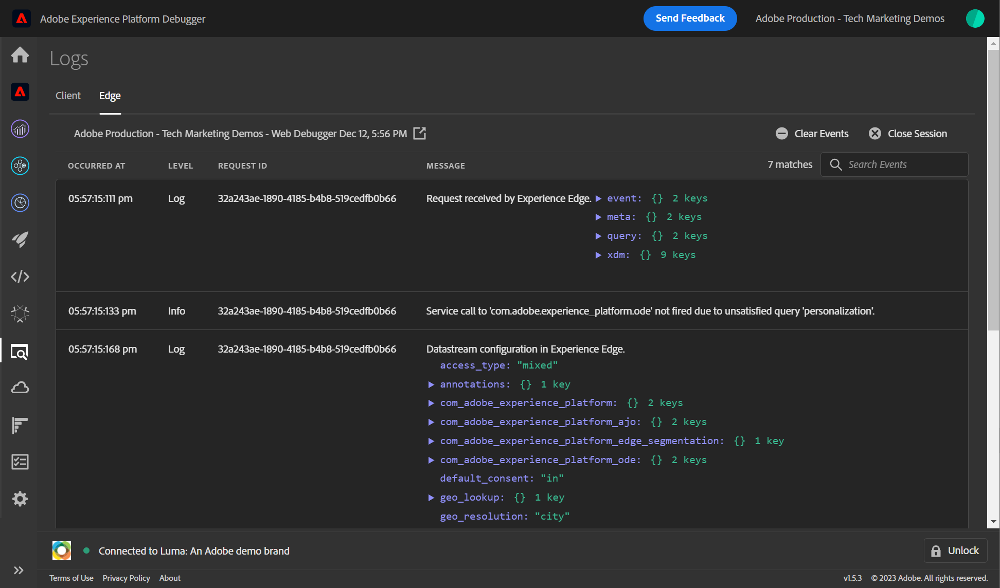

# Experience Platform Assuranceを使用した web SDK実装の検証

[Adobe Experience Platform Assurance](https://experienceleague.adobe.com/ja/docs/experience-platform/assurance/home) は、データの収集方法やエクスペリエンスの提供方法を検査、配達確認、シミュレートおよび検証するのに役立つ機能です。

[ データストリームの設定 ](configure-datastream.md) のレッスンで学んだように、Platform Web SDKは、最初にデジタルプロパティから Platform Edge Networkにデータを送信します。 次に、Platform Edge Networkは、を使用して、データストリーム内で有効になっているサービスにデータを転送します。 Platform Edge Networkに対して送受信されるリクエストを検証するには、Assuranceを使用します。

## 学習目標

このレッスンを最後まで学習すると、以下の内容を習得できます。

* Assurance セッションの開始
* Platform Edge Networkとの間で送信されたリクエストの表示

## 前提条件

データ収集タグと [Luma デモ web サイト ](https://luma.enablementadobe.com){target="_blank"} に精通し、チュートリアルの前のレッスンを完了しています。

* [XDM スキーマの設定](configure-schemas.md)
* [ID 名前空間の設定](configure-identities.md)
* [データストリームの設定](configure-datastream.md)
* [タグプロパティにインストールされている web SDK拡張機能](install-web-sdk.md)
* [データ要素の作成](create-data-elements.md)
* [ID のキャプチャ](create-identities.md)
* [タグルールの作成](create-tag-rule.md)
* [デバッガーでの検証](validate-with-debugger.md)

## Assurance セッションの開始と表示

Assurance セッションを開始する方法はいくつかあります。

### Debugger でのEdge Trace の有効化

Edge Trace を有効にする手順は次のとおりです。

1. [Luma デモ web サイト ](https://luma.enablementadobe.com) に移動し、デバッガーを使用して [ サイトのタグプロパティを独自の開発プロパティに切り替える ](validate-with-debugger.md#use-the-experience-platform-debugger-to-map-to-your-tags-property)
1. 組織名が表示された状態でデバッガーにログインしていることを確認します。 代わりにユーザー名が表示されている場合は、ログアウトしてからログインし直してください。
1. **[!UICONTROL Experience Platform Debugger の左側のナビゲーションで]** 「**[!UICONTROL ログ]**」を選択します
1. 「**[!UICONTROL Edge]**」タブを選択し、「**[!UICONTROL 接続]**」を選択します

   

1. 今のところ空です

   

1. [Luma ホームページ ](https://luma.enablementadobe.com/) を更新し、**[!UICONTROL Experience Platform Debugger]** を再度確認して、データが Platform Edge Networkに取り込まれていることを確認します。 今後のレッスンでは、データストリームでサービスを有効にすると、送信リクエストを確認できるようになります。

   

   Adobe Experience Platform DebuggerでEdge Trace を有効にするたびに、バックグラウンドでAssurance セッションが開始されます。 ここで内容を確認することもできますが、Assurance インターフェイスがはるかに役に立つ場合があります。

1. Edge Trace を有効にすると、上部に送信リンクアイコンが表示されます。 アイコンを選択して、Assuranceを開きます。

   

1. Assurance インターフェイスが表示された新しいブラウザータブが開きます。

### Assurance インターフェイスからのAssurance セッションの開始

1. [ データ収集インターフェイス ](https://experience.adobe.com/#/data-collection/home){target="_blank"} を開きます。
1. 左側のナビゲーションの「Assurance」を選択します
1. Create Session を選択します。
   
1. 「**[!UICONTROL ディープリンク接続]** オプションを使用します
1. **[!UICONTROL 開始]** を選択します
1. セッションに名前を付けます（例：`Luma Web SDK validation`）。
1. **[!UICONTROL ベース URL]** として、`https://luma.enablementadobe.com/` と入力します
   
1. 次の画面で、「**[!UICONTROL リンクをコピー]**」を選択します
1. アイコンを選択して、クリップボードにリンクをコピーします
1. URL をブラウザーに貼り付けます。これにより、特別な URL パラメーター `adb_validation_sessionid` を持つ Luma web サイトが開き、セッションが開始されます
1. Assurance インターフェイスには、セッションに正常に接続したことを示すメッセージが表示され、Assurance インターフェイスにキャプチャされたイベントが表示されます。
   

## Web SDK実装の現在の状態の検証

データストリームでまだサービスが有効になっていないので、実装のこの段階では、表示できる情報は限られています。

### `Alloy Request` を使用した Web SDKからの受信リクエストの表示

Web SDKから受信したヒットは、エッジで受信した際に表示されます。

1. `Alloy Request` 行を選択します
1. 次のように Raw イベントを探し（または、[!UICONTROL  ペイロード ]/`ACPExtensionEventData` のノードを展開して）、XDM オブジェクトが見つかります。

   

### 応答を `Alloy Response Handle` で表示

ご存知のように、Experience Cloud ID （ECID）は、Platform Edge Networkで生成された後、web SDK応答に表示されます。 Assuranceに表示された応答で探してみましょう。

1. `Alloy Response Handle` というイベントを使用して、行をフィルタリングして選択します。
1. メニューが右側に表示されます。 「`+`」の横にある `[!UICONTROL ACPExtensionEventData]` 記号を選択します
1. `[!UICONTROL payload > 0 > payload > 0 > namespace]` を選択してドリルダウンします。 最後の `0` の下に表示される ID は、`ECID` に対応しています。 一致する `namespace` の下に表示される値によって `ECID` わかります

   

   >[!CAUTION]
   >
   >ウィンドウの幅が原因で、ECID 値が切り捨てられる場合があります。 インターフェイスのハンドルバーを選択し、左にドラッグするだけで、ECID 全体を表示できます。

今後のレッスンでは、Assuranceを使用して、データストリームで有効になっているAdobe アプリケーションに到達する完全に処理されたペイロードを検証します。

XDM オブジェクトをページで実行し、データ収集の検証方法を理解したので、Platform Web SDKを使用してExperience Platformと個々のAdobe アプリケーションのセットアップを行う準備が整いました。

>[!NOTE]
>
>Adobe Experience Platform Web SDKの学習にご協力いただき、ありがとうございます。 ご不明な点がある場合や、一般的なフィードバックを共有したい場合、または今後のコンテンツに関するご提案がある場合は、この [Experience League Community Discussion の投稿でお知らせください ](https://experienceleaguecommunities.adobe.com/adobe-experience-platform-18/tutorial-discussion-implement-adobe-experience-cloud-with-web-sdk-tutorial-248848)
