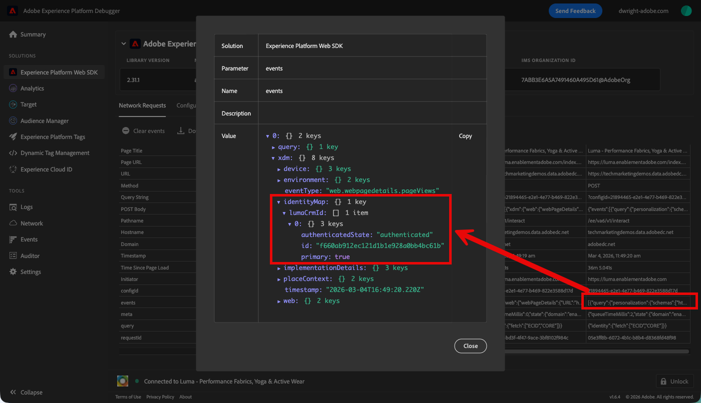

# Experience Platform Debugger を使用した web SDK実装の検証

Adobe Experience Platform デバッガ―を使用して Adobe Experience Platform Web SDK 実装を検証する方法について説明します。

Experience Platform Debugger は [Chrome拡張機能であり &#x200B;](https://chromewebstore.google.com/detail/adobe-experience-platform/bfnnokhpnncpkdmbokanobigaccjkpob)web ページに実装されたAdobe テクノロジーを確認するのに役立ちます。 Experience Platform Debugger とブラウザーの Developer Console は、Web SDK実装のブラウザーサイドの側面を検証およびデバッグする最適な方法です。 次のレッスンで説明するAdobe Experience Platform Assuranceは、Platform Edge Networkに出入りするデータの最適なビューを提供します。

デバッガーを初めて使用する場合は、次の 5 分間の概要ビデオをご覧ください。

>[!VIDEO](https://video.tv.adobe.com/v/36086?captions=jpn&learn=on&enablevpops)

このレッスンでは、[Adobe Experience Platform Debugger拡張機能 &#x200B;](https://chromewebstore.google.com/detail/adobe-experience-platform/bfnnokhpnncpkdmbokanobigaccjkpob) を使用して、[Luma デモ web サイト &#x200B;](https://luma.enablementadobe.com) でハードコードされたタグプロパティを独自のプロパティに置き換えます。

この手法は環境の切り替えと呼ばれ、後で自分の web サイトでタグを操作する際に役立ちます。 これにより、ブラウザーに実稼動 web サイトを読み込み、*開発* タグライブラリを使用できます。 この機能を使用すると、通常のコードリリースとは別に、タグの変更を自信を持って行い、検証できます。 結局、マーケティングタグリリースを通常のコードリリースから分離することが、顧客がタグを最初に使用する主な理由の 1 つです。

## 学習目標

このレッスンを終了すると、デバッガを使用して次の操作を実行できるようになります。

* 代替タグライブラリの読み込み
* クライアントサイド XDM イベントが、Platform Edge Networkに対して期待どおりにデータを取得して送信していることを検証します
* Edge Trace を有効にして、Platform Edge Networkから送信されたサーバーサイドリクエストを表示します

## 前提条件

データ収集タグと [Luma デモ web サイト &#x200B;](https://luma.enablementadobe.com/){target="_blank"} に精通し、チュートリアルの前のレッスンを完了しています。

* [XDM スキーマの設定](configure-schemas.md)
* [ID 名前空間の設定](configure-identities.md)
* [データストリームの設定](configure-datastream.md)
* [タグプロパティにインストールされている web SDK拡張機能](install-web-sdk.md)
* [データ要素の作成](create-data-elements.md)
* [ID のキャプチャ](create-identities.md)
* [タグルールの作成](create-tag-rule.md)

## Debugger での代替タグライブラリの読み込み

Experience Platform Debugger には、既存のタグライブラリを別のライブラリで置き換えることができる優れた機能があります。 この手法は、検証に役立ち、このチュートリアルの多くの実装手順をスキップできます。

1. [Luma デモ web サイト &#x200B;](https://luma.enablementadobe.com){target="_blank"} が開いていることを確認し、Experience Platform Debugger 拡張機能アイコンを選択します
1. デバッガーが開き、ハードコーディングされた実装の詳細が表示されます（デバッガーを開いた後に Luma サイトをリロードする必要が生じる場合があります）
1. 次の図に示すように、デバッガーが「**[!UICONTROL Luma に接続]**」されていることを確認し、「**[!UICONTROL lock]**」アイコンを選択して、デバッガーを Luma サイトにロックします。
1. 「**[!UICONTROL ログイン]**」ボタンを選択し、Adobe ID を使用してAdobe Experience Cloudにログインして、組織を選択します。

   >[!TIP]
   >
   > ログイン後にデバッガーに組織名ではなくユーザー名が表示された場合は、ログアウトしてから再試行してください。

   

1. 左側のナビゲーションの **[!UICONTROL Experience Platform タグ]** に移動します
1. 「**[!UICONTROL 設定]**」タブを選択します。
1. **[!UICONTROL ページ埋め込みコード]** が表示されている場所の右側で、「**[!UICONTROL アクション]**」ドロップダウンを開き、「**[!UICONTROL 置換]**」を選択します

   

1. 認証されたので、Debugger は使用可能なタグプロパティと環境を取り込みます。 プロパティを選択
1. `Development` 環境を選択します
   

   >[!TIP]
   >
   > ドロップダウンを使用してプロパティと環境を選択できない場合は、代わりに [!UICONTROL &#x200B; タグ &#x200B;]/[!UICONTROL &#x200B; 環境 &#x200B;]/[!UICONTROL &#x200B; 開発 &#x200B;]/[!UICONTROL &#x200B; インストール &#x200B;] に移動し、アイコンを選択して埋め込みコードをコピーし、デバッガーに貼り付けます。
   > 

1. 「**[!UICONTROL 適用]** ボタンを選択します

1. Luma web サイトが _独自のタグプロパティを使用して_ 再読み込みされるようになりました。

   

チュートリアルを続ける際は、この手法を使用して、Luma サイトを独自のタグプロパティにマッピングし、Platform Web SDK実装を検証します。 独自の web サイトでタグを使用する場合、これと同じ手法を使用して、実稼動 web サイトで開発タグライブラリを検証できます。

## デバッガーでの検証

### ネットワークリクエストと XDM の検証

Debugger を使用して、Platform Web Edge Network実装からトリガーされたクライアントサイドビーコンを検証し、Platform SDKに送信されたデータを確認することができます。

1. 左側のナビゲーションの **[!UICONTROL 概要]** に移動して、タグプロパティの詳細を確認します

   

1. 左側のナビゲーションで **[!UICONTROL Experience Platform Web SDK]** に移動して、**[!UICONTROL ネットワークリクエスト]** を確認します
1. **[!UICONTROL events]** 行を開きます

   

1. `web.webPageDetails.pageView` 変数を更新 [!UICONTROL &#x200B; アクション、および &#x200B;] フィールドグループに準拠するその他の標準変数で指定した `AEP Web SDK ExperienceEvent` イベントタイプを確認する方法をメモします

   

1. `web` オブジェクトまで下にスクロールし、選択してオブジェクトを開き、`webPageDetails.name` を調べます。 ホームページの対応する `adobeDataLayer` データレイヤーの変数と一致する必要があります

>[!TIP]
>
> ホームページ上で `adobeDataLayer` のデータレイヤーを表示して比較するには：
>
> 1. Luma ホームページで、ブラウザー開発者ツールを開きます。 Chromeの場合は、キーボードの `F12` ボタンを選択します
> 1. 「**[!UICONTROL コンソール]**」タブを選択します。
> 1. `adobeDataLayer` と入力し、キーボードで `Enter` を選択してデータレイヤーの値を表示します

製品ページ、買い物かごページおよび注文確認ページで設定されたイベントと変数を検証します。

### ID マップを検証

ID マップの詳細を検証することもできます。

1. **[!DNL Sign In]** Luma web サイト [&#x200B; で「](https://luma.enablementadobe.com/){target=_blank}」を選択します。 「**[!DNL Create Account]**」を選択し、資格情報 `test@test.com`/`test` を使用してアカウントを作成します。

1. デバッガーの **[!UICONTROL 最新にジャンプ]** ショートカットを使用して、最新の Web SDK イベント（最後の列）にすばやく移動します。 **[!UICONTROL events]** 行を選択して、詳細モーダルを開きます。

1. モーダル内で **identityMap** を検索します。 ここでは、authenticatedState、id、および primary designation の 3 つのキーを持つ `lumaCrmId` が表示されます。
   

## ブラウザー開発者ツールを使用した検証

多くの web 開発者は、ブラウザーの開発者ツールで実装を表示する方が好む可能性があります。 すべてのブラウザーがデバッガー拡張機能をサポートしているわけではないため、これは特に重要です。 また、柔軟なフレームワークにより、追加の実装詳細（Cookie や応答の詳細など）を調べることができます。

### ネットワークリクエストの検証

Web SDK リクエストの詳細は、ブラウザーの web デベロッパーツールの **ネットワーク** タブにも表示されます（web サイトがタグライブラリを読み込んでいると仮定）。

1. ブラウザーの web 開発者ツールの「**ネットワーク**」タブを開き、ページをリロードします。 `/ee` を使用して呼び出しをフィルターし、呼び出しを見つけて選択し、「**ヘッダー**」タブと「**ペイロード**」タブを探します

   

1. 「**プレビュー**」タブに移動し、ECID 値がネットワーク応答にどのように含まれるかを確認します。

   

   >[!NOTE]
   >
   > ECID 値は、ネットワーク応答に表示されます。 これは、ネットワークリクエストの `identityMap` の部分には含まれず、この形式で cookie に格納されることもありません。

### Web SDK の cookie

開発者向けツールを開いている間に、ブラウザーで web SDKの cookie セットの一部を見てみましょう。 アプリケーション / Cookie / https://luma.enablementadobe.comを開きます

Web SDKによって設定された複数の Cookie が表示されます。

* kndctr_[IMS_ORGID]_AdobeOrg_identity:ECID に関連するデータを格納します
* kndctr_[IMS_ORGID]_AdobeOrg_cluster：後続のネットワーク呼び出しが同じEdge サーバーにルーティングされるように、使用されるデータセンターの場所を格納します
* AMCV_[IMS_ORGID]%40AdobeOrg：これは、Web SDK Experience CloudSDK以前のライブラリで使用されていた従来の AMCV Cookie で、Adobe Experience Platform Web SDK タグ拡張機能で選択されたデフォルトの **[!UICONTROL VisitorAPI への ECID の移行]** 設定を残しているために設定されています。 この設定は、ページを古いライブラリから Web SDKに移行する際に有効にすることが重要ですが、すべてのページが一定期間移行された後に無効にすることができます。

これらの Cookie を消去してページを再読み込みすると、`.demdex.net` ドメインにサードパーティ Cookie が追加で設定されていることに気付く場合があります。 これらは、Adobe Experience Platform Web SDK タグ拡張機能でデフォルトの **[!UICONTROL サードパーティ Cookie を使用]**:**[!UICONTROL 有効]** 設定を残していたために設定されています。 ブラウザーがサードパーティ Cookie を許可していない場合、ページをリロードするとサードパーティ Cookie は削除されます。

### Luma ローカルストレージ

Luma デモ web サイトでは、HTML、CSS、JavaScriptなど、厳密なクライアントサイドテクノロジーを使用しています。 Web サイトのデフォルト状態で使用されるExperience Cloud実装以外に、バックエンドのストレージメカニズムはありません。 ユーザー名の詳細などの情報は、localStorage を使用してブラウザーのローカルに保存されるだけです。 したがって、この情報を削除したり、匿名ウィンドウを使用したりすると、以前に作成したテストユーザーアカウントを再作成する必要がある可能性があります。

次に、Adobe Experience Platform Assuranceを使用して、Platform Edge Networkから受信および送信されるこれらのネットワークリクエストを検証する方法について説明します。

>[!NOTE]
>
>Adobe Experience Platform Web SDKの学習にご協力いただき、ありがとうございます。 ご不明な点がある場合や、一般的なフィードバックを共有したい場合、または今後のコンテンツに関するご提案がある場合は、この [Experience League Community Discussion の投稿でお知らせください &#x200B;](https://experienceleaguecommunities.adobe.com/adobe-experience-platform-18/tutorial-discussion-implement-adobe-experience-cloud-with-web-sdk-tutorial-248848)
