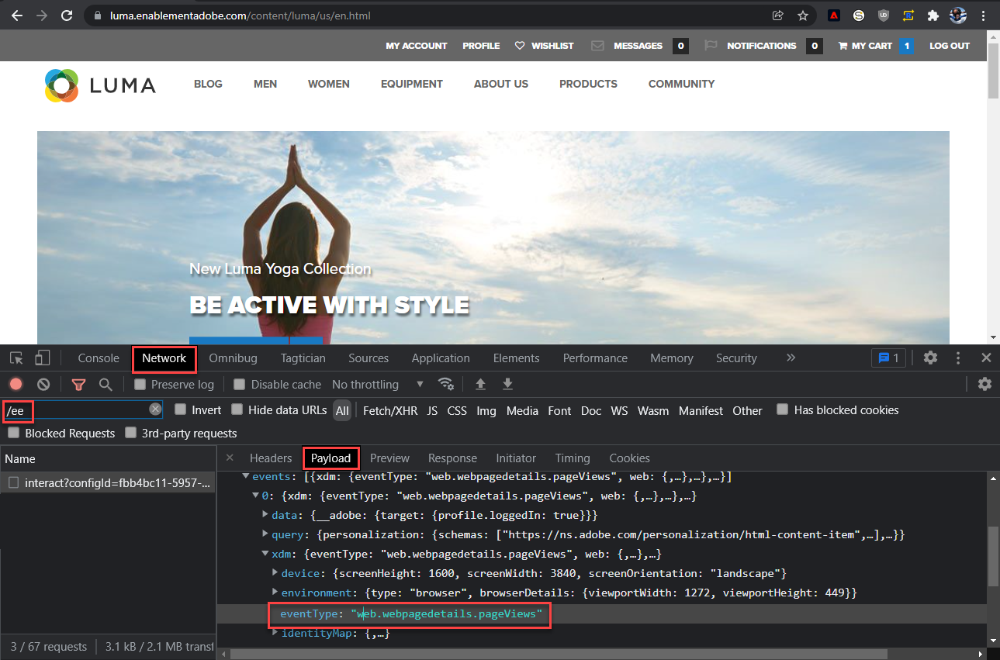

# Experience Platformデバッガーを使用した Web SDK 実装の検証

Adobe Experience Platform Debuggerを使用してAdobe Experience Platform Web SDK 実装を検証する方法を説明します。

Experience Platformーデバッガーは、Chrome および Firefox ブラウザーで使用できる拡張機能で、web ページに実装されたAdobeーテクノロジーを確認するのに役立ちます。 使用するブラウザーのバージョンをダウンロードします。

* [Firefox 拡張機能](https://addons.mozilla.org/ja/firefox/addon/adobe-experience-platform-dbg/)
* [Chrome 拡張機能](https://chromewebstore.google.com/detail/adobe-experience-platform/bfnnokhpnncpkdmbokanobigaccjkpob)

デバッガーをまだ使用したことがない場合は、次の 5 分間の概要ビデオをご覧ください。

>[!VIDEO](https://video.tv.adobe.com/v/32156?learn=on)

このレッスンでは、 [Adobe Experience Platform Debugger拡張機能](https://chromewebstore.google.com/detail/adobe-experience-platform/bfnnokhpnncpkdmbokanobigaccjkpob) でハードコードされたタグプロパティを [Luma デモサイト](https://luma.enablementadobe.com/content/luma/us/en.html) 自分のプロパティを持つ。

この手法は環境の切り替えと呼ばれるもので、後で自分の web サイトでタグを使用する際に役立ちます。 これにより、ブラウザーに実稼動用 web サイトを読み込むことができますが、その際に *開発* タグライブラリ。 この機能を使用すると、通常のコードリリースとは別に、タグの変更を自信を持って行い、検証できます。 結局のところ、マーケティングタグリリースと通常のコードリリースの分離は、顧客がそもそもタグを使用する主な理由の 1 つです。

## 学習目標

このレッスンを終了すると、デバッガを使用して次の操作を実行できるようになります。

* 代替タグライブラリの読み込み
* クライアントサイド XDM イベントが、Platform Edge Networkに対して期待どおりにデータを取得して送信していることを検証します
* Edge Trace を有効にして、Platform Edge Networkーから送信されたサーバーサイドリクエストを表示します

## 前提条件

データ収集タグと [Luma デモサイト](https://luma.enablementadobe.com/content/luma/us/en.html){target="_blank"} そして、チュートリアルの前のレッスンを完了している。

* [XDM スキーマの設定](configure-schemas.md)
* [ID 名前空間の設定](configure-identities.md)
* [データストリームの設定](configure-datastream.md)
* [タグプロパティにインストールされている Web SDK 拡張機能](install-web-sdk.md)
* [データ要素の作成](create-data-elements.md)
* [ID の作成](create-identities.md)
* [タグルールの作成](create-tag-rule.md)

## Debugger での代替タグライブラリの読み込み

Experience Platformデバッガーには、既存のタグライブラリを別のライブラリで置き換えることができる優れた機能があります。 この手法は、検証に役立ち、このチュートリアルの多くの実装手順をスキップできます。

1. を持っていることを確認します。 [Luma デモ web サイト](https://luma.enablementadobe.com/content/luma/us/en.html){target="_blank"} を開き、「Experience Platformデバッガー拡張機能」アイコンを選択します
1. デバッガーが開き、ハードコーディングされた実装の詳細が表示されます（デバッガーを開いた後に Luma サイトをリロードする必要が生じる場合があります）
1. デバッガーが「」であることを確認します。**[!UICONTROL Luma に接続]**&#x200B;次の図のように「」を選択してから、「」を選択します&#x200B;**[!UICONTROL ロック]**「アイコンでデバッガーを Luma サイトにロックします。
1. 「」を選択します **[!UICONTROL ログイン]** ボタンを押し、AdobeID を使用してAdobe Experience Cloudにログインします。
1. さあ、行きなさい **[!UICONTROL Experience Platformタグ]** 左側のナビゲーションで

   

1. 「」を選択します **[!UICONTROL 設定]** タブ
1. 表示される場所の右側 **[!UICONTROL ページ埋め込みコード]**&#x200B;を開きます。 **[!UICONTROL アクション]** ドロップダウンから選択 **[!UICONTROL 置換]**

   

1. 認証されたので、Debugger は使用可能なタグプロパティと環境を取り込みます。 プロパティを選択
1. を選択 `Development` 0.9511122
1. 「」を選択します **[!UICONTROL 適用]** ボタン

   

1. Luma web サイトがリロードされます _独自のタグプロパティを使用_.

   

チュートリアルを続ける際は、この手法を使用して、Luma サイトを独自のタグプロパティにマッピングし、Platform Web SDK 実装を検証します。 実稼動 web サイトでタグの使用を開始する場合は、タグの開発環境で行うのと同じ方法を使用して変更を検証できます。

## Experience Platform Debugger を使用したクライアントサイドのネットワークリクエストの検証

Debugger を使用して、Platform Web SDK 実装からトリガーされたクライアントサイドビーコンを検証し、Platform Edge Networkに送信されたデータを確認できます。

1. に移動 **[!UICONTROL 概要]** 左側のナビゲーションで、タグプロパティの詳細を表示します。

   

1. さあ、行きなさい **[!UICONTROL Web SDK のExperience Platform]** 左側のナビゲーションでを表示します **[!UICONTROL ネットワークリクエスト]**
1. を開きます **[!UICONTROL イベント]** 行

   

1. 次のように表示されます `web.webpagedetails.pageView` で指定したイベントタイプ [!UICONTROL 変数を更新] アクション、およびに準拠しているその他の標準変数 `AEP Web SDK ExperienceEvent` フィールドグループ

   

1. にスクロール ダウンします。 `web` オブジェクトを選択して開き、 `webPageDetails.name`, `webPageDetails.server`、および `webPageDetails.siteSection`. これらは、対応する `digitalData` ホームページ上のデータレイヤー変数

>[!TIP]
>
> を表示して比較するには `digitalData` ホームページ上のデータレイヤー
>
> 1. Luma ホームページで、ブラウザー開発者ツールを開きます。 Chrome の場合、「」ボタンを選択します `F12` キーボード上
> 1. 「」を選択します **[!UICONTROL コンソール]** タブ
> 1. Enter `digitalData` を選択して、 `Enter` キーボードでデータレイヤーの値を表示する

ID マップの詳細を検証することもできます。

1. 資格情報を使用して Luma サイトにログインします `test@adobe.com`/`test`

1. [Luma のホームページ](https://luma.enablementadobe.com/content/luma/us/en.html)に戻ります。

1. を開きます **[!UICONTROL Web SDK のExperience Platform]** 左側のナビゲーションの「」セクション

   

1. 「」を選択します **[!UICONTROL イベント]** ポップアップで詳細を開く行

   

1. を検索 **identityMap** ポップアップ内。 ここに以下が表示されます `lumaCrmId` authenticatedState、id、および primary の 3 つのキーを持つ：
   

### ブラウザー開発ツールを使用したクライアントサイドリクエストの検証

これらのタイプのリクエストの詳細は、ブラウザーの web デベロッパーツールにも表示されます **ネットワーク** タブ（web サイトがタグライブラリを読み込んでいると仮定）。

1. ブラウザーの web デベロッパーツールを開きます。 **ネットワーク** タブをクリックして、ページをリロードします。 での呼び出しのフィルタリング `/ee` 呼び出しを探すには、呼び出しを選択してから、 **ヘッダー** タブ、 **ペイロード** タブ

   

1. に移動します **応答** タブをクリックし、ECID 値が応答にどのように含まれるかを確認します。 この値をコピーします。次の演習では、この値を使用してプロファイル情報を検証します

   

   >[!NOTE]
   >
   > ECID 値は、ネットワーク応答に表示されます。 このコンポーネントは `identityMap` ネットワークリクエストの一部であるか、この形式で cookie に保存されないもの。

## Debugger を使用したサーバーサイドのネットワークリクエストのExperience Platform化

で学んだように [データストリームの設定](configure-datastream.md) レッスン : Platform Web SDK は、最初にデジタルプロパティから Platform Edge Networkにデータを送信します。 次に、Platform Edge Networkは、データストリームで有効になっている対応するサービスに対して、サーバーサイドのリクエストを追加します。 Platform Debugger で Edge Trace を使用すると、Platform Edge Networkによって行われたサーバーサイドリクエストを検証できます。

<!--Furthermore, you can also validate the fully processed payload after it reaches an Adobe application by using [Adobe Experience Platform Assurance](https://experienceleague.adobe.com/en/docs/experience-platform/assurance/home). -->

### Edge Trace を有効にする

Edge Trace を有効にするには：

1. の左側のナビゲーションで **[!UICONTROL Experience Platformデバッガー]** 選択 **[!UICONTROL ログ]**
1. 「」を選択します **[!UICONTROL Edge]** tab キーを押して、 **[!UICONTROL 接続]**

   

1. 今のところ空です

   

1. を更新 [Luma ホームページ](https://luma.enablementadobe.com/) とチェック **[!UICONTROL Experience Platformデバッガー]** ここでも、データを確認します。

   

この時点では、データストリームでを有効にしていないため、Adobeアプリケーションに送信される Platform Edge Networkリクエストを表示できません。 今後のレッスンでは、Edge Trace を使用して、Adobeアプリケーションやイベント転送への送信サーバーサイドリクエストを表示します。 ただし、最初に、Platform Edge Networkが行ったサーバーサイドリクエストを検証する別のツールであるAdobe Experience Platform Assurance について説明します。

[次へ： ](validate-with-assurance.md)

>[!NOTE]
>
>Adobe Experience Platform Web SDK の学習に時間を費やしていただき、ありがとうございます。 ご質問がある場合、一般的なフィードバックを共有したい場合、または将来のコンテンツに関するご提案がある場合は、このページでお知らせください [Experience League コミュニティ ディスカッションの投稿](https://experienceleaguecommunities.adobe.com/t5/adobe-experience-platform-data/tutorial-discussion-implement-adobe-experience-cloud-with-web/td-p/444996)
