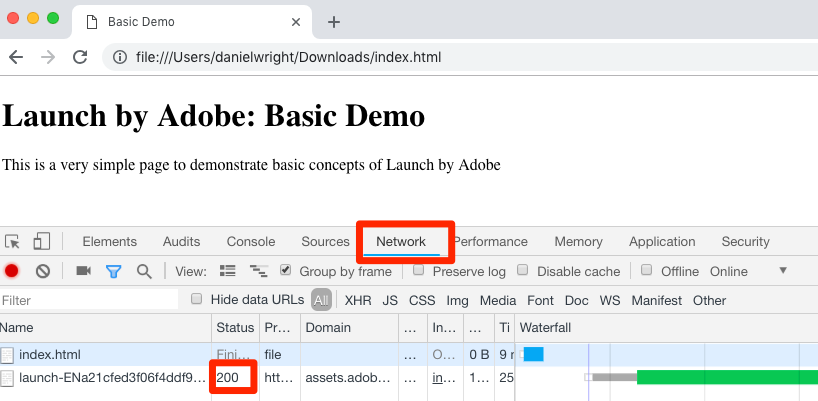
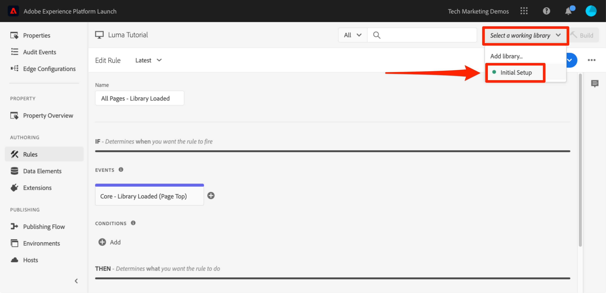

# データ要素、ルールおよびライブラリの追加

このレッスンでは、最初のデータ要素、ルール、ライブラリを作成します。

データ要素とルールは、タグの基本的な構成要素です。 データ要素には、マーケティングソリューションと広告ソリューションに送信する属性が格納され、ルールは、適切な条件下でこれらのソリューションに対する要求を実行します。ライブラリは、すべての作業を実行するため、ページに読み込まれる JavaScript ファイルです。このレッスンでは、3 つすべてを使用して、サンプルページで何らかの処理をおこなうようにします。

>[!NOTE]
>
>Adobe Experience Platform Launch は、データ収集テクノロジーのスイートとして Adobe Experience Platform に統合されています。 このコンテンツを使用する際に注意が必要な、いくつかの用語の変更がインターフェイスにロールアウトされました。
>
> * platform launch（クライアント側）が **[[!DNL tags]](https://experienceleague.adobe.com/docs/experience-platform/tags/home.html?lang=ja)**
> * platform launchサーバー側が **[[!DNL event forwarding]](https://experienceleague.adobe.com/docs/experience-platform/tags/event-forwarding/overview.html)**
> * エッジ設定が **[[!DNL datastreams]](https://experienceleague.adobe.com/docs/experience-platform/edge/fundamentals/datastreams.html?lang=ja)**


## 学習内容

このレッスンを最後まで学習すると、以下の内容を習得できます。

* データ要素の作成
* ルールの作成
* ライブラリの作成
* ライブラリへの変更の追加
* ライブラリが Web ブラウザーに読み込まれていることを検証する
* 作業ライブラリ機能を使用して作業効率を上げる

## ページ名のデータ要素の作成

データ要素は、データレイヤーのタグのバージョンです。 独自のデータレイヤーオブジェクト、cookie、ローカルストレージオブジェクト、クエリー文字列パラメーター、ページ要素、メタタグなどの値を保存できます。この演習では、ページ名のデータ要素を作成し、Target および Analytics の実装で後から使用します。

**データ要素を作成するには、以下を実行します。**

1. 左側のナビゲーションで、 **[!UICONTROL データ要素]**

1. このプロパティにはまだデータ要素を作成していないので、このトピックに関する追加情報を含む短いビデオが表示されます。よろしければこのビデオをご覧ください。

1. 「**[!UICONTROL 新規データ要素を作成]**」ボタンをクリックします。

   

1. データ要素を `Page Name` と名付けます。

1. サンプルページのデータレイヤーの値を示すには、[!UICONTROL JavaScript 変数]データ要素タイプ使用します：`digitalData.page.pageInfo.pageName`

1. 「**[!UICONTROL 強制的に値を小文字に変換]**」および「**[!UICONTROL クリーンテキスト]**」のチェックボックスをオンして大文字と小文字を標準化し、不要なスペースを削除します。

1. **[!UICONTROL なし]**&#x200B;を&#x200B;**[!UICONTROL ストレージ期間]**&#x200B;設定に残します。これは、通常、この値が各ページで異なるためです。

1. 「**[!UICONTROL 保存]**」ボタンをクリックして、データ要素を保存します。

   

>[!NOTE]
>
>データ要素機能&#x200B;_は、拡張機能を使用して拡張できます_。例えば、ContextHub 拡張機能では、拡張機能の機能を使用してデータ要素を追加できます。

## ルールの作成

次に、このデータ要素を単純なルールで使用します。ルールは、タグで最も強力な機能の 1 つで、訪問者が Web サイトとやり取りする際の動作を指定できます。 ルールで概説された基準が満たされると、ルールは指定したアクションをトリガーします。

ページ名データ要素の値をブラウザーコンソールに出力するルールを作成します。

**ルールを作成するには以下を実行します。**

1. 左側のナビゲーションで、 **[!UICONTROL ルール]**

1. このプロパティにはまだルールを作成していないので、トピックに関する追加情報を含む短いビデオが表示されます。よろしければこのビデオをご覧ください。

1. 「**[!UICONTROL 新規ルールを作成:]**」ボタンをクリックします。

   

1. ルール名を `All Pages - Library Loaded` に設定します。この命名規則は、ルールが実行される場所とタイミングを示し、タグプロパティの成熟に伴い、識別して再利用しやすくします。

1. 「イベント」で、「**[!UICONTROL 追加]**」をクリックします。イベントは、タグに対し、ルールが実行されるタイミングを示します。また、ページ読み込み、クリック、カスタム JavaScript イベントなど、様々なアクションを実行できます。

   

   1. 「イベントタイプ」として、「**[!UICONTROL Library Loaded (Page Top)]**」を選択します。「イベントタイプ」を選択すると、選択内容を使用してイベントの名前が事前入力されます。 また、イベントのデフォルトの順序は 50 です。順序は、同じイベントによって複数のルールがトリガーされる場合に、アクションのシーケンスを正確に制御することができる、タグの強力な機能です。 この機能は、チュートリアルの後半で使用します。

   1. 「**[!UICONTROL 変更を保存]**」ボタンをクリックします。

   

1. このルールはすべてのページで実行されるので、**[!UICONTROL 条件]**&#x200B;は空白のままにします。条件モーダルを開くと、URL、データ要素の値、日付範囲など、幅広いオプションに基づき、条件で制限と除外の両方を追加できます。

1. 「アクション」で&#x200B;**[!UICONTROL 追加]**&#x200B;をクリックします。

1. **[!UICONTROL アクションタイプ／カスタムコード]**（この時点では唯一のオプション）を選択します。チュートリアルの後半で、拡張機能を追加すると、より多くのオプションが利用できるようになります。

1. **[!UICONTROL &lt;/> エディターを開く]**&#x200B;を選択して、コードエディターを開きます。

   

1. コードエディターに次を追加します。次のコードは、ページ名データ要素の値をブラウザーコンソールに出力し、機能していることを確認できます。

   ```javascript
   console.log('The page name is '+_satellite.getVar('Page Name'));
   ```

1. コードエディターを保存します。

   

1. アクション設定画面で&#x200B;**[!UICONTROL 変更を保存]**&#x200B;をクリックします。

1. **[!UICONTROL 保存]**&#x200B;をクリックして、プロジェクトを保存します。

ルールページに、新しいルールが表示されます。


## ライブラリへの変更の保存

データ収集インターフェイスで拡張機能、データ要素、ルールのコレクションを設定した後、訪問者がサイトに来訪したときにマーケティングタグが実行されるように、これらの機能とロジックを Web サイトにデプロイできる JavaScript コードのセットにパッケージ化する必要があります。 ライブラリは、これを実行する JavaScript コードのセットです。

以前のレッスンでは、開発環境の埋め込みコードをサンプルページに実装しました。サンプルページを読み込むと、タグライブラリがまだ構築されておらず、環境に割り当てられていないので、埋め込みコード URL に 404 エラーが返されました。 このチュートリアルでは、サンプルページで何らかの処理をおこなえるよう、ライブラリに新しいデータ要素とルールを配置します。

**ライブラリを追加してビルドするには、以下を実行します。**

1. 左側のナビゲーションで、 **[!UICONTROL 公開フロー]**

1. **[!UICONTROL 新しいライブラリの追加]**&#x200B;をクリックします。

   

1. ライブラリに名前を付けます（例： ）。 `Initial Setup`

1. **[!UICONTROL 環境／開発]**&#x200B;を選択します。

1. **[!UICONTROL 変更されたリソースをすべて追加]**&#x200B;をクリックします。

   

1. なお、 **[!UICONTROL 変更されたリソースをすべて追加]** タグには、先ほどおこなった変更の概要が表示されます。

1. **[!UICONTROL 開発用に保存およびビルド]**&#x200B;をクリックします。

   

しばらくすると、ステータスドットが緑色に変わり、ライブラリが正常にビルドされたことを示します。


## 作業の検証

次に、ルールが期待どおりに動作していることを検証します。

サンプルページを再度読み込みます。「開発者ツール/ネットワーク」タブを見ると、タグライブラリに対して 200 件の応答が表示されます。



開発者ツール／コンソールを見ると、「The page name is home」というテキストが表示されます。


これで、最初のデータ要素とルールを作成し、最初のタグライブラリを構築しました。

## 作業ライブラリ機能の使用

タグに多くの変更を加える場合は、「公開」タブを開き、変更を加え、結果を表示するたびにライブラリを構築する必要があるので不便です。  初期セットアップライブラリを作成すると、作業ライブラリ機能を使用して変更内容をすばやく保存し、ライブラリを 1 つの手順でリビルドできます。

「All Pages - Library Loaded」ルールに小さな変更を加えます。左側のナビゲーションで、 **[!UICONTROL ルール]** 次に、 `All Pages - Library Loaded` ルールを使用して開きます。


`Edit Rule` ページで、***[!UICONTROL 作業用ライブラリ]***&#x200B;ドロップダウンをクリックし、`Initial Setup` ライブラリを選択します。



ライブラリを選択すると、 **[!UICONTROL 保存]** ボタンのデフォルト値 **[!UICONTROL ライブラリに保存]**. タグを変更する際は、このオプションを使用して、作業ライブラリに直接変更を加えたり、再構築したりできます。

やってみてください。この機能をテストするには、「Custom Code」アクションを開き、「The page name is」というテキストの後にコロンを追加します。コードブロック全体は次のようになります。

```javascript
console.log('The page name is: '+_satellite.getVar('Page Name'));
```

コードを保存し、アクションの変更を保持したまま、「**[!UICONTROL ライブラリに保存してビルド]**」ボタンをクリックします。


[!UICONTROL 作業ライブラリ]ドロップダウンの横に緑色の点が再び表示されるまでしばらく待ちます。次に、サンプルページを再読み込みし、変更がコンソールメッセージに反映されていることを確認します（ページの変更を確認するには、ブラウザーのキャッシュをクリアして再読み込みする必要がある場合があります）。


これで作業がはるかに高速になるので、チュートリアルの残りの部分ではこの方法を使用します。

[次：「Experience Cloud デバッガーで環境を切り替える」>](switch-environments.md)
