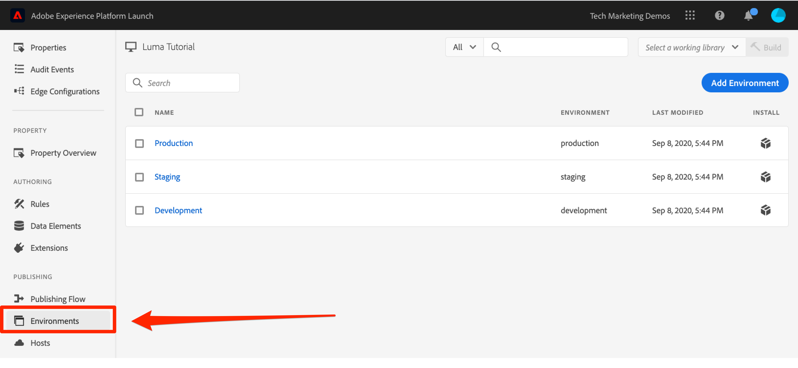

# 埋め込みコードの追加

このレッスンでは、タグプロパティの開発環境の非同期埋め込みコードを実装します。 途中で、タグの 2 つの主な概念（環境と埋め込みコード）について学びます。

>[!NOTE]
>
>Adobe Experience Platform Launch は、データ収集テクノロジーのスイートとして Adobe Experience Platform に統合されています。 このコンテンツを使用する際に注意が必要な、いくつかの用語の変更がインターフェイスにロールアウトされました。
>
> * platform launch（クライアント側）が **[[!DNL tags]](https://experienceleague.adobe.com/docs/experience-platform/tags/home.html?lang=ja)**
> * platform launchサーバー側が **[[!DNL event forwarding]](https://experienceleague.adobe.com/docs/experience-platform/tags/event-forwarding/overview.html)**
> * エッジ設定が **[[!DNL datastreams]](https://experienceleague.adobe.com/docs/experience-platform/edge/fundamentals/datastreams.html?lang=ja)**


## 学習内容

このレッスンを最後まで学習すると、以下の内容を習得できます。

* タグプロパティの埋め込みコードの取得
* 開発環境、ステージング環境および実稼動環境の違いについて理解する。
* HTML ドキュメントにタグ埋め込みコードを追加する
* タグ埋め込みコードに最適な場所を、 `<head>` html ドキュメントの

## 埋め込みコードをコピーする。

埋め込みコードは `<script>` タグを使用します。 ライブラリを非同期で読み込むと、ブラウザーはページの読み込みを続行してタグライブラリを取得し、並行して実行します。 この場合、`<head>` に配置する埋め込みコードは 1 つだけです。( タグが同期的にデプロイされた場合は 2 つの埋め込みコードがあります。1 つは `<head>` そしてもう一つ君が前に置いた `</body>`) をクリックします。

プロパティの概要画面で、 **[!UICONTROL 環境]** 左側のナビゲーションで、環境ページに移動します。 開発環境、ステージング環境、および実稼動環境は、事前に作成されています。



開発環境、ステージング環境、および実稼動環境は、コード開発やリリースプロセスの一般的な環境に対応しています。コードは、開発環境の開発者が最初に記述します。作業が完了したら、QA および他のチームがレビューできるよう、ステージング環境に送信します。QA チームやその他のチームが満足したら、コードは実稼動環境に公開されます。この環境は、訪問者が Web サイトにアクセスしたときに表示される、公開環境です。

タグを使用すると、追加の開発環境を許可できます。これは、複数の開発者が同時に異なるプロジェクトで作業する大規模な組織で役立ちます。

チュートリアルの完了に必要なのは、これらの環境のみです。環境では、異なる URL でホストされるタグライブラリの異なる作業バージョンを使用できるので、新しい機能を安全に追加して、適切なユーザー（開発者、QA エンジニア、公開など）に公開できます。 。

次に、埋め込みコードをコピーします。

1. **[!UICONTROL 開発]**&#x200B;行で、インストールアイコン をクリックして、モーダルを開きます。

1. タグは、デフォルトで非同期埋め込みコードに設定されます。

1. コピーアイコンをクリックして、埋め込みコードをクリップボードにコピーします。

1. **[!UICONTROL 閉じる]**&#x200B;をクリックしてモーダルを閉じます。

   

## サンプル HTML ページの `<head>` に埋め込みコードを実装します。

埋め込みコードは、プロパティを共有するすべての HTML ページの `<head>` 要素に実装する必要があります。1 つまたは複数のテンプレートファイルを使用して、 `<head>` サイト全体にわたってグローバルに追加できるので、タグの追加プロセスが簡単になります。

まだダウンロードしていない場合は、 [サンプルの html ページ](https://www.enablementadobe.com/multi/web/basic-sample.html) （このリンクを右クリックし、「リンクに名前を付けて保存」をクリック）し、コードエディターで開きます。 エディターが必要な場合、[Brackets](https://brackets.io/)は、オープンソースの無料エディターです。

34 行目またはその周辺にある既存の埋め込みコードを、クリップボードのコードと置き換えてページを保存します。次に、Web ブラウザーでページを開きます。`file://` プロトコルを使用してページを読み込む場合は、コードエディターで、埋め込みコード URL の先頭に「https:」を付ける必要があります）。サンプルページの 33～36 行は次のようになります。

```html
    <!--Tags Header Embed Code: REPLACE LINE 39 WITH THE EMBED CODE FROM YOUR OWN DEVELOPMENT ENVIRONMENT-->
    <script src="https://assets.adobedtm.com/launch-ENa21cfed3f06f4ddf9690de8077b39e81-development.min.js" async></script>
    <!--/Tags Header Embed Code-->
```

Web ブラウザーの開発者ツールを開き、「ネットワーク」タブに移動します。この時点で、タグ環境 URL に 404 エラーが表示されます。


404 エラーが発生するのは、このタグ環境にはまだライブラリを構築していないためです。 これについては、次のレッスンでおこないます。404 エラーではなく「Failed」メッセージが表示された場合は、埋め込みコードに `https://` プロトコルを追加し忘れている可能性があります。`file://` プロトコルを使用してサンプルページを読み込む場合にのみ、`https://` プロトコルを指定する必要があります。変更を加え、404 エラーが表示されるまでページをリロードします。

## タグ実装のベストプラクティス

サンプルページで実証されているタグ実装のベストプラクティスのいくつかを見てみましょう。

* **データレイヤー**：

   * 水 *強く* サイト上でデータレイヤーを作成し、Analytics、Target、およびその他のマーケティングソリューションで変数を生成するため必要なすべての属性を含めることをお勧めします。 このサンプルページには非常にシンプルなデータレイヤーのみが含まれていますが、実際のデータレイヤーにはページ、訪問者、買い物かごの詳細などの詳細情報が多数含まれる可能性があります。データレイヤーについて詳しくは、[Customer Experience Digital Data Layer 1.0](https://www.w3.org/2013/12/ceddl-201312.pdf) を参照してください。

   * タグソリューションで実行できる操作を最大限にするために、タグ埋め込みコードの前にデータレイヤーをExperience Cloudします。

* **JavaScript ヘルパーライブラリ**:JQuery などのライブラリを既に `<head>` ページの構文を活用するには、タグの前に読み込みます。

* **HTML5 doctype**：HTML5 doctype は Target の実装に必要です。

* **preconnect および dns-prefetch**：ページの読み込み時間を改善するには preconnect および dns-prefetch を使用します。参照：[/](https://w3c.github.io/resource-hints/)https://w3c.github.io/resource-hints/

* **非同期 Target 実装用のスニペットを事前に非表示にする**:詳しくは、 Target レッスンを参照してください。ただし、非同期タグ埋め込みコードを使用して Target をデプロイする場合、コンテンツのちらつきを管理するには、タグ埋め込みコードの前に、ページに事前非表示のスニペットをハードコードする必要があります

これらのベストプラクティスについて、推奨順にまとめました。アカウント固有の詳細を示すプレースホルダーがいくつかあります。

```html
<!doctype html>
<html lang="en">
<head>
    <title>Basic Demo</title>
    <!--Preconnect and DNS-Prefetch to improve page load time. REPLACE "techmarketingdemos" WITH YOUR OWN AAM PARTNER ID, TARGET CLIENT CODE, AND ANALYTICS TRACKING SERVER-->
    <link rel="preconnect" href="//dpm.demdex.net">
    <link rel="preconnect" href="//fast.techmarketingdemos.demdex.net">
    <link rel="preconnect" href="//techmarketingdemos.demdex.net">
    <link rel="preconnect" href="//cm.everesttech.net">
    <link rel="preconnect" href="//techmarketingdemos.tt.omtrdc.net">
    <link rel="preconnect" href="//techmarketingdemos.sc.omtrdc.net">
    <link rel="dns-prefetch" href="//dpm.demdex.net">
    <link rel="dns-prefetch" href="//fast.techmarketingdemos.demdex.net">
    <link rel="dns-prefetch" href="//techmarketingdemos.demdex.net">
    <link rel="dns-prefetch" href="//cm.everesttech.net">
    <link rel="dns-prefetch" href="//techmarketingdemos.tt.omtrdc.net">
    <link rel="dns-prefetch" href="//techmarketingdemos.sc.omtrdc.net">
    <!--/Preconnect and DNS-Prefetch-->
    <!--Data Layer to enable rich data collection and targeting-->
    <script>
    var digitalData = {
        "page": {
            "pageInfo" : {
                "pageName": "Home"
                }
            }
    };
    </script>
    <!--/Data Layer-->
    <!--jQuery or other helper libraries-->
    <script src="https://code.jquery.com/jquery-3.3.1.min.js"></script>
    <!--/jQuery-->
    <!--prehiding snippet for Adobe Target with asynchronous tags deployment-->
    <script>
        (function(g,b,d,f){(function(a,c,d){if(a){var e=b.createElement("style");e.id=c;e.innerHTML=d;a.appendChild(e)}})(b.getElementsByTagName("head")[0],"at-body-style",d);setTimeout(function(){var a=b.getElementsByTagName("head")[0];if(a){var c=b.getElementById("at-body-style");c&&a.removeChild(c)}},f)})(window,document,"body {opacity: 0 !important}",3E3);
    </script>
    <!--/prehiding snippet for Adobe Target with asynchronous tags deployment-->
    <!--Tags Header Embed Code: REPLACE LINE 39 WITH THE INSTALL CODE FROM YOUR OWN DEVELOPMENT ENVIRONMENT-->
    <script src="//assets.adobedtm.com/launch-EN93497c30fdf0424eb678d5f4ffac66dc.min.js" async></script>
    <!--/Tags Header Embed Code-->
</head>
<body>
    <h1>Tags Basic Demo</h1>
    <p>This is a very simple page to demonstrate basic concepts of tags</p>
</body>
</html>
```

これで、サイトにタグ埋め込みコードを追加する方法が分かりました。

[次：「データ要素ルールおよびライブラリの追加」>](add-data-elements-rules.md)
