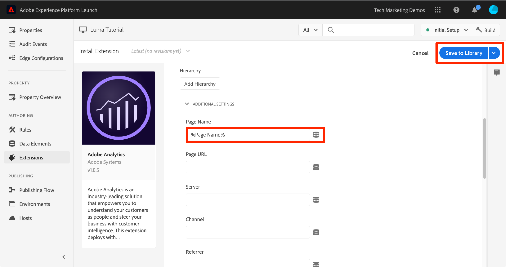
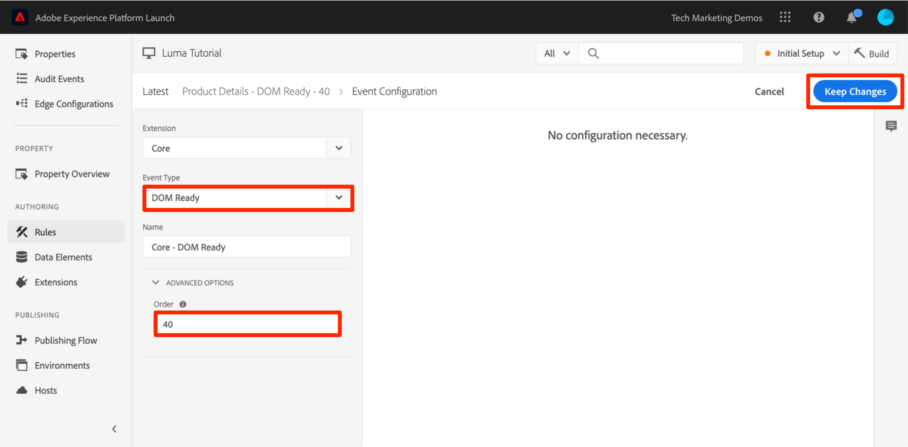
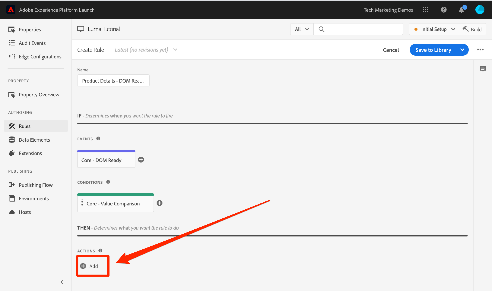
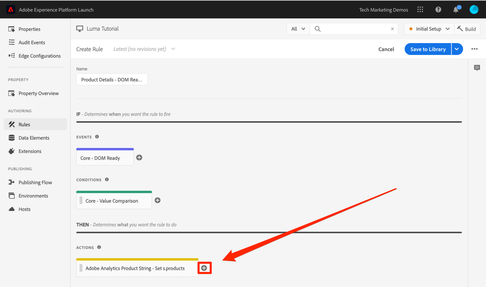
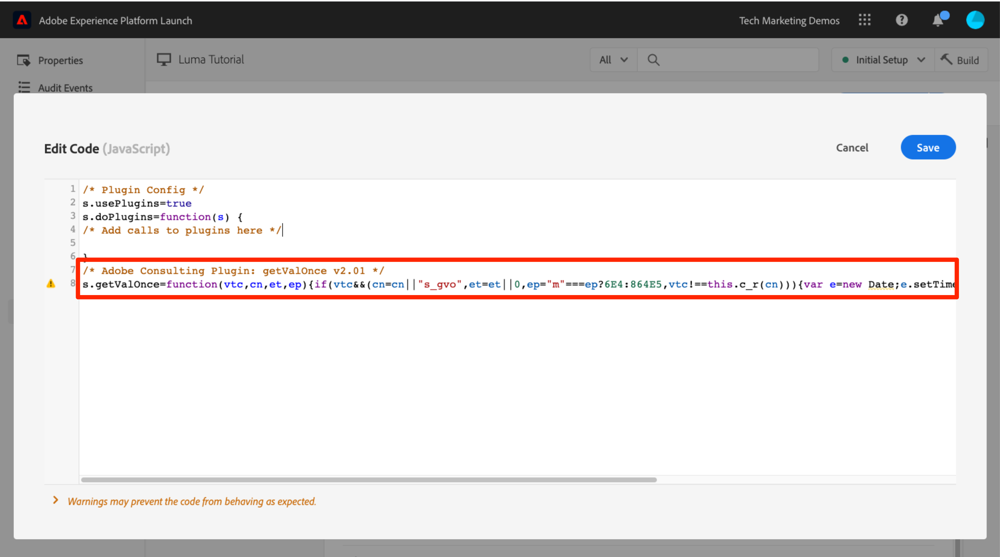

# Adobe Analytics の追加

このレッスンでは、[Adobe Analytics 拡張機能](https://experienceleague.adobe.com/docs/experience-platform/tags/extensions/adobe/analytics/overview.html)を実装し、Adobe Analytics にデータを送信するルールを作成します。

[Adobe Analytics](https://experienceleague.adobe.com/docs/analytics.html?lang=ja) は、顧客像を把握し、顧客インテリジェンスを活用してビジネスを導く力をユーザーに提供する、業界最先端のソリューションです。

>[!NOTE]
>
>Adobe Experience Platform Launch は、データ収集テクノロジーのスイートとして Adobe Experience Platform に統合されています。 このコンテンツを使用する際に注意する必要があるインターフェイスで、いくつかの用語がロールアウトされました。
>
> * Platform launch（クライアントサイド）が **[[!DNL tags]](https://experienceleague.adobe.com/docs/experience-platform/tags/home.html?lang=ja)** になりました
> * Platform launchサーバーサイドが **[[!DNL event forwarding]](https://experienceleague.adobe.com/docs/experience-platform/tags/event-forwarding/overview.html)** になりました
> * Edgeの設定が **[[!DNL datastreams]](https://experienceleague.adobe.com/docs/experience-platform/edge/fundamentals/datastreams.html?lang=ja)** になりました

## 学習内容

このレッスンを最後まで学習すると、以下の内容を習得できます。

1. Adobe Analytics 拡張機能の追加
1. 拡張機能を使用したグローバル変数の設定
1. ページビュービーコンの追加
1. ルールを使用した変数の追加
1. クリック追跡およびその他のイベントベースのビーコンの追加
1. Analytics プラグインの追加

タグの Analytics に実装できる項目は多数あります。 このレッスンは完全なものではありませんが、お客様独自のサイトで実装するために必要となる、主な技術の概要について明確に説明します。

## 前提条件

[ タグの設定 ](create-a-property.md) および [ID サービスの追加 ](id-service.md) のレッスンを既に完了しているはずです。

さらに、1 つ以上のレポートスイート ID とトラッキングサーバーが必要です。このチュートリアルで使用できるテスト／開発用レポートトスイートがない場合は、作成してください。方法が分からない場合は、[ドキュメント](https://experienceleague.adobe.com/docs/analytics/admin/manage-report-suites/new-report-suite/new-report-suite.html?lang=ja)を参照してください。トラッキングサーバーは、現在の実装、アドビコンサルタントまたはカスタマーケア担当者から取得できます。

## Analytics 拡張機能の追加

Analytics 拡張機能は、次の 2 つの主要部分で構成されます。

1. 拡張機能設定。コア AppMeasurement.js library 設定を管理し、グローバル変数を設定できます。
1. 次の操作を実行するルールアクション：
   1. Set Variables
   1. Clear Variables
   1. Analytics ビーコンの送信

**Analytics 拡張機能を追加するには、以下を実行します。**

1. **[!UICONTROL 拡張機能/カタログ]** に移動します。
1. Adobe Analytics 拡張機能を検索します。
1. 「**[!UICONTROL インストール]**」をクリックします。

   

1. [!UICONTROL  ライブラリ管理/レポートスイート ] で、各タグ環境で使用するレポートスイート ID を入力します。 ユーザーがAdobe Analyticsにアクセスできる場合、ボックスに入力を開始すると、すべてのレポートスイートの事前入力リストが表示されます。 （このチュートリアルでは、すべての環境に対して 1 つのレポートスイートを使用しても構いませんが、実際の環境では、次の画像のように別々のレポートスイートを使用する必要があります）。

   

   >[!TIP]
   >
   >[!UICONTROL  ライブラリ管理 ] 設定として「[!UICONTROL  ライブラリをシス `AppMeasurement.js` ムで管理」オプションを使用すると、ライブラリを最新の状態に保つことが非常に容易になるため ] 推奨しています。

1. [!UICONTROL  一般/トラッキングサーバー ] に、トラッキングサーバーを入力します（例：`tmd.sc.omtrdc.net`） サイトが `https://` に対応している場合は、SSL トラッキングサーバーを入力します。

   

1. [!UICONTROL  グローバル変数 ] セクションの [!UICONTROL  追加設定 ] で、`Page Name` データ要素を使用して [!UICONTROL  ページ名 ] 変数を設定します。 をクリックしてモーダルを開き、ページの `Page Name` データ要素を選択します。

1. 「**[!UICONTROL ライブラリに保存]**」をクリックします

   

>[!NOTE]
>
>グローバル変数は、拡張機能の設定またはルールアクションで設定できます。 拡張機能の設定で変数を設定する場合、データレイヤーはタグ埋め込みコードの *前* に定義する必要があります。

## ページビュービーコンの送信

次に、Analytics ビーコンを起動するルールを作成します。このルールは、拡張機能設定で設定された[!UICONTROL ページ名]変数を送信します。

このチュートリアルの [ データ要素、ルール、ライブラリの追加 ](add-data-elements-rules.md) レッスンでは、「すべてのページ – ライブラリの読み込み」ルールを作成済みです。このルールは、タグライブラリの読み込み時にすべてのページでトリガーされます。 このルールを Analytics にも使用できます *ただし* この設定では、Analytics ビーコンで使用されるすべてのデータレイヤー属性を、タグ埋め込みコードの前に定義する必要があります。 データ収集をより柔軟に実行できるようにするには、「DOM Ready」でトリガーして Analytics ビーコンを起動する、新しい「all pages」ルールを作成します。

**ページビュービーコンを送信するには、以下を実行します。**

1. 左側のナビゲーションの [**[!UICONTROL ルール]**] セクションに移動し、[**[!UICONTROL ルールの追加]**] をクリックします

   

1. ルール名を設定します。`All Pages - DOM Ready`
1. **[!UICONTROL イベント /追加]** をクリックして、`Event Configuration` 画面を開きます

   

1. **[!UICONTROL イベントタイプ/DOM Ready]** を選択します（ルールの順序は「50」です）。
1. 「**[!UICONTROL 変更を保持]**」をクリックします
   

1. 「アクション」の下のをクリックして、新しいアクションを追加します。

   

1. **[!UICONTROL 拡張機能/Adobe Analytics]** を選択します。

1. **[!UICONTROL アクションタイプ/ビーコンを送信]** を選択します。

1. トラッキングは `s.t()` に設定したままにします。クリックイベントルールで `s.tl()` を呼び出す場合は、「ビーコンを送信」アクションでおこなうことも使用できます。

1. 「**[!UICONTROL 変更を保持]**」ボタンをクリックします

   

1. 「**[!UICONTROL ライブラリおよびビルドに保存]**」をクリックします

   

### ページビュービーコンの検証

ビーコンを送信するためのルールを作成したら、Experience Cloud デバッガーでそのリクエストを表示できるようになります。

1. Chrome ブラウザーで [Luma サイト](https://luma.enablementadobe.com/content/luma/us/en.html)を開きます。
1.  デバッガーアイコンをクリックして、**[!UICONTROL Adobe Experience Cloud デバッガーを開きます]**
1. [ 前のレッスン ](switch-environments.md) の説明に従って、Debugger がタグプロパティを *自分の* 開発環境にマッピングしていることを確認します。

   

1. クリックして「Analytics」タブを開きます。
1. レポートスイート名を展開して、それに対するすべての要求を表示します。
1. そのページ名変数と値で要求が実行されたことを確認します。

   

>[!NOTE]
>
>ページ名が表示されない場合は、このページの手順に戻り、見落としがないことを確認します。

## ルールによる変数の追加

Analytics 拡張機能を設定する際、拡張機能設定に `pageName` 変数を入力しました。タグ埋め込みコードが読み込まれる前にページ上で値が使用可能であれば、eVar や prop などの他のグローバル変数を設定するのに適した場所です。

変数やイベントを設定する場所は、`Set Variables` アクションを使用するルール内でより柔軟に指定できます。ルールを使用すると、異なる条件下で異なる Analytics 変数やイベントを設定できます。例えば、`prodView` は製品詳細ページでのみ、`purchase` イベントは注文確認ページでのみ設定できます。ここでは、ルールを使用して変数を設定する方法について説明します。

### 使用例

製品の詳細ページ（PDP）は、小売サイトでのデータ収集に重要なポイントです。通常は、Analytics に対し、製品の表示が発生し、どの製品が閲覧されたかを登録します。これは、顧客に人気のある製品を把握するのに役立ちます。メディアサイトでは、記事またはビデオページで、このセクションで説明する手法と似たトラッキングテクニックを使用できます。製品の詳細ページを読み込む際、その値を「ページタイプ」`eVar` に入力し、イベントと製品 ID を設定することができます。これにより、以下の内容を分析で確認できるようになります。

1. 製品の詳細ページは何回読み込まれたか。
1. どの製品が何回表示されたか。
1. その他の要因（キャンペーン、検索など）が、ユーザーが読み込む PDP にどの程度影響しているか。

### ページタイプのデータ要素の作成

まずどのページが製品の詳細ページであるかを特定する必要があります。これには、データ要素を使用します。

**ページタイプのデータ要素を作成するには、以下を実行します。**

1. 左側のナビゲーションで **[!UICONTROL データ要素]** をクリックします
1. 「**[!UICONTROL データ要素を追加]**」をクリックします。

   

1. データ要素に「`Page Type`」と名前を付けます。
1. **[!UICONTROL データ要素タイプ/JavaScript変数]** を選択します。
1. `digitalData.page.category.type` を **[!UICONTROL JavaScript変数名として使用]**
1. 「**[!UICONTROL テキストをクリーン]**」および「**[!UICONTROL 小文字を強制]**」オプションをオンにします
1. 「**[!UICONTROL ライブラリに保存]**」をクリックします

   

### 製品 ID のデータ要素の作成

次に、現在の製品詳細ページの製品 ID をデータ要素と共に収集します。

**製品 ID のデータ要素を作成するには、以下を実行します。**

1. 左側のナビゲーションで **[!UICONTROL データ要素]** をクリックします
1. 「**[!UICONTROL データ要素を追加]**」をクリックします。

   

1. データ要素に「`Product Id`」と名前を付けます。
1. **[!UICONTROL データ要素タイプ/JavaScript変数]** を選択します。
1. `digitalData.product.0.productInfo.sku` を **[!UICONTROL JavaScript変数名として使用]**
1. 「**[!UICONTROL テキストをクリーン]**」および「**[!UICONTROL 小文字を強制]**」オプションをオンにします
1. 「**[!UICONTROL ライブラリに保存]**」をクリックします

   

### Adobe Analytics 製品文字列拡張機能の追加

Adobe Analytics の実装に詳しい方は、[products](https://experienceleague.adobe.com/docs/analytics/implementation/vars/page-vars/products.html?lang=ja) 変数について既に詳しいと思われます。製品変数には特定の構文があり、コンテキストに応じて使用方法は若干異なります。タグで製品変数の母集団を簡単にするために、タグ拡張機能のマーケットプレイスには、既に 3 つの拡張機能が作成されています。 この節では、製品の詳細ページで使用できるよう、アドビコンサルティングによって作成された拡張機能を追加します。

**`Adobe Analytics Product String`extension** を追加するには、以下を実行します。

1. [!UICONTROL 拡張機能／カタログ]ページに移動します。
1. Adobe Consulting サービスによって `Adobe Analytics Product String` 拡張機能を検索し、「**[!UICONTROL インストール]**」をクリックします。
   
1. しばらく時間をかけ、手順を読んでください。
1. 「**[!UICONTROL ライブラリに保存]**」をクリックします

   

### 製品の詳細ページ用のルールの作成

次に、新しいデータ要素と拡張機能を使用して、製品の詳細ページルールを作成します。この機能の場合は、「DOM Ready」によってトリガーされる別のページ読み込みルールを作成します。ただし、製品の詳細ページでのみ実行するよう条件を使用しビーコンを送信するルールより&#x200B;_前に_&#x200B;実行されるように順序を設定します。

**製品詳細ページのルールを作成するには、以下を実行します。**

1. 左側のナビゲーションの [**[!UICONTROL ルール]**] セクションに移動し、[**[!UICONTROL ルールの追加]**] をクリックします

   

1. ルール名を設定します。`Product Details - DOM Ready - 40`
1. **[!UICONTROL イベント /追加]** をクリックして、`Event Configuration` 画面を開きます

   

1. **[!UICONTROL イベントタイプ/DOM Ready]** を選択します。
1. 「**[!UICONTROL 順序]**」を 40 に設定して、Analytics / ビーコンの送信アクションを含むルールを *前* 実行するようにします
1. 「**[!UICONTROL 変更を保持]**」をクリックします
   

1. **[!UICONTROL 条件]** で  して `Condition Configuration` 画面を開きます
   

   1. **[!UICONTROL 条件タイプ/値の比較]** を選択します。
   1. データ要素ピッカーを使用して、最初のフィールドで「`Page Type`」を選択します。
   1. 比較演算子ドロップダウンから「**[!UICONTROL 次を含む]**」を選択します
   1. 次のフィールドで、`product-page` を入力します（PDPのデータレイヤーから取り出したページタイプ値の一意の部分）。
   1. 「**[!UICONTROL 変更を保持]**」をクリックします

      

1. 「アクション」の下のをクリックして、新しいアクションを追加します。

   

1. **[!UICONTROL 拡張機能/Adobe Analytics製品文字列]** を選択します。
1. **[!UICONTROL アクションタイプ/s.products を設定]** を選択します。

1. 「**[!UICONTROL Analytics E コマースイベント]**」セクションで、「**[!UICONTROL prodView]**」を選択します。

1. **[!UICONTROL 商品データのデータレイヤー変数]** セクションで、データ要素ピッカーを使用して `Product Id` データ要素を選択します

1. 「**[!UICONTROL 変更を保持]**」をクリックします

   


1. 「アクション」の下のをクリックして、新しいアクションを追加します。

   

1. **[!UICONTROL 拡張機能/Adobe Analytics]** を選択します。
1. **[!UICONTROL アクションタイプ/変数を設定]** を選択します。
1. **[!UICONTROL eVar1 /名前を付けて設定を選択し]**`product detail page` と入力します
1. オプションの値は空白のままにして、**[!UICONTROL event1]** を設定します
1. 「イベント」の下の「**[!UICONTROL さらに追加]**」ボタンをクリックします
1. **[!UICONTROL prodView]** イベントを設定します（オプションの値は空白のままにします）
1. 「**[!UICONTROL 変更を保持]**」をクリックします

   

1. 「**[!UICONTROL ライブラリおよびビルドに保存]**」をクリックします

   

### 製品の詳細ページデータの検証

ビーコンの送信前に変数を設定するルールを作成しました。これで、Experience Cloud デバッガーでヒット内のデータを表示できるようになります。

**製品詳細ページデータを検証するには、以下を実行します。**

1. Chrome ブラウザーで [Luma サイト](https://luma.enablementadobe.com/content/luma/us/en.html)を開きます。
1. 製品の詳細ページに移動します。
1.  デバッガーアイコンをクリックして、**[!UICONTROL Adobe Experience Cloud デバッガーを開きます]**
1. 「Analytics」タブをクリックします。
1. レポートスイートを展開します。
1. 製品詳細変数がデバッガーに表示されています。`eVar1` は「製品詳細ページ」に設定されており、`Events` 変数は「event1」および「prodView」に設定されています。製品変数は表示している製品の製品 ID とともに設定されています。ページ名は引き続き Analytics 拡張機能によって設定されています。

   

## トラックリンクビーコンの送信

ページが読み込まれると、通常、`s.t()` 関数によってトリガーされたページ読み込みビーコンが実行されます。これにより、`pageName` 変数に表示されるページの `page view` 指標が自動的に増分されます。

しかし、実行するアクションがページビューよりも小さい、またはページビューとは異なるという理由で、サイトのページビュー数を増加させたくない場合があります。この場合は、`s.tl()` 関数（一般的にトラックリンクリクエストと呼ばれます）を使用します。トラックリンクリクエストと呼ばれていますが、必ずしもリンクのクリックでトリガーする訳ではありません。タグのルールビルダーで使用できる *任意の* イベント（独自のカスタムJavaScriptを含む）によってトリガーされます。

このチュートリアルでは、最も優れた JavaScript イベントの 1 つである `s.tl()` イベントを使用して `Enters Viewport` の呼び出しをトリガーします。

### ユースケース

このユースケースでは、ユーザーが Luma ホームページで十分にスクロールされて、ページの *おすすめ製品* セクションが表示されているかどうかを確認します。 ユーザーがそのセクションを閲覧できるかどうかに関して、社内で不和があるため、Analytics を使用して真実を判断する必要があります。

### タグでのルールの作成

1. 左側のナビゲーションの「**[!UICONTROL ルール]**」セクションに移動し、「**[!UICONTROL ルールを追加]**」をクリックします
   
1. ルール名を設定します。`Homepage - Featured Products enters Viewport`
1. **[!UICONTROL イベント /追加]** をクリックして、`Event Configuration` 画面を開きます

   

1. **[!UICONTROL Event Type > Enters Viewport]** を選択します。 表示されたフィールドに CSS セレクターを入力します。このセレクターは、ブラウザーにルールが表示されたときにルールをトリガーする必要のあるページ上の項目を識別します。
1. Luma のホームページに戻り、注目の製品セクションまで下にスクロールします。
1. 「FEATURED PRODUCTS」タイトルとこのセクションの項目の間のスペースを右クリックし、右クリックメニューから「`Inspect`」を選択します。 探しているものはすぐ近くにあります。
1. おそらく選択したセクションのすぐ下に、`class="we-productgrid aem-GridColumn aem-GridColumn--default--12"`を含む div があるはずです。この要素を見つけます。
1. この要素を右クリックし、「コピー **[!UICONTROL コピーセレクター]** を選択します。

   

1. タグに戻り、クリップボードのこの値を、`Elements matching the CSS selector` というラベルの付いたフィールドに貼り付けます。
   1. CSS セレクターの識別方法はユーザーが決定します。この方法は、ページ上で特定の変更をおこなうと、このセレクターが壊れる場合があるので、少し脆弱です。タグで CSS セレクターを使用する場合は、このことを考慮してください。
1. 「**[!UICONTROL 変更を保持]**」をクリックします
   

1. 「条件」で、をクリックして、新しい条件を追加します。
1. **[!UICONTROL 条件タイプ/値の比較]** を選択します。
1. データ要素ピッカーを使用して、最初のフィールドで「`Page Name`」を選択します。
1. 比較演算子ドロップダウンから「**[!UICONTROL 次に等しい]**」を選択します
1. 次のフィールドで、`content:luma:us:en` と入力します（これは、データレイヤーから取り込んだホームページのページ名です。このルールは、ホームページ上でのみ実行する必要があります）。
1. 「**[!UICONTROL 変更を保持]**」をクリックします

   

1. 「アクション」の下のをクリックして、新しいアクションを追加します。
1. **[!UICONTROL 拡張機能/Adobe Analytics]** を選択します。
1. **[!UICONTROL アクションタイプ/変数を設定]** を選択します。
1. `eVar3` を `Home Page - Featured Products` に設定します。
1. `prop3` を `Home Page - Featured Products` に設定します。
1. `Events` 変数を `event3` に設定します。
1. 「**[!UICONTROL 変更を保持]**」をクリックします

   

1. 「アクション」の下のをクリックして、新しいアクションを追加します。

1. **[!UICONTROL 拡張機能/Adobe Analytics]** を選択します。
1. **[!UICONTROL アクションタイプ/ビーコンを送信]** を選択します。
1. **[!UICONTROL `s.tl()`]** のトラッキングオプションを選択します
1. 「**[!UICONTROL リンク名]**」フィールドに「`Scrolled down to Featured Products`」と入力します。 この値は、Analytics のカスタムリンクレポートに配置されます。
1. 「**[!UICONTROL 変更を保持]**」をクリックします

   

1. 「**[!UICONTROL ライブラリおよびビルドに保存]**」をクリックします

   

### トラックリンクビーコンの検証

次に、サイトのホームページの「特集製品」セクションまでスクロールダウンしたときに、このヒットが表示されるようにする必要があります。 最初にホームページを読み込んだときには、リクエストは実行されませんが、下にスクロールしてセクションが表示されると、新しい値でヒットが起動します。

1. Chrome ブラウザーで [Lumaサイト](https://luma.enablementadobe.com/content/luma/us/en.html)を開き、ホームページの先頭に来ていることを確認します。
1. **[!UICONTROL デバッガーアイコン]** をクリックして、[!UICONTROL Adobe Experience Cloud デバッガーを開きます ]
1. 「Analytics」タブをクリックします。
1. レポートスイートのヒットを展開します。
1. ホームページの通常のページビューヒットにページ名などが付いています。（ただし、eVar3 や prop3 には何も含まれません）。

   

1. デバッガーを開いたままにして、おすすめ製品セクションが表示されるまでサイトを下にスクロールします
1. デバッガーを再度表示すると、別の Analytics ヒットが表示されるはずです。このヒットには、設定した s.tl() ヒットに関連付けられたパラメーターが含まれている必要があります。すなわち、
   1. `LinkType = "link_o"` となります（これは、ヒットは、ページビューヒットではなく、カスタムリンクヒットであることを意味します）。
   1. `LinkName = "Scrolled down to Featured Products"`
   1. `prop3 = "Home Page - Featured Products"`
   1. `eVar3 = "Home Page - Featured Products"`
   1. `Events = "event3"`

      

## プラグインの追加

プラグインは、実装することで、製品に組み込まれていない関数を実行できる JavaScript コードです。プラグインは、ユーザー、他のアドビの顧客やパートナー、またはアドビコンサルティングによって作成できます。

プラグインを実装するには、基本的には次の 3 つの手順があります。

1. doPlugins 関数を含める（この関数では、プラグインが参照されます）。
1. プラグインのメイン関数コードを追加する。
1. 関数を呼び出し、変数などを設定するコードを含める。

### Analytics オブジェクトにグローバルでアクセスできるようにする

doPlugins 関数（以下）を追加してプラグインを使用する場合は、チェックボックスをオンにして、Analytics 実装でグローバルに Analytics の「s」オブジェクトを使用できるようにする必要があります。

1. **[!UICONTROL 拡張機能/インストール済み]** に移動します。

1. Adobe Analytics拡張機能で、「**[!UICONTROL 設定]**」をクリックします

   

1. **[!UICONTROL ライブラリ管理]** で、「`Make tracker globally accessible`」というラベルの付いたボックスを選択します。 ヘルプバブルに表示されるように、トラッカーは、window.s の下でグローバルにスコープされるので、顧客の JavaScript で参照する際に重要です。
   

### doPlugins 関数を含める

プラグインを追加するには、doPlugins と呼ばれる関数を追加する必要があります。この関数は、デフォルトでは追加されませんが、追加されると AppMeasurement ライブラリによって処理され、Adobe Analytics にヒットが送信される際に最後に呼び出されます。したがって、この関数を使用すると、JavaScript を実行して、この方法を設定するよりも簡単に変数を設定できます。

1. Analytics 拡張機能を使用している間に、下にスクロールして「`Configure Tracker Using Custom Code.`」セクションを展開します。
1. **[!UICONTROL 編集画面を開く]** をクリックします
1. コードエディターに次のコードを貼り付けます。

   ```javascript
   /* Plugin Config */
   s.usePlugins=true
   s.doPlugins=function(s) {
   /* Add calls to plugins here */
   }
   ```

1. 次の手順で使用するので、このウィンドウを開いておきます。

### プラグインに関数コードを追加します。

このコードでは 2 つのプラグインを呼び出しますが、そのうちの 1 つは AppMeasurement ライブラリに組み込まれているので、呼び出す関数を追加する必要はありません。ただし、2 番目の関数については、関数コードを追加する必要があります。この関数は、getValOnce() と呼ばれます。

### getValOnce() プラグイン

このプラグインの目的は、訪問者がページを更新したとき、またはブラウザーの戻るボタンを使用して値が設定されたページに戻ったときに、コード内で誤って値が複製されるのを防ぐことです。このレッスンでは、`clickthrough` イベントの重複を防ぐためにこれを使用します。

このプラグインのコードは [Analytics のドキュメント](https://experienceleague.adobe.com/docs/analytics/implementation/vars/plugins/getvalonce.html)で入手できますが、簡単にコピーして貼り付けられるよう、ここに含まれています。

1. 次のコードをコピーします。

   ```javascript
   /* Adobe Consulting Plugin: getValOnce v2.01 */
   s.getValOnce=function(vtc,cn,et,ep){if(vtc&&(cn=cn||"s_gvo",et=et||0,ep="m"===ep?6E4:864E5,vtc!==this.c_r(cn))){var e=new Date;e.setTime(e.getTime()+et*ep);this.c_w(cn,vtc,0===et?0:e);return vtc}return""};
   ```

1. Analytics 拡張機能のコードウィンドウ（まだ開いていない場合は、前の手順に従って再度開きます）にペーストします。doPlugins 関数の下に（関数の内部ではなく）**完全に**&#x200B;にペーストします。

   

これで、このプラグインを doPlugins 内から呼び出せるようになりました。

### doPlugins 内からのプラグインの呼び出し

これでコードが配置され、参照できるようになったので、doPlugins 関数内でプラグインを呼び出すことができます。

まず、AppMeasurement ライブラリに組み込まれているプラグイン（ユーティリティ）を呼び出します。これは、`s.Util.getQueryParam` と呼ばれ、s オブジェクトの一部であるため、ビルトインユーティリティであり、URL のクエリ文字列のパラメーターに基づいて値を取得します。

1. 次のコードをコピーします。

   ```javascript
   s.campaign = s.Util.getQueryParam("cid");
   ```

1. doPlugins 関数に貼り付けます。これにより、現在のページ URL で `cid` というパラメーターを探し、s.campaign 変数に配置します。
1. 次のコードをコピーして、getQueryParam への呼び出しの下に張り付け、getValOnce 関数を呼び出します。

   ```javascript
   s.campaign=s.getValOnce(s.campaign,'s_cmp',30);
   ```

   このコードを使用すると、同じ値が連続した 30 日間に 2 回以上送信されないようにすることができます（必要に応じてこのコードをカスタマイズする方法については、ドキュメントを参照してください）。

   

1. コードウィンドウを保存します。
1. 「**[!UICONTROL ライブラリおよびビルドに保存]**」をクリックします

   

### プラグインの検証

次に、プラグインが機能していることを確認できます。

**プラグインを検証するには、以下を実行します。**

1. Chrome ブラウザーで [Luma サイト](https://luma.enablementadobe.com/content/luma/us/en.html)を開きます。
1.  デバッガーアイコンをクリックして、**[!UICONTROL Adobe Experience Cloud デバッガーを開きます]**
1. 「Analytics」タブをクリックします。
1. レポートスイートを展開します。
1. Analytics ヒットには Campaign 変数はありません。
1. デバッガーを開いたまま Luma サイトに戻り、`?cid=1234` を URL に追加してから、Enter キーを押してそのクエリ文字列を含むページを更新します。

   

1. デバッガーを選択し、Campaign 変数が `1234` に設定された 2 回目の Analytics リクエストがあることを確認します。

   

1. クエリ文字列を URL 内に残したまま、戻って Luma ページをもう一度更新します。
1. デバッガーで次のヒットをチェックすると、Campaign 変数が存在&#x200B;**しない**&#x200B;はずです。getValOnce プラグインは、重複がなく、別の人がキャンペーントラッキングコードから来たように見えないように確認しているからです。

   

1. ボーナス：クエリ文字列内の `cid` パラメーターの値を変更することで、これを何度もテストできます。Campaign 変数は、値が含まれるページを **初めて** 実行したときにのみ表示される必要があります。デバッガーに Campaign 値が表示されていない場合は、URL のクエリ文字列にある `cid` の値を変更し、Enter キーを押して、デバッガーで再度表示します。

   >[!NOTE]
   >
   >Analytics 拡張機能の設定など、実際には URL のクエリ文字列からパラメーターを取得する方法はいくつかあります。 ただし、これら以外のプラグインオプションでは、getValOnce プラグインを使用してここでおこなった操作と同じように、不要な重複を停止する機能は提供していません。これは著者が気に入っている方法ですが、どの方法がお客様やお客様のニーズに最適かは、お客様が判断する必要があります。

お疲れ様です。Analytics のレッスンが完了しました。もちろん、Analytics の実装を強化するために実行できる操作は他にも多数ありますが、これにより、残りのニーズに対処するための中核的なスキルのいくつかが得られれば幸いです。

[次の「Adobe Audience Managerの追加」 >](audience-manager.md)
