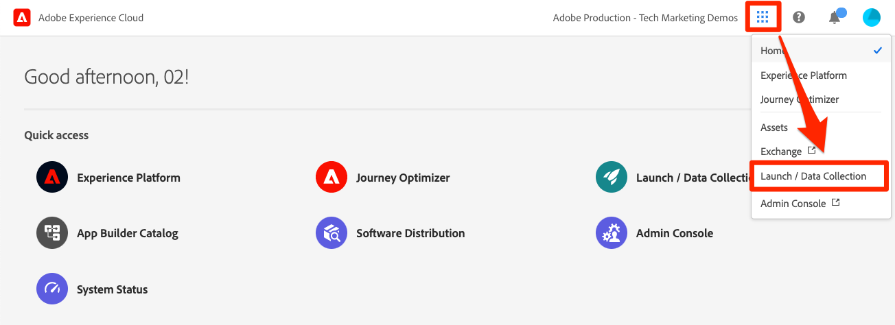

# タグプロパティの作成

このレッスンでは、最初のタグプロパティを作成します。

プロパティは基本的に、サイトにタグを導入する際に拡張機能、ルール、データ要素およびライブラリを入力するコンテナです。

## 前提条件

次のレッスンを完了するには、タグで環境の開発、承認、公開、管理をおこなう権限が必要です。 ユーザーインターフェイスオプションが使用できないためにこれらの手順を完了できない場合は、Experience Cloud 管理者に連絡してアクセス権をもらってください。タグのユーザー権限について詳しくは、 [ドキュメント](https://experienceleague.adobe.com/docs/experience-platform/tags/admin/user-permissions.html?lang=ja).

>[!NOTE]
>
>Adobe Experience Platform Launch は、データ収集テクノロジーのスイートとして Adobe Experience Platform に統合されています。 このコンテンツを使用する際に注意が必要な、いくつかの用語の変更がインターフェイスにロールアウトされました。
>
> * platform launch（クライアント側）が **[[!DNL tags]](https://experienceleague.adobe.com/docs/experience-platform/tags/home.html?lang=ja)**
> * platform launchサーバー側が **[[!DNL event forwarding]](https://experienceleague.adobe.com/docs/experience-platform/tags/event-forwarding/overview.html)**
> * エッジ設定が **[[!DNL datastreams]](https://experienceleague.adobe.com/docs/experience-platform/edge/fundamentals/datastreams.html?lang=ja)**

## 学習内容

このレッスンを最後まで学習すると、以下の内容を習得できます。

* データ収集ユーザーインターフェイスへのログイン
* 新しいタグプロパティを作成する
* タグプロパティの設定

## データ収集インターフェイスに移動します。

**データ収集にアクセスするには**

1. [Adobe Experience Cloud ](https://experiencecloud.adobe.com)にログインします。

1. 次をクリック：  アイコンをクリックしてアプリ切り替えボタンを開きます。

1. 選択 **[!UICONTROL Launch/データ収集]** メニューから 

`Tags Properties` 画面が表示されます（アカウントでプロパティを作成したことがない場合は、この画面が空になる可能性があります）。

## プロパティの作成

プロパティは基本的に、サイトにタグを導入する際に拡張機能、ルール、データ要素およびライブラリを入力するコンテナです。プロパティは、1 つ以上のドメインやサブドメインをグループ化できます。それらすべてのアセットを、ほぼ共通の方法で管理および追跡できます。例えば、1 つのテンプレートに基づく複数の Web サイトがあり、それらすべてに関する共通のアセットを追跡する場合などに役立ちます。1 つのプロパティを複数のドメインに適用することもできます。プロパティの作成について詳しくは、製品ドキュメントの[企業とプロパティ](https://experienceleague.adobe.com/docs/experience-platform/tags/admin/companies-and-properties.html)を参照してください。

**プロパティを作成するには**

1. 「**[!UICONTROL 新しいプロパティ]**」ボタンをクリックします。

   

1. プロパティに名前を付けます（例：`Luma Tutorial` または `Luma Tutorial - Daniel`）
1. ドメインとして、これは Luma デモサイトがホストされているドメインなので、`enablementadobe.com` と入力します。「Domain」フィールドは必須ですが、タグプロパティは、実装されているすべてのドメインで機能します。 このフィールドの主な目的は、ルールビルダーでメニューオプションを事前に設定することです。
1. を展開します。 **[!UICONTROL 詳細オプション]** 」セクションにチェックを入れ、 **[!UICONTROL ルールコンポーネントを順に実行]**
1. 「**[!UICONTROL 保存]**」ボタンをクリックします。

   

新しいプロパティが「プロパティ」ページに表示されます。プロパティ名の横にあるボックスをチェックすると、プロパティを&#x200B;**[!UICONTROL 設定]**&#x200B;または&#x200B;**[!UICONTROL 削除]**&#x200B;するオプションがプロパティリストの上に表示されます。プロパティ名（例：`Luma Tutorial`）をクリックして、`Overview` 画面を開きます。

[次：「 埋め込みコードの追加」>](add-embed-code.md)
