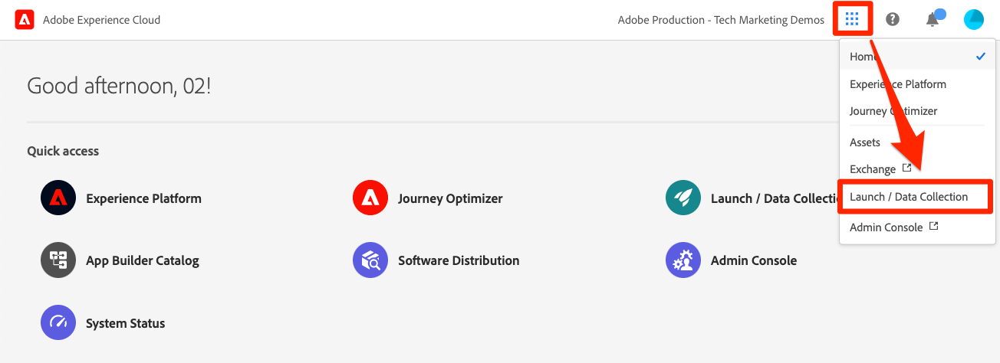
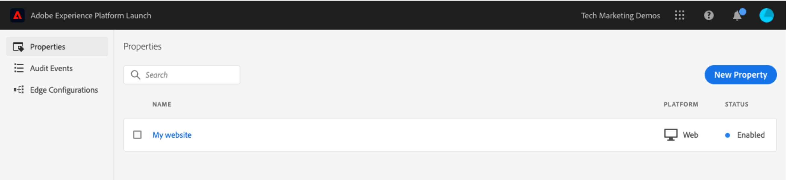
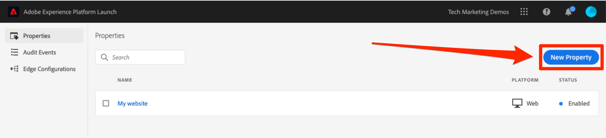
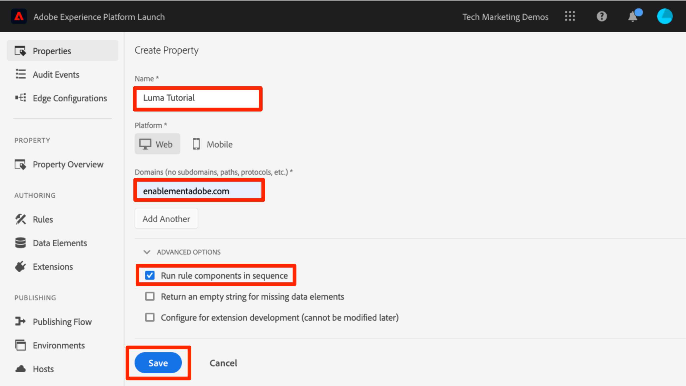
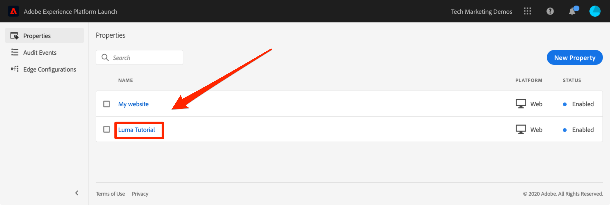

# タグプロパティの作成

このレッスンでは、最初のタグプロパティを作成します。

プロパティは基本的に、サイトにタグを導入する際に拡張機能、ルール、データ要素およびライブラリを入力するコンテナです。

>[!WARNING]
>
> このチュートリアルと Luma web サイトの演習はメンテナンスされなくなり、古いJavaScript ライブラリに依存するようになりました。 現在のベストプラクティスについては、[Web SDKを使用したAdobe Experience Cloudの実装 &#x200B;](https://experienceleague.adobe.com/ja/docs/platform-learn/implement-web-sdk/overview) チュートリアルを参照してください。

## 前提条件

次の数つのレッスンを完了するには、タグで環境を開発、承認、公開、管理、管理する権限が必要です。 ユーザーインターフェイスオプションが使用できないためにこれらの手順を完了できない場合は、Experience Cloud 管理者に連絡してアクセス権をもらってください。タグユーザー権限について詳しくは、[&#x200B; ドキュメント &#x200B;](https://experienceleague.adobe.com/docs/experience-platform/tags/admin/user-permissions.html?lang=ja) を参照してください。

## 学習内容

このレッスンを最後まで学習すると、以下の内容を習得できます。

* データ収集ユーザーインターフェイスにログインします
* 新しいタグプロパティの作成
* タグプロパティの設定

## データ収集インターフェイスに移動

**データ収集を表示するには**

1. [Adobe Experience Cloud &#x200B;](https://experiencecloud.adobe.com)にログインします。

1.  アイコンをクリックして、アプリ切り替えボタンを開きます

1. **[!UICONTROL アイコンを使用してソリューション切り替えボタンを開き]** メニューから  を選択し、「Launch/データ収集」をクリックします。

`Tags Properties` 画面が表示されます（アカウントでプロパティを作成したことがない場合は、この画面が空になる可能性があります）。

## プロパティの作成

プロパティは基本的に、サイトにタグを導入する際に拡張機能、ルール、データ要素およびライブラリを入力するコンテナです。プロパティは、1 つ以上のドメインやサブドメインをグループ化できます。それらすべてのアセットを、ほぼ共通の方法で管理および追跡できます。例えば、1 つのテンプレートに基づく複数の Web サイトがあり、それらすべてに関する共通のアセットを追跡する場合などに役立ちます。1 つのプロパティを複数のドメインに適用することもできます。プロパティの作成について詳しくは、製品ドキュメントの[企業とプロパティ](https://experienceleague.adobe.com/docs/experience-platform/tags/admin/companies-and-properties.html?lang=ja)を参照してください。

**プロパティを作成するには**

1. 「**[!UICONTROL 新規プロパティ]**」ボタンをクリックします。

   

1. プロパティに名前を付けます（例：`Luma Tutorial` または `Luma Tutorial - Daniel`）
1. ドメインとして、これは Luma デモサイトがホストされているドメインなので、`enablementadobe.com` と入力します。「ドメイン」フィールドは必須ですが、タグプロパティは、実装されているすべてのドメインで機能します。 このフィールドの主な目的は、ルールビルダーでメニューオプションを事前に設定することです。
1. 「**[!UICONTROL 詳細オプション]**」セクションを展開し、「ルール コンポーネントを順番に実行 **[!UICONTROL するチェックボックスをオンに]** ます。
1. 「**[!UICONTROL 保存]**」ボタンをクリックします。

   

新しいプロパティが「プロパティ」ページに表示されます。プロパティ名、**[!UICONTROL 設定]** または **[!UICONTROL 削除」オプションの横のボックスをオンにすると]** プロパティはプロパティリストの上に表示されます。 プロパティ名（例：`Luma Tutorial`）をクリックして、`Overview` 画面を開きます。

[次に「埋め込みコードの追加」 >](add-embed-code.md)
