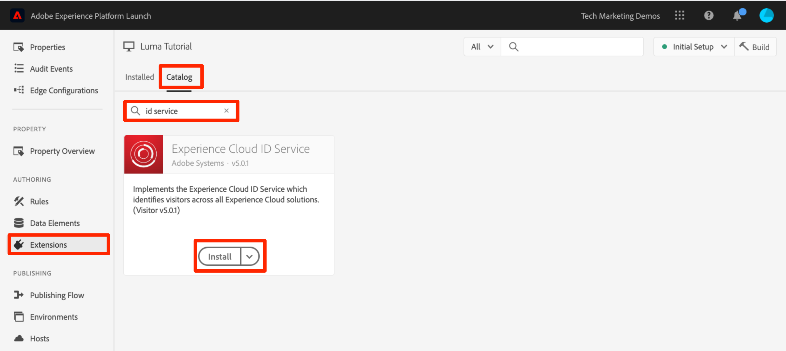
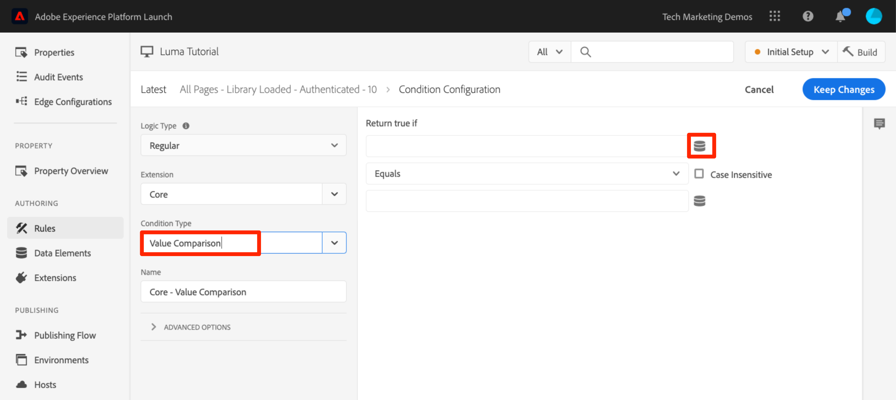
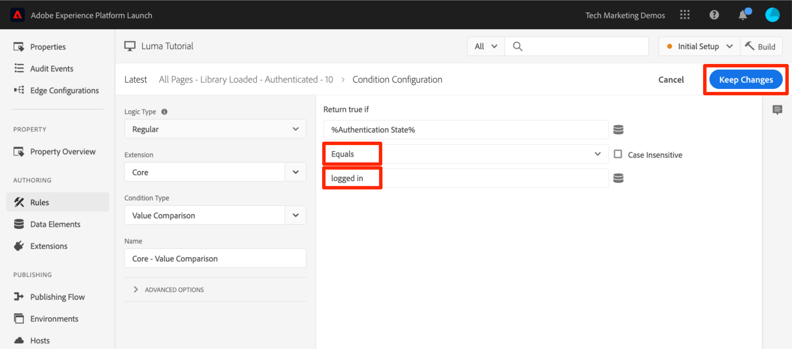
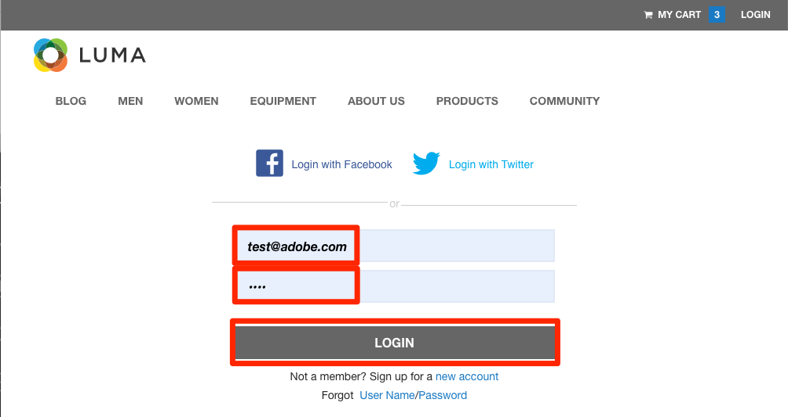

# Adobe Experience Platform ID サービスの追加

このレッスンでは、[Adobe Experience Platform ID サービス拡張機能](https://experienceleague.adobe.com/docs/experience-platform/tags/extensions/adobe/id-service/overview.html?lang=ja)の実装と顧客 ID の送信に必要な手順を説明します。

[Adobe Experience Platform ID サービス](https://experienceleague.adobe.com/docs/id-service/using/home.html?lang=ja)は、ソリューション間でのオーディエンス共有などの Experience Cloud 機能を強化するために、すべてのアドビソリューションに共通の訪問者 ID を設定します。また、サービスに独自の顧客 ID を送信して、クロスデバイスターゲティングを有効にし、顧客関係管理（CRM）システムとのさらなる統合を可能にすることもできます。

>[!NOTE]
>
>Adobe Experience Platform Launch は、データ収集テクノロジーのスイートとして Adobe Experience Platform に統合されています。 このコンテンツを使用する際に注意が必要な、いくつかの用語の変更がインターフェイスにロールアウトされました。
>
> * platform launch（クライアント側）が **[[!DNL tags]](https://experienceleague.adobe.com/docs/experience-platform/tags/home.html?lang=ja)**
> * platform launchサーバー側が **[[!DNL event forwarding]](https://experienceleague.adobe.com/docs/experience-platform/tags/event-forwarding/overview.html)**
> * エッジ設定が **[[!DNL datastreams]](https://experienceleague.adobe.com/docs/experience-platform/edge/fundamentals/datastreams.html?lang=ja)**


## 学習内容

このレッスンを最後まで学習すると、以下の内容を習得できます。

* ID サービス拡張機能を追加する
* 顧客 ID を収集するデータ要素を作成する
* 「顧客 ID を設定」アクションを使用するルールを作成して、顧客 ID をアドビに送信する
* ルールの順序機能を使用して、同じイベントで実行されるルールの順序を設定する

## 前提条件

既に [タグの設定](create-a-property.md) 」セクションに入力します。

## ID サービス拡張機能の追加

これは最初に追加する拡張機能なので、次に拡張機能の概要を示します。拡張機能は、タグの主要機能の 1 つです。 拡張機能とは、Web サイトにデプロイできるタグの新しいオプションや、無限のオプションを追加する、アドビ、アドビパートナー、またはアドビの顧客によって構築された統合です。タグをオペレーティングシステムと考えた場合、拡張機能は、タグが必要な動作を実行できるようにインストールするアプリケーションとなります。

**ID サービス拡張機能を追加するには、以下を実行します。**

1. 左側のナビゲーションで、 **[!UICONTROL 拡張機能]**

1. **[!UICONTROL カタログ]**&#x200B;をクリックして、拡張機能カタログページに移動します。

1. カタログには様々な拡張機能が含まれます。

1. 上部のフィルターで、「id」と入力してカタログをフィルターします。

1. Adobe Experience Platform ID サービスのカード上で、**[!UICONTROL インストール]**&#x200B;をクリックします。

   

1. Experience Cloud 組織 ID は自動検出されています。

1. すべてのデフォルト設定をそのままにし、**[!UICONTROL ライブラリに保存してビルド]**&#x200B;をクリックします。

   

>[!NOTE]
>
> ID サービス拡張機能の各バージョンには、拡張機能の説明に記載されている特定のバージョンの VisitorAPI.js が付属しています。VisitorAPI.js バージョンを更新するには、ID サービス拡張機能を更新します。

### 拡張機能の検証

ID サービス拡張機能は、ルールアクションを使用せずに要求をおこなう、いくつかのタグ拡張機能の 1 つです。 拡張機能は、Web サイトへの初回訪問の最初のページ読み込みで、ID サービスへの要求を自動的におこないます。要求された ID は、「AMCV_」で始まるファーストパーティ cookie に保存されます。

**ID サービス拡張機能を検証するには、以下を実行します。**

1. [Luma サイト](https://luma.enablementadobe.com/content/luma/us/en.html)を開きます。

1. Debugger がタグプロパティをにマッピングしていることを確認します。 *あなたの* 開発環境 ( [前のレッスン](switch-environments.md).

1. デバッガーの「概要」タブの「タグ」セクションに、Adobe Experience Platform ID サービス拡張機能が実装されていることを示す必要があります。

1. また、「概要」タブの「 ID サービス」セクションには、データ収集インターフェイスの拡張設定画面に表示されるのと同じ組織 ID を入力する必要があります。

   

1. 訪問者 ID を取得するための最初の要求が、デバッガーの「ID サービス」タブに表示されることがあります。既に要求されている可能性がありますが、表示されなくても心配しないでください:
   

1. 訪問者 Id を取得する最初のリクエストの後、ID は名前が `AMCV_` で始まる cookie に保存されます。次の手順を実行して、cookie が設定されていることを確認します。
   1. ブラウザーの開発者ツールを開きます。
   1. 「`Application`」タブに移動します。
   1. 左側の `Cookies` を展開します。
   1. ドメイン（`https://luma.enablementadobe.com`）をクリックします。
   1. 右側の AMCV_ cookie を探します。Luma サイトがハードコードされたタグプロパティと独自のタグプロパティの両方を使用して読み込まれているので、いくつか表示される場合があります。
      

これで作業は完了です。最初の拡張機能が追加されました。ID サービスの設定オプションについて詳しくは、[ドキュメント](https://experienceleague.adobe.com/docs/id-service/using/id-service-api/configurations/function-vars.html)を参照してください。

## 顧客 ID の送信

次に、顧客 ID を [ID サービス](https://experienceleague.adobe.com/docs/id-service/using/reference/authenticated-state.html?lang=ja)に送信します。これにより、Experience Cloud と [CRM を統合](https://experienceleague.adobe.com/docs/core-services/interface/customer-attributes/attributes.html?lang=ja)し、デバイスをまたいで訪問者を追跡できます。

前の「[データ要素、ルールおよびライブラリの追加](add-data-elements-rules.md)」レッスンでは、データ要素を作成してルールで使用しました。次に、訪問者が認証されたときに、同じ方法で顧客 ID を送信します。

### 顧客 ID データ要素の作成

まず、2 つのデータ要素を作成します。

1. `Authentication State`：訪問者がログインしているかどうかをキャプチャします。
1. `Email (Hashed)`：データレイヤーから（顧客 ID として使用される）電子メールアドレスのハッシュバージョンを取り込みます。

**認証状態のデータ要素を作成するには、以下を実行します。**

1. クリック **[!UICONTROL データ要素]** 左のナビゲーション
1. 「**[!UICONTROL データ要素を追加]**」ボタンをクリックします。

   

1. データ要素に「`Authentication State`」と名前を付けます。
1. **[!UICONTROL データ要素の種類]**&#x200B;で、**[!UICONTROL カスタムコード]**&#x200B;を選択します。
1. 「**[!UICONTROL エディターを開く]**」ボタンをクリックします。

   

1. [!UICONTROL コードの編集]ウィンドウで、次のコードを使用して、Luma サイトのデータレイヤーの属性に基づいて「logged in」または「logged out」の値を返します。

   ```javascript
   if (digitalData.user[0].profile[0].attributes.loggedIn)
       return "logged in"
   else
       return "logged out"
   ```

1. **[!UICONTROL 保存]**&#x200B;をクリックしてカスタムコードを保存します。

   

1. その他の設定はすべてデフォルト値のまま残します。
1. クリック **[!UICONTROL ライブラリに保存]** をクリックしてデータ要素を保存し、データ要素ページに戻ります。 すべての変更を加えて検証する準備が整うまで、「ビルド」を実行する必要はありません。

   

ユーザーの認証状態を把握することで、ID サービスに送信するには、ページ上にいつ顧客 ID があればよいかがわかります。次に、顧客 ID 自体のデータ要素を作成します。Luma デモサイトで、訪問者の電子メールアドレスのハッシュバージョンを使用します。

**ハッシュ化された電子メールのデータ要素を追加するには、以下を実行します。**

1. 「**[!UICONTROL データ要素を追加]**」ボタンをクリックします。

   

1. データ要素に「`Email (Hashed)`」と名前を付けます。
1. **[!UICONTROL データ要素の種類]**&#x200B;で&#x200B;**[!UICONTROL JavaScript 変数]**&#x200B;を選択します。
1. **[!UICONTROL JavaScript 変数名]**&#x200B;として、Luma サイトのデータレイヤー内の変数「`digitalData.user.0.profile.0.attributes.username`」へのポインターを使用します。
1. その他の設定はすべてデフォルト値のまま残します。
1. クリック **[!UICONTROL ライブラリに保存]** データ要素を保存するには、以下を実行します。

   

### 顧客 ID を送信するルールの追加

Adobe Experience Platform ID サービスは、「Set Customer IDs」アクションを使用して、顧客 ID をルールで渡します。訪問者が認証されたときにこのアクションをトリガーするルールを作成します。

**顧客 ID を送信するルールを追加するには、以下を実行します。**

1. 左側のナビゲーションで、 **[!UICONTROL ルール]**
1. **[!UICONTROL ルールの追加]**&#x200B;をクリックして、ルールビルダーを開きます。

   

1. ルール名を設定します。`All Pages - Library Loaded - Authenticated - 10`

   >[!TIP]
   >
   > この命名規則は、ユーザーが認証され、順序が「10」となっている場合、すべてのページの先頭でこのルールを実行することを示します。アクションでトリガーされるソリューションに対して、このような命名規則を使用すると、実装で必要とされるルールの全体的な数を最小限に抑えることができます。

1. **[!UICONTROL イベント]** で&#x200B;**[!UICONTROL 追加]**&#x200B;をクリックします。

   

   1. **[!UICONTROL イベントの種類]**&#x200B;として&#x200B;**[!UICONTROL 読み込まれたライブラリ（ページ上部）]**&#x200B;を選択します。
   1. を展開します。 **[!UICONTROL 詳細オプション]** セクションおよび  **[!UICONTROL 注文]** 入力 `10`. 「順番」は、同じイベントによってトリガーされるルールのシーケンスを制御します。順番が早いルールは、順番が遅いルールの前に実行されます。この場合、要求を実行する前に顧客 ID を設定しますが、次のレッスンでは順序が `50` のルールを使用します。
   1. 「**[!UICONTROL 変更を保持]**」ボタンをクリックし、ルールビルダーに戻ります。

   

1. **[!UICONTROL 条件]**&#x200B;で&#x200B;**[!UICONTROL 追加]**&#x200B;をクリックします。

   

   1. **[!UICONTROL 条件の種類]**&#x200B;で&#x200B;**[!UICONTROL 値の比較]**&#x200B;を選択します。
   1. をクリックして、データ要素モーダルを開きます。

      

   1. 「データ要素モーダル」で、**[!UICONTROL 認証状態]**&#x200B;をクリックしてから、**[!UICONTROL 選択]**&#x200B;をクリックします。

      

1. `Equals` が演算子であることを確認します。
1. テキストフィールドに「logged in」と入力します。これにより、データ要素「Authentication State」の値が「logged in」になるとルールが実行されます。

1. **[!UICONTROL 変更を保存]**&#x200B;をクリックします。

   

1. **[!UICONTROL アクション]**&#x200B;で&#x200B;**[!UICONTROL 追加]**&#x200B;をクリックします。

   

   1. の **[!UICONTROL 拡張]** 選択 **[!UICONTROL Experience CloudID サービス]**
   1. **[!UICONTROL アクションの種類]**&#x200B;で、**[!UICONTROL Set Customer IDs]**&#x200B;を選択します。
   1. **[!UICONTROL 統合コード]**&#x200B;に、`crm_id` を入力します。
   1. **[!UICONTROL 値]**&#x200B;では、データ要素セレクターモーダルを開いて、`Email (Hashed)` を選択します。
   1. **[!UICONTROL 認証状態]**&#x200B;では、**[!UICONTROL 認証済み]**&#x200B;を選択します。
   1. 「**[!UICONTROL 変更を保存]**」ボタンをクリックしてアクションを保存し、ルールビルダーに戻ります。

      

1. 「**[!UICONTROL ライブラリに保存してビルド]**」ボタンをクリックして、ルールを保存します。

   

これで、訪問者が認証されたときに顧客 ID を `crm_id` 変数として送信するルールが作成されました。順序を `10` として指定したため、このルールは、「[データ要素、ルール、ライブラリを追加](add-data-elements-rules.md)」レッスンで作成したデフォルトの順序値（`50`）を使用する `All Pages - Library Loaded` ルールより前に実行されます。

### 顧客 ID の検証

作業内容を検証するには、Luma サイトにログインし、新しいルールの動作を確認します。

**Luma サイトにログインするには、以下を実行します。**

1. [Luma サイト](https://luma.enablementadobe.com/content/luma/us/en.html)を開きます。

1. Debugger がタグプロパティをにマッピングしていることを確認します。 *あなたの* 開発環境 ( [前のレッスン](switch-environments.md)

   

1. Luma サイトの右上隅にある&#x200B;**[!UICONTROL ログイン]**&#x200B;リンクをクリックします。

   

1. ユーザー名として `test@adobe.com` を入力します。
1. パスワードとして `test` を入力します。
1. 「**[!UICONTROL ログイン]**」ボタンをクリックします。

   

1. ホームページに戻ります。

次に、デバッガー拡張機能を使用して、顧客 ID がサービスに送信を使用されていることを確認します。

**ID サービスが顧客 ID を渡していることを検証するには、以下を実行します。**

1. Luma サイトが入ったタブがフォーカスされていることを確認します。
1. デバッガーで、「Adobe Experience Platform ID サービス」タブに移動します。
1. 組織 ID を展開します。
1. `Customer ID - crm_id` 値のセルをクリックします。
1. モーダルには、顧客 ID 値と「`AUTHENTICATED`」の状態が反映されます。

   

1. Luma ページのソースコードを表示し、username プロパティを調べることで、ハッシュされた電子メールの値を確認できることに注意してください。これは、デバッガーに表示されている値と一致する必要があります。

   

### その他の検証に関するヒント

タグには、リッチなコンソールログ機能もあります。 これらをオンにするには、 **[!UICONTROL ツール]** 」タブをクリックし、 **[!UICONTROL tags コンソールログ]** 切り替え


これにより、ブラウザーコンソールと、デバッガーの「ログ」タブで、コンソールのログがオンになります。これまでに作成したすべてのルールのログが表示されるはずです。新しいログエントリはリストの最上部に追加され、「All Pages - Library Loaded - Authenticated - 10」ルールが「All Pages - Library Loaded」ルールの前に実行され、デバッガーのコンソールログの下に表示されるようになります:


[次：「Adobe Target の追加」>](target.md)
