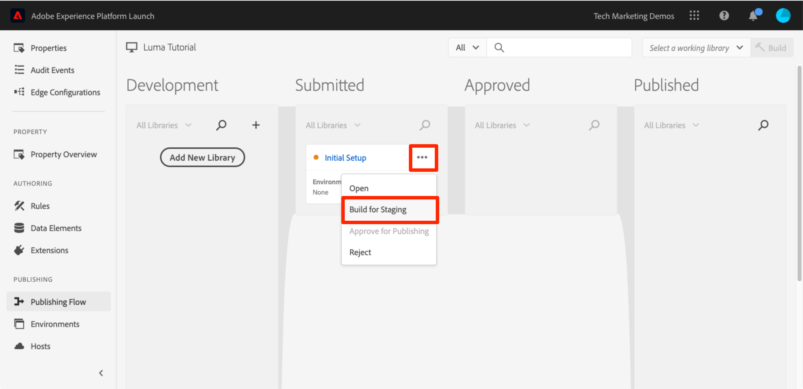
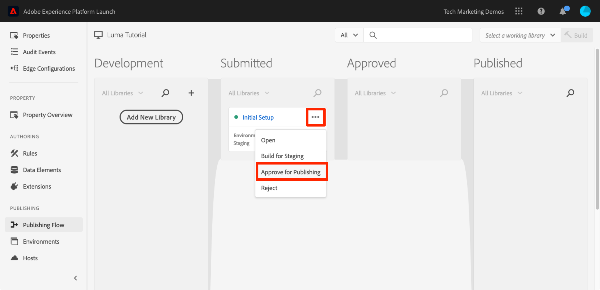
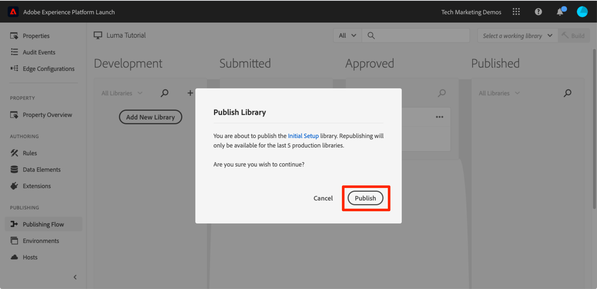

# タグプロパティの公開

開発環境で Adobe Experience Cloud の主要ソリューションをいくつか実装したら、パブリッシュのワークフローについて学習しましょう。

>[!WARNING]
>
> このチュートリアルで使用する Luma の web サイトは、2026 年 2 月 16 日の週に置き換えられる予定です。 このチュートリアルの一部で行った作業は、新しい web サイトには適用されない場合があります。

>[!NOTE]
>
>Adobe Experience Platform Launch は、データ収集テクノロジーのスイートとして Adobe Experience Platform に統合されています。 このコンテンツを使用する際に注意する必要があるインターフェイスで、いくつかの用語がロールアウトされました。
>
> * Platform Launch（クライアントサイド）は **[[!DNL tags]](https://experienceleague.adobe.com/docs/experience-platform/tags/home.html?lang=ja)** になりました
> * Platform Launch サーバーサイドが **[[!DNL event forwarding]](https://experienceleague.adobe.com/docs/experience-platform/tags/event-forwarding/overview.html?lang=ja)** になりました
> * Edgeの設定が **[[!DNL datastreams]](https://experienceleague.adobe.com/docs/experience-platform/edge/fundamentals/datastreams.html?lang=ja)** になりました

## 学習内容

このレッスンを最後まで学習すると、以下の内容を習得できます。

1. ステージング環境へ開発ライブラリをパブリッシュする
1. デバッガーを使用してステージングライブラリを本番稼働 web サイトにマッピングする
1. ステージングライブラリを本番環境に公開する

## ステージングへのパブリッシュ

開発環境でライブラリを作成して検証したら、そのライブラリをステージングにパブリッシュする番です。

1. **[!UICONTROL 公開フロー]** ページに移動

1. ライブラリの横にあるドロップダウンを開き、「**[!UICONTROL 承認用に送信]**」を選択します。

   

1. ダイアログの **[!UICONTROL 送信]** ボタンをクリックします。

   

1. ライブラリが[!UICONTROL 送信済み]列に未ビルドの状態で表示されます。

1. ドロップダウンを開き、「**[!UICONTROL ステージング用にビルド]**」を選択します。

   

1. 緑のドットアイコンが表示されると、ステージング環境でライブラリをプレビューできます。

実際のシナリオでは通常、プロセスの次のステップとして、ステージングライブラリの変更を QA チームに検証してもらいます。これをおこなうには、デバッガーを使用します。

**ステージングライブラリで変更を検証するには、以下を実行します。**

1. タグプロパティで、[!UICONTROL &#x200B; 環境 &#x200B;] ページを開きます

1. [!UICONTROL ステージング]行で、インストールアイコン をクリックして、モーダルを開きます。

   

1. コピーアイコンをクリックして、埋め込みコードをクリップボードにコピーします。

1. 「**[!UICONTROL 閉じる]**」をクリックして、モーダルを閉じます

   

1. Chrome ブラウザーで [Luma デモサイト](https://luma.enablementadobe.com/content/luma/us/en.html)を開きます。

1.  アイコンをクリックして、[Experience Platform Debugger 拡張機能](https://chromewebstore.google.com/detail/adobe-experience-platform/bfnnokhpnncpkdmbokanobigaccjkpob)を開きます

   

1. 「ツール」タブに移動します。

1. 「**[!UICONTROL Adobe Launch/Launch 埋め込みコードの置き換え」セクションで]** クリップボードにあるステージング埋め込みコードを貼り付けます
1. **[!UICONTROL luma.enablementadobe.com 全体に適用]** スイッチをオンにします

1. ディスクアイコンをクリックして保存します。

   

1. デバッガーの「概要」タブをリロードして確認します。「ローンチ」セクションに、ステージングプロパティが実装され、プロパティ名（「タグチュートリアル」など、プロパティに名前を付けたもの）が表示されます。

   

実際には、QA チームがステージング環境の変更を確認してサインオフしたら、本番環境に公開します。

## 本番環境への公開

1. [!UICONTROL パブリッシング]ページに移動します。

1. ドロップダウンから、「**[!UICONTROL 公開の承認]**」をクリックします。

   

1. ダイアログボックスの **[!UICONTROL 承認]** ボタンをクリックします。

   

1. ライブラリが[!UICONTROL 承認済み]列に未ビルド（黄色の点）として表示されます。

1. ドロップダウンを開き、「**[!UICONTROL ビルドして実稼動環境に公開]**」を選択します。

   

1. ダイアログボックスで **[!UICONTROL 公開]** をクリックします。

   

1. ライブラリが[!UICONTROL パブリッシュ済み]列に表示されます。

   

これで作業は完了です。チュートリアルを完了し、タグの最初のプロパティを公開しました。
