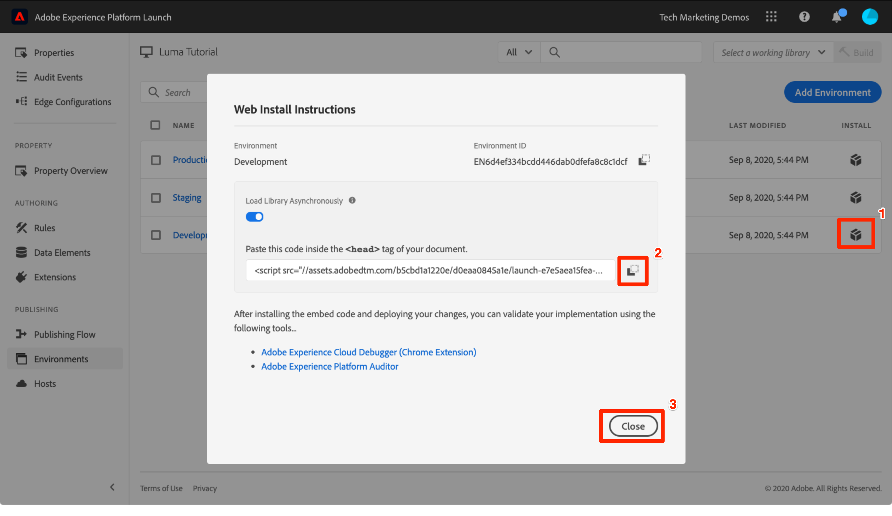
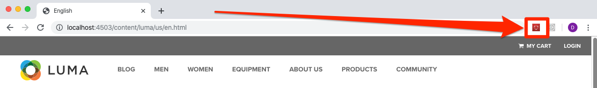
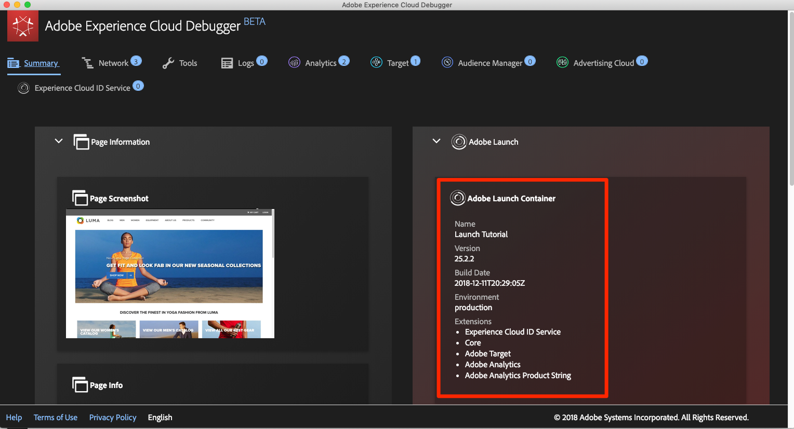
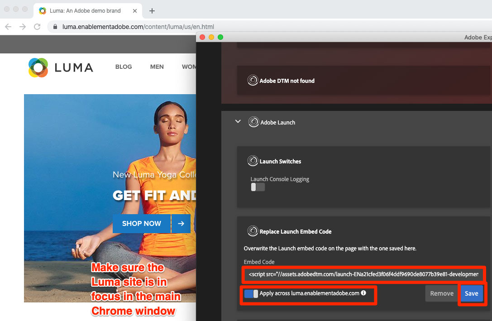

# Experience Cloud Debugger でのタグ環境の切り替え

このレッスンでは、[Adobe Experience Platform Debugger 拡張機能](https://chromewebstore.google.com/detail/adobe-experience-platform/bfnnokhpnncpkdmbokanobigaccjkpob)を使用して、[Luma デモサイト](https://luma.enablementadobe.com/content/luma/us/en.html)でハードコード化されたタグプロパティを独自のプロパティに置き換えます。

>[!WARNING]
>
> このチュートリアルと Luma web サイトの演習はメンテナンスされなくなり、古いJavaScript ライブラリに依存するようになりました。 現在のベストプラクティスについては、[Web SDKを使用したAdobe Experience Cloudの実装 ](https://experienceleague.adobe.com/ja/docs/platform-learn/implement-web-sdk/overview) チュートリアルを参照してください。

この手法は環境の切り替えと呼ばれ、後で自分の web サイトでタグを操作する際に役立ちます。 本番稼働用 web サイトをブラウザーに読み込むことができますが、*開発*&#x200B;タグ環境を使用します。 これにより、通常のコードリリースとは独立し、自信を持ってタグの変更を実行および検証できます。  結局、マーケティングタグリリースを通常のコードリリースから分離することが、顧客がタグを最初に使用する主な理由の 1 つです。

## 学習内容

このレッスンを最後まで学習すると、以下の内容を習得できます。

* Debugger を使用して、代替タグ環境を読み込む
* Debugger を使用して、代替ログ環境を読み込んだことを検証する

## 開発環境 URL の取得

1. タグプロパティで、`Environments` ページを開きます

1. **[!UICONTROL 開発]**&#x200B;行で、インストールアイコン  をクリックして、モーダルを開きます

1. コピーアイコンをクリックして、埋め込みコードをクリップボードにコピーします。

1. 「**[!UICONTROL 閉じる]**」をクリックして、モーダルを閉じます

   

## Luma デモサイトのタグ URL を置き換えます

1. Chrome ブラウザーで [Luma デモサイト](https://luma.enablementadobe.com/content/luma/us/en.html)を開きます。

1.  アイコンをクリックして、[Experience Platform Debugger 拡張機能](https://chromewebstore.google.com/detail/adobe-experience-platform/bfnnokhpnncpkdmbokanobigaccjkpob)を開きます

   

1. 現在実装されているタグプロパティは、「概要」タブに表示されます。

   

1. 「ツール」タブに移動します。
1. 「**[!UICONTROL Launch 埋め込みコードを置換]**」セクションまでスクロールします
1. Luma サイトの「Chrome」タブが Debugger の背後で焦点が当てられていることを確認します（このチュートリアルのタブやデータ収集インターフェイスのタブではなく）。  クリップボードにある埋め込みコードを入力フィールドに貼り付けます。
1. 「luma.enablementadobe.com 全体で適用」機能をオンに切り替えて、Luma サイトのすべてのページがタグプロパティにマッピングされるようにします。
1. 「**[!UICONTROL 保存]**」ボタンをクリックします。

   

1. Luma サイトを再読み込みし、デバッガーの「概要」タブを確認します。 Launch セクションには、使用中の開発プロパティが表示されます。 プロパティ名がユーザーと一致し、環境が「開発」となっていることを確認します。

   

>[!NOTE]
>
>Debugger はこの設定を保存し、Luma サイトに戻るたびにタグ埋め込みコードを置き換えます。 他の開いているタブでアクセスする他のサイトには影響しません。 Debugger による埋め込みコードの置き換えを停止するには、Debugger の「ツール」タブで埋め込みコードの横にある「**[!UICONTROL 削除]**」ボタンをクリックします。

チュートリアルを続ける際には、Luma サイトを独自のタグプロパティにマッピングするこの手法を使用して、タグの実装を検証します。 本番稼働用 web サイトでタグの使用を開始する際、同じ手法を使用して変更を検証できます。

[次：「Adobe Experience Platform ID サービスの追加」>](id-service.md)
